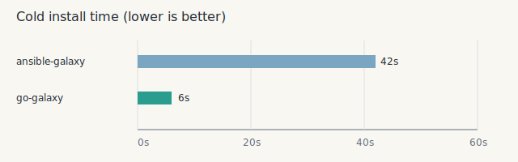

# go-galaxy

Fast Ansible Galaxy collections installer for CI.

Cold install time comparison (used `requirements.yml` from this repo):


<details>
<summary>Logs</summary>

```shell
➜ rm -rf ~/.ansible collection
➜ time ansible-galaxy collection install -r requirements.yml -p collections
Starting galaxy collection install process
Process install dependency map
Starting collection install process
Downloading https://galaxy.ansible.com/api/v3/plugin/ansible/content/published/collections/artifacts/amarao-ip-0.1.11.tar.gz to /Users/greeddj/.ansible/tmp/ansible-local-4026ctu00ql9/tmpz9g71ez5/amarao-ip-0.1.11-0e1sb701
Downloading https://galaxy.ansible.com/api/v3/plugin/ansible/content/published/collections/artifacts/ansible-posix-2.0.0.tar.gz to /Users/greeddj/.ansible/tmp/ansible-local-4026ctu00ql9/tmpz9g71ez5/ansible-posix-2.0.0-y7n_aw2j
Installing 'amarao.ip:0.1.11' to '/Users/greeddj/.ansible/collections/ansible_collections/amarao/ip'
amarao.ip:0.1.11 was installed successfully
Downloading https://galaxy.ansible.com/api/v3/plugin/ansible/content/published/collections/artifacts/community-crypto-3.0.1.tar.gz to /Users/greeddj/.ansible/tmp/ansible-local-4026ctu00ql9/tmpz9g71ez5/community-crypto-3.0.1-od_6f_ct
Installing 'ansible.posix:2.0.0' to '/Users/greeddj/.ansible/collections/ansible_collections/ansible/posix'
ansible.posix:2.0.0 was installed successfully
'ansible.utils:6.0.0' is already installed, skipping.
Installing 'community.crypto:3.0.1' to '/Users/greeddj/.ansible/collections/ansible_collections/community/crypto'
Downloading https://galaxy.ansible.com/api/v3/plugin/ansible/content/published/collections/artifacts/community-general-11.1.0.tar.gz to /Users/greeddj/.ansible/tmp/ansible-local-4026ctu00ql9/tmpz9g71ez5/community-general-11.1.0-jik19n84
community.crypto:3.0.1 was installed successfully
Installing 'community.general:11.1.0' to '/Users/greeddj/.ansible/collections/ansible_collections/community/general'
Downloading https://galaxy.ansible.com/api/v3/plugin/ansible/content/published/collections/artifacts/community-libvirt-1.3.1.tar.gz to /Users/greeddj/.ansible/tmp/ansible-local-4026ctu00ql9/tmpz9g71ez5/community-libvirt-1.3.1-1mdcf635
community.general:11.1.0 was installed successfully
Downloading https://galaxy.ansible.com/api/v3/plugin/ansible/content/published/collections/artifacts/community-postgresql-4.1.0.tar.gz to /Users/greeddj/.ansible/tmp/ansible-local-4026ctu00ql9/tmpz9g71ez5/community-postgresql-4.1.0-uanswhbv
Installing 'community.libvirt:1.3.1' to '/Users/greeddj/.ansible/collections/ansible_collections/community/libvirt'
community.libvirt:1.3.1 was installed successfully
Installing 'community.postgresql:4.1.0' to '/Users/greeddj/.ansible/collections/ansible_collections/community/postgresql'
Downloading https://galaxy.ansible.com/api/v3/plugin/ansible/content/published/collections/artifacts/containers-podman-1.17.0.tar.gz to /Users/greeddj/.ansible/tmp/ansible-local-4026ctu00ql9/tmpz9g71ez5/containers-podman-1.17.0-9_souarj
community.postgresql:4.1.0 was installed successfully
Installing 'containers.podman:1.17.0' to '/Users/greeddj/.ansible/collections/ansible_collections/containers/podman'
Downloading https://galaxy.ansible.com/api/v3/plugin/ansible/content/published/collections/artifacts/serverscom-mitogen-1.4.0.tar.gz to /Users/greeddj/.ansible/tmp/ansible-local-4026ctu00ql9/tmpz9g71ez5/serverscom-mitogen-1.4.0-b7hxg5wt
containers.podman:1.17.0 was installed successfully
'kubernetes.core:6.2.0' is already installed, skipping.
Installing 'serverscom.mitogen:1.4.0' to '/Users/greeddj/.ansible/collections/ansible_collections/serverscom/mitogen'
Downloading https://galaxy.ansible.com/api/v3/plugin/ansible/content/published/collections/artifacts/t_systems_mms-acme-3.0.1.tar.gz to /Users/greeddj/.ansible/tmp/ansible-local-4026ctu00ql9/tmpz9g71ez5/t_systems_mms-acme-3.0.1-mn316wg7
serverscom.mitogen:1.4.0 was installed successfully
Installing 't_systems_mms.acme:3.0.1' to '/Users/greeddj/.ansible/collections/ansible_collections/t_systems_mms/acme'
t_systems_mms.acme:3.0.1 was installed successfully
'amazon.aws:10.1.2' is already installed, skipping.
'openstack.cloud:2.5.0' is already installed, skipping.
'azure.azcollection:3.12.0' is already installed, skipping.
ansible-galaxy collection install -r requirements.yml -p collections 2.62s user 1.04s system 8% cpu 41.962 total

➜ rm -rf ~/.cache/go-galaxy collections
➜ time go-galaxy i -r requirements.yml -p collections
✅ Installed: amarao.ip
✅ Installed: community.libvirt
✅ Installed: kubernetes.core
✅ Installed: community.postgresql
✅ Installed: ansible.utils
✅ Installed: openstack.cloud
✅ Installed: containers.podman
✅ Installed: azure.azcollection
✅ Installed: community.crypto
✅ Installed: amazon.aws
✅ Installed: serverscom.mitogen
✅ Installed: ansible.posix
✅ Installed: community.general
✅ Installed: t_systems_mms.acme
🤩 All done. Took 6s
go-galaxy i -r requirements.yml  0.44s user 0.89s system 30% cpu 6.084 total
```
</details>

## Scope

- Collections only (Galaxy API sources).
- `requirements.yml` must contain a `collections` list.
- `roles` entries are ignored with a warning.
- ansible.cfg options supported:
  - `[defaults] collections_path`
  - `[galaxy] server`
  - `[galaxy] cache_dir`

## Features

- Dependency resolution with snapshot reuse.
- API and tarball caches.
- Skip install if already extracted.
- Parallel downloads and extraction.
- `cleanup` command to remove unreachable collections.

## Install

```bash
go build -o ./dist/go-galaxy ./cmd/go-galaxy
```

## Usage

```bash
./dist/go-galaxy i -r requirements.yml -p ./collections
```

Clean unreachable collections:

```bash
./dist/go-galaxy c
```

### Commands

- `install` (`i`) — install collections from `requirements.yml`.
- `cleanup` (`c`) — remove unused cached collections across projects.

### Global options

- `--help, -h`
- `--version, -v`

### install options

- `--verbose` — verbose output (`$GO_GALAXY_VERBOSE`)
- `--quiet, -q` — quiet mode (`$GO_GALAXY_QUIET`)
- `--dry-run`
- `--cache-dir` (`$GO_GALAXY_CACHE_DIR`, `$ANSIBLE_GALAXY_CACHE_DIR`)
- `--server` (`$GO_GALAXY_SERVER`, `$ANSIBLE_GALAXY_SERVER`)
- `--timeout` (`$GO_GALAXY_SERVER_TIMEOUT`, `$ANSIBLE_GALAXY_SERVER_TIMEOUT`)
- `--download-path, -p` (`$GO_GALAXY_COLLECTIONS_PATH`, `$ANSIBLE_COLLECTIONS_PATH`)
- `--requirements-file, -r` (`$GO_GALAXY_REQUIREMENTS_FILE`, `$ANSIBLE_GALAXY_REQUIREMENTS_FILE`)
- `--ansible-config` (`$GO_GALAXY_ANSIBLE_CONFIG`, `$ANSIBLE_CONFIG`)
- `--workers` (`$GO_GALAXY_WORKERS`)
- `--no-cache` (`$GO_GALAXY_NO_CACHE`)
- `--refresh` (`$GO_GALAXY_REFRESH`)
- `--clear-cache` (`$GO_GALAXY_CLEAR_CACHE`)
- `--no-deps` (`$GO_GALAXY_NO_DEPS`)

S3 cache options (if `--s3-bucket` is set, S3 backend is used):

- `--s3-bucket` (`$GO_GALAXY_S3_BUCKET`)
- `--s3-region` (`$GO_GALAXY_S3_REGION`)
- `--s3-prefix` (`$GO_GALAXY_S3_PREFIX`)
- `--s3-access-key` (`$GO_GALAXY_S3_ACCESS_KEY`, `$AWS_ACCESS_KEY_ID`)
- `--s3-secret-key` (`$GO_GALAXY_S3_SECRET_KEY`, `$AWS_SECRET_ACCESS_KEY`)
- `--s3-endpoint` (`$GO_GALAXY_S3_ENDPOINT`)
- `--s3-session-token` (`$GO_GALAXY_S3_SESSION_TOKEN`, `$AWS_SESSION_TOKEN`)
- `--s3-path-style-disabled` (`$GO_GALAXY_S3_PATH_STYLE_DISABLED`)

### cleanup options

- `--verbose` — verbose output (`$GO_GALAXY_VERBOSE`)
- `--quiet, -q` — quiet mode (`$GO_GALAXY_QUIET`)
- `--dry-run`
- `--cache-dir` (`$GO_GALAXY_CACHE_DIR`, `$ANSIBLE_GALAXY_CACHE_DIR`)
- `--s3-bucket` (`$GO_GALAXY_S3_BUCKET`)
- `--s3-region` (`$GO_GALAXY_S3_REGION`)
- `--s3-prefix` (`$GO_GALAXY_S3_PREFIX`)
- `--s3-access-key` (`$GO_GALAXY_S3_ACCESS_KEY`, `$AWS_ACCESS_KEY_ID`)
- `--s3-secret-key` (`$GO_GALAXY_S3_SECRET_KEY`, `$AWS_SECRET_ACCESS_KEY`)
- `--s3-endpoint` (`$GO_GALAXY_S3_ENDPOINT`)
- `--s3-session-token` (`$GO_GALAXY_S3_SESSION_TOKEN`, `$AWS_SESSION_TOKEN`)
- `--s3-path-style-disabled` (`$GO_GALAXY_S3_PATH_STYLE_DISABLED`)

## requirements.yml

```yaml
---
collections:
  - name: community.general
    version: "11.1.0"
  - name: ansible.posix
    version: "2.0.0"
    source: https://galaxy.ansible.com
```

## ansible.cfg

```ini
[defaults]
collections_path = ./collections

[galaxy]
server = https://galaxy.ansible.com
cache_dir = /home/ci/.cache/go-galaxy
```

## Notes

- Non-Galaxy sources (git/url/file/dir) are not supported.
- `roles` in requirements.yml are ignored.

## S3 Cache (optional)

When `--s3-bucket` (or `GO_GALAXY_S3_BUCKET`) is set, go-galaxy uses S3 as the cache backend.
Artifacts and cache metadata are stored in S3; collections are still installed locally.
