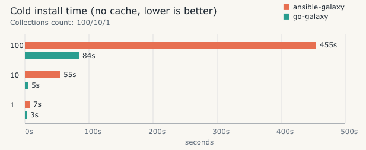

# go-galaxy

Fast Ansible Galaxy collections installer for CI.

> **Note:** This project was created in collaboration with the GPT 5.2 Codex.



Files used for comparison:

- `testing/requirements-100.yml`
- `testing/requirements-10.yml`
- `testing/requirements-1.yml`

## Motivation

CI pipelines often spend minutes downloading and unpacking Galaxy collections.
go-galaxy is built to reduce that wait time with faster installs and smarter caching,
so pipelines finish sooner and changes ship faster.

## Scope

- Collections only (Galaxy API sources).
- `requirements.yml` must contain a `collections` list.
- `roles` entries are ignored with a warning.
- ansible.cfg options supported:
  - `[defaults] collections_path`
  - `[galaxy] server`
  - `[galaxy] cache_dir`

## Features

- Dependency resolution with snapshot reuse.
- API and tarball caches.
- Skip install if already extracted.
- Parallel downloads and extraction.
- `cleanup` command to remove unreachable collections.

## Install

### Go

```bash
go install github.com/greeddj/go-galaxy/cmd/go-galaxy@latest
```

Binary is installed into `$(go env GOPATH)/bin` (usually `~/go/bin`).

### Homebrew (macOS)

```bash
brew tap greeddj/tap
brew install go-galaxy
```

### Podman

```bash
podman run --rm -v "$PWD":/work -w /work ghcr.io/greeddj/go-galaxy:latest --help
```

Example install:

```bash
podman run --rm -v "$PWD":/work -w /work ghcr.io/greeddj/go-galaxy:latest i -r requirements.yml -p ./collections
```

### Build from source

```bash
go build -o ./dist/go-galaxy ./cmd/go-galaxy
```

## Usage

```bash
./dist/go-galaxy i -r requirements.yml -p ./collections
```

Clean unreachable collections:

```bash
./dist/go-galaxy c
```

### Commands

- `install` (`i`) — install collections from `requirements.yml`.
- `cleanup` (`c`) — remove unused cached collections across projects.

### Global options

- `--help, -h`
- `--version, -v`

### install options

- `--verbose` — verbose output (`$GO_GALAXY_VERBOSE`)
- `--quiet, -q` — quiet mode (`$GO_GALAXY_QUIET`)
- `--dry-run`
- `--cache-dir` (`$GO_GALAXY_CACHE_DIR`, `$ANSIBLE_GALAXY_CACHE_DIR`)
- `--server` (`$GO_GALAXY_SERVER`, `$ANSIBLE_GALAXY_SERVER`)
- `--timeout` (`$GO_GALAXY_SERVER_TIMEOUT`, `$ANSIBLE_GALAXY_SERVER_TIMEOUT`)
- `--download-path, -p` (`$GO_GALAXY_COLLECTIONS_PATH`, `$ANSIBLE_COLLECTIONS_PATH`)
- `--requirements-file, -r` (`$GO_GALAXY_REQUIREMENTS_FILE`, `$ANSIBLE_GALAXY_REQUIREMENTS_FILE`)
- `--ansible-config` (`$GO_GALAXY_ANSIBLE_CONFIG`, `$ANSIBLE_CONFIG`)
- `--workers` (`$GO_GALAXY_WORKERS`)
- `--no-cache` (`$GO_GALAXY_NO_CACHE`)
- `--refresh` (`$GO_GALAXY_REFRESH`)
- `--clear-cache` (`$GO_GALAXY_CLEAR_CACHE`)
- `--no-deps` (`$GO_GALAXY_NO_DEPS`)

S3 cache options (if `--s3-bucket` is set, S3 backend is used):

- `--s3-bucket` (`$GO_GALAXY_S3_BUCKET`)
- `--s3-region` (`$GO_GALAXY_S3_REGION`)
- `--s3-prefix` (`$GO_GALAXY_S3_PREFIX`)
- `--s3-access-key` (`$GO_GALAXY_S3_ACCESS_KEY`, `$AWS_ACCESS_KEY_ID`)
- `--s3-secret-key` (`$GO_GALAXY_S3_SECRET_KEY`, `$AWS_SECRET_ACCESS_KEY`)
- `--s3-endpoint` (`$GO_GALAXY_S3_ENDPOINT`)
- `--s3-session-token` (`$GO_GALAXY_S3_SESSION_TOKEN`, `$AWS_SESSION_TOKEN`)
- `--s3-path-style-disabled` (`$GO_GALAXY_S3_PATH_STYLE_DISABLED`)

### cleanup options

- `--verbose` — verbose output (`$GO_GALAXY_VERBOSE`)
- `--quiet, -q` — quiet mode (`$GO_GALAXY_QUIET`)
- `--dry-run`
- `--cache-dir` (`$GO_GALAXY_CACHE_DIR`, `$ANSIBLE_GALAXY_CACHE_DIR`)
- `--s3-bucket` (`$GO_GALAXY_S3_BUCKET`)
- `--s3-region` (`$GO_GALAXY_S3_REGION`)
- `--s3-prefix` (`$GO_GALAXY_S3_PREFIX`)
- `--s3-access-key` (`$GO_GALAXY_S3_ACCESS_KEY`, `$AWS_ACCESS_KEY_ID`)
- `--s3-secret-key` (`$GO_GALAXY_S3_SECRET_KEY`, `$AWS_SECRET_ACCESS_KEY`)
- `--s3-endpoint` (`$GO_GALAXY_S3_ENDPOINT`)
- `--s3-session-token` (`$GO_GALAXY_S3_SESSION_TOKEN`, `$AWS_SESSION_TOKEN`)
- `--s3-path-style-disabled` (`$GO_GALAXY_S3_PATH_STYLE_DISABLED`)

## requirements.yml

```yaml
---
collections:
  - name: community.general
    version: "11.1.0"
  - name: ansible.posix
    version: "2.0.0"
    source: https://galaxy.ansible.com
```

## ansible.cfg

```ini
[defaults]
collections_path = ./collections

[galaxy]
server = https://galaxy.ansible.com
cache_dir = /home/ci/.cache/go-galaxy
```

## Notes

- Non-Galaxy sources (git/url/file/dir) are not supported.
- `roles` in requirements.yml are ignored.

## S3 Cache (optional)

When `--s3-bucket` (or `GO_GALAXY_S3_BUCKET`) is set, go-galaxy uses S3 as the cache backend.
Artifacts and cache metadata are stored in S3; collections are still installed locally.
