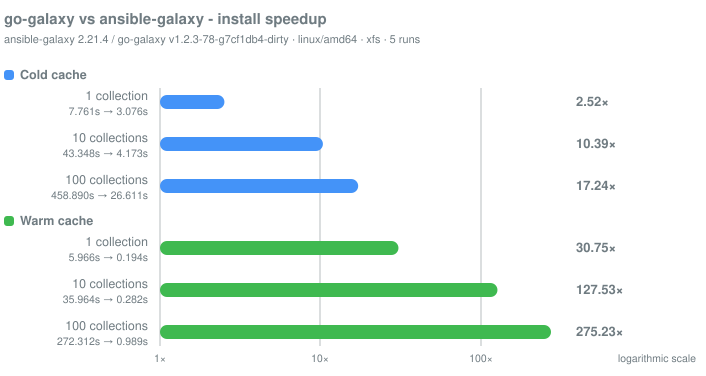

<h1>
  <picture>
    <source media="(prefers-color-scheme: dark)" srcset="docs/assets/logo-banner-white.svg">
    
  </picture>
</h1>

[](https://github.com/greeddj/go-galaxy/actions/workflows/ci.yml)
[](https://github.com/greeddj/go-galaxy/actions/workflows/release.yml)
[](https://codecov.io/gh/greeddj/go-galaxy)

Fast Ansible Galaxy collections and roles installer for CI.

> [!NOTE]
> This project was created in collaboration with Claude Code.

CI pipelines often spend minutes downloading and unpacking Galaxy collections
and roles. go-galaxy resolves, downloads and extracts them in parallel,
hardlinks out of a content-addressed cache on warm runs, and skips the network
entirely under `--frozen --offline`. With a warm cache, installing 100
collections takes seconds rather than minutes.



*Mean of 5 runs on Linux, both tools with `--no-deps`. The warm rows compare
[two cache designs](docs/reference/benchmarks.md#what-each-tool-caches).*

## Why go-galaxy

- **Shared cache.** An optional [S3 bucket](docs/guides/caching.md#s3-cache-optional)
  shares downloads across runners, and [`cleanup`](docs/guides/caching.md#clearing-and-cleanup)
  removes what no project uses any more.
- **Reproducible.** `galaxy.lock`
  [pins](docs/guides/lockfile.md#what-each-entry-is-pinned-by) every collection and
  role to an exact version, commit or sha256.
- **Refuses rather than guesses.** A PubGrub resolver backtracks to older
  releases until the constraints fit, or prints a
  [proof](docs/guides/requirements.md#when-no-version-fits) that none do and exits
  [`3`](docs/reference/exit-codes.md).
- **Reads your ansible-galaxy setup.** go-galaxy takes `requirements.yml` and
  the `ansible.cfg` keys and `ANSIBLE_*` variables for paths, servers and
  timeouts. It adds its own [`galaxy.toml`](docs/guides/requirements.md#galaxytoml).
- **Many sources.** Collections and roles come from Galaxy, git and http(s)
  tarballs. With a [keyring](docs/guides/signatures.md), Galaxy collection
  signatures are checked in pure Go, without `gpg`.

Some differences break a pipeline that worked under `ansible-galaxy`, so read
[Differences a migration runs into](docs/get-started/ansible-galaxy-compat.md#differences-a-migration-runs-into)
before you switch. `go-galaxy migrate` turns your `requirements.yml` into a
`galaxy.toml` when you want one
([Moving to galaxy.toml](docs/guides/requirements.md#moving-to-galaxytoml)).

## Install

| Method | Command |
| :-- | :-- |
| GitHub Action | `uses: greeddj/go-galaxy@v1.4.0` runs a cached `install` on Linux or macOS. With `install: false` it only puts go-galaxy on `PATH` ([Inputs and outputs](docs/guides/ci.md#inputs-and-outputs)) |
| GitLab CI | `ghcr.io/greeddj/go-galaxy:<version>-alpine` as the job image, with `entrypoint: [""]` ([GitLab CI](docs/guides/ci.md#gitlab-ci)) |
| Homebrew | `brew install --cask greeddj/tap/go-galaxy` |
| Go | `go install github.com/greeddj/go-galaxy/cmd/go-galaxy@latest` |
| Release binary | Download, check and install it as below |
| Container | `ghcr.io/greeddj/go-galaxy`, run in your project through the alias below. `:<version>-alpine` adds a shell for a CI job image |
| Your image | `COPY --from=ghcr.io/greeddj/go-galaxy:<version> /go-galaxy /usr/local/bin/go-galaxy` in its Dockerfile ([Install](docs/get-started/getting-started.md#install)) |
| From source | `go build -o dist/go-galaxy ./cmd/go-galaxy` in a clone |

```bash
base=https://github.com/greeddj/go-galaxy/releases/latest/download
curl -sSLf -O "$base/go-galaxy-linux-amd64" -O "$base/checksums.txt"
sha256sum --ignore-missing -c checksums.txt   # macOS: shasum -a 256 --ignore-missing -c checksums.txt
sudo mkdir -p /usr/local/bin
sudo install -m 755 go-galaxy-linux-amd64 /usr/local/bin/go-galaxy
```

Swap in `linux-arm64`, `darwin-amd64` or `darwin-arm64` for `linux-amd64`.
The darwin builds need macOS 13 or later.

```bash
alias go-galaxy='docker run --rm -u "$(id -u):$(id -g)" -e HOME=/work -v "$PWD":/work -w /work ghcr.io/greeddj/go-galaxy'
```

With this alias, the quick start below works as written. The image runs
go-galaxy as the unprivileged user `65532`. `-u` runs it as you instead, so it
can write into your project. `HOME` puts its cache in `.cache` there, so add
`.cache/` to `.gitignore`.

<details markdown>
<summary>Homebrew quarantine and verifying a release</summary>

The builds are not Apple-notarized, so on macOS the cask clears the quarantine
attribute from the binary it installs, which skips a Gatekeeper check for you.
To check a download's signature and provenance yourself, follow
[Verifying a release](docs/guides/security.md#verifying-a-release).

</details>

## Quick start

```toml
# galaxy.toml
[project]
collections = [
  "community.general >= 10.0.0",
  "ansible.utils",
]
roles = ["geerlingguy.docker"]
```

```bash
go-galaxy install
go-galaxy lock
go-galaxy install --frozen
```

`install` reads `./galaxy.toml`, else `./requirements.yml`. By default it
installs into `.collections` and `.roles`. Export
`ANSIBLE_COLLECTIONS_PATH=.collections` and `ANSIBLE_ROLES_PATH=.roles` so
ansible-playbook looks there too. `lock` pins every version in `galaxy.lock`.
Commit it, and `install --frozen` installs exactly what it pins. The
[full quick start](docs/get-started/getting-started.md) walks through these
steps and a first CI job.

<details markdown>
<summary>The same project in requirements.yml</summary>

```yaml
collections:
  - name: community.general
    version: ">=10.0.0"
  - name: ansible.utils
roles:
  - name: geerlingguy.docker
```

Write this file instead when `ansible-galaxy` must read it too.

</details>

## Scope

| Source | Collections | Roles |
| :-- | :-- | :-- |
| Galaxy API server | yes | yes, through the v1 role API (Automation Hub has none) |
| git repository, http(s) or ssh | yes | yes |
| http(s) tarball URL | yes | `.tar.gz` only |
| `file`, `dir`, `subdirs`, local path | no | no |

[Requirements files](docs/guides/requirements.md) gives the entry syntax for
each source and what is refused at load.
[What each entry is pinned by](docs/guides/lockfile.md#what-each-entry-is-pinned-by)
says how `galaxy.lock` pins each source. Private git and URL credentials are in
[Servers and credentials](docs/guides/servers-and-auth.md).

## Documentation

| Section | Pages |
| :-- | :-- |
| Get started | [Quick start](docs/get-started/getting-started.md), [Coming from ansible-galaxy](docs/get-started/ansible-galaxy-compat.md) |
| Guides | [Requirements files](docs/guides/requirements.md), [Lockfile](docs/guides/lockfile.md), [CI pipelines](docs/guides/ci.md), [Servers and credentials](docs/guides/servers-and-auth.md), [Caching and S3](docs/guides/caching.md), [Signatures](docs/guides/signatures.md), [Security](docs/guides/security.md) |
| Reference | [CLI](docs/reference/cli.md), [Configuration](docs/reference/configuration.md), [Exit codes](docs/reference/exit-codes.md), [Metrics](docs/reference/metrics.md), [Upgrading](docs/reference/upgrading.md), [Benchmarks](docs/reference/benchmarks.md) |
| Internals | [How it works](docs/internals/index.md), [Command flows](docs/internals/commands.md), [Security boundaries](docs/internals/boundaries.md), [Development](docs/internals/development.md) |
| Contributing | [CONTRIBUTING.md](CONTRIBUTING.md): commit subjects and cutting a release |

## License

[MIT](LICENSE).
