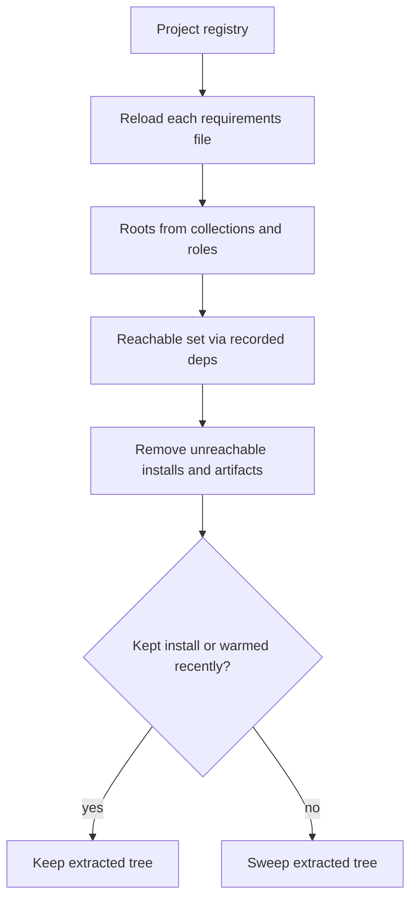

# CLI reference

Every go-galaxy command and option, with its variables, file keys and default.
Start with the task table, then look up the command or option group.

## Usage

| Task | Command |
| --- | --- |
| Install the requirements file | `go-galaxy install` |
| Pin every version | `go-galaxy lock` |
| Install in CI from the lockfile | `go-galaxy install --frozen` |
| Fail CI when the lockfile is stale | `go-galaxy lock --check` |
| Fill a CI image's cache | `go-galaxy warm` |
| See newer upstream versions | `go-galaxy outdated` |
| Show the locked dependency tree | `go-galaxy tree` |
| Why a collection is there | `go-galaxy explain community.general` |
| Print a CI cache key | `go-galaxy hash` |
| Free disk space | `go-galaxy cleanup` |

> [!TIP]
> A bare `go-galaxy` runs `install`, so `go-galaxy -r galaxy.toml` is
> `go-galaxy install -r galaxy.toml`.

## Commands

| Command | Alias | Does | Network | Cache lock | Writes |
| --- | --- | --- | --- | --- | --- |
| `install` | `i` | Installs collections and roles | unless `--offline` | yes | collections and roles paths, cache |
| `lock` | `l` | Resolves and writes the lockfile | unless `--offline` | yes | `galaxy.lock`, cache |
| `warm` | `w` | Fills the cache without installing | unless `--offline` | yes | cache |
| `outdated` | `o` | Compares what runs with the latest upstream | always | no | `--metrics-file` only |
| `cleanup` | `c` | Removes what no recorded project reaches | S3 only | yes | deletes installs and cache entries |
| `hash` | `h` | Prints a CI cache key | no | no | nothing |
| `tree` | `t` | Prints the locked dependency tree | no | no | nothing |
| `explain` | `why` | Shows why one entry is locked | no | no | nothing |

Roles install after the collections, and only when every collection succeeded.
No command but `explain <name>` takes an argument: every name comes from the
requirements file, and an extra word exits [`2`](exit-codes.md).

<details markdown>
<summary>How arguments are dispatched</summary>

- The first word that is neither a root option nor a command hands that word
  and everything after it to `install`.
- `go-galaxy -r galaxy.toml lock` therefore hands `lock` to `install`, which
  refuses it (`2`), as it refuses `go-galaxy collection install ns.name`.
- `go-galaxy help` exits `2` the same way; help is `--help`.
- An unknown flag before any command word is reported against `install`'s
  flag set; after one, against that command's.
- `explain` with no name or with two exits `2`.
- `--version` and `-v` work only before a command word; after one,
  `--version` exits `2` and `-v` is ignored.
- `go-galaxy -h <command>` prints that command's help; a word naming no
  command exits `2` with `No help topic`.

</details>

### `lock`

```bash
go-galaxy lock --check
```

`lock` resolves from the requirements file, not the existing lockfile, and pins
every entry; unchanged requirements reuse the cached resolve unless
`--refresh`. It takes the `install` options except `--frozen` and the signature
flags.

`--check` compares instead of writing and exits `6` on drift; `--dry-run`
prints the difference. A `download_url` with a query string, or off its
server's artifact path, exits `5`. Workflow: [Create the
lockfile](lockfile.md#create-the-lockfile) and [Catch
drift](lockfile.md#catch-drift).

### `warm`

```bash
go-galaxy warm --frozen
```

`warm` downloads and extracts every collection and role into the cache
without installing, so a later `install` only links.
It takes the `install` options and needs a cache, so `--no-cache` exits `2`.

`cleanup` keeps a warmed tree for 30 days after its last warm. Recipe:
[Container image bake](ci.md#container-image-bake).

### `outdated`

```bash
go-galaxy outdated
```

`outdated` compares the lockfile's entries, or without one the collections
under `--download-path`, with the latest upstream. It opens no cache and takes
no lock, so it can run beside `install`, and a failed lookup exits `4` (with
[exceptions](exit-codes.md#special-cases-by-command)), as does `--offline`.

It warns once that `--clear-cache`, `--no-cache`, `--refresh`, `--no-deps`,
`--frozen` and `--s3-bucket` do nothing. The report: [Find newer
versions](lockfile.md#find-newer-versions).

### `hash`, `tree` and `explain`

```bash
go-galaxy explain community.general
```

These read files only and take only `-r` and `--lock-file`; the global options
are ignored. `hash` prints `sha256:<hex>` of the lockfile's canonical form, or
of the requirements file's bytes when there is none.

`tree` and `explain` exit `6` without a lockfile, and `explain` exits `1` for a
name the lockfile lacks. Every case: [Inspect what is
locked](lockfile.md#inspect-what-is-locked) and [A cache key for
CI](lockfile.md#a-cache-key-for-ci).

### `cleanup` options

```bash
go-galaxy cleanup --dry-run
```

```text
· Would remove community.general@13.4.0
· Would remove community.library_inventory_filtering_v1@1.1.5
· Would remove role geerlingguy.docker
· Would sweep extracted "cbb9e86c5b1720df21e940cedcd2f3e1226c38262623e090a883712610733851"
✔ Dry-run cleanup complete. Candidates: 3
```

`cleanup` removes, from every recorded project and from the cache, what no
recorded project reaches. Every `install`, `warm` or `lock` records its project
in the cache it uses, except under `--dry-run`.

`cleanup` takes the global options, `-r` and the [S3](#s3) flags. `-r` only
names the cache to clean, through a `galaxy.toml`'s `cache_dir`, `s3` and
`servers`.



| Item | Kept when | Otherwise |
| --- | --- | --- |
| Installed collection | A recorded project's `collections:` reaches it, directly or through dependencies | Removed from every project |
| Installed role | A recorded project's `roles:` reaches it | Removed, if go-galaxy installed it under a recorded `roles_path` |
| Extracted tree | A kept install uses it, or a warm within 30 days | Swept |
| Cached artifact | No removed install names it | Removed with that install, if its record names the server |
| [Legacy flat-key](caching.md#clearing-and-cleanup) artifact | Its collection is installed in no recorded project | Removed, reachable or not |

<details markdown>
<summary>When cleanup warns, skips or stops</summary>

| Situation | What `cleanup` does |
| --- | --- |
| A recorded requirements file no longer exists | Warns; that project adds no roots |
| A recorded requirements file fails to load | Exits `2` before deleting anything |
| Its `roles:` list is refused, such as an `include:` | Warns; keeps the roles under that project's `roles_path` and their dependencies |
| A git or url requirement with no recorded pin | Keeps every install from that repository or URL |
| `ansible_collections` escapes its path or loops | Warns; skips scanning that project |
| A `MANIFEST.json` that is not a file, does not parse or is unsafe | Warns; skips that collection |
| Any other read error, or a failed removal | Stops the run; nothing unremoved is reported as removed |

The scan in detail: [Scan: every recorded project's
installs](commands.md#scan-every-recorded-projects-installs).

</details>

## Global options

| Flag | Variables | Effect |
| --- | --- | --- |
| `--help`, `-h` | | Prints the command's help; `go-galaxy -h <command>` works too |
| `--version`, `-v` | | Prints the version; before a command word only |
| `--verbose` | `GO_GALAXY_VERBOSE` | Adds debug lines: where each setting came from, requests, timings |
| `--quiet`, `-q` | `GO_GALAXY_QUIET` | Drops progress lines; results, warnings and errors still print. Ignored with `--verbose` |
| `--dry-run` | `GO_GALAXY_DRY_RUN` | Reports what would happen; see [Dry run](#dry-run) |
| `--cache-dir` | `GO_GALAXY_CACHE_DIR`, `ANSIBLE_GALAXY_CACHE_DIR` | The [local cache](caching.md#the-local-cache); unset, `galaxy.toml`'s `cache_dir`, then `ansible.cfg`'s `[galaxy] cache_dir`, then `~/.cache/go-galaxy` |

## Options

A flag outranks its variables, listed here in precedence order, and the files
come after: [Where a setting comes
from](configuration.md#where-a-setting-comes-from). A `[section] key` is
`ansible.cfg`'s; a bare key sits in `galaxy.toml`'s `[tool.go-galaxy]` table.

| Group | `install` | `warm` | `lock` | `outdated` | `cleanup` | `hash`, `tree`, `explain` |
| --- | --- | --- | --- | --- | --- | --- |
| [Global](#global-options) | yes | yes | yes | yes, `--cache-dir` unused | yes | ignored |
| [Paths and files](#paths-and-files) | yes | yes | yes | yes | `-r` only | `-r` only |
| [Servers and network](#servers-and-network) | yes | yes | yes | yes | | |
| [Concurrency](#concurrency) | yes | yes | yes | `--download-workers` ignored | | |
| [Cache behavior](#cache-behavior) | yes | `--no-cache` exits `2` | yes | ignored; `--offline` exits `4` | | |
| [Lockfile](#lockfile) | yes | yes | `--check`, no `--frozen` | `--lock-file`; `--frozen` ignored | | `--lock-file` |
| [Signatures](#signatures) | yes | yes | | | | |
| [S3](#s3) | yes | yes | yes | checked, unused | yes | |

Blank: the command does not take the flag, so passing it exits `2`, and its
variables are not read. Ignored: accepted with no effect; only `outdated` warns.

### Paths and files

| Flag | Variables | File key | Default | Meaning |
| --- | --- | --- | --- | --- |
| `--download-path`, `-p` | `GO_GALAXY_COLLECTIONS_PATH`, `GO_GALAXY_DOWNLOAD_PATH`, `ANSIBLE_COLLECTIONS_PATH` | `[defaults] collections_path` | `.collections` | Where collections install |
| `--roles-path` | `GO_GALAXY_ROLES_PATH`, `ANSIBLE_ROLES_PATH` | `[defaults] roles_path` | `.roles` | Where roles install |
| `--requirements-file`, `-r`, `--role-file` | `GO_GALAXY_REQUIREMENTS_FILE`, `ANSIBLE_GALAXY_REQUIREMENTS_FILE` | | `galaxy.toml`, else `requirements.yml` | The requirements file; a `.toml` name reads as `galaxy.toml` |
| `--ansible-config` | `GO_GALAXY_ANSIBLE_CONFIG` | | discovered | An `ansible.cfg` that must exist, else exit `2`; a missing [`ANSIBLE_CONFIG`](configuration.md#where-it-is-found) is skipped |
| `--metrics-file` | `GO_GALAXY_METRICS_FILE` | `metrics_file` | | Writes a JSON [run report](metrics.md) |

Either install path is read as ansible's `:` list: the first entry wins and
the rest draw a warning. A roles path equal to the collections path warns too,
and roles install beside `ansible_collections`; roles path warnings print only
when the run has roles.

Every command but `hash`, `tree` and `explain` under `--lock-file` loads
[`[tool.go-galaxy]`](configuration.md#the-toolgo-galaxy-table) first, and a
`galaxy.toml` that fails to load exits `2`. Discovery: [Which file is
read](requirements.md#which-file-is-read).

### Servers and network

| Flag | Variables | File key | Default | Meaning |
| --- | --- | --- | --- | --- |
| `--server` | `GO_GALAXY_SERVER` | `servers`, `[galaxy] server_list`, `[galaxy] server` | `https://galaxy.ansible.com` | A server URL, or the id of a configured server |
| `--token` | `GO_GALAXY_TOKEN` | | | API token for the one server in effect |
| `--timeout` | `GO_GALAXY_SERVER_TIMEOUT`, `GO_GALAXY_TIMEOUT`, `ANSIBLE_GALAXY_SERVER_TIMEOUT` | `[galaxy] server_timeout` | `30s` | Longest wait for headers, or between two body reads |

`--timeout` takes seconds (`60`) or a Go duration (`1m30s`); `0`, a negative
or an unparseable value exits `2` (`invalid timeout`). It bounds a stall, not
a transfer: [Timeouts and fixed limits](#timeouts-and-fixed-limits).

`ANSIBLE_GALAXY_SERVER_LIST`, even empty, outranks both file lists, and
`ANSIBLE_GALAXY_SERVER` outranks `[galaxy] server`. `--token` with several
servers in effect exits `2`, and an empty value clears a configured token. The
rules: [Which servers a run
uses](servers-and-auth.md#which-servers-a-run-uses) and
[`--token`](servers-and-auth.md#--token).

### Concurrency

| Flag | Variable | File key | Default | Accepted | Outside that |
| --- | --- | --- | --- | --- | --- |
| `--workers` | `GO_GALAXY_WORKERS` | `workers` | CPUs, clamped to 2..16 | 1 to max(CPUs, 2) | One warning, then the default |
| `--download-workers` | `GO_GALAXY_DOWNLOAD_WORKERS` | `download_workers` | 4 x CPUs, clamped to 8..32 | 1 or more | The default, silently |

CPUs means those this process may use, a container's quota included; a
non-integer value exits `2`. `--workers` bounds extraction, which waits on the
filesystem; `--download-workers` bounds downloads and cache probes. Where
creating files is slow, fewer workers can be faster: [Why your numbers will
differ](benchmarks.md#why-your-numbers-will-differ).

### Cache behavior

| Flag | Variable | Effect |
| --- | --- | --- |
| `--no-cache` | `GO_GALAXY_NO_CACHE` | Bypasses the artifact cache and extracted store, and resolves afresh |
| `--refresh` | `GO_GALAXY_REFRESH` | Re-asks version-free answers: version lists, branches, tags, the v1 role API, url sources |
| `--clear-cache` | `GO_GALAXY_CLEAR_CACHE` | Deletes cached metadata, pins and artifacts before the run, S3 included |
| `--offline` | `GO_GALAXY_OFFLINE` | Uses cached state only; any network access fails |
| `--no-deps` | `GO_GALAXY_NO_DEPS` | Installs only the requirements file's own entries |

`--offline` beats `--refresh` with a warning. `--refresh` and `--no-deps` do
nothing under `--frozen`; write the lockfile with `lock --refresh` or
`lock --no-deps` instead. Compared: [Cache flags](caching.md#cache-flags).

### Lockfile

| Flag | Variable | File key | Meaning |
| --- | --- | --- | --- |
| `--lock-file` | `GO_GALAXY_LOCK_FILE` | `lock_file` | The lockfile to read or write |
| `--frozen` | `GO_GALAXY_FROZEN` | | `install`, `warm`: take every entry from the lockfile, pins enforced |
| `--check` | `GO_GALAXY_CHECK` | | `lock`: compare with the lockfile instead of writing; drift exits `6` |

The path is the first of:

1. `--lock-file` or `GO_GALAXY_LOCK_FILE` when set; an empty value means step 3.
2. `lock_file` in `galaxy.toml`, relative to that file.
3. `galaxy.lock` beside the requirements file.

`lock --frozen` exits `2`, and `GO_GALAXY_FROZEN` never reaches `lock`. What
the pins enforce: [What a frozen install
checks](lockfile.md#what-a-frozen-install-checks).

### Signatures

| Flag | Variables | Default | Meaning |
| --- | --- | --- | --- |
| `--keyring` | `GO_GALAXY_KEYRING`, `ANSIBLE_GALAXY_GPG_KEYRING` | | OpenPGP keyring to verify against; unset, nothing is verified |
| `--required-valid-signature-count` | `GO_GALAXY_REQUIRED_VALID_SIGNATURE_COUNT`, `ANSIBLE_GALAXY_REQUIRED_VALID_SIGNATURE_COUNT` | `1` | A count or `all`; a `+` prefix also demands one valid signature |
| `--ignore-signature-status-code` | `GO_GALAXY_IGNORE_SIGNATURE_STATUS_CODE`, `ANSIBLE_GALAXY_IGNORE_SIGNATURE_STATUS_CODES` | | A status code to tolerate, such as `NO_PUBKEY`; repeatable |
| `--disable-gpg-verify` | `GO_GALAXY_DISABLE_GPG_VERIFY`, `ANSIBLE_GALAXY_DISABLE_GPG_VERIFY` | | Skips verification even with a keyring |

No file sets these: an `ansible.cfg`'s signature keys draw a warning. How
verification works: [Turning it on](signatures.md#turning-it-on).

### S3

| Flag | Variables | `[tool.go-galaxy.s3]` key | Default | Meaning |
| --- | --- | --- | --- | --- |
| `--s3-bucket` | `GO_GALAXY_S3_BUCKET` | `bucket` | | Turns the S3 cache on |
| `--s3-region` | `GO_GALAXY_S3_REGION` | `region` | `us-east-1` | Signing region |
| `--s3-prefix` | `GO_GALAXY_S3_PREFIX` | `prefix` | | Key prefix inside the bucket |
| `--s3-endpoint` | `GO_GALAXY_S3_ENDPOINT` | `endpoint` | AWS, for the region | An S3-compatible endpoint |
| `--s3-access-key` | `GO_GALAXY_S3_ACCESS_KEY`, `AWS_ACCESS_KEY_ID` | `access_key` | | Required with a bucket |
| `--s3-secret-key` | `GO_GALAXY_S3_SECRET_KEY`, `AWS_SECRET_ACCESS_KEY` | `secret_key` | | Required with a bucket |
| `--s3-session-token` | `GO_GALAXY_S3_SESSION_TOKEN`, `AWS_SESSION_TOKEN` | `session_token` | | For temporary credentials |
| `--s3-path-style-disabled` | `GO_GALAXY_S3_PATH_STYLE_DISABLED` | `path_style_disabled` | path style | Addresses `<bucket>.<endpoint>` instead |

A bucket without both keys, or with `--offline`, exits `2`. Pass secrets as
variables: other processes can see flags. Setup: [S3 cache
(optional)](caching.md#s3-cache-optional).

### Timeouts and fixed limits

| Budget | Covers | Value | Configurable |
| --- | --- | --- | --- |
| `--timeout` | The header wait, and each gap between body reads | `30s` | yes |
| Artifact acquisition | One artifact's download, S3 cache included, extraction, commit and retries | 15 min | no |
| Metadata request | One Galaxy API request, retries included | 2 min | no |
| Cache-state operation | One snapshot or registry load or save | 60 s | no |
| Signature phase | Every signature source of one collection | 1 min | no |

A budget that runs out fails that item: exit `5` behind the install headline,
`4` when it ends the run alone, never an interrupt. The messages: [Messages to
grep](exit-codes.md#messages-to-grep).

<details markdown>
<summary>Why these values</summary>

`--timeout` catches a stalled server, not one that drips a few bytes into
every window, so each fixed ceiling bounds the whole operation. None is
configurable: a knob on a safety ceiling is the one an operator raises after a
truncation, which is how a slow-drip attack wins.

15 minutes moves 4 GiB at about 38 Mbit/s, while a real collection needs under
1 Mbit/s. An ordinary collection spends that budget once; a failed prefetch, or
a cached copy that fails its check, spends a second.

The state budget is tighter because it runs while the S3 lock blocks every
other runner. Mechanism: [Acquiring an
artifact](architecture.md#acquiring-an-artifact).

</details>

## Dry run

```text
$ go-galaxy lock --dry-run
! --dry-run is active: no Galaxy artifact will be downloaded and no artifact installed or cached; a role, git source or url source with no usable recorded pin is still fetched to learn its identity, then discarded; the resolved metadata caches are still saved
✔ Would add: ansible.posix@2.2.2
✔ Would update: community.general (version 13.4.0 -> 12.6.5; download_url https://galaxy.ansible.com/api/v3/plugin/ansible/content/published/collections/artifacts/community-general-13.4.0.tar.gz -> https://galaxy.ansible.com/api/v3/plugin/ansible/content/published/collections/artifacts/community-general-12.6.5.tar.gz; sha256 efd1c0b5dc6f89b9667e4bd77f2426c30545861910dba188593871095ede1804 -> 6146f29c174bab4a04ec05561e9bf01bead4536103dd34cfce982625d9c28b73; deps community.library_inventory_filtering_v1 -> (none))
✔ Would remove: ansible.utils@6.1.1
✔ Would remove: community.library_inventory_filtering_v1@1.1.5
· Dry run: lockfile would change; 1 would be added, 1 would be updated, 2 would be removed, 0 unchanged (galaxy.lock)
```

| Command | Prints | Still does | Never does |
| --- | --- | --- | --- |
| `install` | `Would install`, `Up to date` or `Would fail`; roles add `(role)` | Takes the cache lock; fetches unpinned git, url and role sources | Downloads Galaxy artifacts; writes installs, extracted trees or records |
| `warm` | `Would warm`, `Already warm` or `Would fail` | As `install` | Writes warmed entries or artifacts |
| `lock` | `Would add`, `Would update`, `Would remove` and a verdict | Resolves like a real run | Writes the lockfile |
| `cleanup` | `Would remove`, `Would sweep` and a candidate count | Takes the cache lock | Deletes or saves anything |
| `outdated` | Its usual report | Every lookup | Writes `--metrics-file` |

`install`, `warm` and `lock` also skip `--clear-cache` and the metrics report,
and save the metadata caches only when a snapshot already exists. A would-fail
exits with the code a real run hitting the same cause uses:

| Would fail because | Exit |
| --- | --- |
| Not cached, under `--offline` | `5` |
| Cached digest contradicts the lockfile pin, under `--offline` | `7` |
| `install`: a file or escaping symlink blocks the install path | `5` |
| `install`: a role directory neither go-galaxy nor `ansible-galaxy` installed | `5` |
| `install`: `ansible_collections` is a bad symlink, or a file | `5`, or `1` for a file |

> [!WARNING]
> An exported `GO_GALAXY_DRY_RUN` turns `install`, `warm`, `lock` and `cleanup`
> jobs into green runs that install, warm, lock or remove nothing; only
> `lock --check` still fails on drift. The sign, kept under `--quiet`, is a
> stderr banner or `cleanup`'s `Dry-run cleanup complete`.

<details markdown>
<summary>Known blind spots</summary>

A dry run checks that a cached artifact exists and compares its recorded
digest with the pin; it does not re-hash the bytes. Under `--frozen --offline`
a tarball whose bytes drifted still reports as cached; one fixed warning says
the real run could still fail on such bytes.

`warm` reports `Already warm` only when the extracted tree is ready under the
pinned or last-warmed sha256, so a fresh runner over a warm bucket reports
`Would warm: <name> (artifact cached)`. Details: [Dry
run](architecture.md#dry-run).

</details>

## Output and color

```text
· Resolve dependencies
· Downloading https://galaxy.ansible.com/api/v3/plugin/ansible/content/published/collections/artifacts/community-general-13.4.0.tar.gz
✔ Installed: community.general == 13.4.0
✔ Installed: role geerlingguy.docker == 8.0.0
✔ All done. Took 26s
```

| Marker | Means | Stream |
| --- | --- | --- |
| `✔` | A result | stdout |
| `↑` | A newer version exists (`outdated`) | stdout |
| `✗` | A failure | stderr |
| `!` | A warning | stderr |
| `·` | Progress: what the run is doing | stdout |
| `== <version>` | The version a result settled on | its line's |

Each stream is colored only when it is a terminal: with
`go-galaxy install > install.log` the log is plain and stderr keeps its color.
The spinner draws only on a terminal stdout, never under `--quiet` or
`--verbose`.

| Variable | Effect |
| --- | --- |
| `NO_COLOR` | Non-empty: never color; beats the two below. The spinner still runs, uncolored |
| `CLICOLOR_FORCE`, `FORCE_COLOR` | Non-empty and not `0`: color even off a terminal |
| `TERM=dumb` | Removes the spinner's color only; markers keep theirs |
