# Command flows

This page draws how each `go-galaxy` command runs: the steps it takes in order,
the decisions that branch it, and the exit code at every place it can stop. Each
section ends with the flags that change that command's flow and the ones it
accepts without changing it. What each option means is in the
[CLI reference](cli.md), what each exit code means is in
[Exit codes](exit-codes.md), and how the pieces work inside is in
[How it works](architecture.md).

## How to read the diagrams

Each diagram is a Mermaid flowchart read from the top. A rectangle is a step,
and a diamond is a decision whose answers are written on the arrows that leave
it. A label on an arrow that leaves a rectangle names an outcome of that step,
most often a way it fails. A rounded node is an end of the diagram: an exit,
labeled with its exit code and the class of that code in parentheses, such as
`exit 2 (usage)`, or the point where the flow comes in from, or hands over to,
another diagram of the same section. A step that says "see" and a title
continues in the diagram under that title in the same section. Three shapes are
rarer: in `outdated`, a box with doubled sides stands for a whole diagram named
inside it and a framed group of steps is a sub-flow another diagram reuses, and
in the entry point a dotted arrow is something that happens while the run is
under way, a signal arriving.

The class in an exit label is a short name for a class
[Exit codes](exit-codes.md) describes: `1` generic, `2` usage, `3` resolution,
`4` network, `5` install, `6` lockfile, `7` integrity, `8` cache busy, `9` cache
corrupt and `10` signature. `129`, `130` and `143` are a caught SIGHUP, SIGINT
and SIGTERM, and a caught signal outranks whatever exit a diagram reaches, as
[Process entry and exit](#process-entry-and-exit) shows. An exit labeled with
several codes "by cause" takes the class of the error that ended the run, in the
order [Exit code classes](#exit-code-classes) draws.

## Commands

Every command starts in the shared entry point. Each command's own section then
draws its path, repeating the startup steps as they apply to that command.

- [Entry point and shared setup](#entry-point-and-shared-setup): dispatch,
  configuration, the cache backend and its lock, and how an error becomes an
  exit code.
- [install](#install): resolve the requirements, or read the lockfile under
  `--frozen`, then install collections and roles.
- [lock](#lock): resolve and write `galaxy.lock`, or gate on drift under
  `--frozen`.
- [warm](#warm): fill the artifact cache and the extracted store without
  installing anything.
- [cleanup](#cleanup): remove the collections and roles no recorded project
  reaches.
- [outdated](#outdated): compare the locked or installed versions with what
  their sources offer now.
- [hash](#hash): print the cache key of the lockfile or the requirements file.
- [tree](#tree): print the dependency tree the lockfile records.
- [explain](#explain): show what pinned one collection or role, what requires it
  and what it depends on.

## Entry point and shared setup

Every run enters through `main.run`, and urfave/cli picks the command, `install`
when none is named. The commands `install`, `warm`, `lock`, `outdated` and
`cleanup` build their configuration, printer and HTTP clients in
`runCollectionCommand` before their own work, while `hash`, `tree` and `explain`
read the requirements file and the lockfile straight from disk. `handleResult`
then turns the outcome into the exit code.

### Process entry and exit

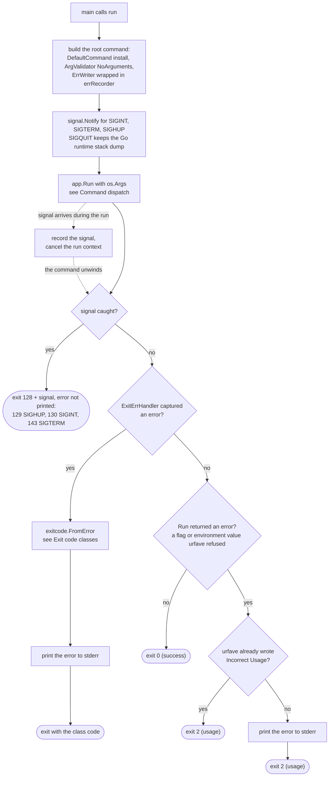

### Command dispatch

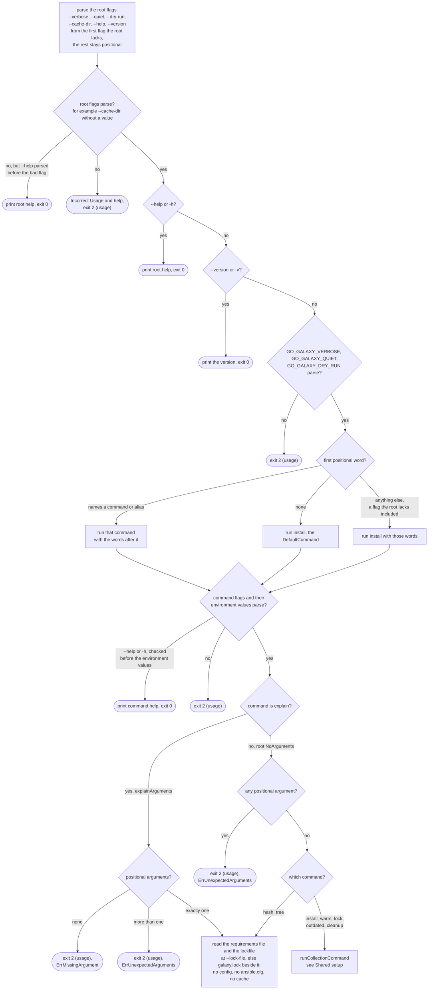

### Shared setup: runCollectionCommand

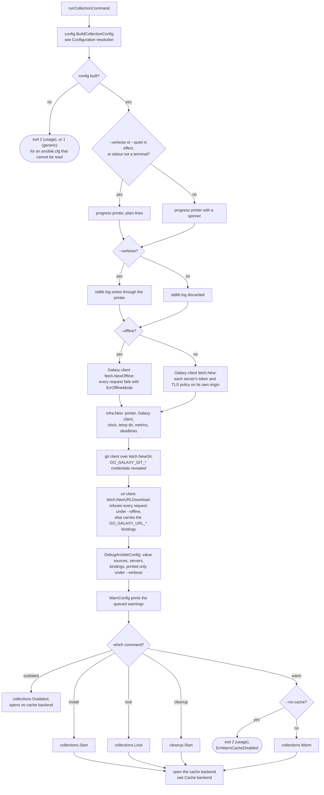

### Configuration resolution, part 1: flags, timeout and ansible.cfg

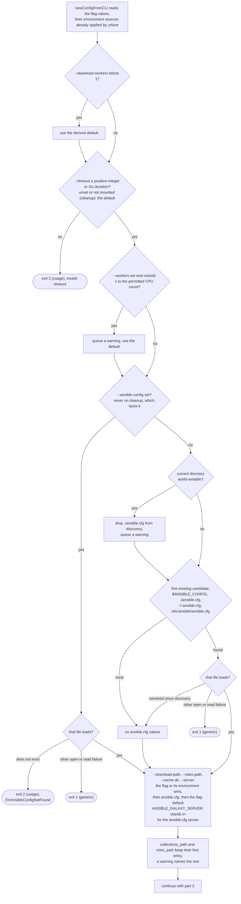

### Configuration resolution, part 2: servers, credentials, S3 and signatures

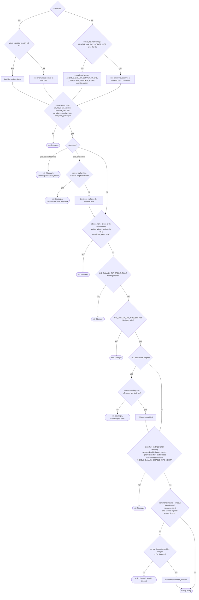

### Cache backend: selection, open and lock

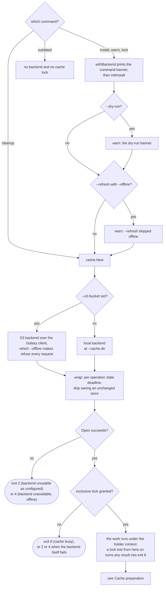

### Cache preparation after the lock

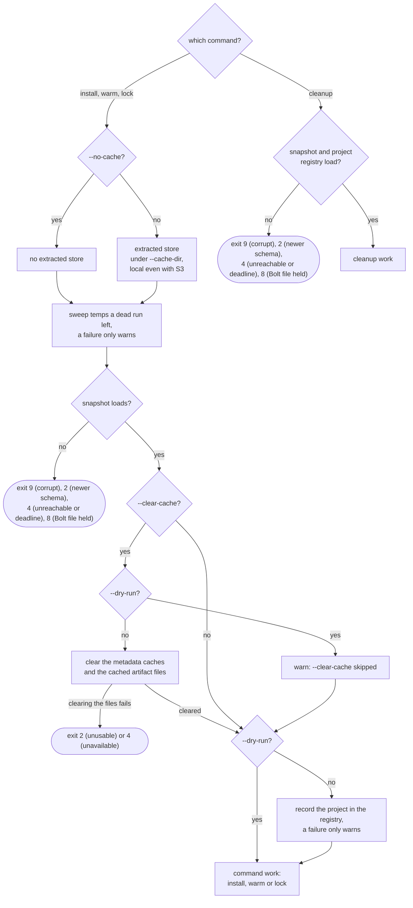

### Exit code classes

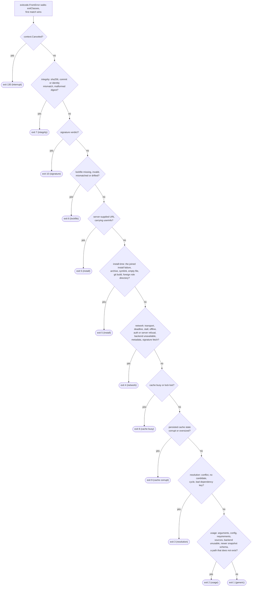

### Which command mounts which flags

A flag a command does not mount is an undefined flag after its command word
(exit 2), and `BuildCollectionConfig` reads it as its zero value, so its
environment variable is ignored too.

- Every command inherits the root's `--verbose`, `--quiet` (`-q`), `--dry-run`
  and `--cache-dir`, and has its own `--help` (`-h`). `--version` (`-v`) exists
  only before a command word.
- install and warm: the collection flags, the signature flags and the S3 flags.
- lock and outdated: the collection flags and the S3 flags.
- cleanup: the S3 flags only, so it has no `--offline`, `--timeout`,
  `--workers`, `--download-workers`, `--download-path`, `--roles-path`,
  `--server`, `--token`, `--ansible-config`, `--no-cache`, `--refresh`,
  `--clear-cache` or signature flags.
- hash, tree and explain: `--requirements-file` (`-r`, `--role-file`) and
  `--lock-file`. They accept the root flags but never read them.

### Flags that change the flow

- `--help`, `-h`: prints that command's help and exits 0 before anything runs,
  even when a flag after it or an environment value would fail.
- `--version`, `-v`: only before any command word; prints the version and
  exits 0. After a command word it is an undefined flag, exit 2.
- `--verbose` (`GO_GALAXY_VERBOSE`): no spinner, the stdlib log goes through the
  printer, and the `DebugAnsibleConfig` lines print. It also switches `--quiet`
  off.
- `--quiet`, `-q` (`GO_GALAXY_QUIET`): no spinner and no progress lines. Ignored
  under `--verbose`.
- `--offline` (`GO_GALAXY_OFFLINE`, not on cleanup): the Galaxy client and the
  url client refuse every request. The S3 backend uses the Galaxy client too, so
  `--offline` with `--s3-bucket` fails at Open with exit 4. With `--refresh` it
  prints the skip warning.
- `--timeout` (`GO_GALAXY_SERVER_TIMEOUT`, `GO_GALAXY_TIMEOUT`,
  `ANSIBLE_GALAXY_SERVER_TIMEOUT`, not on cleanup): a zero, negative or
  unparseable value exits 2. When no source sets it, `[galaxy] server_timeout`
  decides. cleanup always runs with the default and never reads
  `server_timeout`.
- `--workers` (`GO_GALAXY_WORKERS`): a value outside 1 to the permitted CPU
  count gets a warning and the derived default.
- `--download-workers` (`GO_GALAXY_DOWNLOAD_WORKERS`): a value below 1 silently
  becomes the derived default.
- `--ansible-config` (`GO_GALAXY_ANSIBLE_CONFIG`, not on cleanup): replaces
  discovery with a strict load. A missing file exits 2. An ansible.cfg that
  exists but cannot be read, named or discovered, exits 1.
- `--download-path` (`-p`), `--roles-path`, `--cache-dir`: when set from the
  flag or its environment, they outrank ansible.cfg. cleanup mounts only
  `--cache-dir`.
- `--server` (`GO_GALAXY_SERVER`): picks one server_list section by id, or one
  anonymous server. The rest of the list is never read. Without it, cleanup
  still resolves server_list, so a broken one fails cleanup with exit 2.
- `--token` (`GO_GALAXY_TOKEN`): exits 2 when several servers are in effect,
  when the server is plain http to a non-loopback host, or when the server's URL
  or `validate_certs false` came from ansible.cfg. Otherwise it replaces the
  server's token.
- `--s3-bucket` (`GO_GALAXY_S3_BUCKET`): a non-empty value selects the S3
  backend and makes `--s3-access-key` and `--s3-secret-key` required (exit 2
  without both).
- `--keyring`, `--required-valid-signature-count` (install and warm only): an
  explicitly empty value exits 2. The keyring is not opened here.
- `--required-valid-signature-count`, `--ignore-signature-status-code` (install
  and warm only): a count or status code the policy check refuses exits 2.
- `--disable-gpg-verify` (install and warm): when it is not set,
  `ANSIBLE_GALAXY_DISABLE_GPG_VERIFY` is read on every collection command,
  cleanup included, and a value that does not parse exits 2. With a keyring
  configured, it queues a warning.
- `--dry-run` (`GO_GALAXY_DRY_RUN`): for install, warm and lock, it prints the
  dry-run banner, skips `--clear-cache` with a warning and does not record the
  project.
- `--clear-cache` (`GO_GALAXY_CLEAR_CACHE`): after the snapshot loads, it clears
  the metadata caches and the cached artifact files, and a failure to clear the
  files ends the run. It is skipped under `--dry-run`.
- `--refresh` (`GO_GALAXY_REFRESH`): in the shared part, it only adds the skip
  warning when combined with `--offline`.
- `--no-cache` (`GO_GALAXY_NO_CACHE`): warm exits 2 before the banner and before
  any backend is opened. Install and lock run with no extracted store.

These flags are accepted but do not branch the shared setup, because they only
pass values on to a command or the backend: `--requirements-file` (`-r`,
`--role-file`), `--lock-file`, `--metrics-file`, `--no-deps`, `--frozen`,
`--s3-region`, `--s3-prefix`, `--s3-endpoint`, `--s3-session-token` and
`--s3-path-style-disabled`.

## install

`install` (alias `i`, and what runs when no command is named) resolves the
collections and roles of the requirements file - from the Galaxy servers, git
repositories and url sources, or under `--frozen` from the lockfile alone - and
installs collections under `--download-path` and then roles under
`--roles-path`, holding the cache backend's exclusive lock for the whole run.

A caught SIGINT, SIGTERM or SIGHUP at any point exits `128 + signal number`
(130, 143, 129); every other exit is decided by the cause's class, as the
diagrams show. Each flag also reads its `GO_GALAXY_*` variable, and
`--download-path`, `--roles-path` and `--cache-dir` fall back to `ansible.cfg`
when neither is set.

### Overview

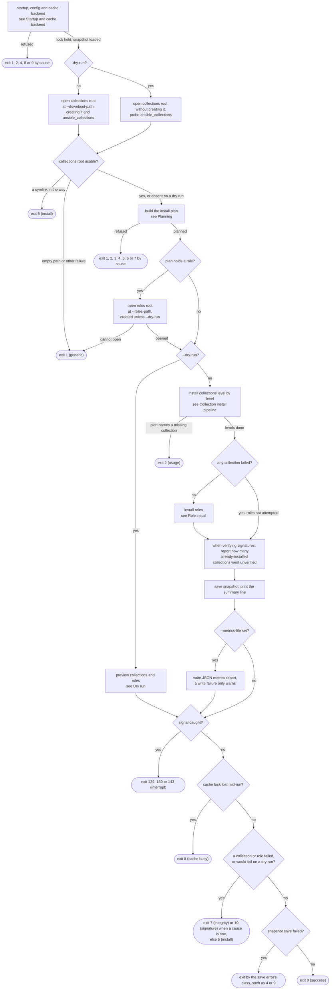

### Startup and cache backend

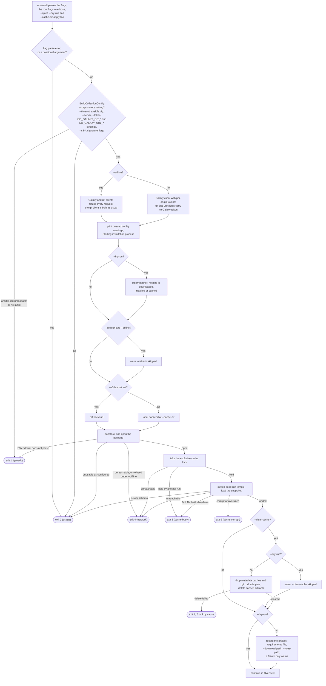

### Planning

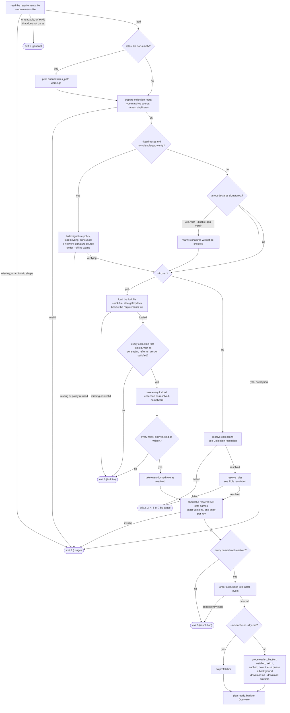

### Collection resolution

Runs only without `--frozen`.

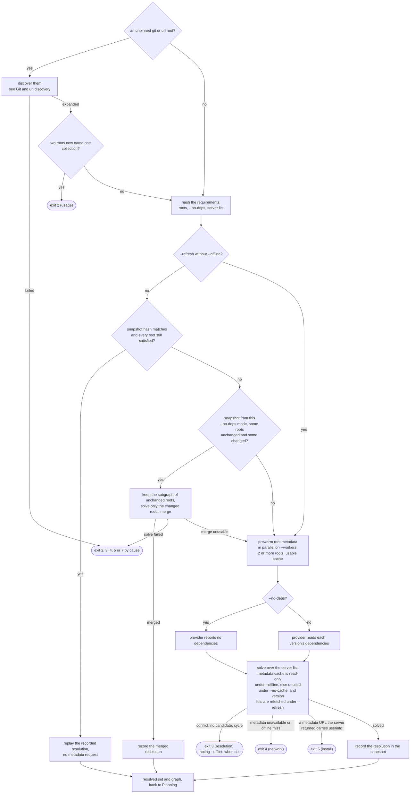

### Git and url discovery

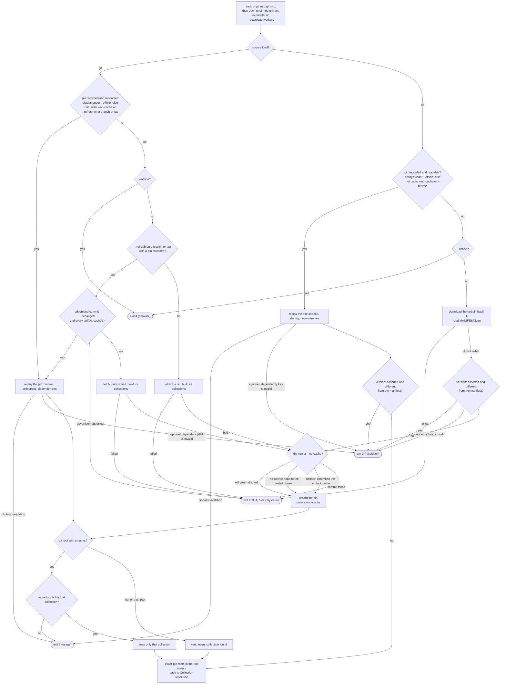

### Collection install pipeline

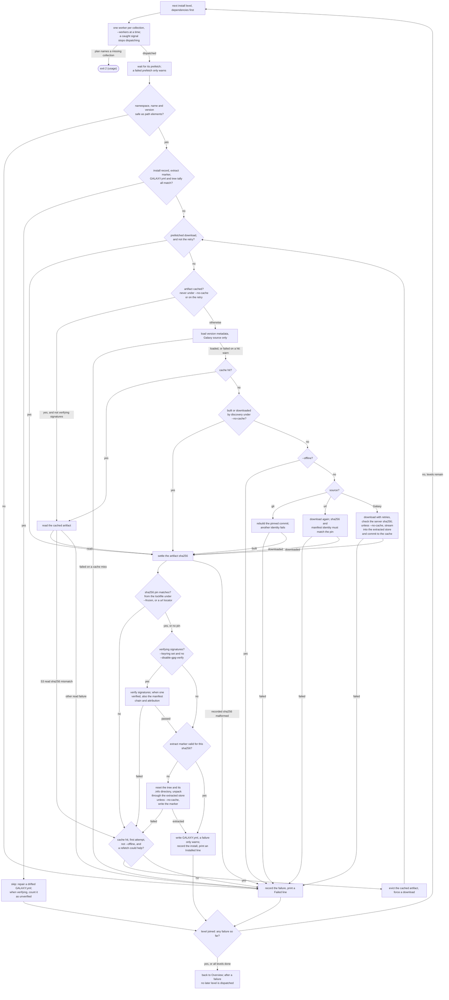

### Role resolution

Runs only without `--frozen`.

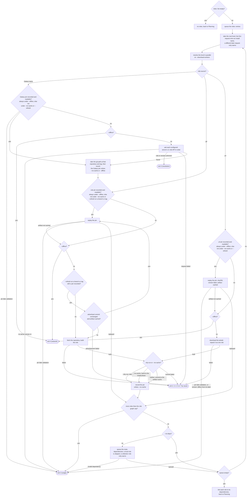

### Role install

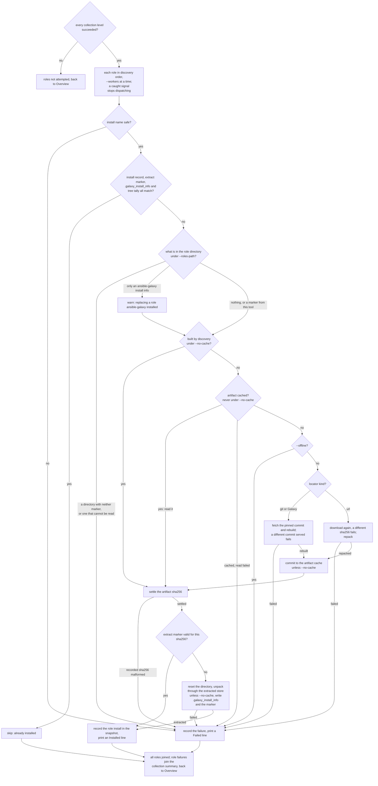

### Dry run

Replaces both install phases under `--dry-run`; resolution above still ran,
fetching git repositories, url tarballs and roles and recording their pins in a
snapshot that is saved only if one existed, but committing no artifact.

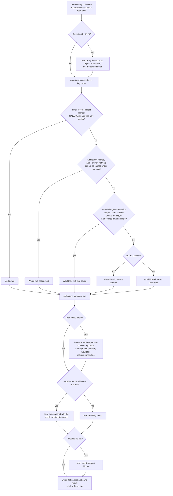

### Flags that change the flow

- `--frozen`: collections and roles come from the lockfile (`--lock-file`, else
  `galaxy.lock` beside the requirements file) instead of discovery and the
  solver. A missing, invalid or mismatched lockfile exits `6`, every locked
  entry is installed, lockfile sha256 pins are checked before extraction, and
  `--refresh` and `--no-deps` have nothing to act on. Without `--frozen` the
  lockfile is not read, except for the hash the metrics report carries.
- `--dry-run`: prints the banner, skips `--clear-cache` and the project record,
  creates neither install root, discards what discovery built, starts no
  prefetcher, previews instead of installing, saves the snapshot only when one
  already existed, and skips the metrics report with a warning.
- `--offline`: the Galaxy and url clients refuse every request, and with
  `--s3-bucket` the S3 backend cannot open (exit `4`); the metadata cache and
  the git, url and role pins are read even under `--no-cache`, and never
  written; an unrecorded pin, or a git or url role whose artifact is not cached,
  exits `4` during resolution; an artifact missing from the cache fails that
  collection or role at install; a corrupt cache hit is not evicted; `--refresh`
  is dropped with a warning; a solver conflict carries an offline note.
- `--refresh`: vetoes the resolve snapshot, refetches version-free metadata,
  re-advertises git branch and tag pins (collections and roles), re-asks the v1
  API for Galaxy roles and re-downloads url sources. Ignored under `--offline`
  and, having no resolution to act on, under `--frozen`.
- `--no-cache`: no artifact cache hit or commit, no extracted store and no
  prefetcher; discovery hands its builds straight to the install phase. Without
  `--offline` the metadata cache and the git, url and role pins are neither read
  nor written, except that `--refresh` still reads a branch or tag pin to
  compare its commit. The resolve snapshot is still loaded, replayed and saved.
- `--clear-cache`: drops the metadata caches and every git, url and role pin and
  deletes the cached artifacts before planning.
- `--no-deps`: part of the requirements hash; the solver sees no dependencies;
  the role walk stops at the `roles:` entries.
- `--keyring`, `--disable-gpg-verify`: verification runs only with a keyring and
  without the disable flag. Then each collection's signatures are checked before
  it is extracted, a cache hit still loads its version metadata, and a skipped
  install is counted as unverified. A `signatures:` block with no keyring exits
  `2`, or only warns under `--disable-gpg-verify`.
- `--s3-bucket`: selects the S3 backend instead of the local one at
  `--cache-dir`.
- `--metrics-file`: writes the JSON report after a real run.
- `--timeout`, `--server`, `--token`, `--ansible-config`,
  `--required-valid-signature-count`, `--ignore-signature-status-code`,
  `--s3-access-key`, `--s3-secret-key`: branch only when refused at startup,
  exiting `2`, or `1` for an `ansible.cfg` that cannot be read.

Accepted without changing the flow: `--verbose`, `--quiet`, `--cache-dir`,
`--download-path`, `--roles-path`, `--requirements-file`, `--lock-file`
(locations), `--workers`, `--download-workers` (pool sizes), `--s3-region`,
`--s3-prefix`, `--s3-endpoint`, `--s3-session-token` and
`--s3-path-style-disabled`, beyond the startup validation of the ones listed
above and the S3 backend refusing an endpoint it cannot use when it opens.

## lock

`lock` (alias `l`) resolves `requirements.yml` fresh (collections and the
`roles:` list) under the exclusive cache lock and writes `galaxy.lock`. With
`--frozen` it compares the fresh result with the file already on disk and fails
on drift instead of writing. With `--dry-run` it prints the same diff and writes
nothing. It never installs anything, but it saves the resolve work into the
cache snapshot so later runs can reuse it.

The six diagrams follow the order the code runs in. Diagrams 1 to 5 show each
exit with the class it has when it is raised. Diagram 6 shows how every result,
errors and success alike, becomes the process status: a caught signal outranks
all of them, and once the cache lock is held, losing the S3 lock mid-run turns
any result into exit 8.

### 1. Command line to a locked cache

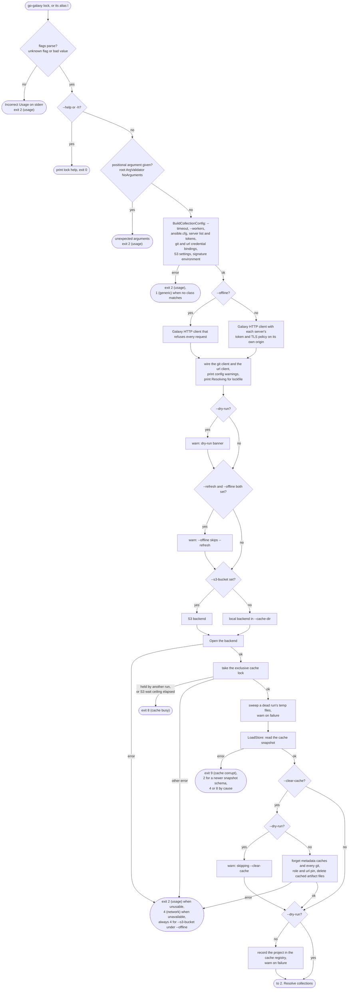

### 2. Resolve collections

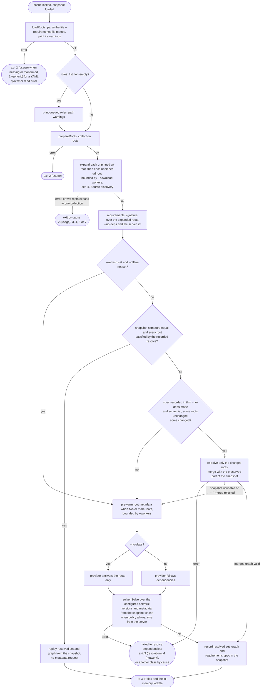

### 3. Roles and the in-memory lockfile

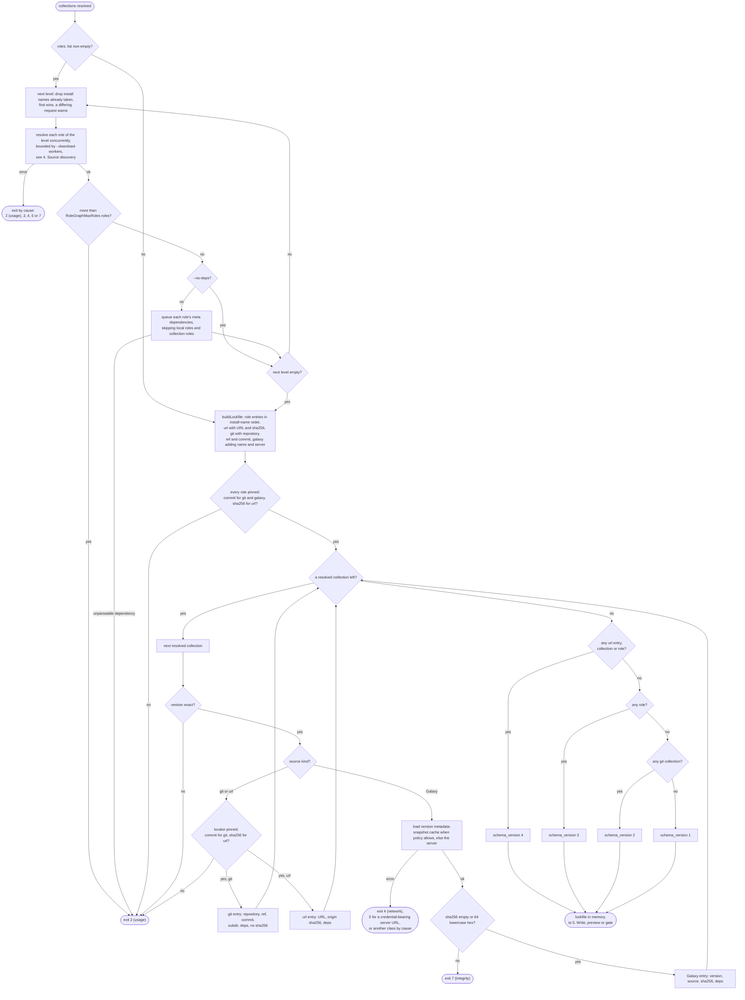

### 4. Source discovery for one git or url source

The same steps run for an unpinned git or url collection root (diagram 2) and
for every role (diagram 3). A Galaxy role maps to a GitHub repository and tag
first, then follows the git path.

```mermaid
flowchart TD
    S(["one source: git or url collection root,<br/>or a role"]) --> K{"source kind?"}
    K -->|"Galaxy role"| GS{"--no-cache or --refresh,<br/>without --offline?"}
    GS -->|"no"| GP{"Galaxy pin recorded?"}
    GS -->|"yes"| GO
    GP -->|"yes"| GM["repository and tag from the Galaxy pin"]
    GP -->|"recorded but invalid"| XP
    GP -->|"no"| GO{"--offline?"}
    GO -->|"yes"| X4(["not recorded in the cache<br/>exit 4 (network)"])
    GO -->|"no"| V1["ask each configured server's v1 role API in order,<br/>passing over one without v1 or without the role"]
    V1 -->|"error, or found nowhere"| XV(["exit 3 (resolution), 2 (usage)<br/>or 4 (network) by cause"])
    V1 -->|"found"| GM2["GitHub repository and tag from the v1 record"]
    GM --> RD
    GM2 --> RD
    K -->|"git or url collection root,<br/>git or url role"| RD{"--no-cache, or --refresh on a url<br/>or a ref that is not a commit,<br/>without --offline?"}
    RD -->|"yes"| OFF
    RD -->|"no"| PR{"pin recorded?"}
    PR -->|"yes"| RP["replay the pin, validated like a remote answer"]
    PR -->|"no"| OFF{"--offline?"}
    RP -->|"invalid pin or<br/>asserted version differs"| XP(["exit 2 (usage) or 3 (resolution)"])
    RP -->|"a role whose artifact<br/>is not cached"| OFF
    RP -->|"ok"| DONE
    OFF -->|"yes"| X4
    OFF -->|"no"| ADV{"git source, --refresh, ref not a commit,<br/>pin recorded, even under --no-cache?"}
    ADV -->|"yes"| AD["advertise the ref once"]
    AD -->|"error"| XF
    AD --> SAME{"same commit as the pin<br/>and artifacts cached?"}
    SAME -->|"yes"| RP
    SAME -->|"no, fetch the advertised commit"| FE
    ADV -->|"no"| FE["fetch: git repository at the ref and build,<br/>or download the url tarball over the url client<br/>and read MANIFEST.json or repack the role"]
    FE -->|"error"| XF(["exit by cause:<br/>4 (network), 3, 2, 5 or 7"])
    FE -->|"ok"| ST{"--dry-run?"}
    ST -->|"yes"| DI["discard the build"]
    ST -->|"no"| NC{"--no-cache?"}
    NC -->|"yes"| KE["keep the build for this run only,<br/>removed when the run ends"]
    NC -->|"no"| CO["commit the artifact to the cache"]
    CO -->|"error"| XF
    CO --> WR
    DI --> WR{"--no-cache?"}
    WR -->|"no"| RE["record the pin in the snapshot"]
    WR -->|"yes"| DONE
    KE --> DONE
    RE --> DONE(["source pinned: locator with commit or sha256,<br/>a Galaxy role then records its Galaxy pin<br/>unless --no-cache or --offline"])
```

### 5. Write, preview or gate

`--frozen` is checked before `--dry-run`, so with both set the frozen verdict
applies and `--dry-run` controls only the snapshot save and the metrics report.

```mermaid
flowchart TD
    IN(["lockfile built in memory"]) --> PA["path: --lock-file, else galaxy.lock<br/>beside --requirements-file"]
    PA --> FR{"--frozen?"}
    FR -->|"yes"| LR["LoadRequired: read and validate the file at path"]
    LR -->|"absent"| XM(["lockfile missing<br/>exit 6 (lockfile)"])
    LR -->|"unreadable or invalid"| XI(["lockfile invalid<br/>exit 6 (lockfile)"])
    LR -->|"ok"| CF["Compare the file on disk with the fresh build,<br/>print Would lines and a Frozen summary"]
    CF --> SD{"--dry-run?"}
    SD -->|"no"| SS
    SD -->|"yes"| WP
    FR -->|"no"| DR{"--dry-run?"}
    DR -->|"yes"| BL["load the file at path as the baseline"]
    BL -->|"absent"| BN["empty baseline"]
    BL -->|"unreadable or invalid"| BW["warn, empty baseline"]
    BL -->|"ok"| CD
    BN --> CD
    BW --> CD["Compare baseline with the fresh build,<br/>print Would lines and a Dry run summary"]
    CD --> WP{"snapshot persisted before this run?"}
    WP -->|"yes"| SS
    WP -->|"no"| WW["warn: a dry run creates no snapshot"]
    DR -->|"no"| SA["lockfile.Save: canonical copy, schema recomputed,<br/>entries and deps sorted, 2-space YAML,<br/>atomic write"]
    SA -->|"error"| XW(["exit 1 (generic): no class matches<br/>a filesystem error, no snapshot<br/>or metrics written"])
    SA -->|"ok"| OK1["print Lockfile written to path"]
    OK1 --> SS["SaveStore, skipped when the snapshot is unchanged"]
    SS --> MF
    WW --> MF{"--metrics-file set?"}
    MF -->|"no"| DF
    MF -->|"yes"| MD{"--dry-run?"}
    MD -->|"yes"| MW["warn: skipping metrics report"]
    MD -->|"no"| MR["write the metrics report, warn on failure"]
    MW --> DF
    MR --> DF{"--frozen and the diff not empty?"}
    DF -->|"yes"| XD(["lockfile drift, with any save failure appended<br/>exit 6 (lockfile)"])
    DF -->|"no"| SF{"snapshot save failed?"}
    SF -->|"yes"| XS(["exit by cause,<br/>usually 4 (network) or 2 (usage)"])
    SF -->|"no"| X0(["exit 0 (success)"])
```

### 6. How the result becomes the exit status

```mermaid
flowchart TD
    A["the lock work returns nil or an error"] --> B{"cache lock was taken, run not canceled,<br/>and the S3 heartbeat saw another holder?"}
    B -->|"yes"| C["the result becomes cache lock lost"]
    B -->|"no"| D
    C --> D["deferred: remove unclaimed --no-cache builds,<br/>close the backend, release the lock,<br/>a release failure is only printed"]
    D --> E["app.Run returns to main"]
    E --> F{"SIGINT, SIGTERM or SIGHUP caught?"}
    F -->|"yes"| XS(["exit 130, 143 or 129 (interrupt)"])
    F -->|"no"| G{"error?"}
    G -->|"no"| X0(["exit 0 (success)"])
    G -->|"yes"| H["exitcode.FromError, first match wins:<br/>canceled 130, integrity 7, signature 10,<br/>lockfile 6, server URL userinfo 5,<br/>install 5, network 4,<br/>cache busy 8, cache corrupt 9,<br/>resolution 3, usage 2, else 1"]
    H --> XE(["error printed on stderr,<br/>exit with that code"])
```

A failure before the lock is taken (diagram 1 up to the lock) has no lock to
lose. A setup failure after Open (the lock, LoadStore, `--clear-cache`) is
unwound inside `initInstall`: the lock is released if it was taken and the
backend is closed, so the deferred step above does not run for it. The lock-loss
check still applies once the lock was taken.

### Flags that change the flow

- `--frozen` (`GO_GALAXY_FROZEN`): the fresh resolve still runs in full.
  Afterwards the file at the lockfile path must exist and load (exit 6
  otherwise), and it is compared with the fresh build instead of being
  overwritten; any difference, a server-only change included, exits 6. It is
  checked before `--dry-run`.
- `--dry-run` (`GO_GALAXY_DRY_RUN`, global): prints the banner, skips
  `--clear-cache` and project registration, discards every git and url build
  made during discovery, writes no lockfile but diffs the fresh build against
  the file on disk (an unreadable file is warned about and treated as absent),
  saves the snapshot only when one was persisted before this run, and skips the
  metrics report.
- `--refresh` (`GO_GALAXY_REFRESH`): stops the resolve snapshot from being
  replayed or reused incrementally, skips version-free cached metadata,
  re-advertises git branch and tag pins, and skips url pins and Galaxy role
  pins. `--offline` outranks it: one warning is printed and it has no effect.
- `--offline` (`GO_GALAXY_OFFLINE`): the Galaxy and url HTTP clients refuse
  every request. Sources replay only their recorded pins, and a miss exits 4.
  Pins and cached metadata are read even when `--refresh` or `--no-cache` is
  set, and nothing new is recorded. The S3 backend shares the Galaxy HTTP
  client, so `--s3-bucket` under `--offline` fails at Open with exit 4.
- `--no-cache` (`GO_GALAXY_NO_CACHE`): no metadata cache or pin is read or
  recorded, and each build is kept as a temporary file for the run instead of
  being committed to the artifact cache. Two exceptions: under `--refresh` a
  recorded git pin on a ref that is not a commit is still re-advertised and kept
  when the commit is unchanged and its artifacts are cached, and the recorded
  resolve in the snapshot is still replayed and recorded.
- `--no-deps` (`GO_GALAXY_NO_DEPS`): the solver answers the roots only, the role
  walk stops at the `roles:` entries, and the flag is part of the requirements
  signature, so a snapshot resolved in the other mode is not replayed.
- `--clear-cache` (`GO_GALAXY_CLEAR_CACHE`): before resolving, forgets the
  metadata caches and every pin and deletes the cached artifact files. It is
  skipped under `--dry-run`. The recorded resolve is kept, so when the
  requirements are unchanged it is still replayed.
- `--s3-bucket` (`GO_GALAXY_S3_BUCKET`): chooses the S3 backend instead of the
  local one. Only the S3 lock can be lost mid-run (exit 8).
- `--metrics-file` (`GO_GALAXY_METRICS_FILE`): writes the JSON report at the end
  of a run that reaches the save step. It is skipped under `--dry-run`.
- `--help`, `-h`: prints the command help and exits 0.

Accepted without changing the flow, since they supply values only: `--verbose`,
`--quiet`, `--cache-dir`, `--server`, `--token`, `--timeout`,
`--download-path`/`-p`, `--roles-path`,
`--requirements-file`/`-r`/`--role-file`, `--ansible-config`, `--workers`,
`--download-workers`, `--lock-file`, and `--s3-region`, `--s3-prefix`,
`--s3-access-key`, `--s3-secret-key`, `--s3-endpoint`, `--s3-session-token`,
`--s3-path-style-disabled`. The same holds for the `ansible.cfg` keys `lock`
reads (`[defaults] collections_path` and `roles_path`, `[galaxy] server`,
`server_list`, `cache_dir`, `server_timeout`, and the `[galaxy_server.<id>]`
sections); a value that cannot be used fails in diagram 1. `lock` does not mount
the signature flags.

## warm

`warm` (alias `w`) resolves `requirements.yml` the way `install` does, then
fills the artifact cache and the extracted store for every resolved collection
and role without touching the collections or roles directories, so a baked CI
image's later installs only hardlink. Each warmed item gets a warmed entry in
the snapshot (`namespace.name@version`, or `role:name@version` for a role),
stamped with the time of the warm, and `cleanup` keeps its extracted tree for 30
days after that stamp.

Two rules hold at every step below. A caught SIGINT, SIGTERM or SIGHUP ends the
run with 130, 143 or 129, whatever the diagram says. Once the cache lock is
taken, `withBackend` passes every result, a successful one included, through
`cacheManager.LockLostError`, so on the S3 backend a lock that another holder
took mid-run turns the result into exit 8 (cache busy).

### Startup, cache backend and lock

```mermaid
flowchart TD
    Start(["go-galaxy warm, alias w"]) --> Parse{"flags parse?"}
    Parse -->|"no"| X2a(["exit 2 (usage)"])
    Parse -->|"yes"| Args{"positional arguments given?"}
    Args -->|"yes"| X2a
    Args -->|"no"| Cfg["build config from flags, environment and ansible.cfg:<br/>timeout, workers, paths, servers, git and url credentials,<br/>S3 settings, signature policy"]
    Cfg --> CfgOK{"config accepted?"}
    CfgOK -->|"no"| X2b(["exit 2 (usage)<br/>exit 1 for an ansible.cfg that cannot be read or scanned"])
    CfgOK -->|"yes"| Wire["wire the printer, HTTP, git and url clients<br/>print config warnings"]
    Wire --> NoCache{"--no-cache set?"}
    NoCache -->|"yes, with or without --dry-run"| X2c(["exit 2 (usage)<br/>no backend opened, no lock taken"])
    NoCache -->|"no"| Banner["print Warming caches"]
    Banner --> Dry1{"--dry-run set?"}
    Dry1 -->|"yes"| DryWarn["warn: dry-run banner, survives --quiet"]
    Dry1 -->|"no"| RefOff{"--refresh and --offline both set?"}
    DryWarn --> RefOff
    RefOff -->|"yes"| RefWarn["warn: --offline skips --refresh"]
    RefOff -->|"no"| S3{"--s3-bucket set?"}
    RefWarn --> S3
    S3 -->|"yes: S3 backend"| Open["open the backend"]
    S3 -->|"no: local backend at --cache-dir"| Open
    Open -->|"unusable as configured"| X2d(["exit 2 (usage)"])
    Open -->|"unreachable, or S3 refused under --offline"| X4a(["exit 4 (network)"])
    Open -->|"opened"| Lock["take the exclusive cache lock"]
    Lock -->|"another holder has it"| X8a(["exit 8 (cache busy)"])
    Lock -->|"S3 never answered usably"| X4a
    Lock -->|"unusable, such as permission denied"| X2d
    Lock -->|"granted"| Sweep["sweep download and extract temps a dead run left"]
    Sweep --> Load["load the snapshot"]
    Load -->|"corrupt or oversized"| X9(["exit 9 (cache corrupt)"])
    Load -->|"written by a newer schema"| X2d
    Load -->|"Bolt file still held"| X8a
    Load -->|"unreachable or state deadline"| X4a
    Load -->|"S3 snapshot that does not decode"| X1(["exit 1 (generic)"])
    Load -->|"loaded"| Clear{"--clear-cache set?"}
    Clear -->|"yes"| Dry2{"--dry-run set?"}
    Dry2 -->|"yes"| ClearSkip["warn: skipping --clear-cache"]
    Dry2 -->|"no"| ClearDo["drop the metadata caches and the git, url and role pins,<br/>delete the cached artifact files"]
    ClearDo -->|"delete failed"| X4a
    ClearDo -->|"permission denied"| X2d
    Clear -->|"no"| Dry3{"--dry-run set?"}
    ClearSkip --> Dry3
    ClearDo --> Dry3
    Dry3 -->|"no"| Reg["record the project in the cache registry,<br/>warn on failure"]
    Dry3 -->|"yes"| Work["plan and warm under the lock holder context,<br/>see the diagrams below"]
    Reg --> Work
    Work --> Lost{"S3 lock lost to another holder,<br/>run not interrupted?"}
    Lost -->|"yes"| X8b(["exit 8 (cache busy)"])
    Lost -->|"no"| Done(["close the backend, release the lock,<br/>exit with the code of the work result"])
```

### Plan: requirements, verification, resolution

```mermaid
flowchart TD
    Req["load the requirements file, --requirements-file"] --> ReqOK{"file readable and valid?"}
    ReqOK -->|"missing, or not a requirements shape"| X2a(["exit 2 (usage)"])
    ReqOK -->|"unreadable, or not YAML"| X1(["exit 1 (generic)"])
    ReqOK -->|"yes"| Warn["print requirement warnings<br/>with roles: entries, print the queued roles_path warnings"]
    Warn --> Roots["prepare the collection roots"]
    Roots -->|"invalid entry"| X2a
    Roots --> CfgKeys["warn when ansible.cfg carries signature keys, which are never read"]
    CfgKeys --> Ver{"--keyring set and --disable-gpg-verify not set?"}
    Ver -->|"no"| Decl{"a collection root declares signatures:?"}
    Decl -->|"no"| Frozen1{"--frozen set?"}
    Decl -->|"yes, --disable-gpg-verify set"| DeclWarn["warn: declared sources are not checked"]
    Decl -->|"yes, no keyring"| X2b(["exit 2 (usage)"])
    DeclWarn --> Frozen1
    Ver -->|"yes"| Keyring["build the policy, load the keyring"]
    Keyring -->|"unusable"| X2b
    Keyring --> Dry{"--dry-run set?"}
    Dry -->|"yes"| DryNote["warn: the preview verifies no signature"]
    Dry -->|"no"| VerOn["print Signature verification on"]
    DryNote --> OffSig["with --offline, warn once on a declared<br/>network signature source"]
    VerOn --> OffSig
    OffSig --> Frozen1
    Frozen1 -->|"yes"| Lf["print Frozen: using lockfile<br/>load --lock-file, else galaxy.lock beside the requirements file"]
    Lf -->|"missing or invalid"| X6(["exit 6 (lockfile)"])
    Lf --> LfRoots["check every root against its locked entry,<br/>take the pinned versions, sha256 and commits"]
    LfRoots -->|"root missing or constraint unmet"| X6
    Frozen1 -->|"no"| Solve["resolve collections,<br/>see Resolving without --frozen"]
    Solve -->|"failed"| XR(["exit 2 (usage), 3 (resolution), 4 (network),<br/>5 (install) or 7 (integrity) by cause"])
    LfRoots --> Map["fold the resolved set into a map"]
    Solve --> Map
    Map -->|"unsafe name, inexact version or duplicate key"| X2a
    Map --> Frozen2{"--frozen set?"}
    Frozen2 -->|"yes"| LfRoles["load the lockfile again,<br/>check every roles: entry against its locked role"]
    LfRoles -->|"missing, invalid or mismatched"| X6
    Frozen2 -->|"no"| RoleRes["resolve roles,<br/>see Resolving without --frozen"]
    RoleRes -->|"failed"| XR
    LfRoles --> DryRun{"--dry-run set?"}
    RoleRes --> DryRun
    DryRun -->|"yes"| Preview["dry-run preview,<br/>see The --dry-run preview"]
    DryRun -->|"no"| WarmIt["warm collections, then roles,<br/>see Warming collections and roles"]
```

### Resolving without --frozen

Collections resolve first. The plan then folds them into a map, and only after
that are roles resolved. A role level resolves its requests concurrently and
merges them in declaration order. The role cap and the dependency queue are
applied per role in that order, once the whole level has resolved.

```mermaid
flowchart TD
    Start["print Resolve dependencies"] --> Src{"another git or url root to expand?"}
    Src -->|"yes"| Pin{"pin recorded for this root,<br/>not bypassed by --refresh?"}
    Pin -->|"yes"| Replay["replay the pin, no network"]
    Pin -->|"no"| Off{"--offline set?"}
    Off -->|"yes"| X4(["exit 4 (network)"])
    Off -->|"no"| Fetch["git: with --refresh and a recorded branch or tag pin, advertise,<br/>keep the pin when the commit is unchanged and cached,<br/>else fetch and build; url: download, read MANIFEST.json"]
    Fetch -->|"failed"| XS(["exit 2 (usage), 3 (resolution), 4 (network),<br/>5 (install) or 7 (integrity) by cause"])
    Fetch --> DryA{"--dry-run set?"}
    DryA -->|"yes"| Discard["discard the built artifact, record the pin"]
    DryA -->|"no"| Commit["commit the artifact to the cache, record the pin"]
    Replay --> Src
    Discard --> Src
    Commit --> Src
    Src -->|"no"| Snap{"--refresh set without --offline?"}
    Snap -->|"no"| Match{"recorded resolution matches requirements, servers and --no-deps,<br/>or an incremental resolve from it succeeds?"}
    Match -->|"yes"| Reuse["reuse the recorded resolution,<br/>an incremental one is recorded"]
    Match -->|"incremental resolve failed"| XS
    Match -->|"no"| Solver["prewarm root metadata, run the solver<br/>--no-deps: no dependency edges"]
    Snap -->|"yes"| Solver
    Solver -->|"conflict or no candidate"| X3(["exit 3 (resolution)"])
    Solver -->|"metadata unreachable, or not cached under --offline"| X4
    Solver --> Record["record the resolution in the snapshot"]
    Reuse --> CDone(["collections resolved, back to the plan"])
    Record --> CDone
    RStart(["resolve roles, from the plan"]) --> Roles{"roles: entries?"}
    Roles -->|"no"| RDone(["roles resolved, back to the plan"])
    Roles -->|"yes"| RPrint["print Resolve roles"]
    RPrint --> Level["take the next level,<br/>the first request wins per install name"]
    Level --> RPin{"role pin recorded, its artifact cached,<br/>not bypassed by --refresh?"}
    RPin -->|"yes"| RReplay["replay the pin"]
    RPin -->|"no"| ROff{"--offline set?"}
    ROff -->|"yes"| X4
    ROff -->|"no"| RFetch["Galaxy role: v1 lookup, then its git repository<br/>git role: advertise, fetch, build; url role: download<br/>read meta/main.yml and meta/requirements.yml"]
    RFetch -->|"failed"| XS
    RFetch --> DryB{"--dry-run set?"}
    DryB -->|"yes"| RDiscard["discard the built artifact, record the pin"]
    DryB -->|"no"| RCommit["commit the artifact, record the pin"]
    RReplay --> Cap{"more roles than the role graph cap?"}
    RDiscard --> Cap
    RCommit --> Cap
    Cap -->|"yes"| X2(["exit 2 (usage)"])
    Cap -->|"no"| NoDeps{"--no-deps set?"}
    NoDeps -->|"no"| Queue["queue the declared dependencies as the next level"]
    Queue -->|"a dependency refused as written"| X2
    NoDeps -->|"yes"| Next{"next level empty?"}
    Queue --> Next
    Next -->|"no"| Level
    Next -->|"yes"| RDone
```

### Warming collections and roles

Roles are warmed only when every collection warmed. A per-item failure never
stops the other items. The run fails at the end, and the failure's causes are
joined behind the install headline.

```mermaid
flowchart TD
    Pre["start the prefetcher: probe the artifact cache for every collection,<br/>download the misses in the background on the --download-workers pool"] --> Loop{"another collection to dispatch?"}
    Loop -->|"yes"| Cancel{"run canceled by a signal,<br/>or S3 lock lost?"}
    Cancel -->|"no"| One["on the --workers pool: warm one collection,<br/>see Warming one collection"]
    One -->|"warmed"| OkC["print Cached: namespace.name"]
    One -->|"failed"| FailC["print Failed: namespace.name, record the cause"]
    OkC --> Loop
    FailC --> Loop
    Cancel -->|"yes: stop dispatching"| WaitC["wait for the started workers, stop the prefetcher"]
    Loop -->|"no"| WaitC
    WaitC --> AnyC{"any collection failed?"}
    AnyC -->|"yes: roles are not warmed"| Save
    AnyC -->|"no"| RLoop{"another resolved role to dispatch?"}
    RLoop -->|"yes"| RCancel{"run canceled by a signal,<br/>or S3 lock lost?"}
    RCancel -->|"no"| RHit{"role artifact in the artifact cache?"}
    RHit -->|"yes"| RFetch["read it from the cache"]
    RHit -->|"no"| ROff{"--offline set?"}
    ROff -->|"yes: not in cache"| FailR["print Failed: role name, record the cause"]
    ROff -->|"no"| RGet["git or Galaxy role: fetch the pinned commit, build<br/>url role: download, check the pinned sha256<br/>commit to the artifact cache"]
    RGet -->|"another commit or sha256 served, or fetch failed"| FailR
    RGet --> REnsure["hash, ensure the tree in the extracted store,<br/>record warmed entry role:name@version, stamped now"]
    RFetch --> REnsure
    RFetch -->|"read failed"| FailR
    REnsure -->|"failed"| FailR
    REnsure --> OkR["print Cached: role name"]
    OkR --> RLoop
    FailR --> RLoop
    RCancel -->|"yes: stop dispatching"| Save
    RLoop -->|"no, after the started workers finish"| Save["save the snapshot, skipped when nothing changed"]
    Save --> Met{"--metrics-file set?"}
    Met -->|"yes"| MetW["write the metrics report, warn on failure"]
    Met -->|"no"| Res{"any collection or role failed?"}
    MetW --> Res
    Res -->|"yes"| XF(["exit 7 (integrity) or 10 (signature) when a cause is one,<br/>else exit 5 (install), a network cause included<br/>a save failure is joined to the message"])
    Res -->|"no"| SaveOK{"snapshot saved?"}
    SaveOK -->|"no"| XS(["exit 4 (network) or 2 (usage) by cause"])
    SaveOK -->|"yes"| Done["print Warm complete: N collections cached,<br/>or N collections, M roles cached"]
    Done --> X0(["exit 0 (success)"])
```

### Warming one collection

A forced refetch happens at most once per collection, and only after a cache hit
proved bad.

```mermaid
flowchart TD
    Wait["wait for this collection's prefetch"] --> PF{"prefetch failed?"}
    PF -->|"yes"| PFWarn["warn: Prefetch failed"]
    PF -->|"no"| Pre{"prefetched bytes in hand,<br/>not a forced refetch?"}
    PFWarn --> Pre
    Pre -->|"yes"| UsePre["take the prefetched temp and its own sha256"]
    Pre -->|"no"| Hit{"artifact in the artifact cache,<br/>not a forced refetch?"}
    Hit -->|"yes"| CacheAlone{"verification off<br/>and no metadata in hand?"}
    CacheAlone -->|"yes"| CacheOnly["print Using cached, read the cached artifact"]
    CacheAlone -->|"no"| MetaHit["load Galaxy version metadata unless in hand,<br/>warn if it fails, read the cached artifact"]
    Hit -->|"no"| MetaMiss["load Galaxy version metadata,<br/>none for git or url"]
    MetaMiss -->|"metadata failed"| Failed(["Failed: cause recorded"])
    MetaMiss --> Off{"--offline set?"}
    Off -->|"yes: not in cache"| Failed
    Off -->|"no"| Down["download from Galaxy, or refetch the git commit or url,<br/>commit to the artifact cache"]
    Down -->|"failed"| Failed
    UsePre --> Sha["pick the sha256: own hash, a rehash under a pin,<br/>else the metadata or sidecar digest"]
    CacheOnly --> Sha
    MetaHit --> Sha
    Down --> Sha
    CacheOnly -->|"read failed"| Retry1{"cache hit, first attempt, not --offline,<br/>and a sha256 mismatch?"}
    MetaHit -->|"read failed"| Retry1
    Sha -->|"malformed digest"| Failed
    Sha --> PinChk{"sha256 pin set, from the lockfile or a url source,<br/>and different?"}
    PinChk -->|"yes"| Retry2{"cache hit, first attempt, not --offline,<br/>not a signature verdict or source failure?"}
    PinChk -->|"no"| Sig["verify signatures when verification is on"]
    Sig -->|"failed"| Retry2
    Sig --> Ensure["ensure the tree in the extracted store"]
    Ensure -->|"failed"| Retry2
    Ensure --> Stamp["record warmed entry namespace.name@version:<br/>sha256, stamped now, cache hits included"]
    Stamp --> Ok(["Cached"])
    Retry1 -->|"yes"| Evict["evict the cached artifact, force a refetch"]
    Retry1 -->|"no"| Failed
    Retry2 -->|"yes"| Evict
    Retry2 -->|"no"| Failed
    Evict --> Pre
```

### The --dry-run preview

This replaces the warming step. It downloads no artifact, extracts nothing and
writes no warmed entry. Resolution above still ran, and a git, url or role
source that had no usable pin was fetched there and its build discarded.

```mermaid
flowchart TD
    Warmed["read the warmed set: entries warmed within the last 30 days"] --> Probe["probe every collection in parallel on the --workers pool,<br/>one artifact metadata lookup each"]
    Probe --> Cached{"artifact cached?"}
    Cached -->|"no"| Verdict["verdict per collection"]
    Cached -->|"yes"| PinOff{"--offline set, and a well-formed recorded digest<br/>differs from the sha256 pin?"}
    PinOff -->|"yes: would fail, sha256 mismatch"| Verdict
    PinOff -->|"no"| Ready{"extracted tree ready under the sha256 pin,<br/>else under the sha256 of its warmed entry?"}
    Ready -->|"yes: settled"| Verdict
    Ready -->|"no: cached"| Verdict
    Verdict --> FO{"--frozen and --offline both set?"}
    FO -->|"yes"| FOWarn["warn: the preview checks recorded digests, not bytes"]
    FO -->|"no"| Report{"in sorted key order: settled?"}
    FOWarn --> Report
    Report -->|"yes"| Already["print Already warm: key"]
    Report -->|"no"| NotCached{"not cached and --offline set?"}
    NotCached -->|"yes"| WF1["print Would fail: not cached and --offline forbids downloading,<br/>record the cause"]
    NotCached -->|"no"| Fails{"would fail?"}
    Fails -->|"yes"| WF2["print Would fail: key and cause, record it"]
    Fails -->|"no"| WW["print Would warm: key, artifact cached or would download"]
    Already --> Sum["print Dry run: N would warm, M already warm, K would fail"]
    WF1 --> Sum
    WF2 --> Sum
    WW --> Sum
    Sum --> HasRoles{"roles resolved?"}
    HasRoles -->|"yes"| RoleProbe["per role: settled when its artifact is cached, a warmed entry<br/>role:name@version exists and its extracted tree is ready;<br/>report with the role verbs, not cached under --offline would fail,<br/>then print the roles summary line"]
    HasRoles -->|"no"| Persisted{"snapshot persisted before this run?"}
    RoleProbe --> Persisted
    Persisted -->|"yes"| SaveSnap["save the snapshot, skipped when nothing changed"]
    Persisted -->|"no"| NoSave["warn: no snapshot is created,<br/>the metadata caches this run built are discarded"]
    SaveSnap --> Met{"--metrics-file set?"}
    NoSave --> Met
    Met -->|"yes"| MetSkip["warn: skipping the metrics report"]
    Met -->|"no"| Any{"any would fail?"}
    MetSkip --> Any
    Any -->|"yes"| XF(["exit 7 (integrity) for a digest mismatch,<br/>else exit 5 (install)"])
    Any -->|"no"| SaveOK{"snapshot save failed?"}
    SaveOK -->|"yes"| XS(["exit 4 (network) or 2 (usage) by cause"])
    SaveOK -->|"no, or no save attempted"| X0(["exit 0 (success)"])
```

### Flags that change the flow

- `--no-cache` (`GO_GALAXY_NO_CACHE`): refused with exit 2 before any backend is
  opened or locked, `--dry-run` or not. Its dry-run banner is never printed.
- `--dry-run` (`GO_GALAXY_DRY_RUN`): prints the dry-run banner. It skips
  `--clear-cache` with a warning and does not record the project in the
  registry. Git, url and role sources fetched while resolving are discarded
  rather than committed. Warming is replaced by the preview. The snapshot is
  saved only if one was persisted before this run, and the metrics report is
  skipped with a warning. With verification on, it prints a caveat that no
  signature is checked.
- `--frozen` (`GO_GALAXY_FROZEN`): collections and roles come from the lockfile,
  with no solver and no role discovery. A missing, invalid or mismatched
  lockfile exits 6. Every collection the lockfile pins by sha256 (a git entry
  carries none) is checked against that pin before its tree is ensured. With
  `--offline` in a dry run, it prints the recorded-digest warning.
- `--offline` (`GO_GALAXY_OFFLINE`): a git, url or role source needs a
  recorded pin, and a Galaxy collection its cached version listing, or
  resolution exits 4. An artifact missing from the cache (or its Galaxy
  metadata, on a miss) fails that item, so the run ends with exit 5,
  `--frozen` included. The prefetcher still runs and warns that its download
  failed. A bad cache hit is never evicted and refetched. In a dry run, an
  uncached item becomes a would-fail, and so does a recorded digest that
  contradicts the pin. `--offline` also outranks `--refresh`, with a warning.
  With `--s3-bucket` the S3 client refuses every request too, so the backend
  cannot be opened and the run exits 4 before any lock is taken.
- `--refresh` (`GO_GALAXY_REFRESH`): skips the recorded resolution and the
  cached version listings. A url pin is downloaded again. A git branch or tag
  pin, a role pin and a Galaxy role's v1 answer are asked again, and a pin is
  kept when the commit has not moved and its artifact is cached. It has no
  effect under `--frozen` or `--offline`.
- `--clear-cache` (`GO_GALAXY_CLEAR_CACHE`): before resolving, drops the API,
  dependency and version caches, drops every git, url and role pin, and deletes
  the cached artifact files. The recorded resolution and the warmed set survive.
  It is skipped under `--dry-run`.
- `--no-deps` (`GO_GALAXY_NO_DEPS`): the solver sees no dependency edges and the
  role walk stops at the `roles:` entries. It is also part of the signature that
  decides whether a recorded resolution is reused.
- `--keyring` (`GO_GALAXY_KEYRING`, `ANSIBLE_GALAXY_GPG_KEYRING`) and
  `--disable-gpg-verify` (`GO_GALAXY_DISABLE_GPG_VERIFY`,
  `ANSIBLE_GALAXY_DISABLE_GPG_VERIFY`): verification is on when a keyring is set
  and verification is not disabled. When it is on, a cache hit also loads
  version metadata, signatures are checked before the tree is ensured, and a
  failed check exits 10. When it is off and a root declares `signatures:`, the
  run exits 2 unless verification was disabled explicitly. No ansible.cfg key
  can turn verification on.
- `--s3-bucket` (`GO_GALAXY_S3_BUCKET`): picks the S3 backend for the lock, the
  snapshot and the artifacts. The extracted store stays local under
  `--cache-dir`. S3 is what makes lock loss mid-run, and so exit 8 at any point,
  possible: a lost lock also cancels the run's context, so warming stops
  dispatching. Under `--offline` the backend cannot be opened at all (exit 4).
- `--metrics-file` (`GO_GALAXY_METRICS_FILE`): writes the report after the save,
  with a warning on failure. Under `--dry-run` it prints a skip warning instead.

Accepted without changing the flow: `--verbose`, `--quiet`, `--cache-dir`,
`--server`, `--token`, `--timeout`, `--download-path` and `--roles-path` (warm
writes neither directory, it only records them in the project registry),
`--requirements-file`, `--ansible-config`, `--workers`, `--download-workers`,
`--lock-file` (only the path `--frozen` reads),
`--required-valid-signature-count`, `--ignore-signature-status-code`, and the
other `--s3-*` flags. A malformed value of several of them fails the config step
with exit 2.

## cleanup

`cleanup` (alias `c`) takes the cache backend's exclusive lock and loads the
snapshot and the project registry. It then works out, across every recorded
project, which installed collections and roles some project's `requirements.yml`
still reaches, and removes the rest: their install directories, their cached
artifacts and their snapshot records. After that it sweeps legacy artifact keys
and extracted-store entries that nothing references, and saves the snapshot.

Two rules hold at every step below. A caught SIGINT, SIGTERM or SIGHUP ends the
run with 130, 143 or 129, whatever the diagram says. On the S3 backend,
`runCleanup` wraps every result after the lock is taken in
`cacheManager.LockLostError`, so a lock that another holder took mid-run turns
that result into exit 8 (cache busy), a successful one included.

### Startup, cache backend and lock

```mermaid
flowchart TD
    Start(["go-galaxy cleanup"]) --> Parse{"flags parse?"}
    Parse -->|"no"| X2a(["exit 2 (usage)"])
    Parse -->|"yes"| Args{"positional arguments given?"}
    Args -->|"yes"| X2a
    Args -->|"no"| Cfg["build config from flags, environment and ansible.cfg<br/>cache dir: --cache-dir, else ansible.cfg galaxy cache_dir, else the default"]
    Cfg --> CfgOK{"config accepted?"}
    CfgOK -->|"no, for example --s3-bucket without<br/>--s3-access-key or --s3-secret-key"| X2b(["exit 2 (usage)"])
    CfgOK -->|"a discovered ansible.cfg that<br/>cannot be read or parsed"| X1a(["exit 1 (generic)"])
    CfgOK -->|"yes"| S3{"--s3-bucket set?"}
    S3 -->|"yes"| S3B["S3 backend"]
    S3 -->|"no"| LB["local backend at the cache dir"]
    S3B --> Open["open the backend<br/>local: create the cache dir<br/>S3: check the bucket, probe conditional writes"]
    LB --> Open
    Open --> OpenOK{"opened?"}
    OpenOK -->|"unusable: empty cache dir, permission denied,<br/>S3 endpoint with no host, no conditional writes"| X2c(["exit 2 (usage)"])
    OpenOK -->|"S3 endpoint that does not parse as a URL"| X1a
    OpenOK -->|"unavailable: other I/O error, S3 unreachable"| X4a(["exit 4 (network)"])
    OpenOK -->|"yes"| Lock["take the exclusive cache lock<br/>local: non-blocking flock<br/>S3: lock object, retried with backoff up to the wait ceiling"]
    Lock --> LockOK{"lock granted?"}
    LockOK -->|"another holder has it"| X8a(["exit 8 (cache busy)"])
    LockOK -->|"unusable: lock file permission denied,<br/>S3 without compare-and-swap"| X2c
    LockOK -->|"unavailable: other lock-file I/O error,<br/>S3 never answered usably"| X4a
    LockOK -->|"yes"| Load["load the snapshot, then the project registry<br/>an absent or older-schema snapshot loads as empty and never persisted<br/>an absent registry loads as empty"]
    Load --> LoadOK{"both loaded?"}
    LoadOK -->|"no"| Unwind["release the lock, close the backend"]
    Unwind --> LostA{"S3 lock lost to another holder,<br/>run not interrupted?"}
    LostA -->|"yes"| X8b(["exit 8 (cache busy)"])
    LostA -->|"no"| XL(["exit 9 (cache corrupt): corrupt or oversized snapshot or registry<br/>exit 2 (usage): snapshot from a newer schema, permission denied<br/>exit 8 (cache busy): Bolt file still held<br/>exit 4 (network): state deadline or other backend failure<br/>exit 1 (generic): an S3 snapshot that is not valid JSON"])
    LoadOK -->|"yes"| Any{"any project recorded?"}
    Any -->|"no"| NoProj["print 'No projects recorded for GC.'"]
    Any -->|"yes"| Rec{"snapshot records installed, warmed<br/>or installed-role content?"}
    Rec -->|"no"| WarnRec["warn: extracted-cache sweep skipped this run<br/>and, with no persisted snapshot, the snapshot is left untouched"]
    Rec -->|"yes"| Work["scan, reachability, removal, sweeps and save<br/>see the diagrams below"]
    WarnRec --> Work
    NoProj --> LostB
    Work --> LostB{"S3 lock lost to another holder,<br/>run not interrupted?"}
    LostB -->|"yes"| X8b
    LostB -->|"no"| Rel["close the backend, then release the lock<br/>a release error is printed, the exit code is unchanged"]
    Rel --> Done(["exit 0 (success), or the exit code<br/>of the error the work returned"])
```

### Scan: every recorded project's installs

Every project is scanned before any root is resolved, so a root can keep a copy
that any other project installed.

```mermaid
flowchart TD
    P1["for each recorded project, sorted by path"] --> Cand["collections-path candidates in order:<br/>recorded collections_path, project/.collections, project/collections"]
    Cand --> Try{"candidate opens as a root and holds<br/>an ansible_collections directory?"}
    Try -->|"probe error other than not-exist,<br/>for example an escaping symlink"| SkipWS["warn: project skipped,<br/>nothing under it is scanned or removed"]
    Try -->|"no: open fails, absent or not a directory"| More{"another candidate?"}
    More -->|"yes"| Try
    More -->|"no"| NoWS["no workspace, nothing scanned"]
    Try -->|"yes"| Walk["walk ansible_collections/ns/name<br/>entries that are not real directories are skipped"]
    Walk -->|"first ns/name directory"| Man{"ns/name/MANIFEST.json?"}
    Walk -->|"none"| Roles
    Man -->|"I/O error while walking or reading"| X1(["exit 1 (generic)"])
    Man -->|"absent, or empty ns, name or version"| NotColl["not a collection, skipped silently"]
    Man -->|"not a regular file, corrupt JSON,<br/>or an unsafe ns, name or version"| WarnColl["warn, this collection skipped"]
    Man -->|"parsed and safe"| Index["index the copy as ns.name@version<br/>with its manifest dependencies"]
    NotColl --> NextC
    WarnColl --> NextC
    Index --> NextC{"another ns/name directory?"}
    NextC -->|"yes"| Man
    NextC -->|"no"| Roles
    SkipWS --> Roles
    NoWS --> Roles
    Roles{"roles_path recorded for the project?"}
    Roles -->|"no, a record from before roles"| NoRoles["roles not scanned"]
    Roles -->|"yes"| ROpen{"roles path opens as a root?"}
    ROpen -->|"does not exist"| NoRoles
    ROpen -->|"other error"| WarnR["warn: roles of the project skipped"]
    ROpen -->|"yes"| RList{"roles path listed?"}
    RList -->|"no"| X1
    RList -->|"empty"| NextP
    RList -->|"first entry"| REnt{"entry is a directory with a role install name<br/>holding a regular marker file named<br/>.extract-done. plus a sha256 hex digest?"}
    REnt -->|"no"| Foreign["not this tool's, never touched"]
    REnt -->|"yes"| RRec{"snapshot records a role at this install path?"}
    RRec -->|"yes"| RecDeps["deps, source, version and sha from the record"]
    RRec -->|"no"| MetaDeps["deps from meta/main.yml and meta/requirements.yml<br/>no artifact to purge"]
    RecDeps --> RIdx["index the copy by role name"]
    MetaDeps --> RIdx
    RIdx --> NextE{"another entry?"}
    NextE -->|"yes"| REnt
    NextE -->|"no"| NextP["next project, then the reachability phase"]
    NoRoles --> NextP
    WarnR --> NextP
    Foreign --> NextE
```

### Reachability: every recorded project's roots

```mermaid
flowchart TD
    R1["for each recorded project, sorted by path,<br/>against the complete index of every project"] --> Req{"recorded requirements file loads?"}
    Req -->|"no longer exists"| RMiss["warn: contributes no roots this run"]
    Req -->|"not a regular file, unreadable or unparseable"| X2(["exit 2 (usage)"])
    Req -->|"collections: read, roles: list refused"| RKeep["warn: every indexed role under this<br/>project's roles_path is kept"]
    Req -->|"yes"| RRoots["mark each name in roles: reachable,<br/>then the deps of every indexed copy, transitively"]
    RMiss --> NextR
    RKeep --> CRoot
    RRoots --> CRoot["collections: roots"]
    CRoot -->|"none"| NextR
    CRoot -->|"first root"| Type{"root source?"}
    Type -->|"git"| GPin{"git pin recorded for url, ref and subdir?"}
    GPin -->|"yes"| GKeys["the pinned collections that are installed,<br/>narrowed to the named one"]
    GPin -->|"no"| GAll["installed copies whose recorded git locator names<br/>the same repository, at the subdir or an immediate child,<br/>narrowed to the named collection"]
    Type -->|"url"| UPin{"url pin recorded for the URL?"}
    UPin -->|"yes"| UKey["the pinned ns.name@version, if installed"]
    UPin -->|"no"| UAll["installed copies whose recorded url locator names the same URL"]
    Type -->|"galaxy"| Con{"version constraint non-empty and parseable?"}
    Con -->|"yes"| CSel["installed versions satisfying it"]
    Con -->|"no"| CAll["every installed version"]
    GKeys --> Mark
    GAll --> Mark
    UKey --> Mark
    UAll --> Mark
    CSel --> Mark
    CAll --> Mark
    Mark["mark reachable, then every installed version satisfying<br/>each MANIFEST.json dependency, transitively"] --> MoreRoot{"another collections: root?"}
    MoreRoot -->|"yes"| Type
    MoreRoot -->|"no"| NextR["next project, then removal"]
```

### Removal: unreachable collections and roles

```mermaid
flowchart TD
    C0{"next indexed collection key, sorted?"} -->|"key"| CCtx{"holder context done?"}
    CCtx -->|"yes"| XC(["exit 128 + signal number (130 on SIGINT),<br/>or 8 (cache busy) when the S3 lock was lost"])
    CCtx -->|"no"| CReach{"key reachable?"}
    CReach -->|"yes, kept"| C0
    CReach -->|"no"| CDry{"--dry-run?"}
    CDry -->|"yes"| CWould["print 'Would remove ns.name@version', count it"]
    CWould --> C0
    CDry -->|"no"| CRm["remove every copy through an os.Root at its collections path:<br/>ansible_collections/ns/name and the ns.name-version.info sidecar<br/>delete the artifact scoped by the recorded source, if any"]
    CRm --> COk{"removed?"}
    COk -->|"unsafe removal path"| X5(["exit 5 (install)"])
    COk -->|"I/O error"| X1(["exit 1 (generic)"])
    COk -->|"yes"| CDone["print 'Removed ns.name@version', count it<br/>drop its installed, graph and deps-cache records"]
    CDone --> C0
    C0 -->|"none left"| R0{"next indexed role name, sorted?"}
    R0 -->|"name"| RCtx{"holder context done?"}
    RCtx -->|"yes"| XCr(["exit 128 + signal number (130 on SIGINT),<br/>or 8 (cache busy) when the S3 lock was lost"])
    RCtx -->|"no"| RReach{"name reachable?"}
    RReach -->|"yes, kept"| R0
    RReach -->|"no"| RDry{"--dry-run?"}
    RDry -->|"yes"| RWould["print 'Would remove role name', count it"]
    RWould --> R0
    RDry -->|"no"| RRm["remove every copy through an os.Root at its roles path<br/>delete its artifact when the record names source and version"]
    RRm --> ROk{"removed?"}
    ROk -->|"unsafe role name"| X5r(["exit 5 (install)"])
    ROk -->|"I/O error"| X1r(["exit 1 (generic)"])
    ROk -->|"yes"| RDone["print 'Removed role name', count it<br/>drop its installed-role record"]
    RDone --> R0
    R0 -->|"none left"| Sweeps["continue to the sweeps"]
```

### Sweeps and save

```mermaid
flowchart TD
    S0{"holder context done?"} -->|"yes"| XC(["exit 128 + signal number (130 on SIGINT),<br/>or 8 (cache busy) when the S3 lock was lost"])
    S0 -->|"no"| L0{"next indexed collection key, sorted,<br/>reachable or not?"}
    L0 -->|"key"| LCtx{"holder context done?"}
    LCtx -->|"yes, the pass stops silently"| E0
    LCtx -->|"no"| LShape{"legacy key shaped like a server-scoped key?"}
    LShape -->|"yes, never purged"| L0
    LShape -->|"no"| LDry{"--dry-run?"}
    LDry -->|"yes"| LHas{"legacy artifact exists?"}
    LHas -->|"yes"| LWould["print 'Would sweep legacy artifact key'"]
    LHas -->|"no, or the check failed"| L0
    LWould --> L0
    LDry -->|"no"| LDel["delete the legacy artifact key, errors ignored"]
    LDel --> L0
    L0 -->|"none left"| E0{"cache dir set and snapshot records<br/>installed, warmed or installed-role content?"}
    E0 -->|"no"| Fin
    E0 -->|"yes"| Keep["keep set: artifact sha of every installed collection and role<br/>not being removed, plus every entry warmed within 30 days"]
    Keep --> EDry{"--dry-run?"}
    EDry -->|"yes"| EWould["print 'Would sweep extracted name'<br/>for every entry outside the keep set"]
    EDry -->|"no"| ESweep["sweep the extracted store<br/>a failure is printed, not fatal"]
    EWould --> Fin
    ESweep --> Fin
    Fin{"--dry-run?"}
    Fin -->|"yes"| FDry["print 'Dry-run cleanup complete. Candidates: N'"]
    Fin -->|"no"| Pers{"snapshot was persisted?"}
    Pers -->|"no, never fabricate an empty one"| FDone["print 'Cleanup complete. Removed: N'"]
    Pers -->|"yes"| Save["save the snapshot, skipped when nothing changed"]
    Save --> SaveOK{"saved?"}
    SaveOK -->|"no"| X4(["exit 4 (network),<br/>or 2 (usage) on a permission failure"])
    SaveOK -->|"yes"| FDone
    FDry --> X0(["success, back to the lock-loss check"])
    FDone --> X0
```

### Flags that change the flow

- `--dry-run` (`GO_GALAXY_DRY_RUN`): removes nothing. Each unreachable
  collection or role is printed as a `Would remove` line and counted. The legacy
  sweep prints only the keys that exist, and the extracted sweep prints its
  plan. The snapshot is never saved, and the summary reports `Candidates: N`
  instead of `Removed: N`.
- `--cache-dir` (`GO_GALAXY_CACHE_DIR`, `ANSIBLE_GALAXY_CACHE_DIR`, else
  ansible.cfg `[galaxy] cache_dir`): sets the local backend's directory, which
  holds the flock, the Bolt snapshot and the project registry. It also sets the
  extracted store that the sweep walks, and this happens on the S3 backend too.
  An explicitly empty value skips the extracted sweep, and on the local backend
  it fails the open with exit 2.
- `--s3-bucket` (`GO_GALAXY_S3_BUCKET`): picks the S3 backend over the local
  one. The S3 backend is what makes lock loss mid-run possible (exit 8 at any
  point).
- `--s3-access-key` (`GO_GALAXY_S3_ACCESS_KEY`, `AWS_ACCESS_KEY_ID`),
  `--s3-secret-key` (`GO_GALAXY_S3_SECRET_KEY`, `AWS_SECRET_ACCESS_KEY`): with
  `--s3-bucket` set, either one missing fails the config with exit 2.
- `--s3-endpoint`: an endpoint with no host fails the backend open with exit 2,
  and one that does not parse as a URL fails it with exit 1.

Accepted without changing the flow: `--verbose` and `--quiet`, which change
output only, and `--s3-region`, `--s3-prefix`, `--s3-session-token` and
`--s3-path-style-disabled`, which only change where and how S3 requests go (a
bad value there shows up as the open or lock failures above). `cleanup` mounts
nothing else: only the four global options and `cliflags.S3Flags()`.

## outdated

`outdated` (alias `o`) compares what the project runs against what its sources
offer now: the lockfile's collections and roles, or the installed collections
tree when there is no lockfile. Each Galaxy entry is checked against its
server's latest version, each git entry against the commit its ref points at
now, and a url entry is always current. It opens no cache backend and takes no
cache lock, so every answer is live, and it is refused under `--offline`.

### 1. Startup and the current side

```mermaid
flowchart TD
    Start(["go-galaxy outdated"]) --> Args{"flags parse, and no positional argument?"}
    Args -->|"no"| E2a(["exit 2 (usage)"])
    Args -->|"yes"| Cfg["BuildCollectionConfig: --timeout, --workers, ansible.cfg from --ansible-config or discovery,<br/>servers from --server, --token and server_list, GO_GALAXY_GIT_* and GO_GALAXY_URL_* bindings,<br/>S3 settings, ANSIBLE_GALAXY_DISABLE_GPG_VERIFY, [galaxy] server_timeout"]
    Cfg --> CfgOK{"configuration usable?"}
    CfgOK -->|"no: a configuration sentinel"| E2b(["exit 2 (usage)<br/>for example a bad --timeout or server_timeout, missing --ansible-config file,<br/>a malformed credential binding, --s3-bucket without both S3 keys"])
    CfgOK -->|"no: ansible.cfg cannot be opened or scanned"| E1a(["exit 1 (generic)"])
    CfgOK -->|"yes"| Wire["runCollectionCommand: printer for --verbose and --quiet,<br/>Galaxy HTTP client, git client, url client, print config warnings"]
    Wire --> Off{"--offline set?"}
    Off -->|"yes"| E4a(["exit 4 (network)<br/>outdated requires network access"])
    Off -->|"no"| Inert{"any of --clear-cache, --no-cache, --refresh,<br/>--no-deps, --frozen, --s3-bucket set?"}
    Inert -->|"yes"| Warn["one stderr warning naming them; nothing else changes"]
    Inert -->|"no"| Path["lockfile path: --lock-file, else galaxy.lock beside --requirements-file"]
    Warn --> Path
    Path --> Load{"lockfile.Load result?"}
    Load -->|"loaded"| FromLock["current side: the lockfile's collections and roles<br/>report label: the lockfile path"]
    Load -->|"exists but unreadable or invalid"| E6a(["exit 6 (lockfile)"])
    Load -->|"does not exist"| Tree[["installed-tree fallback, diagram 2"]]
    Tree --> TreeRes{"tree scan result?"}
    TreeRes -->|"--download-path or its ansible_collections does not exist"| E6b(["exit 6 (lockfile)<br/>names the lockfile and the tree path"])
    TreeRes -->|"any other read error"| E1b(["exit 1 (generic)"])
    TreeRes -->|"scanned"| FromTree["current side: the tree's collections, no roles<br/>report label: --download-path"]
    FromLock --> Look[["every collection on a pool of --workers, diagram 4,<br/>then every role on a second pool, diagram 5"]]
    FromTree --> Look
    Look --> Report[["report, metrics and exit, diagram 6"]]
```

### 2. Installed-tree fallback, with no lockfile

```mermaid
flowchart TD
    Open{"--download-path opens as a directory?<br/>or collections_path, ANSIBLE_COLLECTIONS_PATH"}
    Open -->|"no: does not exist"| Absent(["tree absent: exit 6 (lockfile)"])
    Open -->|"no: other error"| Other(["exit 1 (generic)"])
    Open -->|"yes"| List{"ansible_collections lists?"}
    List -->|"no: does not exist"| Absent
    List -->|"no: other error"| Other
    List -->|"yes"| Each[["judge each directory entry, diagram 3"]]
    Each --> Notice["sort the entries; progress notice: No lockfile at ...;<br/>reading installed collections from ..., not shown under --quiet"]
    Notice --> Roles["count directories under --roles-path holding<br/>meta/.galaxy_install_info as a regular file; an unreadable --roles-path counts 0"]
    Roles --> GitGap{"any git install skipped?"}
    GitGap -->|"yes"| GitWarn["warn: not checked, installed from git; run lock"]
    GitGap -->|"no"| RoleGap{"role count above zero?"}
    GitWarn --> RoleGap
    RoleGap -->|"yes"| RoleWarn["warn: not checked, N installed roles; run lock"]
    RoleGap -->|"no"| Done(["scanned: the tree's collections, no roles"])
    RoleWarn --> Done
```

### 3. One entry of ansible_collections

```mermaid
flowchart TD
    Info{"a directory whose name ends in .info?"}
    Info -->|"no"| Silent(["skipped silently"])
    Info -->|"yes"| Yml{"its GALAXY.yml is a regular, readable file?"}
    Yml -->|"no"| Silent
    Yml -->|"yes"| Parse{"GALAXY.yml parses, and the provenance<br/>from go-galaxy.yml, else GALAXY.yml, parses?"}
    Parse -->|"no"| Warned(["skipped with a Skipping sidecar warning"])
    Parse -->|"yes"| Kind["kind: git when git_commit is set,<br/>url when url_sha256 is set, else galaxy"]
    Kind --> Name{"name in the kind's alphabet<br/>and version exact?"}
    Name -->|"no"| Warned
    Name -->|"yes"| Filed{"directory name is exactly<br/>namespace.name-version.info?"}
    Filed -->|"no"| Warned
    Filed -->|"yes"| Manifest{"the collection's MANIFEST.json is readable<br/>and declares the same version?"}
    Manifest -->|"no: a stale sidecar"| Stale(["skipped silently"])
    Manifest -->|"yes"| Which{"kind?"}
    Which -->|"git"| GitList(["named in the not-checked git warning"])
    Which -->|"url"| UrlEntry(["entry of type url"])
    Which -->|"galaxy"| Srv{"sidecar records a server?"}
    Srv -->|"yes"| SrvOwn(["entry asks that server"])
    Srv -->|"no"| SrvDef(["entry asks the run's default server"])
```

### 4. One collection entry

```mermaid
flowchart TD
    Start(["lookupOutdated for one collection"]) --> IsGit{"type git?"}
    IsGit -->|"yes"| G1
    IsGit -->|"no"| IsURL{"type url?"}
    IsURL -->|"yes"| UrlUp["up to date, no request:<br/>the pin has no version feed"]
    IsURL -->|"no, galaxy"| HasSrc{"entry records a source?"}
    HasSrc -->|"yes"| OwnSrv["ask that server; a source matching no<br/>configured server warns once per source"]
    HasSrc -->|"no"| DefSrv["ask the run's default server:<br/>--server, or the first server_list entry"]
    OwnSrv --> Meta["GET the collection's root metadata live,<br/>with no cache store"]
    DefSrv --> Meta
    Meta --> MetaOK{"metadata fetched, and any versions_url<br/>it names carries no userinfo?"}
    MetaOK -->|"no"| Fail["lookup failed, cause recorded"]
    MetaOK -->|"yes"| Highest{"highest_version present?"}
    Highest -->|"no"| Fail
    Highest -->|"yes"| Semver{"locked and latest parse as semver?"}
    Semver -->|"no"| Fail
    Semver -->|"yes"| Newer{"latest greater than locked?"}
    Newer -->|"yes"| Out["outdated: locked version to latest version"]
    Newer -->|"no"| Up["up to date"]
    subgraph GitLookup ["git lookup: lookupGitOutdated, shared with roles"]
        G1{"locked ref is a full commit?"}
        G1 -->|"yes"| GUpCommit["up to date, no request"]
        G1 -->|"no"| G2["match a credential from the GO_GALAXY_GIT_* bindings,<br/>then one advertisement of the ref under the git deadline"]
        G2 --> G3{"advertisement succeeded?"}
        G3 -->|"no"| GFail["lookup failed, cause recorded"]
        G3 -->|"yes"| G4{"advertised commit differs<br/>from the locked commit?"}
        G4 -->|"yes"| GOut["outdated: both full commits"]
        G4 -->|"no"| GUp["up to date"]
    end
```

### 5. One locked role

Roles come only from a lockfile; the installed-tree fallback reads none.

```mermaid
flowchart TD
    Start(["lookupRoleOutdated for one role, reported as role name"]) --> IsURL{"role type url?"}
    IsURL -->|"yes"| UrlUp["up to date, no request"]
    IsURL -->|"no"| IsGit{"role type git?"}
    IsGit -->|"yes"| GitRole[["git lookup of its source, ref and commit, diagram 4"]]
    IsGit -->|"no, galaxy"| HasSrc{"entry records a source?"}
    HasSrc -->|"yes"| OwnSrv["ask that server"]
    HasSrc -->|"no"| DefSrv["ask the run's default server"]
    OwnSrv --> Resolve["galaxyv1.Resolve live: look the role up through the v1 role API,<br/>list its versions, select the highest tag"]
    DefSrv --> Resolve
    Resolve --> Res{"resolved?"}
    Res -->|"error"| Fail["lookup failed, cause recorded: transport or auth failure,<br/>no v1 role API, unusable record, unorderable tags"]
    Res -->|"not found"| NotFound["lookup failed: the server does not know the role"]
    Res -->|"yes"| Tags{"server lists any tags?"}
    Tags -->|"no"| Branch[["git lookup of the default branch at the record's<br/>GitHub repository against the locked commit, diagram 4"]]
    Tags -->|"yes"| Differs{"highest tag name differs<br/>from the locked version?"}
    Differs -->|"yes"| Out["outdated: locked version to highest tag"]
    Differs -->|"no"| Up["up to date"]
```

### 6. Report, metrics and exit

```mermaid
flowchart TD
    Sort["sort every result, collections and roles together, by name"] --> Next{"next result?"}
    Next -->|"yes"| Outcome{"outcome?"}
    Outcome -->|"lookup failed"| FailLine["stderr: Lookup failed: name, quoted, then @locked: cause"]
    Outcome -->|"newer"| OutLine["stdout: Outdated: name locked -> latest"]
    Outcome -->|"current"| Verbose{"--verbose set?"}
    Verbose -->|"yes"| UpLine["stdout: Up to date: name == version"]
    Verbose -->|"no"| Next
    FailLine --> Next
    OutLine --> Next
    UpLine --> Next
    Next -->|"no, done"| Summary["stdout summary, printed even under --quiet:<br/>label: N up to date, N outdated, N failed"]
    Summary --> Metrics{"--metrics-file set?"}
    Metrics -->|"no"| AnyFail
    Metrics -->|"yes"| DryRun{"--dry-run set?"}
    DryRun -->|"yes"| DryWarn["warn: --dry-run: skipping metrics report"]
    DryRun -->|"no"| Write["write the JSON report: collections and roles checked,<br/>failures = failed lookups; a write error only warns"]
    DryWarn --> AnyFail{"any lookup failed?"}
    Write --> AnyFail
    AnyFail -->|"no"| Ok(["exit 0"])
    AnyFail -->|"yes"| Failed(["latest version lookup failed for N collections, roles included:<br/>exit 4 (network); exit 5 (install) when a cause is a<br/>server-supplied URL carrying userinfo"])
```

A caught SIGHUP, SIGINT or SIGTERM at any point exits 129, 130 or 143 instead,
whatever the run was doing: the signal cancels the run's context and outranks
the returned error, so a canceled lookup never reaches the exit-code table. The
metrics report is written only on the path through diagram 6, failed lookups or
not: the early exits in diagrams 1 and 2 write none. No cache lock is taken, so
there is no cache-busy or lock-lost exit (8).

### Flags that change the flow

- `--offline` (`GO_GALAXY_OFFLINE`): refuses the run once configuration is
  built, before the lockfile or the tree is read and before the inert-flag
  warning, exit 4.
- `--clear-cache`, `--no-cache`, `--refresh`, `--no-deps`, `--frozen`,
  `--s3-bucket` (and their `GO_GALAXY_*` variables): one stderr warning naming
  the ones set, printed even under `--quiet`; no other effect. `--s3-bucket` set
  while either `--s3-access-key` or `--s3-secret-key` (or `AWS_ACCESS_KEY_ID` /
  `AWS_SECRET_ACCESS_KEY`) is missing fails configuration first, exit 2, and the
  warning never prints.
- `--lock-file` (`GO_GALAXY_LOCK_FILE`), `--requirements-file` / `-r` /
  `--role-file` (`GO_GALAXY_REQUIREMENTS_FILE`,
  `ANSIBLE_GALAXY_REQUIREMENTS_FILE`): pick the lockfile path; absence switches
  to the installed-tree fallback. The requirements file itself is never read.
- `--download-path` / `-p` (`GO_GALAXY_COLLECTIONS_PATH`,
  `GO_GALAXY_DOWNLOAD_PATH`, `ANSIBLE_COLLECTIONS_PATH`,
  `[defaults] collections_path`): the tree the fallback scans, and the report
  label then.
- `--roles-path` (`GO_GALAXY_ROLES_PATH`, `ANSIBLE_ROLES_PATH`,
  `[defaults] roles_path`): where the fallback counts installed roles for its
  not-checked warning.
- `--server` (`GO_GALAXY_SERVER`), else the first `server_list` entry, else
  `ANSIBLE_GALAXY_SERVER` or `[galaxy] server`: the server asked for any entry
  or sidecar that records no source.
- `--ansible-config`, `--timeout`, `--token`: can fail configuration, exit 2;
  otherwise they only feed discovery, the no-progress budget and authentication.
- `GO_GALAXY_GIT_*` and `GO_GALAXY_URL_*` credential bindings, and
  `ANSIBLE_GALAXY_DISABLE_GPG_VERIFY`: a malformed value fails configuration,
  exit 2. A git binding otherwise supplies the credential for a git entry's
  advertisement; a url binding has no further effect, since a url entry makes no
  request.
- `--verbose` (`GO_GALAXY_VERBOSE`): prints an `Up to date:` line for each
  current entry, plus debug lines.
- `--quiet` / `-q` (`GO_GALAXY_QUIET`, ignored when `--verbose` is set): hides
  the fallback's progress notice; every report line, warning and the summary
  still print.
- `--metrics-file` (`GO_GALAXY_METRICS_FILE`): writes the JSON report after the
  lookups.
- `--dry-run` (`GO_GALAXY_DRY_RUN`): skips that report with a warning; nothing
  else changes.

Accepted without changing the flow: `--cache-dir` (not named in the warning),
`--workers` (size of each lookup pool only), `--download-workers`,
`--s3-region`, `--s3-prefix`, `--s3-endpoint`, `--s3-session-token`,
`--s3-path-style-disabled`, and `--s3-access-key` / `--s3-secret-key` beyond the
credential check above.

## hash

`hash` (alias `h`) prints one line, `sha256:<hex>`, for use as a CI cache key:
the SHA256 of the lockfile's canonical re-encoding when a lockfile exists, or of
the requirements file's raw bytes when it does not. It resolves nothing, reads
no `ansible.cfg`, opens no cache backend and makes no request.

### From the command line to the key

```mermaid
flowchart TD
    A["go-galaxy hash, or its alias h"] --> V{"GO_GALAXY_VERBOSE, GO_GALAXY_QUIET<br/>or GO_GALAXY_DRY_RUN set<br/>to a value that is not a boolean?"}
    V -->|"yes, checked before --help"| X2e(["could not parse ... as bool value<br/>printed by go-galaxy, exit 2 (usage)"])
    V -->|"no"| B["urfave parses the flags hash mounts:<br/>--requirements-file<br/>--lock-file<br/>--help<br/>plus the four global flags"]
    B --> C{"flag parse error?<br/>unknown flag or missing value"}
    C -->|"yes"| CH{"--help or -h parsed<br/>before the bad flag?"}
    CH -->|"yes"| X0a(["print hash help on stdout, exit 0"])
    CH -->|"no"| X2a(["Incorrect Usage on stderr,<br/>hash help on stdout<br/>exit 2 (usage)"])
    C -->|"no"| D{"--help or -h given?"}
    D -->|"yes"| X0a
    D -->|"no"| E{"any positional argument?<br/>root ArgValidator NoArguments"}
    E -->|"yes"| X2b(["unexpected arguments<br/>exit 2 (usage)"])
    E -->|"no"| F["req = --requirements-file<br/>or GO_GALAXY_REQUIREMENTS_FILE,<br/>then ANSIBLE_GALAXY_REQUIREMENTS_FILE,<br/>default requirements.yml"]
    F --> G{"--lock-file or GO_GALAXY_LOCK_FILE<br/>set and non-empty?"}
    G -->|"yes"| P1["lockPath = that value"]
    G -->|"no"| H{"req empty?"}
    H -->|"yes"| P2["lockPath = galaxy.lock in the cwd"]
    H -->|"no"| P3["lockPath = galaxy.lock beside req"]
    P1 --> R["lockfile.Load reads lockPath"]
    P2 --> R
    P3 --> R
    R --> J{"read result?"}
    J -->|"file does not exist"| Q["fallback: read req"]
    J -->|"other read error:<br/>permission, is a directory"| X6(["lockfile is invalid<br/>exit 6 (lockfile)"])
    J -->|"bytes read"| K{"YAML parses, schema_version 1 to 4,<br/>every collection and role entry valid?"}
    K -->|"no"| X6
    K -->|"yes"| M["File.Hash on a canonical copy:<br/>entries, roles and deps sorted,<br/>schema_version recomputed from content"]
    M --> N{"YAML encode with 2-space indent<br/>returns an error?"}
    N -->|"yes, not reachable in practice"| X1a(["exit 1 (generic)"])
    N -->|"no"| O["SHA256 of the canonical bytes"]
    Q --> S{"read result?"}
    S -->|"file does not exist"| X2c(["open req: no such file<br/>exit 2 (usage)"])
    S -->|"other read error:<br/>permission, is a directory"| X1b(["exit 1 (generic)"])
    S -->|"bytes read"| T["SHA256 of the raw bytes,<br/>neither parsed nor validated"]
    O --> PR["print sha256:hex on stdout"]
    T --> PR
    PR --> X0b(["exit 0"])
```

### How the outcome becomes the exit status

Every exit above passes through `main`'s result handling, which lets a caught
signal outrank it. The `hash` action does not observe its context, so a signal
does not stop it: the key can still be printed while the status reports the
interrupt.

```mermaid
flowchart TD
    A["app.Run returns to main"] --> B{"SIGINT, SIGTERM or SIGHUP<br/>caught during the run?"}
    B -->|"yes"| XS(["exit 128 + signal number:<br/>130 SIGINT, 143 SIGTERM, 129 SIGHUP (interrupt)"])
    B -->|"no"| C{"error delivered to ExitErrHandler?<br/>argument, lockfile or read error"}
    C -->|"yes"| D["exitcode.FromError, first match wins:<br/>ErrLockfileInvalid gives 6,<br/>ErrUnexpectedArguments or fs.ErrNotExist gives 2,<br/>anything else gives 1"]
    D --> XE(["error printed on stderr,<br/>exit with that code"])
    C -->|"no"| E{"Run returned an error?<br/>flag parse failure or a global<br/>flag's variable that is not a boolean"}
    E -->|"yes"| XU(["exit 2 (usage), printed on stderr<br/>unless urfave already printed it"])
    E -->|"no"| XO(["exit 0"])
```

### Flags that change the flow

- `--requirements-file`, `-r`, also `--role-file`
  (`GO_GALAXY_REQUIREMENTS_FILE`, then `ANSIBLE_GALAXY_REQUIREMENTS_FILE`;
  default `requirements.yml`; a variable set to the empty string counts as set,
  so an empty `GO_GALAXY_REQUIREMENTS_FILE` outranks
  `ANSIBLE_GALAXY_REQUIREMENTS_FILE`): the file hashed when there is no
  lockfile, and the directory the default lockfile path is taken from. An empty
  value puts the default lockfile in the current directory, and the fallback
  read of the empty path then exits 2.
- `--lock-file` (`GO_GALAXY_LOCK_FILE`): the lockfile path, replacing
  `galaxy.lock` beside the requirements file; an empty value counts as unset. A
  path that does not exist falls back to the requirements file rather than
  failing.
- `--help`, `-h`: prints the command's help and exits 0 before arguments are
  checked or any file is read, even when a flag after it fails to parse; an
  unparseable flag before it wins and exits 2.

None of these has an `ansible.cfg` equivalent: `hash` builds no configuration.
The four global flags the root declares, `--verbose`, `--quiet`/`-q`,
`--dry-run` and `--cache-dir` (and their `GO_GALAXY_*` /
`ANSIBLE_GALAXY_CACHE_DIR` variables), are accepted and change nothing, with one
exception: `GO_GALAXY_VERBOSE`, `GO_GALAXY_QUIET` or `GO_GALAXY_DRY_RUN` set to
a value that is not a boolean exits 2 before `--help` or any flag of `hash` is
looked at.

## tree

`tree` (alias `t`) prints the dependency tree the lockfile records, one tree per
root named in `requirements.yml`, then a second `roles:` group when either file
has roles. It reads only those two files: no cache backend, no network, no
write.

### Command flow

```mermaid
flowchart TD
    S(["go-galaxy tree, alias t"])
    F{"every flag and its env var parses?<br/>global ones included"}
    FX(["exit 2 (usage)<br/>unknown flag or a value<br/>that does not parse"])
    H{"--help or -h?"}
    HX(["print help, exit 0<br/>a positional word read as a<br/>help topic instead: exit 2"])
    A{"positional arguments given?"}
    AX(["exit 2 (usage)<br/>unexpected arguments"])
    RP["reqPath = --requirements-file, -r, --role-file<br/>or GO_GALAXY_REQUIREMENTS_FILE,<br/>ANSIBLE_GALAXY_REQUIREMENTS_FILE<br/>default requirements.yml"]
    LF{"--lock-file or<br/>GO_GALAXY_LOCK_FILE set?"}
    LP1["lockPath = that value"]
    RE{"reqPath empty?"}
    LP2["lockPath = galaxy.lock<br/>in the working directory"]
    LP3["lockPath = galaxy.lock<br/>beside reqPath"]
    LX{"lockfile exists?"}
    LXX(["exit 6 (lockfile)<br/>lockfile not found"])
    LV{"readable, valid YAML,<br/>schema_version 1 to 4,<br/>every entry validates?"}
    LVX(["exit 6 (lockfile)<br/>lockfile is invalid"])
    RR{"requirements file<br/>read succeeds?"}
    RNF{"not found?"}
    RNFX(["exit 2 (usage)<br/>requirements file not found"])
    RDX(["exit 1 (generic)<br/>for example permission denied"])
    RY{"valid YAML?"}
    RYX(["exit 1 (generic)<br/>YAML syntax error"])
    RS{"top level is a list of collections,<br/>or a mapping with collections: or roles:,<br/>and every entry validates?"}
    RSX(["exit 2 (usage)<br/>unsupported format or invalid entry"])
    ROOTS["collect collection roots and role roots<br/>see Root selection"]
    PT["print reqPath header and one tree<br/>per sorted collection root<br/>see Tree walk"]
    RG{"lockfile has roles or<br/>requirements has roles?"}
    PR["print roles: header and one tree<br/>per sorted role root"]
    OK(["exit 0"])

    S --> F
    F -->|"no"| FX
    F -->|"yes"| H
    H -->|"yes"| HX
    H -->|"no"| A
    A -->|"yes"| AX
    A -->|"no"| RP
    RP --> LF
    LF -->|"yes"| LP1
    LF -->|"no"| RE
    RE -->|"yes"| LP2
    RE -->|"no"| LP3
    LP1 --> LX
    LP2 --> LX
    LP3 --> LX
    LX -->|"no"| LXX
    LX -->|"yes"| LV
    LV -->|"no"| LVX
    LV -->|"yes"| RR
    RR -->|"no"| RNF
    RNF -->|"yes"| RNFX
    RNF -->|"no"| RDX
    RR -->|"yes"| RY
    RY -->|"no"| RYX
    RY -->|"yes"| RS
    RS -->|"no"| RSX
    RS -->|"yes"| ROOTS
    ROOTS --> PT
    PT --> RG
    RG -->|"yes"| PR
    RG -->|"no"| OK
    PR --> OK
```

The lockfile is loaded before the requirements file, so with both files missing
the run exits 6, not 2. Flag parsing and the help check are drawn in their usual
order, but urfave/cli stops parsing command-line flags at `-h`: `tree -h --nope`
prints help and exits 0, while `tree --nope -h` exits 2. A variable such as
`GO_GALAXY_DRY_RUN=maybe` fails with exit 2 even beside `-h`.

### Root selection

```mermaid
flowchart TD
    C0["for each collection entry of<br/>collections: or a bare top-level list,<br/>in file order"]
    CG{"type git?"}
    CU{"type url?"}
    CGal["root = namespace.name"]
    G1["for each locked collection entry"]
    G2{"entry is git, same repository URL,<br/>subdir equal to the requirement's<br/>or an immediate child of it?"}
    G3{"requirement names<br/>a collection?"}
    G4{"entry name equals<br/>namespace.name?"}
    G5["add the entry's name as a root"]
    G6{"any entry added?"}
    G7{"requirement names<br/>a collection?"}
    G8["root = namespace.name"]
    G9["root = locator text git+URL#subdir"]
    U1{"a locked url entry<br/>with the same URL?"}
    U2["root = the first such entry's name"]
    U3["root = locator text url+URL#"]
    R0["for each roles: entry"]
    R1["root = its install name"]
    NXT["next collection entry"]
    DONE["collection roots and role roots"]

    C0 --> CG
    CG -->|"yes"| G1
    CG -->|"no"| CU
    CU -->|"yes"| U1
    CU -->|"no, Galaxy"| CGal
    G1 -->|"next entry"| G2
    G2 -->|"no"| G1
    G2 -->|"yes"| G3
    G3 -->|"no"| G5
    G3 -->|"yes"| G4
    G4 -->|"yes"| G5
    G4 -->|"no"| G1
    G5 --> G1
    G1 -->|"entries exhausted"| G6
    G6 -->|"yes"| NXT
    G6 -->|"no"| G7
    G7 -->|"yes"| G8
    G7 -->|"no"| G9
    U1 -->|"yes"| U2
    U1 -->|"no"| U3
    CGal --> NXT
    G8 --> NXT
    G9 --> NXT
    U2 --> NXT
    U3 --> NXT
    NXT --> C0
    C0 -->|"entries exhausted"| R0
    R0 --> R1
    R1 --> DONE
```

A root the lockfile does not hold, including the locator text of an unmatched
git or url entry, reaches the walk below and prints as `(missing in lockfile)`.

### Tree walk

The collection group and the `roles:` group run the same walk and differ only in
the provenance text. Both write to stdout through `safeout`, which strips
terminal control sequences from lockfile text.

```mermaid
flowchart TD
    S0["sort the roots, then for each root:<br/>start a fresh empty seen set"]
    W0["walk name"]
    W1{"name has a lockfile entry?"}
    W2["print name (missing in lockfile)"]
    W3{"name already printed<br/>under this same root?"}
    W4["print name version (*)"]
    W5["mark name seen, print name version<br/>and on the same line:"]
    O1{"entry type url?"}
    O2["append (url URL-without-credentials<br/>sha256:first 12 hex digits)"]
    O3{"entry type git?"}
    O4["append (git repository @commit)<br/>a collection adds #subdir when set"]
    O5{"walking the roles: group?"}
    O6["append (galaxy owner.role<br/>via repository @commit)"]
    O7["nothing appended, Galaxy collection"]
    D0{"another dependency,<br/>in sorted order?"}
    D1["walk that dependency<br/>one level deeper"]
    NX["return to the caller:<br/>next sibling, or next root"]

    S0 --> W0
    W0 --> W1
    W1 -->|"no"| W2
    W1 -->|"yes"| W3
    W3 -->|"yes"| W4
    W3 -->|"no"| W5
    W5 --> O1
    O1 -->|"yes"| O2
    O1 -->|"no"| O3
    O3 -->|"yes"| O4
    O3 -->|"no"| O5
    O5 -->|"yes"| O6
    O5 -->|"no"| O7
    O2 --> D0
    O4 --> D0
    O6 --> D0
    O7 --> D0
    D0 -->|"yes"| D1
    D1 --> W0
    D0 -->|"no"| NX
    W2 --> NX
    W4 --> NX
```

The seen set is per root: a dependency shared by two roots prints in full under
each, and `(*)` marks only a repeat inside one root's tree. A missing name is
never marked seen, so it prints `(missing in lockfile)` every time it is
reached. Lockfile entries no root reaches are not printed.

### Flags that change the flow

- `--requirements-file`, `-r`, `--role-file` (`GO_GALAXY_REQUIREMENTS_FILE`,
  `ANSIBLE_GALAXY_REQUIREMENTS_FILE`; default `requirements.yml`): the file the
  roots are read from, and, when `--lock-file` is unset, the directory the
  default `galaxy.lock` is looked up in (an empty value makes it `galaxy.lock`
  in the working directory).
- `--lock-file` (`GO_GALAXY_LOCK_FILE`): the lockfile read instead of
  `galaxy.lock` beside the requirements file.
- `--help`, `-h`: prints the command's help and exits 0 before anything is read.

Accepted without changing the flow: the global `--verbose`, `--quiet`/`-q`,
`--dry-run` and `--cache-dir` (`GO_GALAXY_VERBOSE`, `GO_GALAXY_QUIET`,
`GO_GALAXY_DRY_RUN`, `GO_GALAXY_CACHE_DIR`/`ANSIBLE_GALAXY_CACHE_DIR`); only a
value of theirs that fails to parse, such as `GO_GALAXY_DRY_RUN=maybe`, matters,
by ending the run with exit 2 at flag parsing. urfave/cli also accepts `-v` (the
root's version alias) after `tree` and ignores it: no version is printed, while
`--version` there is an unknown flag, exit 2. `tree` reads no ansible.cfg.

## explain

`explain NAME` (alias `why`) prints, for one collection or role named on the
command line, what the lockfile pinned it to, what requires it and what it
depends on. It reads only the lockfile and the requirements file: no cache
backend, no network, no write, and every printed line comes from the lockfile
except the `requirements.yml (root)` line, which the requirements file decides.

### Arguments and flags

```mermaid
flowchart TD
    S(["go-galaxy explain NAME, alias why"])
    FE{"GO_GALAXY_VERBOSE, GO_GALAXY_QUIET,<br/>GO_GALAXY_DRY_RUN parse as bools?"}
    FEX(["exit 2 (usage)<br/>the env parse error is printed,<br/>--help included"])
    F{"every command-line flag parses?"}
    FH{"--help or -h parsed<br/>before the failing flag?"}
    FX(["exit 2 (usage)<br/>Incorrect Usage and the help printed"])
    H{"--help or -h?"}
    HA{"a positional word given too?"}
    HX(["print explain help, exit 0"])
    HT(["exit 2 (usage)<br/>No help topic for the word"])
    A{"how many positional words?"}
    A0(["exit 2 (usage)<br/>missing argument: explain takes one"])
    A2(["exit 2 (usage)<br/>unexpected arguments, each extra<br/>word quoted: explain takes one"])
    T["target = the one word<br/>continue in Lockfile and roots"]

    S --> FE
    FE -->|"no"| FEX
    FE -->|"yes"| F
    F -->|"no"| FH
    FH -->|"yes"| HX
    FH -->|"no"| FX
    F -->|"yes"| H
    H -->|"yes"| HA
    HA -->|"no"| HX
    HA -->|"yes"| HT
    H -->|"no"| A
    A -->|"none"| A0
    A -->|"two or more"| A2
    A -->|"exactly one"| T
```

The global flags' environment values are read by the root command before
`explain` parses its own command line, so an unparseable one ends the run with
exit 2 even beside `--help`. A command-line flag that fails to parse stops the
parse there: a `--help` or `-h` already read still prints the help and exits 0,
and any word after the failing flag is never seen.

The word count is checked before anything is read, so `explain` with no name
exits 2 even where there is no lockfile. Every extra word is named in the
refusal rather than dropped, since `explain a b` answering only `a` would read
as an answer about both.

### Lockfile and roots

```mermaid
flowchart TD
    RP["reqPath = --requirements-file, -r, --role-file<br/>or GO_GALAXY_REQUIREMENTS_FILE,<br/>ANSIBLE_GALAXY_REQUIREMENTS_FILE<br/>default requirements.yml"]
    LF{"--lock-file or<br/>GO_GALAXY_LOCK_FILE non-empty?"}
    LP1["lockPath = that value"]
    RE{"reqPath empty?"}
    LP2["lockPath = galaxy.lock<br/>in the working directory"]
    LP3["lockPath = galaxy.lock<br/>beside reqPath"]
    LX{"lockfile exists?"}
    LXX(["exit 6 (lockfile)<br/>lockfile not found"])
    LV{"readable, valid YAML,<br/>schema_version 1 to 4,<br/>every entry validates?"}
    LVX(["exit 6 (lockfile)<br/>lockfile is invalid"])
    RQ{"requirements file reads, parses<br/>and every entry validates?"}
    RQN["error discarded:<br/>collection roots and role roots empty"]
    C0["for each collections: entry"]
    CG{"type git?"}
    CGR["roots += locked git entries from the same<br/>repository URL whose subdir is the<br/>requirement's or an immediate child of it,<br/>only namespace.name when the requirement<br/>names a collection; none locked:<br/>namespace.name or git+ locator text"]
    CU{"type url?"}
    CUR["root = name of the locked url entry<br/>with the same URL, else url+ locator"]
    CGal["root = namespace.name"]
    R0["role roots = install name<br/>of every roles: entry"]
    NX["continue in Lookup and output"]

    RP --> LF
    LF -->|"yes"| LP1
    LF -->|"no"| RE
    RE -->|"yes"| LP2
    RE -->|"no"| LP3
    LP1 --> LX
    LP2 --> LX
    LP3 --> LX
    LX -->|"no"| LXX
    LX -->|"yes"| LV
    LV -->|"no"| LVX
    LV -->|"yes"| RQ
    RQ -->|"no"| RQN
    RQ -->|"yes"| C0
    C0 -->|"next entry"| CG
    CG -->|"yes"| CGR
    CG -->|"no"| CU
    CU -->|"yes"| CUR
    CU -->|"no, Galaxy"| CGal
    CGR --> C0
    CUR --> C0
    CGal --> C0
    C0 -->|"entries exhausted"| R0
    R0 --> NX
    RQN --> NX
```

The lockfile is loaded before the requirements file, and the requirements file
cannot fail the run: unlike `tree`, which exits on its load error, `explain`
discards it. A missing, unparseable or refused requirements file (a `file`
source, a malformed role entry) therefore leaves both root sets empty, and a
real top-level entry then prints as an orphan instead of as a root. The root
selection is the one `tree` uses, drawn in [Root selection](#root-selection).

### Lookup and output

Both lookups run before either section prints. The command never watches its
context: a SIGINT, SIGTERM or SIGHUP caught mid-run lets it finish, and the run
then exits 130, 143 or 129 in place of the code the diagram shows, with the
not-found message left unprinted. Output goes to stdout through `safeout`, which
strips terminal control sequences from lockfile text; the not-found error goes
to stderr.

```mermaid
flowchart TD
    FC["collection match: the entry named target<br/>parents: collections whose deps list target"]
    FR["role match: the last role whose install name<br/>or galaxy name is target<br/>parents: roles whose deps list target"]
    NF{"collection or role matched?"}
    NFX(["exit 1 (generic)<br/>collection or role not found<br/>in lockfile: target"])
    CF{"collection matched?"}
    C1["print name version"]
    C2["print type, source, ref, commit,<br/>subdir, sha256, each only when non-empty"]
    C4{"target is a collection root?"}
    C5["print - requirements.yml (root)"]
    C6["print - name version for each parent,<br/>sorted by name"]
    C7{"not a root and no parents?"}
    C8["print - (no parents - orphan in lockfile)"]
    C9{"entry has deps?"}
    C10["print depends on:<br/>and - dep for each, sorted"]
    RF{"role matched?"}
    R1["print role name version"]
    R2["print type, source, ref, commit always,<br/>galaxy and repository only when non-empty,<br/>sha256 never"]
    R4{"matched role's install name<br/>is a role root?"}
    R5["print - requirements.yml (root)"]
    R6["print - role name version for each<br/>parent, sorted by name"]
    R7{"not a root and no parents?"}
    R8["print - (no parents - orphan in lockfile)"]
    R9{"role has deps?"}
    R10["print depends on:<br/>and - role dep for each, sorted"]
    OK(["exit 0"])

    FC --> FR
    FR --> NF
    NF -->|"neither"| NFX
    NF -->|"one or both"| CF
    CF -->|"yes"| C1
    CF -->|"no"| RF
    C1 --> C2
    C2 -->|"print required by:"| C4
    C4 -->|"yes"| C5
    C4 -->|"no"| C6
    C5 --> C6
    C6 --> C7
    C7 -->|"yes"| C8
    C7 -->|"no"| C9
    C8 --> C9
    C9 -->|"yes"| C10
    C9 -->|"no"| RF
    C10 --> RF
    RF -->|"yes"| R1
    RF -->|"no"| OK
    R1 --> R2
    R2 -->|"print required by:"| R4
    R4 -->|"yes"| R5
    R4 -->|"no"| R6
    R5 --> R6
    R6 --> R7
    R7 -->|"yes"| R8
    R7 -->|"no"| R9
    R8 --> R9
    R9 -->|"yes"| R10
    R9 -->|"no"| OK
    R10 --> OK
```

A name that is both a collection and a role prints both sections, the collection
first. What the collection header shows follows from the entry type: a Galaxy
entry its source and sha256, a git entry type, source, ref, commit and, when it
is not the repository root, subdir, a url entry type, source and sha256. The
`requirements.yml (root)` line prints that literal file name whatever
`--requirements-file` names. A role's parents are matched against the word as
typed, not against the matched role's install name, so a role explained by its
Galaxy name (`owner.role`) under a different install name lists no role parents.

### Flags that change the flow

- `--requirements-file`, `-r`, `--role-file` (`GO_GALAXY_REQUIREMENTS_FILE`,
  `ANSIBLE_GALAXY_REQUIREMENTS_FILE`; default `requirements.yml`): the file the
  `requirements.yml (root)` line is decided from, and, when `--lock-file` is
  unset, the directory the default `galaxy.lock` is looked up in. An empty value
  looks up `galaxy.lock` in the working directory and leaves both root sets
  empty.
- `--lock-file` (`GO_GALAXY_LOCK_FILE`): the lockfile read instead of
  `galaxy.lock` beside the requirements file.
- `--help`, `-h`: with no positional word, prints the command's help and exits 0
  before anything is read; with one, urfave reads the word as a help topic and
  the run exits 2. Read before a command-line flag that fails to parse, it still
  wins and exits 0; it never outranks an unparseable global environment value.

Accepted without changing the flow: the global `--verbose`, `--quiet`/`-q`,
`--dry-run` and `--cache-dir` (`GO_GALAXY_VERBOSE`, `GO_GALAXY_QUIET`,
`GO_GALAXY_DRY_RUN`, `GO_GALAXY_CACHE_DIR`/`ANSIBLE_GALAXY_CACHE_DIR`).
`--quiet` does not shorten the report, and only a value that fails to parse,
such as `GO_GALAXY_DRY_RUN=maybe`, matters, by ending the run with exit 2 at
flag parsing. `explain` reads no ansible.cfg.
