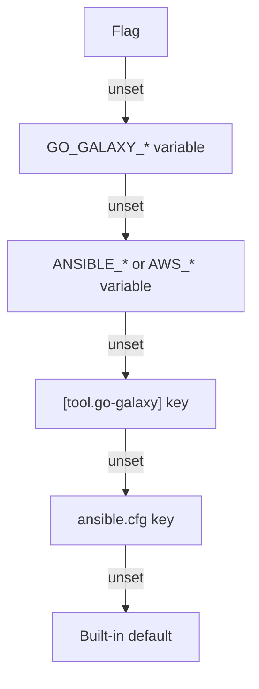

# Configuration

A setting comes from a flag, a variable, the `[tool.go-galaxy]` table of
`galaxy.toml`, `ansible.cfg` or a built-in default.

> [!TIP]
> Looking for `requirements.yml` or the `[project]` table of `galaxy.toml`?
> Both are on [Requirements files](requirements.md).

## Where a setting comes from



A flag's variable exported empty counts as set: it hides the layers below,
and a numeric flag keeps its built-in default. Most settings have only some
layers; [Options](cli.md#options) lists each flag's variables in order.
`--verbose` names the `[tool.go-galaxy]` keys a run took, never their values,
and the values `ansible.cfg` supplied.

> [!NOTE]
> `ANSIBLE_GALAXY_SERVER` stands in for `[galaxy] server`, below any server
> list, not for `--server`
> ([Which servers a run uses](servers-and-auth.md#which-servers-a-run-uses)).
> `ANSIBLE_GALAXY_DISABLE_GPG_VERIFY` takes ansible's booleans, such as `yes`,
> on `install` and `warm` only ([Turning it on](signatures.md#turning-it-on)).

## The `[tool.go-galaxy]` table

```toml
[project]
collections = ["community.general >= 9.0"]

[tool.go-galaxy]
lock_file = "galaxy.lock"
cache_dir = "${HOME}/.cache/go-galaxy" # (1)!
metrics_file = "build/go-galaxy-metrics.json"
workers = 4 # (2)!
download_workers = 16

[tool.go-galaxy.s3] # (3)!
bucket = "ci-galaxy-cache"
region = "eu-central-1"
access_key = "${S3_CACHE_ACCESS_KEY}"
secret_key = "${S3_CACHE_SECRET_KEY}"
path_style_disabled = false # (4)!

[[tool.go-galaxy.servers]] # (5)!
id = "hub"
url = "https://hub.example.com/api/galaxy"
token = "${HUB_TOKEN}"

[[tool.go-galaxy.servers]]
id = "galaxy"
url = "https://galaxy.ansible.com"
```

1.  `~` is not expanded: write `${HOME}`.
2.  A TOML integer, never `"4"`. Outside `1` to the CPU count this process may
    use (at least `2`), the default applies with a warning.
3.  A non-empty `bucket` switches to the [S3 cache](caching.md#s3-cache-optional)
    and needs `access_key` and `secret_key`, here or in their variables. It is
    refused beside `--offline`.
4.  A TOML boolean: `true` selects virtual-hosted-style addressing.
5.  The server list, in order; its keys are under
    [Server settings](servers-and-auth.md#server-settings).

With `HUB_TOKEN` and both S3 keys exported, `go-galaxy install` needs
nothing more: a `${VAR}` token is the file's own, as a literal is, so it goes
to the entry's `url` ([`--token`](servers-and-auth.md#--token)).

The table is read from the requirements file the run uses
([Which file is read](requirements.md#which-file-is-read)), so a run on
`requirements.yml` has none; a relative path resolves from the file's
directory. It is closed: an unknown key is refused.

| Key | Flag and variables | ansible.cfg | Default |
|:----|:-------------------|:------------|:--------|
| `lock_file` | `--lock-file`, `GO_GALAXY_LOCK_FILE` | - | `galaxy.lock` beside the requirements file |
| `cache_dir` | `--cache-dir`, `GO_GALAXY_CACHE_DIR`, `ANSIBLE_GALAXY_CACHE_DIR` | `[galaxy] cache_dir` | `$HOME/.cache/go-galaxy` |
| `metrics_file` | `--metrics-file`, `GO_GALAXY_METRICS_FILE` | - | no report |
| `workers` (integer) | `--workers`, `GO_GALAXY_WORKERS` | - | from the CPU count ([Concurrency](cli.md#concurrency)) |
| `download_workers` (integer) | `--download-workers`, `GO_GALAXY_DOWNLOAD_WORKERS` | - | from the CPU count |
| `s3.bucket`, `region`, `prefix`, `endpoint` | `--s3-<key>`, `GO_GALAXY_S3_<KEY>` | - | no bucket: the local cache |
| `s3.access_key`, `secret_key`, `session_token` | `--s3-<key>`, `GO_GALAXY_S3_<KEY>`, then `AWS_ACCESS_KEY_ID`, `AWS_SECRET_ACCESS_KEY`, `AWS_SESSION_TOKEN` | - | unset |
| `s3.path_style_disabled` (boolean) | `--s3-path-style-disabled`, `GO_GALAXY_S3_PATH_STYLE_DISABLED` | - | `false`: path style |
| `servers` (array of tables) | `--server`, `GO_GALAXY_SERVER`, `ANSIBLE_GALAXY_SERVER_LIST`, `ANSIBLE_GALAXY_SERVER_<ID>_*` | `server_list`, `[galaxy_server.<id>]` | [Which servers a run uses](servers-and-auth.md#which-servers-a-run-uses) |

The install paths (`--download-path`, `--roles-path`) and `--timeout` have
no key: keep them in `ansible.cfg`, a flag or a variable. Nor do signature
policy, git and url credentials, `--ansible-config` and switches such as
`--offline`.

`install`, `warm`, `lock` and `outdated` read every key. `cleanup` reads
`cache_dir`, `s3` and `servers`, so the token rule applies to it too; `hash`,
`tree` and `explain` read only `lock_file`.

### `${VAR}` expansion

- Only `${NAME}` is expanded, in string values under this table. `$NAME`, keys
  and `[project]` stay literal, with no escaping and no recursion.
- Every unset name is reported in one sorted error once the file parses,
  before `ansible.cfg` is read, and the run exits [`2`](exit-codes.md).
- A variable exported empty expands to the empty string, which leaves a path
  or `s3` key unset.
- Every command that loads the file needs every variable: `hash`, `tree`,
  `explain` and `cleanup` too, unless `--lock-file` is set for the first three.
- A `${VAR}` can read any variable the run exports
  ([what that trusts the file with](internals/boundaries.md#loading-requirementsyml-and-the-lockfile)).

<details markdown>
<summary>Exact messages</summary>

Each is a separate run. An unset variable exits `2`:

```text
✗ galaxy.toml: project file references unset environment variables: HUB_TOKEN, S3_CACHE_ACCESS_KEY, S3_CACHE_SECRET_KEY
```

A `workers` value outside the accepted range warns, here on a machine with 12
CPUs:

```text
! [tool.go-galaxy] workers in galaxy.toml = 64 is outside 1..12, the range this machine accepts (the ceiling is the CPU this process is permitted to use, at least 2); using 12 instead
```

A value of the wrong type exits `2`:

```text
✗ galaxy.toml: unsupported requirements file format: [tool.go-galaxy] workers is not an integer
```

A misspelled key exits `2`:

```text
✗ galaxy.toml: unsupported requirements file format: unknown key "worker" in [tool.go-galaxy]
```

</details>

## ansible.cfg

```ini
[defaults]
collections_path = .collections
roles_path = .roles

[galaxy]
server = https://galaxy.ansible.com
cache_dir = /home/ci/.cache/go-galaxy
server_timeout = 60
```

[What go-galaxy reads](#what-go-galaxy-reads) lists every key.

> [!WARNING]
> In a world-writable working directory, sticky bit included (`/tmp`, a `0777`
> CI workspace), go-galaxy skips `./ansible.cfg` and warns, whether or not one
> exists, since any user could plant one. Name the file with `ANSIBLE_CONFIG`
> or `--ansible-config`, or remove the world-writable bit.

### Where it is found

| Order | File | Notes |
|:------|:-----|:------|
| 1 | `--ansible-config`, `GO_GALAXY_ANSIBLE_CONFIG` | Must exist, or the run exits `2`. `cleanup` takes neither: point it with `ANSIBLE_CONFIG`. |
| 2 | `$ANSIBLE_CONFIG` | Skipped when empty or not found. |
| 3 | `./ansible.cfg` | Skipped in a world-writable working directory. |
| 4 | `~/.ansible.cfg` | |
| 5 | `/etc/ansible/ansible.cfg` | |
| - | none found | Fine: each setting falls to its next layer. |

The first file that exists is read, and no other; one that cannot be read
exits `2`.

### What go-galaxy reads

| Key | Variable | Outranked by | Default |
|:----|:---------|:-------------|:--------|
| `[defaults] collections_path` | `ANSIBLE_COLLECTIONS_PATH` | `--download-path`, `GO_GALAXY_COLLECTIONS_PATH`, `GO_GALAXY_DOWNLOAD_PATH` | `.collections` |
| `[defaults] roles_path` | `ANSIBLE_ROLES_PATH` | `--roles-path`, `GO_GALAXY_ROLES_PATH` | `.roles` |
| `[galaxy] server` | `ANSIBLE_GALAXY_SERVER` | any server list, `--server`, `GO_GALAXY_SERVER` | `https://galaxy.ansible.com` |
| `[galaxy] server_list` | `ANSIBLE_GALAXY_SERVER_LIST` | `--server`, `GO_GALAXY_SERVER` (an id picks one entry) | no list |
| `[galaxy] cache_dir` | `ANSIBLE_GALAXY_CACHE_DIR` | `--cache-dir`, `GO_GALAXY_CACHE_DIR` | `$HOME/.cache/go-galaxy` |
| `[galaxy] server_timeout` | `ANSIBLE_GALAXY_SERVER_TIMEOUT` | `--timeout`, `GO_GALAXY_SERVER_TIMEOUT`, `GO_GALAXY_TIMEOUT` | `30s` |
| `[galaxy_server.<id>] url`, `token`, `validate_certs` | `ANSIBLE_GALAXY_SERVER_<ID>_URL`, `_TOKEN`, `_VALIDATE_CERTS` | `--server` or `GO_GALAXY_SERVER` set to a URL; for a lone server's token, `--token`, `GO_GALAXY_TOKEN` | - |

A key's variable outranks the key, and each setting in the third column
outranks both. `galaxy.toml` sits between variable and key for two settings:
`[tool.go-galaxy] cache_dir` outranks `[galaxy] cache_dir`, and
`[[tool.go-galaxy.servers]]` replaces `server_list` and every
`[galaxy_server.<id>]` section.

The `[galaxy]` keys `gpg_keyring`, `required_valid_signature_count`,
`ignore_signature_status_codes` and `disable_gpg_verify` are never read:
`install` and `warm` warn and read the matching `ANSIBLE_GALAXY_*` variables
instead. Any other key is ignored, the plural `collections_paths` included,
except in a `[galaxy_server.<id>]` section
([Server settings](servers-and-auth.md#server-settings)).

`collections_path` and `roles_path` are `:` lists, of which go-galaxy uses
only the first entry ([Paths and files](cli.md#paths-and-files)).

The file is parsed like Python's `configparser` with `;` as the only inline
comment marker, so watch for these lines:

| You write | go-galaxy reads |
|:----------|:----------------|
| `collections_path = "./c"` | `"./c"`, quotes included: drop them |
| `server = https://galaxy.ansible.com # note` | a URL with `# note` in it, refused as `invalid galaxy server url` |
| `server = https://galaxy.ansible.com ; note` | `https://galaxy.ansible.com` |
| `token = abc;def` | `abc;def` |
| `[galaxy] # prod` | the `[galaxy]` section |
| `[ galaxy ]` | another section, its name keeping the spaces |
| the same key twice | the last value |
| a line longer than 64 KiB | nothing: the run exits `2` |

<details markdown>
<summary>Full parsing rules</summary>

- A line starting with `#` or `;` is a comment. A `;` after whitespace starts
  one mid-line, on a header too.
- Whitespace is whatever Python's `str.isspace` accepts, which adds U+001C to
  U+001F to the usual set.
- `=` or `:`, whichever comes first, separates a key from its value.
- Keys are lowercased; section names are matched as written.
- A section name runs to the last `]` on its line, so `[galaxy] = x` opens
  `[galaxy]`.
- Nothing is refused for its content: a junk line is skipped, and one opening
  with `[` also closes the current section.
- A leading UTF-8 byte order mark is stripped, where ansible refuses the file.
- A server URL loses one pair of surrounding double quotes, whatever its
  source.
- A discovered file that vanishes before it is opened counts as none found.

</details>

## Environment-only variables

| Variable | What it sets | Explained in |
|:---------|:-------------|:----------------------|
| `ANSIBLE_CONFIG` | the first `ansible.cfg` candidate | [Where it is found](#where-it-is-found) |
| `GO_GALAXY_GIT_CREDENTIALS`, `GO_GALAXY_GIT_<ID>_*` | a credential bound to a git host | [Git sources and credentials](servers-and-auth.md#git-sources-and-credentials) |
| `GO_GALAXY_URL_CREDENTIALS`, `GO_GALAXY_URL_<ID>_*` | a Bearer token bound to a url-source origin | [URL sources and credentials](servers-and-auth.md#url-sources-and-credentials) |
| `SSH_AUTH_SOCK`, `SSH_KNOWN_HOSTS`, `ALL_PROXY`, `NO_PROXY` | the ssh agent, the known_hosts file and a `socks5://` proxy for ssh git fetches | [Git sources and credentials](servers-and-auth.md#git-sources-and-credentials) |
| `HTTP_PROXY`, `HTTPS_PROXY`, `NO_PROXY` | the proxy for every HTTP request | [what a proxy is sent](internals/boundaries.md#redirects) |
| `SSL_CERT_FILE`, `SSL_CERT_DIR` | a private CA, replacing the default trust store | [TLS: validate_certs](servers-and-auth.md#tls-validate_certs) |
| `NO_COLOR`, `CLICOLOR_FORCE`, `FORCE_COLOR`, `TERM` | whether output is colored (`TERM=dumb`: the spinner only) | [Output and color](cli.md#output-and-color) |

`ANSIBLE_GALAXY_REQUIREMENTS_FILE` looks like an ansible variable but is
go-galaxy's own: a source of [`--requirements-file`](cli.md#paths-and-files)
that `ansible-galaxy` ignores.
