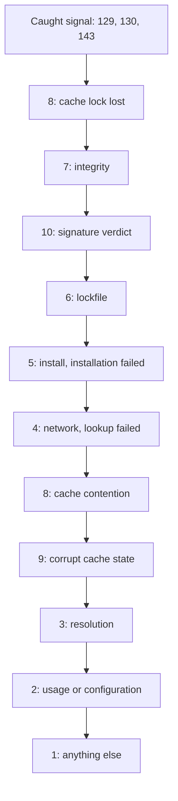

# Exit codes

go-galaxy exits with one code per failure class, so a CI job can branch on the
code instead of parsing the log.

| Code | Meaning | Retry? | First step |
| ---: | --- | --- | --- |
| `0` | Success | - | - |
| `1` | Generic failure: nothing below matched | After a fix | Read the error line |
| `2` | Usage or configuration error: a bad flag, argument, input file, source or setting | After a fix | Fix what the error names |
| `3` | Dependency resolution failure: conflicting constraints, or a collection, version, git ref or role the source lacks, such as a Galaxy `404` | After a fix | [Relax a constraint](requirements.md#when-no-version-fits) |
| `4` | Network or Galaxy API failure: an unreachable Galaxy server or cache backend, a timeout, stall or refusal, any Galaxy status but `404`, a metadata document of the wrong shape, a failed `outdated` lookup | Yes, except `--offline` or refused credentials | Retry; check network and credentials |
| `5` | Install-time failure: unsafe archive content, a foreign role directory, a failed item behind `installation failed` | By hand, for a network cause | Read the `Failed:` lines |
| `6` | Lockfile error: missing, invalid, not matching the requirements, or out of date under `lock --check` | After a fix | Run [`go-galaxy lock`](lockfile.md#create-the-lockfile), commit it |
| `7` | Artifact-integrity failure: bytes or a commit not matching their sha256 or pin | Never | Compare the source with the pin |
| `8` | Cache contention: another run holds the cache lock, or took it mid-run | After the other run | Rerun without the overlap |
| `9` | Persisted cache state is corrupt or oversized: a snapshot, registry or state object | After deleting it | Delete what the [message](#messages-to-grep) points to |
| `10` | Signature verification failure: signatures miss the policy or vouch for another collection | Never | Check the keyring and required count |
| `129` | Interrupted: a caught SIGHUP | If unintended | Rerun |
| `130` | Interrupted: a caught SIGINT, such as Ctrl-C | If unintended | Rerun |
| `143` | Interrupted: a caught SIGTERM | If unintended | Rerun |

<details markdown>
<summary>What exits 2</summary>

| Input | Refused when |
| --- | --- |
| Flags and arguments | an unknown flag, a bad value (`GO_GALAXY_WORKERS=abc`), `warm --no-cache`, a stray argument |
| Requirements file | missing, `requirements file is ...` (unreadable, not YAML or TOML), or an entry [refused as written](requirements.md#what-is-refused) |
| `galaxy.toml` settings | off the schema, or `project file references unset environment variables` |
| `ansible.cfg` | a missing `--ansible-config` file, or `ansible config file is unreadable` |
| Servers | a malformed entry, a URL with a credential, two settings for one origin |
| Tokens | over plain http, `--token` with several servers, or a [refused pairing](servers-and-auth.md#--token) |
| git and url sources | a credential in the URL, a bad ref or subdir, nothing usable fetched |
| Roles | no v1 role API, an unusable v1 record, or no readable role meta |
| Cache | an unusable backend, S3 without both keys or with `--offline`, a newer snapshot schema |

</details>

> [!NOTE]
> A Go runtime crash also exits `2`: look for a `fatal error:` or `panic:` line
> on stderr.

## Using exit codes in CI

Retry only `4` and `8`, a few times:

=== "Shell"

    ```sh
    for attempt in 1 2 3; do
      code=0
      go-galaxy install --frozen || code=$?
      case $code in
        4|8) [ "$attempt" -eq 3 ] || sleep 30 ;;
        *) break ;;
      esac
    done
    [ "$code" -eq 0 ] || exit "$code"
    ```

=== "GitLab CI"

    ```yaml
    install:
      script:
        - go-galaxy install --frozen
      retry:
        max: 2
        # retry:exit_codes needs GitLab 16.11 or later
        exit_codes: [4, 8]
    ```

> [!CAUTION]
> Never auto-retry `7` or `10`: a retry cannot change the bytes, your keyring
> or your signature policy.

A network failure of one item exits `5` ([why](#when-several-things-fail)):
read its `Failed:` line.

## Signals

- `docker stop` and Kubernetes send SIGTERM, so the run exits `143`.
- SIGQUIT dumps every goroutine's stack, showing where a hung run waits, and
  exits `2`.
- Any other code above 128 is 128 plus the killing signal: `137` is SIGKILL,
  as from an OOM kill.
- A stall or deadline is never an interrupt: it exits `4` or `5`, but a
  sha256 mismatch or unusable backend keeps `7` or `2`.

## When several things fail



The code is the first box, top down, that matches the error or any cause
behind it ([classifier chart](internals/http-output-exit-codes.md#exit-code-classes)). A caught
signal wins even over a finished run and prints no error line; a lost cache
lock turns every other outcome, success included, into `8`.

Each failed item prints its own line, then one [headline](#messages-to-grep).
Only a cause ranked above the headline changes the code: a `--frozen` sha256
mismatch exits `7`, a network failure stays `5`.

## Messages to grep

| Message | Exit | Meaning and first step |
| --- | --- | --- |
| `network read stalled`, `artifact download deadline exceeded`, `galaxy metadata fetch deadline exceeded`, `cache state object deadline exceeded` | `4` (`5` behind a headline) | A transfer stalled or a [fixed budget](cli.md#timeouts-and-fixed-limits) ran out; retry |
| `offline mode is enabled, network access is forbidden` | `4` (`5` behind a headline) | Not cached: [warm the cache](caching.md#cache-flags) or drop `--offline` |
| `cache backend cannot be used as configured` | `2` | A host-less S3 endpoint, a bucket without conditional writes, or [cache directory permissions](ci.md#container-image-bake) |
| `galaxy server unavailable` | `4` (`5` behind a headline) | The server was unreachable (connection, DNS, TLS) or answered a metadata request with a status other than success, `401`, `403` or `404`; retry, then check its URL |
| `galaxy server authentication failed` | `4` (`5` behind a headline) | The server answered a metadata request with `401` or `403`; check the [token](servers-and-auth.md#--token) |
| `galaxy metadata response is not JSON`, `answers a web page at every API root` | `4` (`5` behind a headline) | The server answered a page, such as a login page; check its [URL](servers-and-auth.md#how-a-collection-picks-its-server) |
| `galaxy metadata response has the wrong shape` | `4` (`5` behind a headline) | The server answered JSON that does not fit a Galaxy document, such as another API's or a timestamp that does not parse; check its [URL](servers-and-auth.md#how-a-collection-picks-its-server) |
| `is not published at its server`, `its versions are not published at` | `3` | The server answered `404` for what it had listed or you pinned: a collection, a version, a found role's versions; pin a published one |
| `cache backend unavailable` | `4` | The cache failed or did not answer; retry |
| `another process holds the cache`, `another instance is running` | `8` | Another run holds the lock; wait for it |
| `cache lock ownership was lost to another holder` | `8` | Another run took the lock mid-run |
| `corrupt project registry`, `corrupt cache state object`, `corrupt snapshot store`, `cache state object exceeds the maximum allowed size` | `9` | Delete the printed path or S3 key, or `go-galaxy.db` for the [snapshot](caching.md#what-the-directory-holds); `--clear-cache` keeps them |
| `unsupported snapshot schema version` | `2` | A newer release wrote the cache: [run one release](ci.md#pin-one-release), never discard it |
| `installation failed` | `5` | The `install` and `warm` headline; see `Failed:` lines |
| `latest version lookup failed` | `4` | The `outdated` headline; see `Lookup failed:` lines |
| `snapshot save failed:` | The other failure's code | Appended to that failure; alone, the save error sets the code |

## Signature failures

| Failure | Exit |
| --- | --- |
| `collection signature verification failed` ([policy](signatures.md#required-count-and-the-vacuous-pass) not met) | `10` |
| `collection signature vouches for a different collection` | `10` |
| An unreadable keyring, `signatures:` without one, or a refused count, status code or source | `2` |
| `collection signature source unavailable`, `collection signature fetch deadline exceeded` | `5` (behind the install headline) |
| `collection artifact contains no MANIFEST.json` | `5` |
| `collection manifest chain does not match` | `7` |

## Special cases by command

| Command | Case | Exit |
| --- | --- | --- |
| `explain` | `collection or role not found in lockfile` | `1` |
| `explain` | no name, or more than one | `2` |
| `lock`, `outdated` | a server-supplied download or metadata URL with a credential, or a `download_url` with a query or not its server's artifact | `5` |
| `lock` | the snapshot save fails after `Lockfile written` | the save error's code; `galaxy.lock` is already written |
| `install`, `warm`, `lock` (`tree` too, from `galaxy.toml`) | a [constraint](requirements.md#stricter-than-requirementsyml) semver cannot parse | `2` from `galaxy.toml`, `1` from `requirements.yml` |

<details markdown>
<summary>Missing or broken lockfile</summary>

| Command | No lockfile | Unreadable or invalid |
| --- | --- | --- |
| `install --frozen`, `warm --frozen`, `lock --check` (after resolving), `tree`, `explain` | `6` | `6` |
| `hash` | hashes the requirements file (`2` if unreadable) | `6` |
| `outdated` | reads the collections path (`6` if missing) | `6` |

</details>

<details markdown>
<summary>Which command reads which file</summary>

| Input | Read by | Exceptions |
| --- | --- | --- |
| Requirements entries | `install`, `warm`, `lock`, `tree`, `cleanup` (recorded projects) | `explain` ignores load errors; `hash` hashes bytes; `cleanup` warns on a missing file |
| `galaxy.toml` settings | every command | Under `--lock-file`, `hash` and `explain` skip it and `tree` expands no `${VAR}` |
| `ansible.cfg` | `install`, `warm`, `lock`, `outdated`, `cleanup` | - |

</details>
