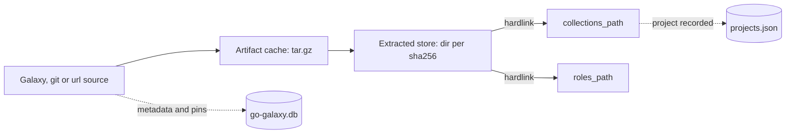
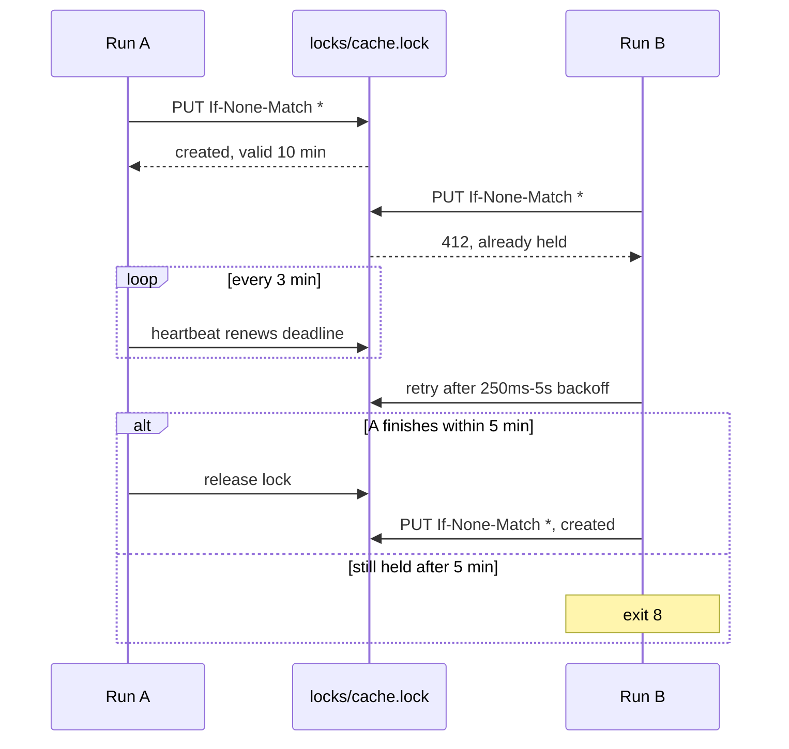

# Caching

go-galaxy keeps what it fetches between runs, so a warm run hardlinks installs
out of the cache instead of downloading and unpacking them again.



## The local cache

The cache lives in `$HOME/.cache/go-galaxy` unless `--cache-dir`, its
variables or a `cache_dir` in `galaxy.toml` or `ansible.cfg` names another
directory ([which wins](../reference/configuration.md#where-a-setting-comes-from)).
One run holds it at a time; a second exits [`8`](../reference/exit-codes.md) at once with
`another instance is running`.

> [!WARNING]
> Installed files are read-only hardlinks into the cache: edit a copy
> ([why](../get-started/ansible-galaxy-compat.md#installed-files-are-read-only)).

### What the directory holds

```text
$HOME/.cache/go-galaxy/
|-- go-galaxy.db                                     # snapshot
|-- <fp>.<namespace>-<name>-<version>.tar.gz         # collection
|-- <fp>.<namespace>-<name>-<version>.tar.gz.sha256  # optional digest
|-- <fp>.role.<name>-<version>.tar.gz                # role
|-- extracted/<sha256>/                              # unpacked tree
|-- projects.json                                    # project registry
`-- .go-galaxy.lock                                  # run lock
```

`<fp>` is the first 12 hex digits of the SHA256 of the artifact's
[scope](#what-a-rerun-reuses): one tarball from two servers or commits is two
entries.

Run one release on every machine sharing a cache, or an older one may refuse
the snapshot with exit `2` ([Pin one release](ci.md#pin-one-release)). Give
each Galaxy credential its own cache, since entries are keyed by server, not by
token ([why](security.md#trust-model)).

<details markdown>
<summary>Snapshot internals</summary>

`last_snapshot`, set by every save, marks a persisted snapshot, the only kind
`cleanup` and `--dry-run` save over. `content_recorded`, set once a save
carries installed, warmed or installed-role records and kept after, gates
`cleanup`'s extracted-store sweep: `lock` saves none.

Only bbolt's `ErrInvalid` (truncation included), `ErrVersionMismatch` and
`ErrChecksum` make `go-galaxy.db` exit `9`, never a permission or mmap failure.
`ErrVersionMismatch` is bbolt's file format, not the snapshot schema: a
`go.etcd.io/bbolt` bump that changes it makes every local snapshot exit `9`.

</details>

### What a rerun reuses

| Source | Artifact scope | A rerun reuses | Refreshed by |
| :-- | :-- | :-- | :-- |
| Galaxy collection | The server's base URL | The last resolution, while requirements, servers and `--no-deps` are unchanged | `--refresh` |
| git collection | `git+<url>#<subdir>@<commit>` | The commit its URL, ref and subdir resolved to | `--refresh` (not for a commit ref), `--clear-cache` |
| url collection | `url+<url>#sha256:<hex>` | The sha256 its URL served | `--refresh`, `--clear-cache` |
| Galaxy role | `git+<github-url>#@<commit>` | The repository, tag and commit its name and version map to | `--refresh`, `--clear-cache` |
| git role | `git+<url>#@<commit>` | The commit its URL and ref resolved to | `--refresh` (not for a commit ref), `--clear-cache` |
| url role | `url+<url>#sha256:<hex>` | The sha256 its URL served, under the same `version:` label | `--refresh`, `--clear-cache` |

Reuse contacts no source. Editing an entry re-resolves it, and nothing here
expires by age ([why this keying](../internals/cache.md#artifact-cache-scoped-by-server-not-by-content)).

## Freshness and retention

| Cached thing | Fresh for | Then | Dropped |
| :-- | :-- | :-- | :-- |
| Answer naming no exact version, such as the highest | 10 minutes | Revalidated with `ETag` or `Last-Modified`; a `304` renews it | 30 days after written or renewed |
| Answer about an exact version | Until dropped | - | 30 days after written |
| Warmed entry | - | Shields its extracted tree from `cleanup` | 30 days after the last `warm` |
| Artifact | Until removed | - | By `cleanup` or `--clear-cache` |
| Extracted tree | Until removed | - | By `cleanup` |
| Install records, last resolution, pins | Until replaced | - | Never by age |

The 10-minute window applies only when a run re-resolves (after a change or
under `--refresh`), not when it [replays the last resolution](#what-a-rerun-reuses).
Retention runs only at a save, which a run that changes nothing skips, and
reading never renews an entry.

> [!TIP]
> `--refresh` never refetches an exact collection version, so one republished
> upstream keeps its first cached bytes; `--clear-cache` takes the new ones. To
> refuse changed bytes, install from a
> [lockfile](lockfile.md#install-from-the-lockfile) with `--frozen`.

<details markdown>
<summary>Edge cases</summary>

A future timestamp counts as stale, with no clock-skew allowance, and a body
that no longer decodes is refetched without validators. A presigned
`download_url` is cached verbatim and usable until it expires; `lock` refuses
to commit one ([why](../internals/lockfile-format.md#download_url-and-frozen-installs)).

</details>

## Cache flags

| Flag | Network | Cached metadata and pins | Last resolution | Writes |
| :-- | :-- | :-- | :-- | :-- |
| `--refresh` | Re-asks servers, git refs, the v1 role API and url sources | Used only for exact collection versions and commit refs | Not replayed | As usual |
| `--no-cache` | Resolves and downloads everything | Neither read nor written | Not replayed | Resolution, install records, project registry; no artifacts or extracted trees |
| `--clear-cache` | Refetches what it dropped | Emptied first, with pins and artifacts | Replayed if requirements are unchanged | As usual |
| `--offline` | None: a miss exits `4` at resolve, `5` at install; warm the cache rather than retry | Read at any age | Replayed | Install records, extracted trees, project registry, a changed resolution |

`--offline` wins over `--refresh`, with a warning; beside `--no-cache` it
still reads cached metadata and pins, but anything it must install fails.
`warm` refuses `--no-cache` (exit `2`); variables are under
[Cache behavior](../reference/cli.md#cache-behavior).

## Clearing and cleanup

| Tool | Runs | Deletes | Keeps | On a shared cache |
| :-- | :-- | :-- | :-- | :-- |
| `--clear-cache` | On `install`, `warm` or `lock` once locked; not under `--dry-run` | Metadata caches, pins, artifacts, leftover `go-galaxy-*.db` snapshot files (on S3, all of `artifacts/`) | Records, last resolution, extracted trees, `go-galaxy.db`, `projects.json`, the lock file | Every project refetches |
| `cleanup` | When you run it | Collections and roles no recorded project reaches, in every project, with their artifacts and unused extracted trees | What any project reaches; trees warmed within 30 days | Safe: reads every recorded project first |
| Temp sweep | Every `install`, `warm` and `lock` once locked, `--dry-run` too | Temps a killed run left | Everything else | Safe: runs only under the lock |

A failed clear never blocks later runs. An artifact no install record names,
such as a superseded git commit's, stays until `--clear-cache`; what `cleanup`
keeps is under [cleanup options](../reference/cli.md#cleanup-options).

<details markdown>
<summary>Legacy flat-key artifacts</summary>

`cleanup` also deletes, reachable or not, a scanned collection's artifact under
the flat key `<namespace>-<name>-<version>.tar.gz`, which no lookup reaches,
unless that key looks scoped: a namespace directory may contain a dot, so
`<12 hex digits>.acme` spells a live key.

</details>

## S3 cache (optional)

=== "galaxy.toml"

    ```toml
    [tool.go-galaxy.s3]
    bucket = "ci-galaxy-cache"
    region = "eu-central-1"
    prefix = "go-galaxy/"
    access_key = "${CI_S3_ACCESS_KEY}" # (1)!
    secret_key = "${CI_S3_SECRET_KEY}"
    ```

    1.  Expanded from the environment as the file loads; an unset variable
        exits `2`.

=== "Environment"

    ```bash
    export GO_GALAXY_S3_BUCKET=ci-galaxy-cache
    export GO_GALAXY_S3_REGION=eu-central-1
    export GO_GALAXY_S3_PREFIX=go-galaxy/
    export AWS_ACCESS_KEY_ID="${CI_S3_ACCESS_KEY}"
    export AWS_SECRET_ACCESS_KEY="${CI_S3_SECRET_KEY}"
    go-galaxy install
    ```

=== "Flags"

    ```bash
    go-galaxy install \
      --s3-bucket ci-galaxy-cache \
      --s3-region eu-central-1 \
      --s3-prefix go-galaxy/ # (1)!
    ```

    1.  Keys stay in the environment: a flag's value shows in the process
        list.

A bucket moves artifacts and the snapshot to S3, so runners share one cache;
go-galaxy creates a missing bucket. Extracted trees stay local, so keep caching
the cache directory.

An S3-compatible store such as MinIO also needs `--s3-endpoint`
([S3 options](../reference/cli.md#s3)). A flag or variable
[outranks](../reference/configuration.md#where-a-setting-comes-from) the file key. The backend
needs:

- Both keys, or the run exits `2`.
- No AWS credential chain: IAM roles, instance profiles, `~/.aws` and
  `AWS_PROFILE` are ignored; the `AWS_*` key variables are plain aliases.
- An endpoint enforcing `If-None-Match: *` and `If-Match`, probed every run.
- No `--offline` (exit `2`): the bucket is reached over the network.

### What the bucket holds

| Object under `<prefix>/` | Holds |
| :-- | :-- |
| `state/store.json.gz` | The snapshot, gzipped JSON |
| `state/projects.json` | The project registry |
| `artifacts/<key>` | One tarball; its `x-amz-meta-sha256` is checked on every fetch |
| `locks/cache.lock` | The lock |

> [!CAUTION]
> Anyone who can write the bucket can change what a run installs. Scope keys to
> one project's bucket, give untrusted branches their own, and pass secrets
> through the environment ([why](security.md#trust-model)).

### Locking and failures

A run holds the lock throughout, so jobs sharing a bucket take turns:



| Symptom | Exit | What to do |
| :-- | :-- | :-- |
| Bucket unreachable, failing, or never answering properly during the lock wait | `4` | Retry after the outage |
| Endpoint lacks a conditional write, redirects, or names no host | `2` | Fix `--s3-endpoint` or use another store |
| Endpoint is not a URL (a bad port, an unclosed `[`) | `1` | Fix `--s3-endpoint` |
| Lock held for the whole 5-minute wait | `8` | Rerun later; a crashed holder's lock expires in 10 minutes |
| Lock taken over mid-run | `8` | Rerun |

<details markdown>
<summary>S3 internals</summary>

An idempotent request gets up to four attempts, 200 ms-5 s full-jitter
backoff apart, after a stalled read, a `429`, `500`, `502`, `503` or `504`, or
a transport failure while the run's context is live. Judged by the error's
shape instead, the two commonest outages would stop retrying: dial and
response-header timeouts also read as deadlines. A conditional PUT and bucket
creation are sent once.

The lock's `x-amz-meta-*` headers are its authority, but its body matters:
S3's single-part ETag is the body's MD5, so two runs reclaiming one expired
lock with `If-Match` differ only by the token each writes there.

At most three 60-second state operations run under the lock: one fits in the
3-minute heartbeat interval, which fits in the 10-minute lifetime, and three
fit in the 5-minute wait. A heartbeat's HEAD and PUT share 30 seconds.

</details>
