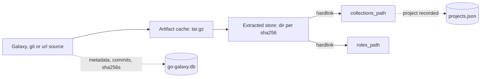
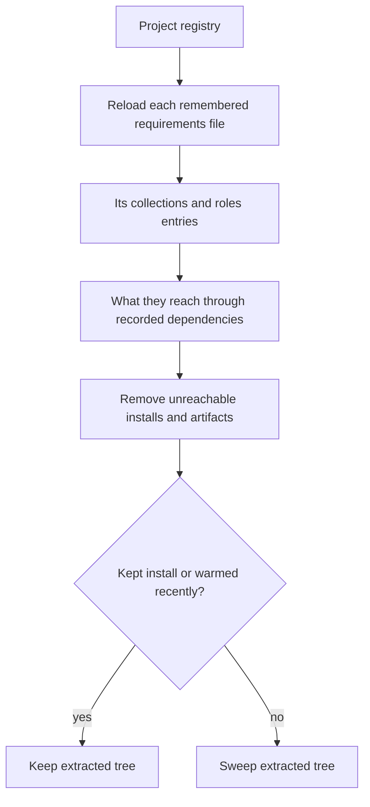
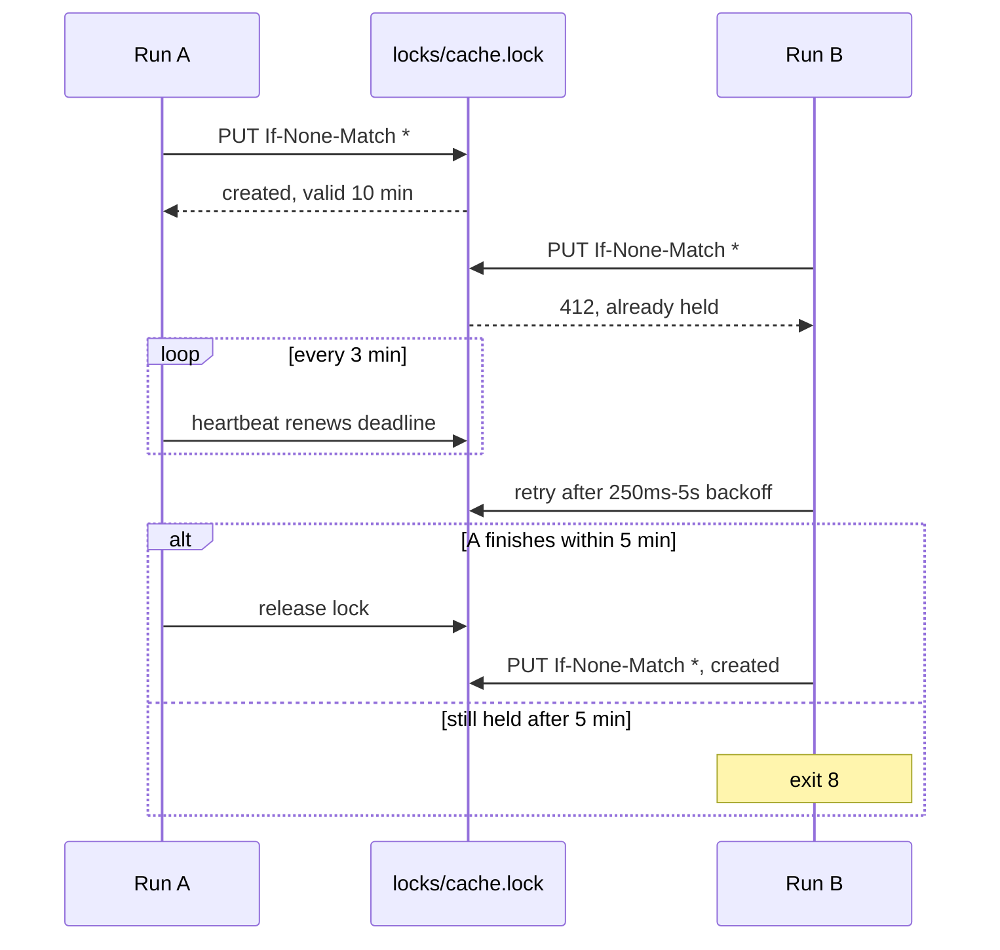

# Caching and S3

go-galaxy keeps what it fetches between runs, so a later run installs out of
the cache instead of downloading and unpacking again.



## The local cache

The cache lives in `$HOME/.cache/go-galaxy` unless `--cache-dir`, its
variables or a `cache_dir` in `galaxy.toml` or `ansible.cfg` names another
directory ([Where a setting comes from](../reference/configuration.md#where-a-setting-comes-from)).
One run holds the cache lock at a time. A second run exits
[`8`](../reference/exit-codes.md) at once with `another instance is running`.

An install hardlinks each file out of the cache. Where a link fails, as across
filesystems, the file is copied instead, which is slower and stores its bytes
twice. Either way the installed file is read-only.

> [!WARNING]
> A hardlinked file shares its bytes with the cache, so edit a copy, never the
> installed file
> ([Installed files are read-only](../get-started/ansible-galaxy-compat.md#installed-files-are-read-only)).

### What the directory holds

```text
$HOME/.cache/go-galaxy/
|-- go-galaxy.db                                     # snapshot
|-- <fp>.<namespace>-<name>-<version>.tar.gz         # collection
|-- <fp>.<namespace>-<name>-<version>.tar.gz.sha256  # optional digest
|-- <fp>.role.<name>-<version>.tar.gz                # role
|-- extracted/<sha256>/                              # unpacked tree
|-- projects.json                                    # project registry
`-- .go-galaxy.lock                                  # cache lock
```

`go-galaxy.db`, the snapshot, holds cached server metadata, the commit or
sha256 each git, url and role source resolved to, the last resolution, and the
install and warm records. A damaged snapshot exits `9`. Delete it, and the
next run rebuilds it ([Messages to grep](../reference/exit-codes.md#messages-to-grep)).

`<fp>` fingerprints where the tarball came from: the Galaxy server, the git
repository and commit, or the URL and its sha256. One tarball from two servers
or commits is therefore two entries
([Cache and storage](../internals/cache.md#artifact-cache-scoped-by-server-not-by-content),
in the internals).

Outside this directory, a run stages git fetches, unpacked url roles and, on
the S3 cache, every artifact under `$TMPDIR` (`/tmp` when unset). Point
`TMPDIR` at a disk with room when `/tmp` is a small tmpfs.

## What a rerun reuses

| Source | A rerun reuses | Refreshed by |
| :-- | :-- | :-- |
| Galaxy collection | The last resolution, while requirements, servers and `--no-deps` are unchanged | `--refresh`, `--no-cache` |
| git collection | The commit its URL, ref and subdir resolved to | `--refresh` (not for a commit ref), `--clear-cache` |
| url collection | The sha256 its URL served | `--refresh`, `--clear-cache` |
| Galaxy role | The repository, tag and commit its name and version map to | `--refresh`, `--clear-cache` |
| git role | The commit its URL and ref resolved to | `--refresh` (not for a commit ref), `--clear-cache` |
| url role | The sha256 its URL served, under the same `version:` label | `--refresh`, `--clear-cache` |

Reuse contacts no source. Editing an entry re-resolves it, and nothing here
expires by age. The cache records these commits and sha256s in the snapshot,
not in `galaxy.lock`. An [S3 cache](#s3-cache-optional) reuses the same way,
and [Cache flags](#cache-flags) compares the flags that refresh it.

## Freshness and retention

| Cached thing | Fresh for | Then | Dropped |
| :-- | :-- | :-- | :-- |
| Server metadata naming no exact version, such as a version list or the highest version | 10 minutes | Revalidated with `ETag` or `Last-Modified`; a `304` renews it | 30 days after written or renewed |
| Server metadata for an exact version | Until dropped | - | 30 days after written |
| Warmed entry, which shields its extracted tree from `cleanup` | - | - | 30 days after the last `warm` |
| Artifact | Until removed | - | By `cleanup` or `--clear-cache` |
| Extracted tree | Until removed | - | By `cleanup` |
| Install records, last resolution, recorded commits and sha256s | Until replaced | - | Never by age |

The 10-minute window matters only when a run resolves anew, as after an edit.
A replayed resolution asks nothing ([What a rerun reuses](#what-a-rerun-reuses)),
and `--refresh` re-asks at any age ([Cache flags](#cache-flags)). Retention
runs only at a save, and a run that changes nothing skips its save. Reading
never renews an entry.

> [!TIP]
> `--refresh` never refetches an exact collection version, so one republished
> upstream keeps its first cached bytes. `--clear-cache` takes the new ones. To
> refuse changed bytes, install with `--frozen`
> ([Install from the lockfile](lockfile.md#install-from-the-lockfile)).

<details markdown>
<summary>Edge cases</summary>

A future timestamp counts as stale, with no clock-skew allowance. A body that
no longer decodes is refetched without validators. A presigned `download_url`
is cached verbatim and works until it expires, but `lock` refuses to commit
one ([Loading the lockfile](../internals/boundaries.md#loading-the-lockfile),
in the internals).

</details>

## Cache flags

| Flag | Network | Cached metadata, commits and sha256s | Last resolution | Writes |
| :-- | :-- | :-- | :-- | :-- |
| `--refresh` | Re-asks servers, git refs, the v1 role API and url sources | Used only for exact collection versions and commit refs | Not replayed | As usual |
| `--no-cache` | Resolves and downloads everything | Neither read nor written | Not replayed | Resolution, install records, project registry; no artifacts or extracted trees |
| `--clear-cache` | Refetches what it dropped | Emptied first, as are the artifacts | Replayed if requirements are unchanged | As usual |
| `--offline` | None: a miss exits `4` at resolve, `5` at install; warm the cache rather than retry | Read at any age | Replayed | Install records, extracted trees, project registry, a changed resolution |

`--offline` wins over `--refresh`, with a warning. Beside `--no-cache`, it
still reads cached metadata, commits and sha256s, but anything it must install
fails. `warm` refuses `--no-cache` (exit `2`). The variables are under
[Cache behavior](../reference/cli.md#cache-behavior).

## Clearing and cleanup

| Tool | Runs | Deletes | Keeps | On a shared cache |
| :-- | :-- | :-- | :-- | :-- |
| `--clear-cache` | On `install`, `warm` or `lock`, after taking the cache lock; not under `--dry-run` | Metadata caches, recorded commits and sha256s, artifacts, leftover `go-galaxy-*.db` snapshot files (on S3, all of `artifacts/`) | Install and warm records, last resolution, extracted trees, `go-galaxy.db`, `projects.json`, `.go-galaxy.lock` | Every project refetches |
| [`cleanup`](../reference/cli.md#cleanup) | When you run it | Collections and roles no recorded project reaches, in every project, with their artifacts and unused extracted trees | What any project reaches, and recently warmed trees | Safe: reads every recorded project first |
| Temp sweep | Every `install`, `warm` and `lock`, after taking the cache lock, `--dry-run` too | Download and unpacking temps a killed run left | Everything else | Safe: runs only under the cache lock |

If `--clear-cache` fails partway, that run stops and saves nothing. The next
run keeps what was not deleted and refetches the rest.

### What cleanup keeps

Every `install`, `warm` or `lock` records its project in the cache it uses
once its requirements file loads, except under `--dry-run`. A run that fails
on its file, a mistyped `-r` included, leaves the directory's record as it
was. A project is the file's directory, and its record remembers every
requirements file a run there loaded, while the file still exists: after
`install` and `install -r requirements-dev.yml` in one directory, `cleanup`
keeps what either file reaches. `cleanup` removes, from every recorded
project and from the cache, what no recorded project reaches:



| Item | Kept when | Otherwise |
| --- | --- | --- |
| Installed collection | A recorded project's `collections:` reaches it, directly or through dependencies | Removed from every project |
| Installed role | A recorded project's `roles:` reaches it | Removed, if go-galaxy installed it under a recorded `roles_path` |
| Extracted tree | A kept install uses it, or a recent `warm` shields it ([Freshness and retention](#freshness-and-retention)) | Swept |
| Cached artifact | No removed install uses it | Removed with that install when the cache holds the install's record; otherwise kept until `--clear-cache` |

An artifact no install record names, such as a superseded git commit's, also
stays until `--clear-cache`. Older releases cached a collection's tarball as
`<namespace>-<name>-<version>.tar.gz`. No run reads that name any more, so
`cleanup` deletes it for every collection installed in a recorded project, even
one still in use.

<details markdown>
<summary>When cleanup warns, skips or stops</summary>

| Situation | What `cleanup` does |
| --- | --- |
| A remembered requirements file no longer exists | Warns; it adds nothing this run, and the project's next record forgets it |
| A remembered requirements file fails to load | Exits `2` before deleting anything, naming the file, its project and the registry file or S3 object. Fix or restore the file, move it away if no run uses it any more, or delete the project's entry from the registry |
| Its `roles:` list is refused, such as an `include:` | Warns; keeps the roles under that project's `roles_path` and their dependencies |
| A git or url requirement whose commit or sha256 the cache never recorded | Keeps every install from that repository or URL |
| `ansible_collections` escapes its path or loops | Warns; skips scanning that project |
| A `MANIFEST.json` that is not a file, does not parse or is unsafe | Warns; skips that collection |
| No `install` or `warm` has saved its records to this cache yet | Warns; sweeps no extracted tree |
| Any other read error, or a failed removal | Stops the run; nothing unremoved is reported as removed |

The internals describe the scan in [Scan: every recorded project's
installs](../internals/flow-cleanup.md#scan-every-recorded-projects-installs)
and the older-release tarball in [Legacy flat-key
artifacts](../internals/cache.md#legacy-flat-key-artifacts).

</details>

## Sharing a cache

These rules hold for a shared cache directory and a shared bucket alike:

- Run one release on every machine sharing the cache. An older release may
  refuse a snapshot a newer one wrote, with exit `2`
  ([Pin one release](ci.md#pin-one-release)).
- Give each Galaxy credential its own cache directory, bucket or prefix.
  Entries are keyed by server, not by token, so a later run without the token
  is served the private answer ([Trust model](security.md#trust-model)).

## S3 cache (optional)

A bucket moves artifacts, the snapshot and the project registry to S3, so
runners share one cache. go-galaxy creates a missing bucket. Extracted trees
stay local, so keep caching the cache directory. Jobs sharing a bucket take
turns ([Locking and failures](#locking-and-failures)).

=== "galaxy.toml"

    ```toml
    [tool.go-galaxy.s3]
    bucket = "ci-galaxy-cache"
    region = "eu-central-1"
    prefix = "go-galaxy/"
    access_key = "${S3_CACHE_ACCESS_KEY}" # (1)!
    secret_key = "${S3_CACHE_SECRET_KEY}"
    ```

    1.  Expanded from the environment as the file loads; an unset variable
        exits `2`.

=== "Environment"

    ```bash
    export GO_GALAXY_S3_BUCKET=ci-galaxy-cache
    export GO_GALAXY_S3_REGION=eu-central-1
    export GO_GALAXY_S3_PREFIX=go-galaxy/
    export GO_GALAXY_S3_ACCESS_KEY="${S3_CACHE_ACCESS_KEY}"
    export GO_GALAXY_S3_SECRET_KEY="${S3_CACHE_SECRET_KEY}"
    go-galaxy install
    ```

=== "Flags"

    ```bash
    go-galaxy install \
      --s3-bucket ci-galaxy-cache \
      --s3-region eu-central-1 \
      --s3-prefix go-galaxy/ # (1)!
    ```

    1.  Keys stay in `GO_GALAXY_S3_ACCESS_KEY` and `GO_GALAXY_S3_SECRET_KEY`:
        a flag's value shows in the process list.

An S3-compatible store such as MinIO also needs `--s3-endpoint`
([S3 options](../reference/cli.md#s3)). The backend needs:

- Both keys, or the run exits `2`. Temporary credentials also need their
  session token.
- Keys from the flags, their variables or `[tool.go-galaxy.s3]`. A flag or
  variable outranks the file key
  ([Where a setting comes from](../reference/configuration.md#where-a-setting-comes-from)),
  and `AWS_ACCESS_KEY_ID` and its siblings count as variables. IAM roles,
  instance profiles, `~/.aws` and `AWS_PROFILE` are ignored.
- A key allowed `s3:ListBucket` on the bucket and `s3:GetObject`,
  `s3:PutObject` and `s3:DeleteObject` on the objects under the prefix, plus
  `s3:CreateBucket` if the bucket may not exist yet. `install`, `warm`, `lock`
  and `cleanup` write and delete objects, the cache lock included, so a
  read-only key cannot run them.
- An endpoint enforcing `If-None-Match: *` and `If-Match`. Each of those
  commands checks it when it opens the bucket.
- The network: `--offline` exits `2`.

### What the bucket holds

| Object under `<prefix>/` | Holds |
| :-- | :-- |
| `state/store.json.gz` | The snapshot, gzipped JSON |
| `state/projects.json` | The project registry |
| `artifacts/<key>` | One tarball; its `x-amz-meta-sha256` is checked on every fetch |
| `locks/cache.lock` | The cache lock |

> [!CAUTION]
> Anyone who can write the bucket can change what a run installs. Scope keys to
> one project's bucket, give untrusted branches their own, and pass secrets
> through the environment ([Trust model](security.md#trust-model)).

### Locking and failures

A run holds the cache lock from start to finish:



| Symptom | Exit | What to do |
| :-- | :-- | :-- |
| `403 Forbidden` from the bucket: a wrong key or a missing permission | `4` | Fix the key or grant the permission. A retry does not help |
| Bucket unreachable, failing otherwise, or never answering properly during the cache lock wait | `4` | Retry after the outage. A run already retries a transient failure |
| Endpoint lacks a conditional write, redirects, or names no host | `2` | Fix `--s3-endpoint` or use another store |
| Endpoint is not a URL (a bad port, an unclosed `[`) | `1` | Fix `--s3-endpoint` |
| Lock held for the whole 5-minute wait | `8` | Rerun later; a crashed holder's lock expires in 10 minutes |
| Lock taken over mid-run | `8` | Rerun |

How a run retries and times the cache lock is in the internals:
[The S3 client](../internals/cache.md#the-s3-client) and
[The S3 distributed lock](../internals/cache.md#the-s3-distributed-lock).
