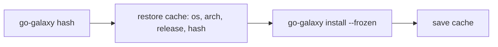

# Reproducible CI

Commit a [lockfile](lockfile.md), then have every CI job install exactly what
it pins, from a warm cache. A GitHub Actions job keys its cache on
[`go-galaxy hash`](lockfile.md#a-cache-key-for-ci) in four steps, and the
action runs all four for you.



## GitHub Actions

=== "With the action"

    ```yaml
    name: ansible-deps
    on: [push, pull_request]

    jobs:
      install:
        runs-on: ubuntu-latest
        steps:
          - uses: actions/checkout@v7
          - uses: greeddj/go-galaxy@v1
            with:
              frozen: true
    ```

=== "By hand"

    ```yaml
    jobs:
      install:
        runs-on: ubuntu-latest
        env:
          RELEASE: "1.2.3" # (1)!
        steps:
          - uses: actions/checkout@v7
          - name: Install go-galaxy # (2)!
            run: |
              base=https://github.com/greeddj/go-galaxy/releases/download/v$RELEASE
              cd "$RUNNER_TEMP"
              curl -sSLf -O "$base/go-galaxy-linux-amd64" -O "$base/checksums.txt"
              sha256sum --ignore-missing -c checksums.txt
              install -D -m 755 go-galaxy-linux-amd64 bin/go-galaxy
              echo "$RUNNER_TEMP/bin" >> "$GITHUB_PATH"
          - id: key
            run: echo "hash=$(go-galaxy hash)" >> "$GITHUB_OUTPUT"
          - uses: actions/cache@v6
            with:
              path: ~/.cache/go-galaxy
              key: go-galaxy-${{ runner.os }}-${{ runner.arch }}-${{ env.RELEASE }}-${{ steps.key.outputs.hash }}
              restore-keys: go-galaxy-${{ runner.os }}-${{ runner.arch }}-${{ env.RELEASE }}-
          - run: go-galaxy install --frozen # (3)!
    ```

    1. The release that wrote `galaxy.lock` ([Pin one release](#pin-one-release)),
       in the cache key too: a release refuses a newer snapshot schema.
    2. Fetch the asset for the runner, `go-galaxy-<linux|darwin>-<amd64|arm64>`,
       checked against `checksums.txt`; [Verifying a
       release](security.md#verifying-a-release) adds the signature.
    3. Not `--offline`: `restore-keys` can hand back an older cache, or none.

The action installs a checksum-verified release binary on Linux and macOS
runners, amd64 or arm64.

### Inputs and outputs

| Input | Default | Effect |
| :-- | :-- | :-- |
| `requirements` | [discovered](requirements.md#which-file-is-read) | `-r`; the cache key hashes this file |
| `collections-path` | go-galaxy's (`.collections`) | `-p` |
| `roles-path` | go-galaxy's (`.roles`) | `--roles-path` |
| `frozen` | `false` | `--frozen`: [install what `galaxy.lock` pins](lockfile.md#install-from-the-lockfile) |
| `offline` | `false` | `--offline`, only for a cache that is always there, like a [baked image](#container-image-bake) |
| `args` | empty | More install arguments, split on whitespace |
| `install` | `true` | `false` only puts go-galaxy on PATH: no install, no cache |
| `cache` | `true` | Restore and save `~/.cache/go-galaxy`; `false` when a flag, variable or `cache_dir` key moves the cache |
| `version` | The `@` reference's release, else the latest | Release to install, `1.1.0` or later |

An unset input adds no flag, leaving the matching variable
[in charge](../reference/configuration.md#where-a-setting-comes-from). Export
`ANSIBLE_COLLECTIONS_PATH` and `ANSIBLE_ROLES_PATH` on the job, and a later
`ansible-playbook` step [finds the installs](../get-started/getting-started.md#your-first-install).

| Output | Value |
| :-- | :-- |
| `version` | The release installed, without the leading `v` |
| `cache-hit` | Whether an exact key match was restored |

<details markdown>
<summary>How the action keys its cache</summary>

The key is `go-galaxy-<os>-<arch>-<release>-<hash>`, and `restore-keys` falls
back only within the same release. A release refuses a snapshot whose schema
is newer than its own, so the key keeps workflows on different releases apart;
the first job after an upgrade runs cold.

With `@v1` or a branch and no `version` input, the action takes the first word
of `go-galaxy --version`, minus a leading `v` (for example `1.2.3`), as both
the `version` output and the key's release. Output that does not start with a
version leaves `version` empty, and every release then shares one key.

</details>

### Secrets

```yaml
      - uses: greeddj/go-galaxy@v1
        env:
          GO_GALAXY_TOKEN: ${{ secrets.GALAXY_TOKEN }} # (1)!
          GO_GALAXY_GIT_CREDENTIALS: forge # (2)!
          GO_GALAXY_GIT_FORGE_URL: https://github.com/acme
          GO_GALAXY_GIT_FORGE_USERNAME: x-access-token
          GO_GALAXY_GIT_FORGE_PASSWORD: ${{ secrets.GH_PAT }}
        with:
          frozen: true
```

1. For the one server in effect; several servers each take their own
   ([`--token`](servers-and-auth.md#--token)).
2. Without this list the `GO_GALAXY_GIT_FORGE_*` variables are ignored. See
   [Git sources and credentials](servers-and-auth.md#git-sources-and-credentials);
   [url sources](servers-and-auth.md#url-sources-and-credentials) work alike.

Anything the inputs miss goes through `env`, at workflow, job or step level.

> [!CAUTION]
> Never put a secret in `args`: it becomes argv, which other processes on the
> runner can read ([why](security.md#trust-model)).

### Settings in galaxy.toml

=== "galaxy.toml"

    ```toml
    [tool.go-galaxy.s3]
    bucket = "ci-galaxy-cache"
    endpoint = "https://s3.example.com"
    access_key = "${S3_CACHE_ACCESS_KEY}"
    secret_key = "${S3_CACHE_SECRET_KEY}"
    ```

    ```yaml
    jobs:
      install:
        env:
          S3_CACHE_ACCESS_KEY: ${{ secrets.S3_CACHE_ACCESS_KEY }}
          S3_CACHE_SECRET_KEY: ${{ secrets.S3_CACHE_SECRET_KEY }}
    ```

=== "Environment"

    ```yaml
    jobs:
      install:
        env:
          GO_GALAXY_S3_BUCKET: ci-galaxy-cache
          GO_GALAXY_S3_ENDPOINT: https://s3.example.com
          GO_GALAXY_S3_ACCESS_KEY: ${{ secrets.S3_CACHE_ACCESS_KEY }}
          GO_GALAXY_S3_SECRET_KEY: ${{ secrets.S3_CACHE_SECRET_KEY }}
    ```

Moving settings such as an [S3 cache](caching.md#s3-cache-optional) into
[`[tool.go-galaxy]`](../reference/configuration.md#the-toolgo-galaxy-table) leaves only
secrets in the workflow. A set `GO_GALAXY_*` variable still outranks the file,
key by key.

> [!WARNING]
> Export each `${VAR}` where the cache-key step sees it too: on the job, or on
> the step that calls the action. `go-galaxy hash` reads `galaxy.toml` and
> exits [`2`](../reference/exit-codes.md) on an unset variable.

## GitLab CI

```yaml
variables:
  GO_GALAXY_CACHE_DIR: "$CI_PROJECT_DIR/.cache/go-galaxy" # (1)!

install:
  image:
    name: ghcr.io/greeddj/go-galaxy:1.3.0-alpine # (2)!
    entrypoint: [""]
  cache:
    key:
      files: [galaxy.lock] # (3)!
      prefix: go-galaxy-1.3.0
    paths: [.cache/go-galaxy]
  script:
    - go-galaxy install --frozen # (4)!
```

1. GitLab caches only paths inside the project directory.
2. The Alpine variant, since the default image is distroless, with no shell
   for the script. `entrypoint: [""]` clears the image's go-galaxy
   entrypoint, which would otherwise receive the script. It runs as the
   unprivileged user `65532`, so `apk add` fails here.
3. GitLab fixes the cache key before any script runs, so `go-galaxy hash`
   cannot set it; `key:files` keys it on `galaxy.lock` instead. The prefix
   carries the release: bump it with the image tag.
4. Not `--offline`: the first pipeline after a lockfile change misses the
   cache.

> [!NOTE]
> With several runners, share one [S3 cache](caching.md#s3-cache-optional) and
> keep the `cache:` block, since extraction stays local. Jobs sharing a bucket
> run one at a time, a job waiting over 5 minutes exits `8`, and untrusted
> branches need a bucket of their own.

## Lockfile drift gate

```yaml
name: lockfile-drift
on:
  push:
    branches: [main]
  pull_request:

jobs:
  lockfile-drift:
    runs-on: ubuntu-latest
    steps:
      - uses: actions/checkout@v7
      - uses: greeddj/go-galaxy@v1
        id: gg
        with:
          install: false # (1)!
      - id: key
        run: echo "hash=$(go-galaxy hash)" >> "$GITHUB_OUTPUT"
      - uses: actions/cache@v6 # (2)!
        with:
          path: ~/.cache/go-galaxy
          key: go-galaxy-drift-${{ runner.os }}-${{ runner.arch }}-${{ steps.gg.outputs.version }}-${{ steps.key.outputs.hash }}
      - run: go-galaxy lock --check # (3)!
      - run: go-galaxy lock --check --refresh
```

1. Only puts go-galaxy on PATH.
2. Its own key, saved by the run on `main` for every pull request: plain
   `lock --check` replays the resolve saved there, which an install cache lacks.
3. Fails on requirements edited without relocking; on a cold cache, also on
   a newer upstream release, which `--refresh` always catches.

On drift either step exits `6`: run `go-galaxy lock` (with `--refresh` for
the second) and commit. [Catch drift](lockfile.md#catch-drift) explains both
checks.

## Container image bake

```dockerfile
FROM debian:stable-slim

# (1)!
COPY --from=ghcr.io/greeddj/go-galaxy:1.2.3 /go-galaxy /usr/local/bin/go-galaxy
# (2)!
RUN apt-get update -qq \
 && apt-get install -y -qq --no-install-recommends ca-certificates \
 && rm -rf /var/lib/apt/lists/*
# (3)!
ENV GO_GALAXY_CACHE_DIR=/var/cache/go-galaxy

WORKDIR /src
# (4)!
COPY requirements.yml galaxy.lock ./
ARG JOB_UID=1001
# (5)!
RUN go-galaxy warm --frozen && chown -R "$JOB_UID" "$GO_GALAXY_CACHE_DIR"
```

1. The image is distroless: one binary at `/go-galaxy`, no shell.
   [Pin](#pin-one-release) its tag.
2. Without CA certificates, Galaxy requests fail TLS verification.
3. A fixed path: the default under `$HOME` differs between root here and your
   job user.
4. On `galaxy.toml`, copy it in place of `requirements.yml`.
5. `JOB_UID` is your jobs' uid. A separate `RUN chown` would copy the whole
   cache into a new layer.

Jobs on this image need no download, the case `--offline` is for:

```bash
go-galaxy install --frozen --offline
```

| Approach | Hardlinks | Installed files | Cache |
| :-- | :-- | :-- | :-- |
| `chown -R` to the job's uid | Work | Read-only | Writable by the job alone |
| `chmod -R a+rwX` | Work | Writable by anyone | Writable by anyone |
| No `chown`, or the wrong uid | - | - | `cache backend cannot be used as configured`, exit `2` |

With the uid unknown at build time, nothing keeps both hardlinks and
[read-only installed files](../get-started/ansible-galaxy-compat.md#installed-files-are-read-only),
so bake for a known uid.

<details markdown>
<summary>Why chown and not chmod</summary>

An install hardlinks its files out of the cache, so a cache file and its
installed copy are one inode with one mode: widening the cache's modes for the
job widens the installed files too. With `fs.protected_hardlinks`, the default
on current distributions, Linux lets you hardlink a file you do not own only
when you may read and write it.

A file you own you may always link, so handing the cache to the job's uid buys
the link while every file stays read-only. That uid can still `chmod u+w` a
file it owns, as with any single-user cache.

</details>

## Pin one release

Run one release everywhere a cache or `galaxy.lock` is shared.

| Mismatch | What happens | Fix |
| :-- | :-- | :-- |
| Older release, cache with a newer snapshot schema | `unsupported snapshot schema version`, exit `2` | Key the cache on the release; a shared bucket or directory needs one release, or an S3 prefix per release |
| Newer release, cache with an older snapshot schema | Rebuilds the snapshot: one slower run | None; a shared cache then fails older releases, as above |
| Older release, newer `galaxy.lock` | Refused, exit `6` | One release everywhere |
| Newer release, Galaxy entries without `download_url` | Refused, exit `6` | `go-galaxy lock`, then commit |

Pin it in each place:

| Where | Pin with |
| :-- | :-- |
| The action | `@v1.2.3`, or `@v1` with `version: 1.2.3` |
| A downloaded binary | A fixed release URL, `releases/download/v1.2.3/` |
| A baked image | `ghcr.io/greeddj/go-galaxy:1.2.3` |

Run `go-galaxy lock` with that release too, on developer machines included.
[Upgrading](../reference/upgrading.md) lists what each release changes.
