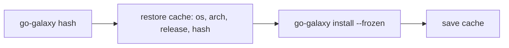

# CI pipelines

Commit a [lockfile](lockfile.md), then have every CI job install exactly what
it pins, from a warm cache. A [GitHub Actions](#github-actions) job keys that
cache on [`go-galaxy hash`](lockfile.md#a-cache-key-for-ci), and the action
does all of it for you. A [GitLab CI](#gitlab-ci) job keys it on `galaxy.lock`
instead.

## GitHub Actions



The action runs these four steps with a checksum-verified release binary, on
Linux and macOS runners, amd64 or arm64.

=== "With the action"

    ```yaml
    name: ansible-deps
    on: [push, pull_request]

    jobs:
      install:
        runs-on: ubuntu-latest
        steps:
          - uses: actions/checkout@v7
          - uses: greeddj/go-galaxy@v1.3.1 # (1)!
            with:
              frozen: true
    ```

    1. The release that writes `galaxy.lock`: bump it with the relock
       ([Pin one release](#pin-one-release)).

=== "By hand"

    ```yaml
    jobs:
      install:
        runs-on: ubuntu-latest
        env:
          RELEASE: "1.3.1" # (1)!
        steps:
          - uses: actions/checkout@v7
          - name: Install go-galaxy # (2)!
            run: |
              base=https://github.com/greeddj/go-galaxy/releases/download/v$RELEASE
              cd "$RUNNER_TEMP"
              curl -sSLf -O "$base/go-galaxy-linux-amd64" -O "$base/checksums.txt"
              sha256sum --ignore-missing -c checksums.txt
              mkdir -p bin
              install -m 755 go-galaxy-linux-amd64 bin/go-galaxy
              echo "$RUNNER_TEMP/bin" >> "$GITHUB_PATH"
          - id: key
            run: |
              hash=$(go-galaxy hash)
              echo "hash=$hash" >> "$GITHUB_OUTPUT"
          - uses: actions/cache@v6
            with:
              path: ~/.cache/go-galaxy
              key: go-galaxy-${{ runner.os }}-${{ runner.arch }}-${{ env.RELEASE }}-${{ steps.key.outputs.hash }}
              restore-keys: go-galaxy-${{ runner.os }}-${{ runner.arch }}-${{ env.RELEASE }}-
          - run: go-galaxy install --frozen # (3)!
    ```

    1. The release that writes `galaxy.lock`, also in the cache key
       ([Pin one release](#pin-one-release)).
    2. Fetch the asset for the runner, `go-galaxy-<linux|darwin>-<amd64|arm64>`,
       checked against `checksums.txt`. [Verifying a
       release](security.md#verifying-a-release) adds the signature.
    3. Not `--offline`: `restore-keys` can hand back an older cache, or none.

### Inputs and outputs

| Input | Default | Effect |
| :-- | :-- | :-- |
| `requirements` | [discovered](requirements.md#which-file-is-read) | `-r`, for the install and for the cache key's [`go-galaxy hash`](lockfile.md#a-cache-key-for-ci) |
| `collections-path` | go-galaxy's (`.collections`) | `-p` |
| `roles-path` | go-galaxy's (`.roles`) | `--roles-path` |
| `frozen` | `false` | `--frozen`: [install what `galaxy.lock` pins](lockfile.md#install-from-the-lockfile) |
| `offline` | `false` | `--offline`, only where the cache is known to be full ([Install from the lockfile](lockfile.md#install-from-the-lockfile)) |
| `args` | empty | More install arguments, split on whitespace. The cache key never sees them, so a `-r` given only here leaves the key step on the [discovered](requirements.md#which-file-is-read) file and the `galaxy.lock` beside it, and fails the action where neither exists: name the requirements file with `requirements`, and the lockfile with `GO_GALAXY_LOCK_FILE` in `env` |
| `install` | `true` | `false` only puts go-galaxy on PATH: no install, no cache |
| `cache` | `true` | Restores and saves `~/.cache/go-galaxy`. Set `false` when a flag, variable or `cache_dir` key moves the cache |
| `version` | The release an `@vX.Y.Z` reference names, else the latest (`@v1`, a branch, a commit SHA) | Release to install, `1.1.0` or later |

An unset input adds no flag, leaving the matching variable
[in charge](../reference/configuration.md#where-a-setting-comes-from). Export
`ANSIBLE_COLLECTIONS_PATH` and `ANSIBLE_ROLES_PATH` on the job, and a later
`ansible-playbook` step finds the installs
([Point ansible at the installs](../get-started/getting-started.md#point-ansible-at-the-installs)).

For a CI dashboard, set `GO_GALAXY_METRICS_FILE` on the job or the action's
step, or `metrics_file` under `[tool.go-galaxy]`. go-galaxy then writes a
[run report](../reference/metrics.md).

| Output | Value |
| :-- | :-- |
| `version` | The release installed, without the leading `v` |
| `cache-hit` | Whether an exact key match was restored |

<details markdown>
<summary>How the action keys its cache</summary>

The key is `go-galaxy-<os>-<arch>-<release>-<hash>`, and `restore-keys` falls
back only within the same release, so the first job after an upgrade runs cold
([Pin one release](#pin-one-release)).

A failing `go-galaxy hash` fails the action at the step that computes the
key, before anything installs, frozen or not: exit `6` for a lockfile that
does not load, `2` for a `galaxy.toml` that does not load
([every case](lockfile.md#a-cache-key-for-ci)). `cache: false` skips `hash`.

With `@v1`, a branch or a commit SHA and no `version` input, the action takes
the first word of `go-galaxy --version`, minus a leading `v` (for example
`1.3.1`), as both the `version` output and the key's release. A first word
that is no version, such as `(devel)`, fails the action there rather than
leave the release out of the key.

</details>

### Secrets

```yaml
      - uses: greeddj/go-galaxy@v1.3.1
        env:
          HUB_TOKEN: ${{ secrets.HUB_TOKEN }} # (1)!
          GO_GALAXY_GIT_CREDENTIALS: forge # (2)!
          GO_GALAXY_GIT_FORGE_URL: https://github.com/acme
          GO_GALAXY_GIT_FORGE_USERNAME: x-access-token
          GO_GALAXY_GIT_FORGE_PASSWORD: ${{ secrets.GH_PAT }}
        with:
          frozen: true
```

1. Read by `token = "${HUB_TOKEN}"` in `galaxy.toml`, as in
   [A private hub, then public Galaxy](servers-and-auth.md#a-private-hub-then-public-galaxy).
   With one server, at the default address or one you export,
   `GO_GALAXY_TOKEN` works too ([Where a token may go](servers-and-auth.md#where-a-token-may-go)).
2. Without this list the `GO_GALAXY_GIT_FORGE_*` variables are ignored. See
   [Git sources and credentials](servers-and-auth.md#git-sources-and-credentials).
   [URL sources](servers-and-auth.md#url-sources-and-credentials) work alike.

> [!NOTE]
> A pull request from a fork, or one Dependabot opens, gets no Actions
> secrets, so each `${{ secrets.* }}` expands empty. A git or url binding with
> an empty password or token, or a bucket with an empty key, then exits `2`
> before anything installs. Run such pull requests in a job without those
> bindings and with `GO_GALAXY_S3_BUCKET: ""`, or skip them.

Anything the inputs miss goes through `env`, at workflow, job or step level.

> [!CAUTION]
> Never put a secret in `args`: it becomes argv, which other processes on the
> runner can read ([why](security.md#trust-model)).

### Settings in galaxy.toml

=== "galaxy.toml"

    ```toml
    [tool.go-galaxy.s3]
    bucket = "ci-galaxy-cache"
    endpoint = "https://s3.example.com"
    access_key = "${S3_CACHE_ACCESS_KEY}"
    secret_key = "${S3_CACHE_SECRET_KEY}"
    ```

    ```yaml
    jobs:
      install:
        env:
          S3_CACHE_ACCESS_KEY: ${{ secrets.S3_CACHE_ACCESS_KEY }}
          S3_CACHE_SECRET_KEY: ${{ secrets.S3_CACHE_SECRET_KEY }}
    ```

=== "Environment"

    ```yaml
    jobs:
      install:
        env:
          GO_GALAXY_S3_BUCKET: ci-galaxy-cache
          GO_GALAXY_S3_ENDPOINT: https://s3.example.com
          GO_GALAXY_S3_ACCESS_KEY: ${{ secrets.S3_CACHE_ACCESS_KEY }}
          GO_GALAXY_S3_SECRET_KEY: ${{ secrets.S3_CACHE_SECRET_KEY }}
    ```

Moving settings such as an [S3 cache](caching.md#s3-cache-optional) into
[`[tool.go-galaxy]`](../reference/configuration.md#the-toolgo-galaxy-table) leaves only
secrets in the workflow. A set `GO_GALAXY_*` variable still outranks the file,
key by key. Jobs on one bucket take turns
([Locking and failures](caching.md#locking-and-failures)), and untrusted
branches need a bucket of their own.

> [!WARNING]
> Export each `${VAR}` where the cache-key step sees it too: on the job, or on
> the step that calls the action. `go-galaxy hash` reads `galaxy.toml` and
> exits [`2`](../reference/exit-codes.md) on an unset variable.

## GitLab CI

```yaml
variables:
  GO_GALAXY_CACHE_DIR: "$CI_PROJECT_DIR/.cache/go-galaxy" # (1)!

install:
  image:
    name: ghcr.io/greeddj/go-galaxy:1.3.1-alpine # (2)!
    entrypoint: [""]
  cache:
    key:
      files: [galaxy.lock] # (3)!
      prefix: go-galaxy-1.3.1
    paths: [.cache/go-galaxy]
  script:
    - go-galaxy install --frozen # (4)!
```

1. GitLab caches only paths inside the project directory.
2. The Alpine variant, since the default image is distroless, with no shell
   for the script. `entrypoint: [""]` clears the image's go-galaxy
   entrypoint, which would otherwise receive the script. It runs as the
   unprivileged user `65532`, so `apk add` fails here.
3. GitLab fixes the cache key before any script runs, so `go-galaxy hash`
   cannot set it. `key:files` keys it on `galaxy.lock` instead. The prefix
   carries the release: bump it with the image tag.
4. Not `--offline`: the first pipeline after a lockfile change misses the
   cache.

A later job does not see this job's files: hand `.collections` and `.roles`
on as `artifacts:`, or run the install in the playbook job itself, on an image
with go-galaxy [copied in](#container-image-bake). Either way, export
`ANSIBLE_COLLECTIONS_PATH` and `ANSIBLE_ROLES_PATH` on the playbook job.

GitLab's Docker executor leaves the checkout world-writable by default, so
go-galaxy, like ansible, skips `./ansible.cfg` there
([ansible.cfg](../reference/configuration.md#ansiblecfg)). A project that reads
servers or paths from it sets `ANSIBLE_CONFIG: "$CI_PROJECT_DIR/ansible.cfg"`
under `variables:`.

Keep secrets in masked CI/CD variables, not in `.gitlab-ci.yml`. GitLab exports
each into the job's environment under its own name, so name it as go-galaxy
reads it: a `${VAR}` your `galaxy.toml` names, `GO_GALAXY_GIT_*`,
`GO_GALAXY_URL_*` or `GO_GALAXY_S3_*`. A Galaxy token in `GO_GALAXY_TOKEN` or
`ANSIBLE_GALAXY_SERVER_<ID>_TOKEN` is refused, exit `2`, when the server's
`url` comes from `ansible.cfg` or `galaxy.toml`. Export the address too, or put
the token in `galaxy.toml` as `token = "${VAR}"`
([Where a token may go](servers-and-auth.md#where-a-token-may-go)). Pass no
secret on the command line
([why](security.md#trust-model)). A private repository on the same GitLab
takes `$CI_JOB_TOKEN`, bound as in
[Git sources and credentials](servers-and-auth.md#git-sources-and-credentials).

> [!NOTE]
> With several runners, share one [S3 cache](caching.md#s3-cache-optional) and
> keep the `cache:` block, since extraction stays local. Jobs on one bucket
> take turns ([Locking and failures](caching.md#locking-and-failures)), and
> untrusted branches need a bucket of their own.

## Lockfile drift gate

=== "GitHub Actions"

    ```yaml
    name: lockfile-drift
    on:
      push:
        branches: [main]
      pull_request:
      schedule:
        - cron: "0 6 * * 1" # (1)!

    jobs:
      lockfile-drift:
        runs-on: ubuntu-latest
        steps:
          - uses: actions/checkout@v7
          - uses: greeddj/go-galaxy@v1.3.1
            id: gg
            with:
              install: false # (2)!
          - id: key
            run: |
              hash=$(go-galaxy hash)
              echo "hash=$hash" >> "$GITHUB_OUTPUT"
          - uses: actions/cache@v6 # (3)!
            with:
              path: ~/.cache/go-galaxy
              key: go-galaxy-drift-${{ runner.os }}-${{ runner.arch }}-${{ steps.gg.outputs.version }}-${{ steps.key.outputs.hash }}
          - run: go-galaxy lock --check # (4)!
          - if: github.event_name == 'schedule'
            run: go-galaxy lock --check --refresh # (5)!
    ```

    1. Starts a weekly run, the only one that takes the last step.
    2. Only puts go-galaxy on PATH.
    3. Its own key, saved by the run on `main`: plain `lock --check` replays
       the [last resolution](caching.md#what-a-rerun-reuses) saved there,
       which an install cache written by `--frozen` lacks.
    4. Fails on requirements edited without relocking. On a cold cache, it
       also fails on a newer upstream release.
    5. On the schedule only. A newer release your constraints allow, a moved
       git ref or changed url bytes would otherwise fail every open pull
       request, whatever it changes.

=== "GitLab CI"

    ```yaml
    lockfile-drift:
      image:
        name: ghcr.io/greeddj/go-galaxy:1.3.1-alpine
        entrypoint: [""]
      script:
        - go-galaxy lock --check --refresh # (1)!
    ```

    1. One step and no cache: by default GitLab keeps a protected branch's
       cache from unprotected ones, so a merge request cannot replay the
       last resolution saved on `main`. This step catches both kinds of
       drift, so a newer upstream release fails every merge request. If the
       gate is required for merging, run it from a pipeline schedule instead.

On drift a step exits `6`: run `go-galaxy lock` (with `--refresh` for an
upstream release) and commit. [Catch drift](lockfile.md#catch-drift) explains
both checks.

## Container image bake

```dockerfile
FROM debian:stable-slim

# (1)!
COPY --from=ghcr.io/greeddj/go-galaxy:1.3.1 /go-galaxy /usr/local/bin/go-galaxy
# (2)!
RUN apt-get update -qq \
 && apt-get install -y -qq --no-install-recommends ca-certificates \
 && rm -rf /var/lib/apt/lists/*
# (3)!
ENV GO_GALAXY_CACHE_DIR=/var/cache/go-galaxy

WORKDIR /src
# (4)!
COPY requirements.yml galaxy.lock ./
ARG JOB_UID=1001
# (5)!
RUN go-galaxy warm --frozen && chown -R "$JOB_UID" "$GO_GALAXY_CACHE_DIR"
```

1. The image is distroless: one binary at `/go-galaxy`, no shell.
   [Pin](#pin-one-release) its tag.
2. Without CA certificates, Galaxy requests fail TLS verification.
3. A fixed path: the default under `$HOME` differs between root here and your
   job user.
4. On `galaxy.toml`, copy it in place of `requirements.yml`. Every `${VAR}`
   its `[tool.go-galaxy]` table names must then be set, here and in the jobs.
   A `[tool.go-galaxy.s3]` table also needs `ENV GO_GALAXY_S3_BUCKET=""`,
   since the image must hold the whole cache and `--offline` refuses a
   bucket. The variables that table names may then be empty.
5. `JOB_UID` is your jobs' uid. A separate `RUN chown` would copy the whole
   cache into a new layer. If the jobs verify signatures, pass `--keyring` to
   this `warm` too
   ([What a verifying run does differently](signatures.md#what-a-verifying-run-does-differently)).

Jobs on this image run go-galaxy directly, without the action, and need no
download, the case `--offline` is for:

```bash
go-galaxy install --frozen --offline
```

| Approach | Hardlinks | Installed files | Cache |
| :-- | :-- | :-- | :-- |
| `chown -R` to the job's uid | Work | Read-only | Writable by the job alone |
| `chmod -R a+rwX` | Work | Writable by anyone | Writable by anyone |
| No `chown`, or the wrong uid | - | - | `cache backend cannot be used as configured`, exit `2` |

With the uid unknown at build time, nothing keeps both hardlinks and
[read-only installed files](../get-started/ansible-galaxy-compat.md#installed-files-are-read-only),
so bake for a known uid.

Hardlinks also need the install path on the cache's filesystem
([The local cache](caching.md#the-local-cache)). A workspace mounted into the
container, as in a GitHub `container:` job or GitLab's `/builds`, is another
filesystem, so each installed file is a read-only copy there.

<details markdown>
<summary>Why chown and not chmod</summary>

An install hardlinks its files out of the cache, so a cache file and its
installed copy are one inode with one mode: widening the cache's modes for the
job widens the installed files too. With `fs.protected_hardlinks`, the default
on current distributions, Linux lets you hardlink a file you do not own only
when you may read and write it.

A file you own you may always link, so handing the cache to the job's uid buys
the link while every file stays read-only. That uid can still `chmod u+w` a
file it owns, as with any single-user cache.

</details>

## Pin one release

Run one release everywhere a cache or `galaxy.lock` is shared.

| Mismatch | What happens | Fix |
| :-- | :-- | :-- |
| Older release, cache with a newer snapshot schema | `unsupported snapshot schema version`, exit `2` | Key the cache on the release. A shared bucket or directory needs one release, or an S3 prefix per release |
| Newer release, cache with an older snapshot schema | Rebuilds the snapshot: one slower run | None. A shared cache then fails older releases, as above |
| Older release, newer `galaxy.lock` | Refused, exit `6` | One release everywhere |
| Newer release, Galaxy entries without `download_url` | Refused, exit `6` | `go-galaxy lock`, then commit |

Pin it in each place:

| Where | Pin with |
| :-- | :-- |
| The action | `@v1.3.1`. `@v1`, a branch or a commit SHA names no release, so add `version: 1.3.1` |
| A downloaded binary | A fixed release URL, `releases/download/v1.3.1/` |
| A baked image | `ghcr.io/greeddj/go-galaxy:1.3.1` |
| A GitLab CI job | Its image, `ghcr.io/greeddj/go-galaxy:1.3.1-alpine`, and the cache key's `prefix` with it |

Run `go-galaxy lock` with that release too, on developer machines included.
[Upgrading](../reference/upgrading.md) lists what each release changes.
