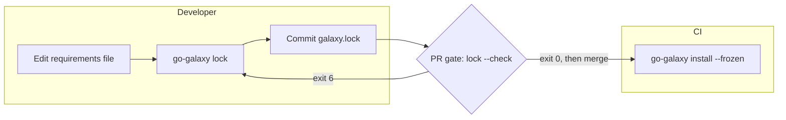

# Lockfile

`galaxy.lock` pins every collection and role a run installs, so CI installs
exactly what you tested.



## Create the lockfile

```bash
go-galaxy lock
```

```text
✔ Lockfile written to galaxy.lock (3 collections, 1 roles)
```

`lock` resolves the collections and roles of your
[requirements file](requirements.md) and writes `galaxy.lock` beside it, or at
the path [`--lock-file` or `lock_file`](../reference/cli.md#lockfile) names. Commit the
file.

Over an existing `galaxy.lock`, `lock` keeps each pin the file holds that the
requirements still allow ([What each entry is pinned
by](#what-each-entry-is-pinned-by)) and its source still serves, and resolves
the rest, such as an entry you added. A dependency keeps its pin while the
entries it is reached through keep theirs: an entry that resolves anew takes
its highest allowed version, and what it alone reaches can move to what that
version needs ([The loop](../internals/solver.md#the-loop), in the internals).
The file outranks the cache: a cold cache, `--no-cache`, `--clear-cache` and a
newer pin that `install --refresh` recorded move none of its pins. A replayed
resolution asks the servers nothing; a run that solves, as after an edit, reads
a kept collection's metadata as any solve does
([Freshness and retention](caching.md#freshness-and-retention)). Run
`go-galaxy lock --refresh` to set the file aside and take newer releases your
constraints allow, moved git refs and new role tags.

| When | `lock` |
| --- | --- |
| The requirements no longer allow a pin, as after you tighten a constraint past it | Resolves that entry anew, as `--dry-run` shows |
| The requirements rule out a git commit: it holds a collection they ask for from another source, or no resolution fits its collections' dependencies | Resolves that git requirement anew, with one warning. `lock --check` then reports drift |
| A source no longer serves a pin: a Galaxy version answers `404`, a repository no longer serves a commit, a URL serves other bytes, or a Galaxy role's repository cannot be fetched while the v1 API names another | Resolves that entry anew, with one warning. `lock --check` then reports drift |
| `--offline`, and the cache lacks a pin: a Galaxy version's metadata, a commit, or the bytes of a URL | Exits [`4`](../reference/exit-codes.md). A plain `lock` without `--offline` records them, a commit only while its branch or tag still names it ([What a rerun reuses](caching.md#what-a-rerun-reuses)) |
| No `galaxy.lock` | Resolves with no pins to keep |
| A `galaxy.lock` that does not load, or a path that is not a regular file | `lock` and `lock --dry-run` warn that it cannot be read and resolve with no pins to keep. `lock --check` exits `6` |

`lock` exits [`5`](../reference/exit-codes.md) when a server names a `download_url` that
carries a query string or leaves the server's origin. Such a server works only
without a lockfile. Any path on that origin locks, such as a caching proxy's
`.../get/<namespace>/<name>/<version>`.
[Security boundaries](../internals/boundaries.md#loading-the-lockfile)
(internals) explains why the lockfile refuses these.

### What each entry is pinned by

| Entry | Pinned by | `lock` keeps it while |
| --- | --- | --- |
| Galaxy collection | `version`, `sha256` and `download_url` | Every constraint on it allows `version`. `sha256` and `download_url` come from its server again |
| git collection | `commit`, with `ref` and `subdir` | Its requirement still asks for that repository and `ref`, matched as a [frozen install](#what-a-frozen-install-checks) matches it, and every entry matched to that requirement shares one `commit` |
| url collection | `sha256` of the tarball | Its requirement still asks for that URL, and for that `version` if it names one |
| Galaxy role | `commit`, with `repository` and `ref` | Its requirement still asks for that Galaxy name, and for that `version` if it names one, the entry names a server the run uses, and its `repository` is on GitHub |
| git role | `commit`, with `ref` | Its requirement still asks for that repository and `ref` |
| url role | `sha256` of the tarball | Its requirement still asks for that URL, and for that `version` if it names one |

A Galaxy server that publishes no digest leaves its entries without `sha256`,
so a frozen install cannot check their bytes.

> [!WARNING]
> Use one go-galaxy release everywhere `galaxy.lock` is read, or a release can
> refuse the file with exit `6`: [Pin one release](ci.md#pin-one-release).
> [Lockfile format](../internals/lockfile-format.md#schema-versions) (internals)
> lists which entry needs which `schema_version`.

<details markdown>
<summary>A sample galaxy.lock</summary>

```yaml
server: https://galaxy.ansible.com
collections:
  - name: ansible.utils
    version: 6.1.1
    source: https://galaxy.ansible.com
    download_url: https://galaxy.ansible.com/api/v3/plugin/ansible/content/published/collections/artifacts/ansible-utils-6.1.1.tar.gz
    sha256: 961b587874b54a0e30e2614ec5c6f673d036cc37b823ed8b164092405f8ada6b
  - name: community.general
    version: 13.4.0
    source: https://galaxy.ansible.com
    download_url: https://galaxy.ansible.com/api/v3/plugin/ansible/content/published/collections/artifacts/community-general-13.4.0.tar.gz
    sha256: efd1c0b5dc6f89b9667e4bd77f2426c30545861910dba188593871095ede1804
    deps:
      - community.library_inventory_filtering_v1
  - name: community.library_inventory_filtering_v1
    version: 1.1.5
    source: https://galaxy.ansible.com
    download_url: https://galaxy.ansible.com/api/v3/plugin/ansible/content/published/collections/artifacts/community-library_inventory_filtering_v1-1.1.5.tar.gz
    sha256: cbb9e86c5b1720df21e940cedcd2f3e1226c38262623e090a883712610733851
roles:
  - name: geerlingguy.docker
    type: galaxy
    version: 8.0.0
    galaxy: geerlingguy.docker
    source: https://galaxy.ansible.com
    repository: https://github.com/geerlingguy/ansible-role-docker
    ref: refs/tags/8.0.0
    commit: 1d3968dbf0df48515ffda0f6561cbd25206f502a
schema_version: 5
```

[Lockfile format](../internals/lockfile-format.md#entry-kinds) (internals)
lists every field of each entry kind.

</details>

## Install from the lockfile

Only `--frozen` makes `install` read `galaxy.lock`. A plain `install`
resolves the requirements file and ignores the lockfile.

```bash
go-galaxy install --frozen
```

```text
· Frozen: using lockfile galaxy.lock
· Using cached ansible-utils-6.1.1.tar.gz
✔ Installed: ansible.utils == 6.1.1
· Using cached community-library_inventory_filtering_v1-1.1.5.tar.gz
✔ Installed: community.library_inventory_filtering_v1 == 1.1.5
· Using cached community-general-13.4.0.tar.gz
✔ Installed: community.general == 13.4.0
✔ Installed: role geerlingguy.docker == 8.0.0
✔ All done. Took 1s
```

| Mode | Network | Resolves | Cache miss | Use it on |
| --- | --- | --- | --- | --- |
| `install` | When not cached | Yes, from cache or the servers | Downloads | A developer machine |
| `install --frozen` | Only for cache misses | No, reads `galaxy.lock` | Downloads the locked `download_url`, commit or URL | Any CI job, cache or not |
| `install --frozen --offline` | None | No | Fails, exit `5` | A baked image only |

[`warm --frozen`](../reference/cli.md#warm) fills the cache from the same pins.
A frozen run asks the server for no metadata unless it
[verifies signatures](signatures.md#what-a-verifying-run-does-differently).

Add `--offline` only where the cache is known to be full, such as a
[baked image](ci.md#container-image-bake): a restored CI cache misses after
every lockfile change.

### What a frozen install checks

| What | Checked against | On mismatch |
| --- | --- | --- |
| Each entry of your requirements file | Its `galaxy.lock` entry exists and still matches: a Galaxy collection's constraint, a git collection's repository and ref (each locked git collection counts for the entry at its directory, else the one above it, that asks for its ref), a url collection's URL and `version`, a role's source and version (for a git role, its ref) | `6` |
| `galaxy.lock` itself | Present, valid, each `download_url` on its server's origin | `6` |
| Galaxy or url collection bytes | The `sha256` pin, after one re-download of a bad cached copy (not under `--offline`) | `7` |
| Galaxy collection bytes from a locked `download_url` | The entry's namespace, name and version, against the `MANIFEST.json` they carry | `7` |
| git collection or any role, on a cache miss | The pinned `commit`, or for a url role the tarball's `sha256` | `7`, or `5` if the remote no longer has the commit |
| Any artifact under `--offline` | The local cache | `5` if missing |

A git collection or a role already in the cache installs as cached, unchecked.
A collection already installed from the locked artifact is skipped: go-galaxy
does not re-hash its files and notices only a change in their number or total
size.

`--refresh` and `--no-deps` do nothing under `--frozen`, since the lockfile is
installed whole. Write the lockfile with `lock --refresh` or `lock --no-deps`
instead. Locked entries that nothing in the requirements file needs any more
still install. `lock --check` catches those.

## Catch drift

| Command | Catches | Exit on drift |
| --- | --- | --- |
| `lock` | Nothing: it rewrites `galaxy.lock` | `0` |
| `lock --dry-run` | As `lock --check` | `0` |
| `lock --check` | Requirements edited without relocking, and a pin its source no longer serves | `6` |
| `lock --check --refresh` | Also newer releases your constraints allow, moved git refs, a Galaxy role's new tag, changed url bytes | `6` |

Preview a change without writing it, here capping `community.general` below
13.0.0 and swapping `ansible.utils` for `ansible.posix`:

```bash
go-galaxy lock --dry-run
```

```text
✔ Would add: ansible.posix@2.2.2
✔ Would update: community.general (version 13.4.0 -> 12.6.5; download_url https://galaxy.ansible.com/api/v3/plugin/ansible/content/published/collections/artifacts/community-general-13.4.0.tar.gz -> https://galaxy.ansible.com/api/v3/plugin/ansible/content/published/collections/artifacts/community-general-12.6.5.tar.gz; sha256 efd1c0b5dc6f89b9667e4bd77f2426c30545861910dba188593871095ede1804 -> 6146f29c174bab4a04ec05561e9bf01bead4536103dd34cfce982625d9c28b73; deps community.library_inventory_filtering_v1 -> (none))
✔ Would remove: ansible.utils@6.1.1
✔ Would remove: community.library_inventory_filtering_v1@1.1.5
· Dry run: roles: 0 would be added, 0 would be updated, 0 would be removed, 1 unchanged
· Dry run: lockfile would change; 1 would be added, 1 would be updated, 2 would be removed, 0 unchanged (galaxy.lock)
```

After the same edit, `lock --check` prints the same `Would` lines, then fails:

```bash
go-galaxy lock --check
```

```text
· Check: roles: 0 would be added, 0 would be updated, 0 would be removed, 1 unchanged
· Check: lockfile would change; 1 would be added, 1 would be updated, 2 would be removed, 0 unchanged (galaxy.lock)
✗ lockfile is out of date: galaxy.lock: run `go-galaxy lock` to update it
```

`lock --check` fails when `lock` would write different pins: an entry added,
removed or repinned, a changed role or default server. A missing or
unloadable lockfile also exits `6`.

Plain `lock --check` keeps the pins `galaxy.lock` holds, as `lock` does
([Create the lockfile](#create-the-lockfile)), so a newer upstream release, a
moved git ref or a Galaxy role's new tag does not fail it, on a cold cache or
a warm one. A pin its source no longer serves fails it only where the run has
to fetch that pin: a cache that still holds the pin answers for it.
`lock --check --refresh` sets `galaxy.lock` aside, so those upstream changes
fail it too.

Fix drift with `go-galaxy lock` (`--refresh` for an upstream release) and
commit `galaxy.lock`. The CI job: [Lockfile drift gate](ci.md#lockfile-drift-gate).

## A cache key for CI

```bash
go-galaxy hash
```

```text
sha256:cd042c8bf64fc5315301eb10613e03a61b699c35bac3942d1d50ce5627d823f0
```

| Case | Key or exit |
| --- | --- |
| A valid lockfile | sha256 of the lockfile as `lock` writes it, so reformatting changes nothing |
| No lockfile | sha256 of the collections and roles the requirements file asks for. Comments, formatting, collection order, a [respelled constraint](requirements.md#version-constraints) and a move between `requirements.yml` and `galaxy.toml` keep it; role order [counts](requirements.md#roles). `[tool.go-galaxy]`, `ansible.cfg` and the environment never enter it |
| A lockfile that fails to load | Exit `6`, never the fallback |
| No lockfile, and a requirements file that is missing or does not load | Exit `2` |
| A `galaxy.toml` that does not load or names an unset `${VAR}`, without `--lock-file` | Exit `2` |
| A `-r` or variable value not ending in `.yml`, `.yaml` or `.toml`, an exported-empty one included | Exit `2`, even beside a valid lockfile ([Which file is read](requirements.md#which-file-is-read)) |

Put the go-galaxy release in the key too
([Pin one release](ci.md#pin-one-release)). The
[GitHub Action](ci.md#github-actions) builds such a key for you. GitLab fixes a
job's cache key before any script runs, so a [GitLab CI](ci.md#gitlab-ci) job
keys on `galaxy.lock` instead.

## Inspect what is locked

```bash
go-galaxy tree
```

```text
requirements.yml
├── ansible.utils 6.1.1
└── community.general 13.4.0
    └── community.library_inventory_filtering_v1 1.1.5
roles:
└── geerlingguy.docker 8.0.0 (galaxy geerlingguy.docker via https://github.com/geerlingguy/ansible-role-docker @1d3968dbf0df48515ffda0f6561cbd25206f502a)
```

| A line ending in | Means |
| --- | --- |
| the version alone | A Galaxy collection |
| `(git <repository>[#<subdir>] @<commit>)` | A git collection or role |
| `(url <url> sha256:<first 12 hex>)` | A url collection or role |
| `(galaxy <owner.role> via <repository> @<commit>)` | A Galaxy role |
| `(*)` | Already printed higher up, under the same requirements entry |
| `(missing in lockfile)` | A requirements entry the lockfile lacks: run `go-galaxy lock` |

`tree` starts from each entry of the requirements file, so it needs both files
and leaves out locked entries that none of them reaches. A missing lockfile
exits `6`. A requirements file that does not load exits `2`.

```bash
go-galaxy explain community.library_inventory_filtering_v1
```

```text
community.library_inventory_filtering_v1 1.1.5
  source       : https://galaxy.ansible.com
  download_url : https://galaxy.ansible.com/api/v3/plugin/ansible/content/published/collections/artifacts/community-library_inventory_filtering_v1-1.1.5.tar.gz
  sha256       : cbb9e86c5b1720df21e940cedcd2f3e1226c38262623e090a883712610733851
  required by:
    - community.general 13.4.0
```

`explain` takes one collection name, or a role's install or Galaxy name.

| Outcome | Exit |
| --- | --- |
| Found | `0` |
| Not in the lockfile | `1` |
| Lockfile missing or invalid | `6` |

`hash`, `tree` and `explain` only read files: they use no network, no cache and
no cache lock. Without `--lock-file`, each exits `2` on a `galaxy.toml` that
does not load or names an unset `${VAR}`. Their options:
[`hash`, `tree` and `explain`](../reference/cli.md#hash-tree-and-explain).

## Find newer versions

Against an older `galaxy.lock`:

```bash
go-galaxy outdated
```

```text
↑ Outdated: community.general 9.0.0 -> 13.4.0
↑ Outdated: role geerlingguy.docker 7.9.0 -> 8.0.0
· galaxy.lock: 2 up to date, 2 outdated, 0 failed
```

| Entry | Compared against |
| --- | --- |
| Galaxy collection | The highest version on its server, regardless of your constraint |
| git collection or role on a branch or tag | The commit that ref points at now; a newer tag is not looked for |
| git ref pinned to a commit, url collection or role | Nothing: always current; `lock --check --refresh` catches changed url bytes |
| Galaxy role | Its server's highest tag ([v1 role API](servers-and-auth.md#roles-and-the-v1-role-api)), flagged when it differs; untagged, its default branch's commit |

`Lookup failed` lines go to stderr. `Outdated` lines, `Up to date` lines
(under `--verbose`) and the summary go to stdout.

`outdated` exits `0` even when entries are behind, and `4` when a lookup failed
([exceptions](../reference/exit-codes.md#special-cases-by-command)). It needs the network
but neither the cache nor the cache lock, so it can run beside an install. Take
an upgrade with `go-galaxy lock --refresh`, raising the constraint first if it
excludes the new version.

<details markdown>
<summary>Without a lockfile</summary>

`outdated` reads the collections installed under `--download-path` instead,
from the `GALAXY.yml` beside each install. An installed git collection records
no ref, and an installed role records no source, so neither can be checked:
`outdated` names the git collections and counts the roles on stderr. Run
`go-galaxy lock` first, and `outdated` reads the lockfile and checks them too.

| Case | Exit |
| --- | --- |
| Neither a lockfile nor an installed tree | `6` |
| A tree that exists but cannot be read | `1` |
| An empty `ansible_collections` | `0` |

</details>
