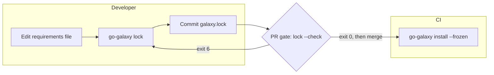

# Lockfile

`galaxy.lock` pins every collection and role a run installs, so CI installs
exactly what you tested.



## Create the lockfile

```bash
go-galaxy lock
```

```text
✔ Lockfile written to galaxy.lock (3 collections, 1 roles)
```

`lock` resolves the collections and roles of your
[requirements file](requirements.md) and writes `galaxy.lock` beside it, or at
the path [`--lock-file` or `lock_file`](../reference/cli.md#lockfile) names. Commit the
file. `lock` reuses what the cache already resolved, so run
`go-galaxy lock --refresh` to take newer releases your constraints allow.

Preview a change without writing it, here capping `community.general` below
13.0.0 and swapping `ansible.utils` for `ansible.posix`:

```bash
go-galaxy lock --dry-run
```

```text
✔ Would add: ansible.posix@2.2.2
✔ Would update: community.general (version 13.4.0 -> 12.6.5; download_url https://galaxy.ansible.com/api/v3/plugin/ansible/content/published/collections/artifacts/community-general-13.4.0.tar.gz -> https://galaxy.ansible.com/api/v3/plugin/ansible/content/published/collections/artifacts/community-general-12.6.5.tar.gz; sha256 efd1c0b5dc6f89b9667e4bd77f2426c30545861910dba188593871095ede1804 -> 6146f29c174bab4a04ec05561e9bf01bead4536103dd34cfce982625d9c28b73; deps community.library_inventory_filtering_v1 -> (none))
✔ Would remove: ansible.utils@6.1.1
✔ Would remove: community.library_inventory_filtering_v1@1.1.5
· Dry run: roles: 0 would be added, 0 would be updated, 0 would be removed, 1 unchanged
· Dry run: lockfile would change; 1 would be added, 1 would be updated, 2 would be removed, 0 unchanged (galaxy.lock)
```

`lock` exits [`5`](../reference/exit-codes.md) when a server names a `download_url` that
carries a query string or is not its own artifact URL
([why the lockfile refuses these](../internals/boundaries.md#loading-requirementsyml-and-the-lockfile)).
Such a server works only without a lockfile.

### What each entry is pinned by

| Entry | Pinned by | Needs `schema_version` |
| --- | --- | --- |
| Galaxy collection | `version`, `sha256` and `download_url` | 5 |
| git collection | `commit`, with `ref` and `subdir` | 2 |
| url collection | `sha256` of the tarball | 4 |
| Galaxy or git role | `commit`, with `ref` | 3 |
| url role | `sha256` of the tarball | 4 |

The file's `schema_version` is the highest its entries need. A Galaxy server
that publishes no digest leaves its entries without `sha256`, and those are not
pin-checked.

> [!WARNING]
> Use one go-galaxy release everywhere `galaxy.lock` is read, or a release can
> refuse the file with exit `6`: [Pin one release](ci.md#pin-one-release).

<details markdown>
<summary>A sample galaxy.lock</summary>

```yaml
server: https://galaxy.ansible.com
collections:
  - name: ansible.utils
    version: 6.1.1
    source: https://galaxy.ansible.com
    download_url: https://galaxy.ansible.com/api/v3/plugin/ansible/content/published/collections/artifacts/ansible-utils-6.1.1.tar.gz
    sha256: 961b587874b54a0e30e2614ec5c6f673d036cc37b823ed8b164092405f8ada6b
  - name: community.general
    version: 13.4.0
    source: https://galaxy.ansible.com
    download_url: https://galaxy.ansible.com/api/v3/plugin/ansible/content/published/collections/artifacts/community-general-13.4.0.tar.gz
    sha256: efd1c0b5dc6f89b9667e4bd77f2426c30545861910dba188593871095ede1804
    deps:
      - community.library_inventory_filtering_v1
  - name: community.library_inventory_filtering_v1
    version: 1.1.5
    source: https://galaxy.ansible.com
    download_url: https://galaxy.ansible.com/api/v3/plugin/ansible/content/published/collections/artifacts/community-library_inventory_filtering_v1-1.1.5.tar.gz
    sha256: cbb9e86c5b1720df21e940cedcd2f3e1226c38262623e090a883712610733851
roles:
  - name: geerlingguy.docker
    type: galaxy
    version: 8.0.0
    galaxy: geerlingguy.docker
    source: https://galaxy.ansible.com
    repository: https://github.com/geerlingguy/ansible-role-docker
    ref: refs/tags/8.0.0
    commit: 1d3968dbf0df48515ffda0f6561cbd25206f502a
schema_version: 5
```

Every field and how `lock` chooses the schema:
[The lockfile](../internals/lockfile-format.md).

</details>

## Install from the lockfile

```bash
go-galaxy install --frozen
```

```text
· Frozen: using lockfile galaxy.lock
· Using cached community-general-13.4.0.tar.gz
✔ Installed: community.general == 13.4.0
✔ Installed: role geerlingguy.docker == 8.0.0
✔ All done. Took 1s
```

| Mode | Network | Resolves | Cache miss | Use it on |
| --- | --- | --- | --- | --- |
| `install` | When not cached | Yes, from cache or the servers | Downloads | A developer machine |
| `install --frozen` | Only for cache misses | No, reads `galaxy.lock` | Downloads the locked `download_url`, commit or URL | Any CI job, cache or not |
| `install --frozen --offline` | None | No | Fails, exit `5` | A baked image only |

A plain `install` ignores `galaxy.lock`. `warm --frozen` takes the same pins.
A frozen run asks the server for no metadata unless it
[verifies signatures](signatures.md#what-a-verifying-run-does-differently).

Add `--offline` only where the cache is known to be full, such as a
[baked image](ci.md#container-image-bake): a restored CI cache misses after
every lockfile change.

### What a frozen install checks

| What | Checked against | On mismatch |
| --- | --- | --- |
| Each requirements root | Its entry: present, constraint met, same ref, URL or role version | `6` |
| `galaxy.lock` itself | Present, valid, each `download_url` its server's own | `6` |
| Galaxy or url bytes | The `sha256` pin, after one re-download of a bad cached copy (not under `--offline`) | `7` |
| git collection, Galaxy or git role, on a cache miss | The pinned `commit` | `7`; `3` if the remote no longer has the commit |
| Any artifact under `--offline` | The local cache | `5` if missing |

`--no-deps` has no effect under `--frozen`: the lockfile is installed whole,
so write it with `lock --no-deps` for roots only. Entries no root needs any
more install too; `lock --check` catches those.

## Catch drift

| Command | Catches | Exit on drift |
| --- | --- | --- |
| `lock` | Nothing: it rewrites `galaxy.lock` | `0` |
| `lock --dry-run` | As `lock --check` | `0` |
| `lock --check` | Requirements edited without relocking | `6` |
| `lock --check --refresh` | Also newer releases your constraints allow, moved git refs, changed url bytes | `6` |

```text
✔ Would add: ansible.posix@2.2.2
✔ Would remove: ansible.utils@6.1.1
✔ Would remove: community.library_inventory_filtering_v1@1.1.5
· Check: lockfile would change; 1 would be added, 1 would be updated, 2 would be removed, 0 unchanged (galaxy.lock)
✗ lockfile is out of date: galaxy.lock: run `go-galaxy lock` to update it
```

`lock --check` fails when `lock` would write different pins: an entry added,
removed or repinned, a changed role or default server. A missing or
unloadable lockfile also exits `6`.

Plain `lock --check` reuses a resolve only from a cache that `lock`, or
`install` or `warm` without `--frozen`, saved for the same requirements; frozen
installs save none. Otherwise it resolves against the servers and can also
flag upstream releases.

Fix drift with `go-galaxy lock` (`--refresh` for an upstream release) and
commit `galaxy.lock`. The CI job: [Lockfile drift gate](ci.md#lockfile-drift-gate).

## A cache key for CI

```bash
go-galaxy hash
```

```text
sha256:cd042c8bf64fc5315301eb10613e03a61b699c35bac3942d1d50ce5627d823f0
```

| Case | Key or exit |
| --- | --- |
| A valid lockfile | sha256 of the lockfile as `lock` writes it, so reformatting changes nothing |
| No lockfile | sha256 of the requirements file's bytes, comments and whitespace included |
| A lockfile that fails to load | Exit `6`, never the fallback |
| No lockfile and no readable requirements file | Exit `2` |
| A `galaxy.toml` that does not load or names an unset `${VAR}`, without `--lock-file` | Exit `2` |

Put the go-galaxy release ([why](ci.md#pin-one-release)) and the runner's OS
and architecture in the key too; the [GitHub Action](ci.md#github-actions)
builds that key for you.

## Inspect what is locked

```bash
go-galaxy tree
```

```text
requirements.yml
├── ansible.utils 6.1.1
└── community.general 13.4.0
    └── community.library_inventory_filtering_v1 1.1.5
roles:
└── geerlingguy.docker 8.0.0 (galaxy geerlingguy.docker via https://github.com/geerlingguy/ansible-role-docker @1d3968dbf0df48515ffda0f6561cbd25206f502a)
```

| A line ending in | Means |
| --- | --- |
| the version alone | A Galaxy collection |
| `(git <repository>[#<subdir>] @<commit>)` | A git collection or role |
| `(url <url> sha256:<first 12 hex>)` | A url collection or role |
| `(galaxy <owner.role> via <repository> @<commit>)` | A Galaxy role |
| `(*)` | Already printed in this root's tree |
| `(missing in lockfile)` | A root the lockfile lacks: run `go-galaxy lock` |

`tree` starts from each root of the requirements file, so it needs both files
and leaves out entries no root reaches. A missing lockfile exits `6`, a
requirements file that does not load `2`.

```bash
go-galaxy explain community.library_inventory_filtering_v1
```

```text
community.library_inventory_filtering_v1 1.1.5
  source       : https://galaxy.ansible.com
  download_url : https://galaxy.ansible.com/api/v3/plugin/ansible/content/published/collections/artifacts/community-library_inventory_filtering_v1-1.1.5.tar.gz
  sha256       : cbb9e86c5b1720df21e940cedcd2f3e1226c38262623e090a883712610733851
  required by:
    - community.general 13.4.0
```

`explain` takes one collection name, or a role's install or Galaxy name.

| Outcome | Exit |
| --- | --- |
| Found | `0` |
| Not in the lockfile | `1` |
| Lockfile missing or invalid | `6` |

`hash`, `tree` and `explain` read only files, with no network, cache or lock,
and share the `hash` table's `galaxy.toml` row
([flags](../reference/cli.md#hash-tree-and-explain)).

## Find newer versions

```bash
go-galaxy outdated
```

```text
↑ Outdated: community.general 9.0.0 -> 13.4.0
↑ Outdated: role geerlingguy.docker 7.9.0 -> 8.0.0
· galaxy.lock: 1 up to date, 2 outdated, 0 failed
```

| Entry | Compared against |
| --- | --- |
| Galaxy collection | The highest version on its server, regardless of your constraint |
| git collection or role on a branch or tag | The commit that ref points at now; a newer tag is not looked for |
| git ref pinned to a commit, url collection or role | Nothing: always current; `lock --check --refresh` catches changed url bytes |
| Galaxy role | Its server's highest tag ([v1 role API](servers-and-auth.md#roles-and-the-v1-role-api)), flagged when it differs; untagged, its default branch's commit |

`Lookup failed` lines go to stderr; `Outdated` lines, `Up to date` lines
(under `--verbose`) and the summary to stdout.

`outdated` exits `0` even when entries are behind, and `4` when a lookup failed
([exceptions](../reference/exit-codes.md#special-cases-by-command)). It needs the network
but no cache or lock, so it can run beside an install. Take an upgrade with
`go-galaxy lock --refresh`, raising the constraint first if it excludes the new
version.

<details markdown>
<summary>Without a lockfile</summary>

`outdated` reads the collections installed under `--download-path` instead,
from the `GALAXY.yml` beside each install. A collection installed from git
records no ref and an installed role no source, so the git collections are
named and the roles counted on stderr, rather than checked; run `lock` to
cover them.

| Case | Exit |
| --- | --- |
| Neither a lockfile nor an installed tree | `6` |
| A tree that exists but cannot be read | `1` |
| An empty `ansible_collections` | `0` |

</details>
