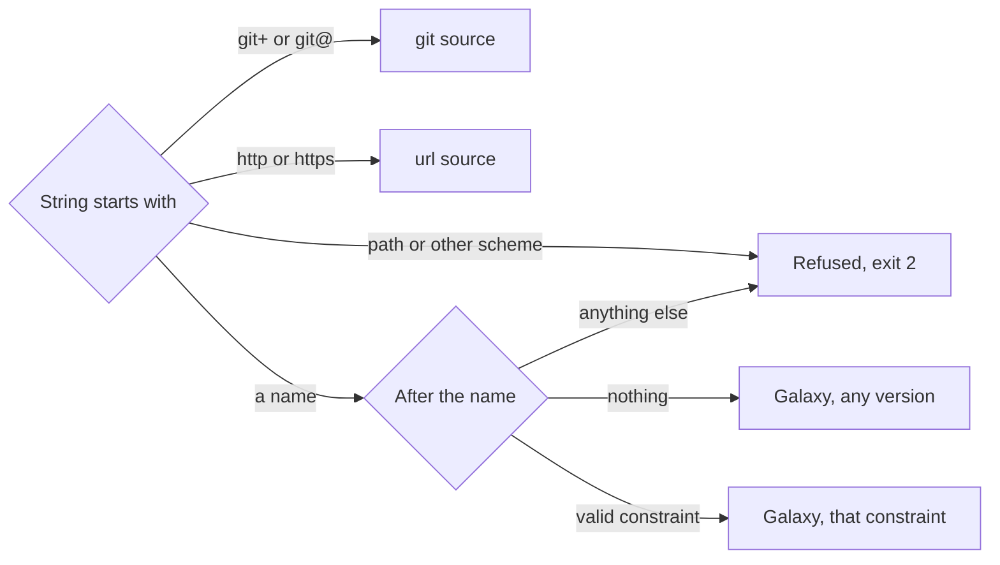
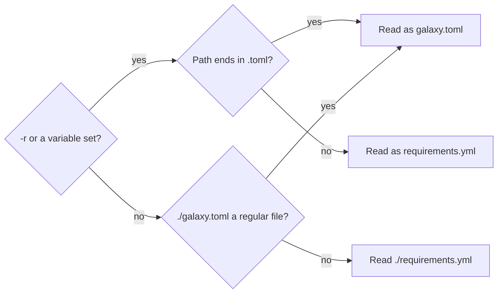

# Requirements files

A requirements file lists the collections and roles that `go-galaxy install`
puts in place. Write go-galaxy's own `galaxy.toml` or ansible's
`requirements.yml`: both hold the same two lists.

<div class="grid" markdown>

```toml title="galaxy.toml"
[project]
collections = [
  "community.general >=10.0.0",
  "ansible.utils",
]
roles = ["geerlingguy.docker,8.0.0"]
```

```yaml title="requirements.yml"
---
collections:
  - name: community.general
    version: ">=10.0.0"
  - name: ansible.utils
roles:
  - geerlingguy.docker,8.0.0
```

</div>

## Collections

=== "Galaxy"

    === "galaxy.toml"

        ```toml
        [[project.collections]]
        name = "community.general"
        version = ">=10.0.0,<12.0.0" # (1)!
        source = "hub" # (2)!
        ```

        1.  A [constraint](#version-constraints); absent means any version.
            Without `source`, the string `"community.general >=10.0.0,<12.0.0"`
            says the same.
        2.  Optional: the one
            [server to ask](servers-and-auth.md#how-a-collection-picks-its-server).

    === "requirements.yml"

        ```yaml
        collections:
          - name: community.general
            version: ">=10.0.0,<12.0.0" # (1)!
            source: hub # (2)!
        ```

        1.  A [constraint](#version-constraints); absent means any version.
        2.  Optional: the one
            [server to ask](servers-and-auth.md#how-a-collection-picks-its-server).

=== "git"

    === "galaxy.toml"

        ```toml
        [project]
        collections = [
          "git+https://github.com/acme/app.git,v1.2.0", # (1)!
          "git+https://github.com/acme/mono.git#collections/app,main", # (2)!
        ]
        ```

        1.  `,` names the ref: a branch, a tag or a full 40-hex commit, never
            an abbreviated one. Absent means `HEAD`.
        2.  `#` picks a directory. With no `galaxy.yml` or `MANIFEST.json`
            there, every collection one level down installs.

    === "requirements.yml"

        ```yaml
        collections:
          - name: https://github.com/acme/app.git
            type: git # (1)!
            version: v1.2.0 # (2)!
          - git+https://github.com/acme/mono.git#collections/app,main # (3)!
        ```

        1.  Needed here: a bare `https://` URL is a tarball, not a repository.
        2.  A branch, a tag or a full 40-hex commit, never an abbreviated one.
            Absent means `HEAD`.
        3.  `#` picks a directory and `,` the ref, which overrides `version:`.
            With no `galaxy.yml` or `MANIFEST.json` there, every collection one
            level down installs.

=== "url"

    === "galaxy.toml"

        ```toml
        [project]
        collections = [
          "https://dl.example.com/acme-lib-2.1.0.tar.gz", # (1)!
          { name = "https://dl.example.com/acme-app-1.4.0.tar.gz", version = "1.4.0" }, # (2)!
          "http://cache.example.com/https://dl.example.com/acme-db-1.0.0.tar.gz", # (3)!
        ]
        ```

        1.  Its `MANIFEST.json` names the collection; the downloaded bytes are
            pinned by sha256.
        2.  `version` is an assertion: it must match the manifest, or the run
            exits [`3`](../reference/exit-codes.md).
        3.  A caching proxy: the embedded URL needs a lower-case scheme and
            host, and no default port.

    === "requirements.yml"

        ```yaml
        collections:
          - https://dl.example.com/acme-lib-2.1.0.tar.gz # (1)!
          - name: https://dl.example.com/acme-app-1.4.0.tar.gz
            type: url
            version: "1.4.0" # (2)!
          - http://cache.example.com/https://dl.example.com/acme-db-1.0.0.tar.gz # (3)!
        ```

        1.  Its `MANIFEST.json` names the collection; the downloaded bytes are
            pinned by sha256.
        2.  An assertion: it must match the manifest, or the run exits
            [`3`](../reference/exit-codes.md).
        3.  A caching proxy: the embedded URL needs a lower-case scheme and
            host, and no default port.

| Key | Galaxy | git | url |
| --- | --- | --- | --- |
| `name` | `namespace.name` | Repository URL, or `ns.name` when `source` holds the URL | Tarball URL |
| `namespace` | Beside a one-part `name` | Beside `source` | Refused |
| `version` | Constraint | Ref | Exact version |
| `source` | Server id or URL | Repository URL (optional) | Refused |
| `type` | `galaxy` or absent | `git`, or a `git+` or `git@` name | `url`, or an `http(s)://` name |
| `signatures` | [Allowed](signatures.md#signatures-in-the-requirements-file) | Refused | Refused |

A bare top-level list is read as `collections:`.

### Version constraints

| Form | Example | Meaning | ansible-galaxy accepts |
| --- | --- | --- | --- |
| Any | `*`, or no version | Every version, prereleases included | Yes, releases only |
| Exact | `1.2.3`, `=1.2.3`, `==1.2.3` | Exactly `1.2.3` | Yes |
| Partial | `1.0` | `>=1.0.0, <1.1.0` | Yes, as exactly `1.0.0` |
| Comparison | `>=1.0`; also `>`, `<`, `<=`, `!=` | As written | Yes |
| AND | `>=2.0, <3.0` or `>=2.0 <3.0` | Both | Comma only |
| OR | <code>^1 &#124;&#124; ^2</code> | Either | No |
| Tilde, caret | `~1.5`, `^1.2` | `>=1.5.0, <1.6.0`; `>=1.2.0, <2.0.0` | No |
| Hyphen range | `1.2 - 1.4` | `1.2.0` through every `1.4.x` | No |
| x-range | `1.x` | `>=1.0.0, <2.0.0` | No |

Every other form admits a prerelease only when it names one, as `>=1.0.0-0`
does ([Prereleases](../get-started/ansible-galaxy-compat.md#prereleases)).

> [!TIP]
> Quote every version in YAML: an unquoted `1.10` reaches go-galaxy as the
> number `1.1`.

### When no version fits

=== "galaxy.toml"

    ```toml
    [project]
    collections = [
      "ansible.netcommon >=8.7.0",
      "ansible.utils <3.0.0",
    ]
    ```

=== "requirements.yml"

    ```yaml
    collections:
      - name: ansible.netcommon
        version: ">=8.7.0"
      - name: ansible.utils
        version: "<3.0.0"
    ```

```text
$ go-galaxy install
...
So, because root depends on ansible.netcommon >=8.7.0 and root depends on ansible.utils <3.0.0, version solving failed.
hint: pre-release versions of ansible.netcommon exist and are excluded by plain constraints; if you intended to allow them, use a >=X.Y.Z-0 floor or an exact pin
```

go-galaxy's [PubGrub solver](../internals/solver.md) tries older
releases when a newer one conflicts. When no combination fits, it exits
[`3`](../reference/exit-codes.md) rather than pick leniently; the proof's `So, because`
line names the constraints to relax.

## Roles

=== "Galaxy role"

    === "galaxy.toml"

        ```toml
        [project]
        roles = [
          "geerlingguy.docker",
          "geerlingguy.nginx,3.2.0,nginx", # (1)!
          { name = "geerlingguy.java", version = "2.3.0" },
        ]
        ```

        1.  `src,version,name`: the name is the directory under `roles_path`.

    === "requirements.yml"

        ```yaml
        roles:
          - geerlingguy.docker
          - geerlingguy.nginx,3.2.0,nginx # (1)!
          - name: geerlingguy.java
            version: "2.3.0"
        ```

        1.  `src,version,name`: the name is the directory under `roles_path`.

=== "git role"

    === "galaxy.toml"

        ```toml
        [project]
        roles = [
          "git+https://git.example.com/platform/ansible-role-base.git,v1.4.0,base",
          "git+https://git.example.com/platform/ansible-role-app.git,release/1.x",
          "https://github.com/acme/ansible-role-cache", # (1)!
        ]
        ```

        1.  A `github.com` URL without `.tar.gz` is a repository, as in ansible.

    === "requirements.yml"

        ```yaml
        roles:
          - git+https://git.example.com/platform/ansible-role-base.git,v1.4.0,base
          - src: https://git.example.com/platform/ansible-role-app.git
            scm: git
            version: release/1.x
          - src: https://github.com/acme/ansible-role-cache # (1)!
        ```

        1.  A `github.com` URL without `.tar.gz` is a repository, as in ansible.

=== "url role"

    === "galaxy.toml"

        ```toml
        [[project.roles]]
        src = "https://dl.example.com/roles/acme-cache-2.0.0.tar.gz"
        name = "cache"
        version = "2.0.0" # (1)!
        ```

        1.  Only a label: the bytes are pinned by sha256.

    === "requirements.yml"

        ```yaml
        roles:
          - src: https://dl.example.com/roles/acme-cache-2.0.0.tar.gz
            name: cache
            version: "2.0.0" # (1)!
        ```

        1.  Only a label: the bytes are pinned by sha256.

| Source | Detected by | `version:` | Default install name |
| --- | --- | --- | --- |
| Galaxy | `owner.role`, each half `^[A-Za-z0-9][A-Za-z0-9_-]{0,63}$` | A tag; absent or `*` means the highest | `owner.role` |
| git | `git+`, `git@`, `scm: git` or a `github.com` URL | A ref; absent means `HEAD` | Repository name minus `.git` |
| url | An http(s) URL ending `.tar.gz` | A label; absent means the sha256's first 12 hex digits | File name minus `.tar.gz` |

An install name matches `^[A-Za-z0-9_][A-Za-z0-9_.-]{0,127}$` and is never
`ansible_collections`. A Galaxy role needs a server with the
[v1 role API](servers-and-auth.md#roles-and-the-v1-role-api).

Each role's `meta` dependencies install too, unless `--no-deps` is set. A
local role (no dot) is skipped, and so, with a warning, is a collection's role
(two or more dots).

## galaxy.toml

| Use | When |
| --- | --- |
| `galaxy.toml` | You want the constraint beside the name, a strict schema, and run settings in [`[tool.go-galaxy]`](../reference/configuration.md#the-toolgo-galaxy-table) |
| `requirements.yml` | `ansible-galaxy` must read the file too |

### The `[project]` table

```toml
[project]
name = "infra"
collections = [
  "community.general >= 10.0, < 12.0", # (1)!
  "git+https://github.com/acme/mono.git#collections/app,main", # (2)!
  "https://dl.example.com/acme-lib-2.1.0.tar.gz",
  { name = "acme.app", version = ">= 1.4.0", source = "hub" }, # (3)!
]
roles = ["geerlingguy.docker,8.0.0"] # (4)!
```

1.  The name, then a [constraint](#version-constraints).
2.  A git pointer, never split into a constraint.
3.  An [inline table](#inline-tables-and-projectcollections).
4.  `src,version,name`, never split into a constraint.

| Key | Type | Required | Meaning |
| --- | --- | --- | --- |
| `name`, `version`, `description` | String | No | For readers; go-galaxy ignores them |
| `collections` | Array of strings and tables | This or `roles` | [Collections](#collections) |
| `roles` | Array of strings and tables | This or `collections` | [Roles](#roles) |

`collections = []` installs nothing; a file with neither list exits `2`. A
`${VAR}` in an entry stays literal: only
[`[tool.go-galaxy]`](../reference/configuration.md#var-expansion) expands one.

### Dependency strings



The name is the longest run of `A-Za-z0-9_.`, followed by whitespace or an
operator, so `ns.name>=1.0` equals `ns.name >= 1.0`.

### Inline tables and `[[project.collections]]`

```toml title="Inline tables"
[project]
collections = [{ name = "acme.app", version = ">= 1.4.0", source = "hub" }]
roles = [{ name = "postgres", src = "geerlingguy.postgresql", version = "3.5.0" }]
```

```toml title="Array of tables"
[[project.collections]]
name = "acme.app"
version = ">= 1.4.0"
source = "hub"

[[project.roles]]
name = "postgres"
src = "geerlingguy.postgresql"
version = "3.5.0"
```

A collection table takes `namespace`, `name`, `version`, `source`, `type` and
`signatures`; a role table takes `name`, `role`, `src`, `scm` and `version`.
Every value is a string; `signatures` is a string or an array of them.

### Stricter than requirements.yml

| Case | requirements.yml | galaxy.toml |
| --- | --- | --- |
| Unknown key on a collection | Ignored | Refused, exit `2` |
| Unknown key on a role | Dropped with a warning | Refused, exit `2` |
| Other top-level key or table | Ignored | Refused, exit `2` |
| A number where text belongs | Read as text, or ignored | Refused, exit `2` |
| Unparsable constraint | Exit `1` at the resolve | Exit `2` at load |

## Which file is read



The variables are `GO_GALAXY_REQUIREMENTS_FILE` and
`ANSIBLE_GALAXY_REQUIREMENTS_FILE`; an empty export counts as set, names no
file and exits `2`. The extension alone decides, `.TOML` too: a `galaxy.txt`
reads as YAML.

When discovery finds both files, go-galaxy warns:

```text
! galaxy.toml and requirements.yml are both present in the current directory; using galaxy.toml and ignoring requirements.yml (name one with --requirements-file to choose)
```

With neither file, `install`, `warm`, `lock` and `hash` exit `2`. A
world-writable directory does not stop discovery, as
[Security](../internals/boundaries.md#loading-requirementsyml-and-the-lockfile) explains.

## What is refused

Each exits `2` before anything installs, naming the entry.

| Entry | Why | Write instead |
| --- | --- | --- |
| A `file`, `dir` or `subdirs` type, a local path, or another scheme such as `ssh://` without `git+` | Unsupported source | A Galaxy name, `git+ssh://...` or an https tarball |
| A credential in a URL | It would reach logs and the lockfile | A binding for [git](servers-and-auth.md#git-sources-and-credentials) or [url](servers-and-auth.md#url-sources-and-credentials) |
| A `#fragment` in a url source | Not part of a tarball URL | The URL without it |
| `src:` or `scm:` in a collection | Role keys | The entry under `roles:` |
| A collection named twice, even by two repositories | One entry per collection | One entry |
| `signatures:` on a git or url collection | Signatures cover Galaxy collections only | Drop it: the pin covers it |
| `include:` in `roles:` | No second file is read | The roles, inline |
| An `scm:` other than `git` | No external process runs | A git repository |
| A role URL neither git nor `.tar.gz`, or a local path | Not an installable role source | `git+<url>` or a `.tar.gz` URL |
| `#subdir` on a git role | The repository root is the role | One repository per role |
| `source:`, `signatures:` or `type:` on a role | It would change the entry's meaning | The entry without it |
| Two roles with one install name, case ignored | Both would land in one directory | Distinct `name:` values |

<details markdown>
<summary>Refused spellings in galaxy.toml</summary>

A name running straight into its constraint, an upper-case name and an
unparsable constraint stop at load:

```text
✗ failed to load requirements file: invalid collection name: "ns.name@1.0": put a space or a version operator between the name and its constraint
✗ failed to load requirements file: invalid collection name: "ns.name:1.0": put a space or a version operator between the name and its constraint
✗ failed to load requirements file: invalid collection name: "ns.name-1.0": put a space or a version operator between the name and its constraint
✗ failed to load requirements file: invalid collection name: "Acme"."App" must each match ^[a-z][a-z0-9_]*$
✗ failed to load requirements file: invalid collection name: "ns.name1.0.0"
✗ failed to load requirements file: invalid collection version constraint: ">>= 1.0" for ns.name
```

`ns.name1.0.0` is a four-part name, since nothing separates the version. Only
the grammar is checked at load: `ns.name >= 99` loads and fails in the
resolve.

</details>

## Moving to galaxy.toml

- [ ] Upgrade every go-galaxy sharing the cache or the lockfile first
      ([From v1.2.x](../reference/upgrading.md#from-v12x)).
- [ ] Rewrite the entries, copying each constraint exactly, and delete
      `requirements.yml`, or every run that names no file warns.
- [ ] Run `go-galaxy lock --check`: the same entries give the same
      `galaxy.lock`.
- [ ] Without a lockfile, expect a new
      [`go-galaxy hash`](lockfile.md#a-cache-key-for-ci) key; a respelled
      constraint (`"1.0.0"` as `== 1.0.0`) costs one fresh resolve.
- [ ] Optionally move `cache_dir` and the whole server list from `ansible.cfg`
      into [`[tool.go-galaxy]`](../reference/configuration.md#the-toolgo-galaxy-table).
