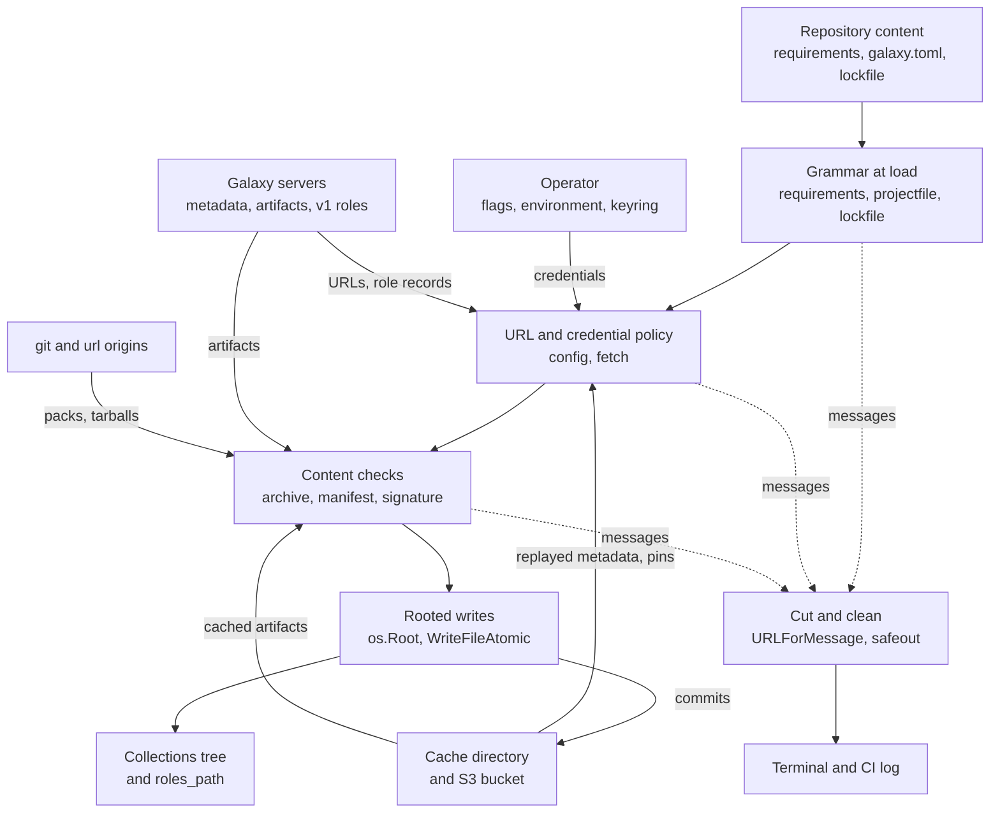

# Security boundaries

Where untrusted input crosses into go-galaxy, what each boundary refuses, and
the property a change must keep. What an operator does about the residuals is
in [Trust model](../guides/security.md#trust-model).

Every arrow from a zone but the operator's crosses a boundary below. Exits are
each sentinel's own class; joined behind the install headline, a per-collection
failure exits 5 unless its class is 6, 7 or 10
([classes](http-output-exit-codes.md#exit-code-classes)).

## Credentials and the token pairing rule

| Input | Refused when | Where | Sentinel | Exit |
| :-- | :-- | :-- | :-- | :-- |
| An operator's Galaxy token | its server URL came from a file | `config.checkTokenPairing` | `ErrTokenDestinationFromFile` | 2 |
| An operator's Galaxy token | a file disabled its certificate check | `config.checkTokenPairing` | `ErrTokenTLSPolicyFromFile` | 2 |
| A Galaxy token, git password or url token | bound to plaintext `http` off loopback | `checkTokenTransport`, `buildGitBasicCredential`, `buildURLCredential` | `ErrInsecureTokenTransport` | 2 |
| Two servers on one origin | their tokens or TLS policies differ | `checkOriginConflicts` | `ErrConflictingServerToken`, `ErrConflictingServerTLSPolicy` | 2 |
| A server URL | it carries userinfo | `config.resolveServerURL`, `buildImplicitServer` | `ErrGalaxyServerURLUserinfo` | 2 |

Each plaintext is revealed once, straight into its client: `serverAuths`,
`gitCredentials` and `urlBindings` in `cmd/go-galaxy/commands`, and the S3
client; elsewhere it is a redacting `config.Secret`. A token is attached only on
a byte-equal origin (`helpers.Origin`, `urlsource.Prefix.Origin` for a url
binding), so changing one renderer alone silently drops it.

Whoever chose a destination may not spend a secret that is not theirs: a
file's own token is exempt, a `galaxy.toml` `${VAR}` one included, since the
file named the variable and a `${VAR}` url could carry it anyway
([below](#loading-requirementsyml-and-the-lockfile)); a `${VAR}` url stays the
file's. Provenance: [Configuration loading](config-loading.md).

Accepted cost and an ansible.cfg parsing rule

- Your URL or TLS policy with the file's token passes, since the secret is not
  yours; a collection only your account sees then 404s.
- An `ansible.cfg` line opening with `[` that is neither header nor key closes
  the section, or a dev `url` could draw prod's literal token.

## Redirects

| Input | Refused when | Where | Sentinel | Exit |
| :-- | :-- | :-- | :-- | :-- |
| Any hop | past 10 hops | `fetch.checkRedirect` | none: net/http's own wording | by caller |
| A git hop | scheme, host or port differs from the first request's | `fetch.checkGitRedirect` | `ErrGitTransportFailed` | 4 |
| A url-source hop | it drops from `https` to `http`, credential or not: the pin comes from these bytes | `fetch.checkURLRedirect` | `ErrDownloadFailed` | 4 |

net/http runs each hop through the transport again, so every credential
decision is remade per hop: another origin gets no Galaxy token, and a url
token follows its binding in and out. `checkRedirect` deletes the `Referer`
net/http composes, whose query would hand a presigned signature onward.

A proxy URL with userinfo (`HTTP_PROXY`, `HTTPS_PROXY`) gets
`Proxy-Authorization` from every client, credential-free ones included. The S3
client refuses every hop ([The S3 endpoint](#the-s3-endpoint)).

## URLs a Galaxy server supplies

| Input | Refused when | Where | Sentinel | Exit |
| :-- | :-- | :-- | :-- | :-- |
| A download URL | not absolute `http(s)` with a host | `collections.checkDownloadURL` | `ErrUnsupportedDownloadURLScheme` | 4 |
| A download URL | it carries userinfo | `checkDownloadURL` | `ErrDownloadURLUserinfo` | 5 |
| `versions_url`, `highest_version.href` | the resolved URL carries userinfo | `normalizeVersionsURL` | `ErrMetadataURLUserinfo` | 5 |
| A v1 role record or page link | a GitHub name outside its alphabet, a bad branch, or a link off the server's origin | `galaxyv1.validateRole`, `nextPage` | `ErrGalaxyRoleInvalid` | 2 |
| A replayed Galaxy role pin | its repository is not `https://github.com/<user>/<repo>` | `galaxyv1.ValidateRepository` | `ErrGalaxyRoleInvalid` | 2 |

- Userinfo becomes a Basic `Authorization` header the token transport never
  overwrites, so it would displace your token.
- `normalizeVersionsURL` refuses after the server walk: inside it, a 404 would
  try the next server and a 401 would blame a credential.
- A v1 record's GitHub URL is composed, never copied, and `download_url` is
  never read; paging past `RoleVersionsMaxPages` exits 4.
- A query on a server base survives only because `apiRootCandidates`
  concatenates strings; building roots with `net/url` would persist the query.

## Git and url sources

| Input | Refused when | Where | Sentinel | Exit |
| :-- | :-- | :-- | :-- | :-- |
| A git or url source | it carries a credential | `gitsource.ParseURL`, `urlsource.ParseURL` | `ErrGitURLUserinfo`, `ErrURLRequirementUserinfo` | 2 |
| Its path | a rune outside the alphabet, an empty or dot segment; git: a leading `-`, a query; both: a fragment | `ParseURL` in each | `ErrInvalidGitURL`, `ErrInvalidURLRequirement` | 2 |
| A persisted locator | not canonical: the URL must round-trip, the pin be lowercase hex | `ParseLocator` in each | `ErrInvalidGitLocator`, `ErrInvalidURLLocator` | 2 |
| A Galaxy entry's `source:` | a git pointer, or a git or url locator, which consumers would dispatch unjudged | `requirements.checkGalaxySourceShape` | `ErrUnsupportedCollectionSource` | 2 |
| An ssh host key | not in known_hosts | `gitfetch.sshAuthFor`, `classifyTransportError` | `ErrGitAuthFailed` | 4 |
| A tree entry | a bad name, `.git` in any case, or a case-folded duplicate | `gitfetch.validateEntries` | `ErrGitTreeEntryInvalid`, `ErrGitTreeDuplicateEntry` | 5 |
| A url artifact | its sha256 differs from the pin | `url_fetch.go`, `role_url.go` | `ErrSHA256Mismatch`, `ErrURLArtifactSHA256Mismatch` | 7 |

- A dot segment is refused, `%2e` too, because the remote resolves
  `/org/../x` while a credential binding matches the path as written.
- The one admitted empty segment is an embedded upstream URL's `//`, which
  `urlsource` and the transport's `pathHasUnsafeSegment` recognize alike.
- No process runs (`gitfetch.harden`), nothing is checked out, and
  `fetch.NewGit` and `fetch.NewURLDownload` hold no Galaxy token or relaxed
  TLS, so a Galaxy role's github.com fetch carries none.

Caps on what a remote can make the process do

| Bound | Value | Why |
| :-- | :-- | :-- |
| Pack on disk | `GitPackMaxSize`, 512 MiB | Both transports converge on disk; go-git inflates objects in memory while indexing, so it sits far below the artifact cap |
| Error response body | `GitErrorBodyMaxSize`, 64 KiB | go-git reads it whole, and neither the pack cap nor the stall watchdog sees it |
| One blob | `ArchiveMaxEntrySize` | The archive's per-entry cap |
| Tree depth | `GitTreeMaxDepth`, 64 | Recursion bounded by this tool, not the remote |
| Roles per run | `RoleGraphMaxRoles`, 1000 | A chain of repositories ends |
| A role's meta file | `BuildMetadataMaxBytes`, 1 MiB | Read before it is decoded |

Submodules are never fetched. A git or url artifact passes the same chain
check and extractor a download does; no signature can vouch for it.

## Loading requirements.yml and the lockfile

| Input | Refused when | Where | Sentinel | Exit |
| :-- | :-- | :-- | :-- | :-- |
| A requirements `source:` | it carries userinfo | `requirements.checkSourceUserinfo` | `ErrGalaxyServerURLUserinfo` | 2 |
| A lockfile `source` or `name` | userinfo, never printed; a name outside its alphabet | `lockfile.validate` | `ErrLockfileInvalid` | 6 |
| A Galaxy entry's `download_url` | not canonical `http(s)`, or with userinfo, query or fragment | `lockfile.downloadURLProblem` | `ErrLockfileInvalid` | 6 |
| A Galaxy entry's `sha256` | neither empty nor 64 lowercase hex digits | `lockfile.validateGalaxyEntry` | `ErrLockfileInvalid` | 6 |
| The same under `--frozen` | off its server's origin, or not ending `/<ns>-<name>-<version>.tar.gz` | `checkLockedDownloadURLs` | `ErrLockfileInvalid` | 6 |
| A download URL at `lock` | a query, or not its server's own artifact | `lockableDownloadURL`, `checkServerArtifactURL` | `ErrDownloadURLQuery`, `ErrDownloadURLNotServerArtifact` | 5 |
| A `galaxy.toml` | a syntax error, shown as line and last key; an unknown table or key | `projectfile.Decode` | `ErrInvalidRequirementsTOML`, `ErrUnsupportedRequirementsFormat` | 2 |
| A `${VAR}` under `[tool.go-galaxy]` | unset; every name reported, sorted, never a value | `projectfile.LoadSettings` | `ErrProjectFileEnvUnset` | 2 |

- `--frozen` fetches `download_url` into the cache slot later installs read,
  so it is held to the server's own artifact; a refetch after a pin failure
  keeps the cached copy (`refetchCachedArtifact`), so no wrong pin empties it.
- `lock` refuses a query: a presigned capability would be committed and expire.
- A world-writable directory does not stop discovery, as it does for
  `./ansible.cfg`: this file is what gets installed, not a setting.
- A `${VAR}` reads any exported variable into any string of the table, server
  `url` and S3 `endpoint` included: the file is trusted with the environment.

What else galaxy.toml may and may not decide

- Discovery `Stat`s for a regular file: the open runs under the cache lock,
  where a fifo would block every runner.
- `requirements.ParseTOML` only reshapes the decoded tree for `parseRaw`,
  refusing unknown inline-table keys (`ErrInvalidCollectionEntry`,
  `ErrInvalidRoleEntry`), so no rule above has a second implementation.
- Validation order is part of the boundary: `checkSourceUserinfo` and
  `checkSignatureSources` run before the no-name refusal that echoes the entry.
- `[tool.go-galaxy]` holds paths, worker counts, S3 and servers, never the
  signature policy, a git or url credential, `--offline`, `--frozen` or `--no-cache`.
- A file-chosen S3 `endpoint` with operator keys passes, unlike a file-chosen
  server with an operator token: SigV4 signs with the secret, never sends it.
- `cleanup` re-reads a recorded file through `Decode`, which expands nothing,
  so its roots never depend on the cleaning process's environment.

## Archive extraction

| Input | Refused when | Where | Sentinel | Exit |
| :-- | :-- | :-- | :-- | :-- |
| An entry path | empty, absolute, or escaping the destination | `archive.sanitizeArchivePath` | `ErrArchiveEntryHasEmptyName`, `ErrArchiveEntryIsAbsolutePath`, `ErrArchiveEntryEscapesDestination` | 5 |
| An entry or hardlink target | an existing component is a symlink | `ensureNoSymlinkParents` | `ErrArchivePathContainsSymlinkComponent` | 5 |
| A symlink target | empty, absolute, or resolving outside, to the root or to itself | `safeSymlinkTarget` | `ErrSymlinkTarget` and siblings | 5 |
| A regular file | an earlier entry created the path | `classifyOpenRegularFileError` | `ErrArchiveDuplicateEntry` | 5 |
| Headers of any type | past `ArchiveMaxEntryCount` | `extractTarEntries` | `ErrArchiveTooManyEntries` | 5 |
| A declared size | negative, or past the per-entry or total cap | `chargeEntrySize` | `ErrArchiveEntryHasNegativeSize`, `ErrArchiveEntryIsTooLarge`, `ErrArchiveExceedsMaxSize` | 5 |
| The decompressed stream | past `ArchiveMaxDecompressedSize` | `decompressedLimitReader` | `ErrArchiveDecompressedTooLarge` | 5 |
| A gzip member | it produces no bytes | `gzipstream.Reader` | `ErrEmptyGzipMember` | the reader's wrap |

- The decompressed cap is the guarantee: sparse entries and meta headers read
  bytes no declared size accounts for. Skipped entry types are still charged.
- `archive` resolves no path through `os.Root`; its caller hands it a contained
  destination ([Install pipeline](install-pipeline.md)).

Reader properties a change must keep

- `decompressedLimitReader` returns zero bytes with the crossing read's error:
  `io.ReadAtLeast` and `io.CopyN` drop an error beside a full read.
- Its error is sticky and the overrun clamped to one byte. Neither it nor
  `contextReader` may implement `io.Seeker`, or archive/tar would seek past both.
- It is not `helpers.NewSizeLimitedReader`, whose sentinel exits 4. The two and
  manifest's `limitReader` keep one shape: change all three together.
- `gzipstream` walks members in a loop: pgzip's `Read` recurses per member, and
  a flood of empty ones overflows the stack beyond any `recover`.
- `verifiedDirs` holds directories only, sound because extraction never
  replaces a path; a new `ensureDir` caller `Lstat`s every component first.
- The duplicate refusal rests on the first copy being read-only; root with
  `CAP_DAC_OVERRIDE` reopens it, and the last entry wins.

## Reading a manifest

| Input | Refused when | Where | Sentinel | Exit |
| :-- | :-- | :-- | :-- | :-- |
| An artifact | no regular `MANIFEST.json` at the exact top-level name, a zero-byte one, or past the 64 MiB scan | `manifest.ReadFromTarGz` | `ErrManifestNotFound` | 5 |
| An entry name or link target | past `ArchiveMaxEntryNameLen`, checked before any rule renders it | `manifest.checkEntryNameLengths` | `ErrArchiveEntryNameTooLong` | 5 |
| A `FILES.json` header | declares past `FilesManifestMaxBytes` | `manifest.VerifyChain` | `ErrArchiveEntryIsTooLarge` | 5 |
| The archive's files | a digest differs from `FILES.json`, a file is unlisted, or `FILES.json` does not match the manifest's pointer | `manifest.VerifyChain` | `ErrManifestChainMismatch` | 7 |

- `manifest` writes nothing, not even a temp file, and opens only artifact
  paths, so the code deciding an install cannot change what is installed.
- The chain scan shares the extractor's caps as constants, not code, and
  decodes `FILES.json` row by row, at most `ArchiveMaxEntryCount` rows.

## Signatures and OpenPGP framing

| Input | Refused when | Where | Sentinel | Exit |
| :-- | :-- | :-- | :-- | :-- |
| A `signatures:` source | a scheme but `http(s)` or `file`, a `file` host but `localhost`, or userinfo | `signature.ValidateRequirementSource` | `ErrUnsupportedSignatureSource`, `ErrSignatureSourceUserinfo` | 2 |
| A `file://` source | absent, unreadable, not regular on the opened descriptor, or too large | `Fetcher.fetchFile` | `ErrSignatureSourceUnavailable` | 4 |
| A keyring | a keybox; secret key material, bad framing, over 4096 packets, or no keys | `signature.LoadKeyring` | `ErrKeyringIsKeybox`, `ErrKeyringUnreadable` | 2 |
| A signature blob | a non-signature packet, over 64 packets, or bad framing | `checkOne` | that blob fails as `ERRSIG` | 10 if the policy fails |

- `signature` only reads. `Fetcher` builds its own client from
  `fetch.NewUnauthenticated`, and `FetchRequirementSource` admits `file` only
  for requirements input.
- A `file://` source opens `O_NONBLOCK` and is judged on the descriptor: a fifo
  would outwait every deadline, and a path stat races the open.
- Every packet stream passes `checkPacketFraming` before go-crypto parses it,
  which sizes buffers from declared lengths: ten bytes can allocate 4 GiB.

The framing walk, in order

Per packet: no findable end or an unreadable header; a secret key packet (RSA
validation costs about 12 s per 16 KiB); a tag outside the profile; the packet
ceiling. Then the v4 to v6 subpacket areas, embedded signatures to depth 4.
Last, go-crypto parses exactly that packet, and an unread byte refuses the file.

Armor is decoded by `decodeArmorBlock`, never go-crypto's armored entry
points, and every armor header section is held to 4096 bytes, because the
decoder's allocation grows with the square of a line. A keyring is cut into
blocks at line-start opening lines, one packet ceiling per file.

## The collections tree and the cache directory

| Input | Refused when | Where | Sentinel | Exit |
| :-- | :-- | :-- | :-- | :-- |
| `ansible_collections` | it leads out of the download path | `openCollectionsRoot` | `ErrCollectionsPathEscape` | 5 |
| A namespace, name or version | not `helpers.IsPathElement` | `buildCollectionsMap`, `newInstallTarget` | `ErrUnsafeCollectionIdentifier` | 2 |
| A role directory | carries neither the extract marker nor `.galaxy_install_info` | `checkRoleDirectoryOwned` | `ErrRoleDirectoryForeign` | 5 |
| A sha256 digest | not 64 lowercase hex (`helpers.IsSHA256Hex`) | extract, marker, `lock` | `ErrMalformedArtifactSHA256` | 7 |

- The install `os.Root` opens at the download path, not `ansible_collections`,
  because `os.OpenRoot` follows a symlink at the path it opens.
- Each identity part is checked before the join: `path.Join` fuses a `..`-led
  version into an element the next `..` cancels.
- Roles write through an `os.Root` at `roles_path` after `IsRoleInstallName`,
  and cleanup [roots its removals](#reading-an-installed-tree-cleanup-and-outdated) too.
- The extracted store writes through an `os.Root`; the local artifact store
  has none: `helpers.ArtifactKey` keeps each path one element, so a planted
  symlink is replaced or unlinked, never followed.
- The lockfile and metrics file are replaced atomically by
  `helpers.WriteFileAtomic`, mode `0644`; the project registry keeps `0600`.

## Reading an installed tree: cleanup and outdated

| Input | Refused when | Where | Sentinel | Exit |
| :-- | :-- | :-- | :-- | :-- |
| A project's `ansible_collections` | its probe fails with anything but not-exist | `cleanup.openProjectWorkspace` | project skipped, warned | - |
| A scanned namespace, name or version | not `helpers.IsPathElement` | `cleanup` scan | skipped, warned | - |
| The same at removal | not `IsPathElement`, or the install path outside the collections path | `cleanup.removeInstalled` | `ErrUnsafeRemovalPath` | 5 |
| A role directory | no recorded roles path, not an install name, or no extract marker | `cleanup.scanProjectRoles`, `scannedRole` | never indexed | - |
| A recorded requirements file | not a regular file by `Stat` | `cleanup.loadRequirements` | `ErrProjectRequirementsUnreadable` | 2 |
| `MANIFEST.json`, `GALAXY.yml`, install info | not a regular file by `Lstat` through the root | `manifestIsRegularFile`, `readRegularFile` | skipped | - |
| An `outdated` sidecar | a bad name or version, fields not recomposing its `.info` name, or another manifest version | `scanInstalledCollection` | skipped | - |

- Reachability covers every registered project before any delete, and a failed
  probe skips its project rather than aiming at another directory.
- Namespace and name come from the directories walked, only the version from
  the manifest, so no manifest can aim a delete at another collection.
- Removal re-opens an `os.Root`, so a symlink swapped in since the scan is
  refused. Accepted: a symlink planted deeper in a collections path, and a
  writer swapping the collections path itself between scan and removal.

## The S3 endpoint

| Input | Refused when | Where | Sentinel | Exit |
| :-- | :-- | :-- | :-- | :-- |
| A redirect | always, a same-host upgrade to `https` included | `s3.refuseRedirect` | `ErrCacheBackendUnusable` | 2 |
| A snapshot or registry object | past a `StateObjectMax*Size` cap, or an empty gzip member | `s3.Backend.readObject` | `ErrStateObjectTooLarge`, `ErrCorruptStateObject` | 9 |
| A listing page or delete result | past `S3ListMaxSize` | `s3.Client` | `ErrResponseTooLarge` | 4 |
| A batch delete | a per-key `<Error>` inside a `200` | `deleteObjectsBatch` | `ErrCacheBackendUnavailable` | 4 |

- A redirected SigV4 request cannot verify; following it would forward the
  `X-Amz-*` headers, session token among them, and replay a PUT body.
- The refusal sits on the S3 client's own copy of the shared client; listed
  keys are untrusted, so the delete body goes through `encoding/xml`.

## Printed output

| Input | Treatment | Where |
| :-- | :-- | :-- |
| Text of external origin | C0 and C1 controls but `\n` and `\t`, DEL, U+2028, U+2029 and invalid UTF-8 become U+FFFD | `safeout.Clean` |
| A refused URL | query, fragment and userinfo cut by string scan, then truncated | `helpers.URLForMessage` |
| A URL rendered or persisted, not fetched | query and userinfo cut | `helpers.WithoutCredentials` |
| A persisted signature source | query cut only | `helpers.WithoutQuery` |
| A failed request | re-rendered over the cut URL the caller asked for | `helpers.CutTransportURL` |
| An attacker-influenced message field | cut at 512 bytes, `... (N bytes)` appended | `helpers.TruncateForMessage` |
| Lockfile fields in `tree`, `explain` | the writer is wrapped; a new printing command does the same | `safeout.NewWriter` |

- `\n` survives, so a forged line is stopped where values enter:
  `helpers.IsPathElement` refuses every `safeout.IsUnsafeRune` rune, and
  `lockfile.Load` holds names to an alphabet.
- Cuts are string scans, since `url.Parse` refuses the values most needing
  one, and run before truncation, which could drop a userinfo's `@`.
- `CutTransportURL` prints the wrapped cause as is, so no `http.RoundTripper`
  here may put an uncut URL in its error; classify with `errors.Is`.
