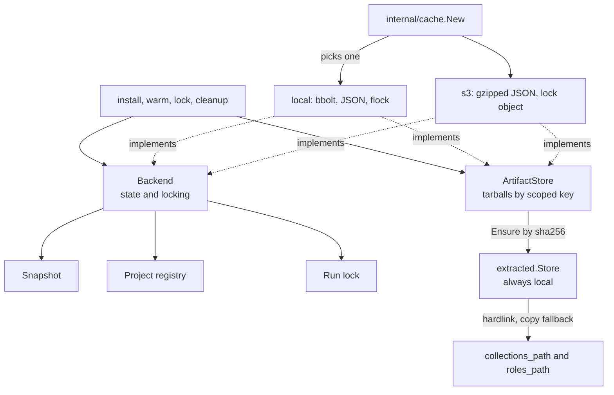
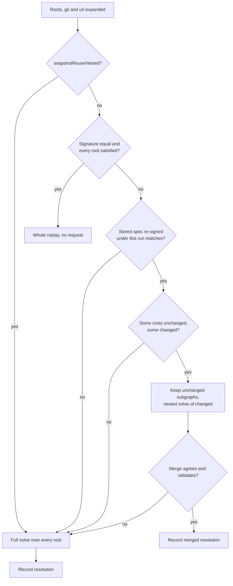
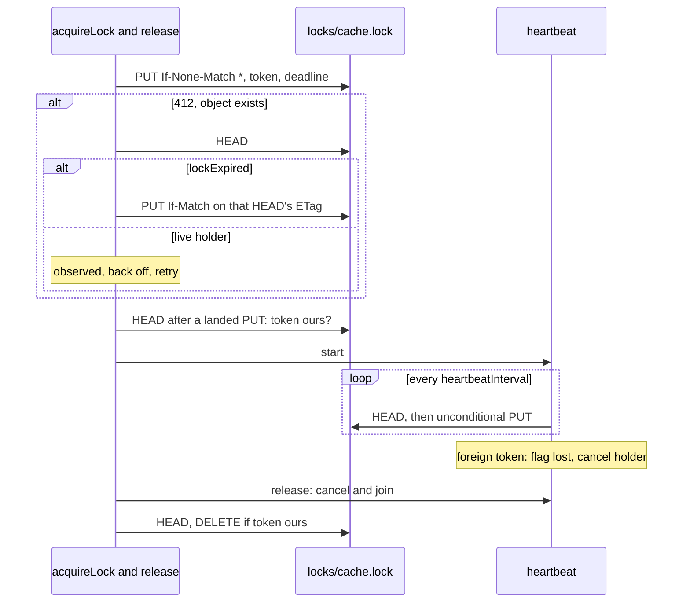

# Cache and storage

How the persistent cache is built: keys, stores, the snapshot and the seam two
backends implement. Its layout, freshness and flags are on
[Caching](../caching.md).

## The caching model

### Artifact cache: scoped by server, not by content

| Source | Scope |
| :-- | :-- |
| Galaxy | The server base the collection resolved from |
| git, or a git or Galaxy role | `git+<url>#<subdir>@<commit>`; a role's subdir is empty |
| url, collection or role | `url+<url>#sha256:<hex>` |

`helpers.ArtifactKey(scope, filename)` is 12 hex digits of sha256(scope), a
dot and the escaped filename. Without the scope, two servers publishing one
`namespace.name@version` share a slot, and a hit serves whichever landed
first. Content addressing cannot work: the digest is unknown until the
download ends, and a hit must be answered first.

A git or url scope is the locator the installed record and resolution carry,
so a new commit moves the key and forces a reinstall. Consumers dispatch on its
prefix, never `type`.

- Filenames come only from `ArtifactFilename` and `RoleArtifactFilename`:
  `cleanup` ignores `Delete`'s error, so drift stops purging silently.
- The role filename's `role.` prefix keeps it apart from a collection built at
  the same commit, whose namespace has no dot.
- A persisted locator parses one way (`gitsource.ParseLocator`): `Locator.String`
  always writes the `#`, a canonical URL holds no `#`, a subdir no `@`.
- `helpers.IsScopedArtifactKey` changes with `ArtifactKey`: the legacy-key
  sweep uses it to spare a live key.

### Extracted store: content-addressed, materialized by hardlink

| Rule | Why |
| :-- | :-- |
| One tree per digest in `extracted/<sha256>/`; `Materialize` hardlinks it, copying where a link fails | Installs share bytes, so files lose their write bit (`helpers.ReadOnlyPerm`) |
| The `.ready` marker, written last, holds a version tag (`ReadyMarkerPayload`) | Readiness is checked before the per-digest lock; a new tag rebuilds older trees once |
| Every store write goes through an `os.Root` at the cache directory | Opening a root follows a symlink, so rooting at `extracted/` adopts its target |
| The zero `SHAProvenance`, `SHAFromRecord`, hashes the tarball first | An undeclared digest is verified, not trusted |

`cleanup`'s `sweepExtractedStore` keeps the digests of installs and roles
that stay and of warms within 30 days, read from the snapshot: a disk scan
misses an absent workspace, normal on an ephemeral runner. Only `warm` writes
a warmed entry, or a tree would outlive its install by 30 days.

### Snapshot

| Bucket | Key | Holds |
| :-- | :-- | :-- |
| `api_cache` | sha256 of the URL | A response body and its validators |
| `versions_cache` | Versions URL | Version list |
| `deps_cache` | `ScopedDepsCacheKey` | Dependency constraints per server and version |
| `requirements`, `resolved`, `graph` | fqdn, fqdn, fqdn@version | The last resolution: root spec, picks, edges |
| `installed`, `warmed` | fqdn@version; a warmed role `role:<name>@<version>` | Install record; warmed sha256 and time |
| `git_pins`, `url_pins` | `gitsource.PinKey`, the URL | Commit or sha256, with identities and deps |
| `installed_roles`, `role_pins` | Install name, requirement line | Role record; what the line resolved to |
| `meta` | Fixed keys | Schema version, save stamps, requirements hash |

A local save writes every bucket in one bbolt transaction (`store.Save`), S3
one gzipped JSON object (`MarshalSnapshot`), both through `snapshotData`, the
one copy path, which applies retention and cuts signature queries.

- `helpers.StoreSnapshotSchemaVersion` is bumped for any change, additive
  included: `ValidateSchema` drops an older snapshot and refuses a newer one.
- A new bucket joins `jsonBuckets` (appended), `New`, `ensureMaps`,
  `snapshotData`, `MarshalSnapshot`, and `hasContentEntries` if it records
  on-disk content.
- Every write-locked `*Store` method sets the dirty flag
  (`TestEveryWriteLockedStoreMethodMarksDirty`); a clean run skips the save.
- A skipped save skips eviction, so a read of mutable data checks age
  itself (`WarmedArtifactSHAByKey`).

### Resolution replay

`requirementsSignatureFromSpec` hashes `no-deps=<bool>`,
`servers=<serversSignature>`, then sorted `fqdn|constraint|source|type|signatures`
lines.

| Input | Rule | Why |
| :-- | :-- | :-- |
| Server list | Id, URL and whether a token is set, in order | Order decides ownership; the signature is persisted, so no token |
| Unpinned root's source | Stays empty | "No preference" differs from "the default server" |
| Git and url roots | Expanded first (`expandSourceRoots`) | Else `--clear-cache`, dropping pins, replays the old graph |
| Signature source | Query cut by `normalizeSignatures` and again on save | Else hash and stored spec disagree and the incremental path stops |
| `--offline` | Outranks the veto | Metadata ages out after 30 days; the resolution does not |

### Project registry

`projects.json` maps a project directory to its requirements file,
collections path and roles path, built by `store.NewProjectRecord` on both
backends.

| Rule | Why |
| :-- | :-- |
| Missing is empty; undecodable is `ErrCorruptProjectRegistry` | Read as empty, nothing is reachable and `cleanup` deletes everything |
| No schema version: fields are only added, and absence reads conservatively, as no `roles_path` means "do not scan" | An older binary drops unknown fields when it re-records |
| A galaxy.toml path goes in `requirements_file` | An older binary reads it as YAML, so its `cleanup` fails closed |
| `--dry-run` records nothing (`recordProjectUnlessDryRun`) | A previewed broken file would abort every cleanup |

### The extract-done marker

| Aspect | Rule |
| :-- | :-- |
| Name | `.extract-done.<sha256>`, the digest checked by `markerRel` before any join |
| Place | A collection's version `.info` directory, which `ansible-galaxy collection verify` ignores; a role's own directory |
| Content | `go-galaxy-extract-1 entries=<n> dirs=<n> bytes=<n>`, capped at 256 bytes, parsed strictly |
| Catches | An entry added or removed, a size change; not a same-length edit (`TestExtractMarkerMutationCases`) |
| On mismatch | Removed and re-extracted, never a failed run |
| Verified by | Skip checks and extraction (`verifyExtractMarker`); dry-run probes only read (`checkExtractMarker`) |

`resetCollectionInfo` removes other versions' `.info` directories, so no stale
marker leaves the tally as a reinstall's only check.

## The cache seam

| Interface | Concurrency | A backend must |
| :-- | :-- | :-- |
| `Backend` | Unsafe: the caller serializes every call, `SweepTemp` only under the lock | Return a holder context from `Lock`, the caller's own if unlosable; build `Artifacts` in `Open` |
| `ArtifactStore` | Safe across distinct keys | Set `ArtifactFile.SHA` only over bytes it produced; keep `Meta` tri-state like `Has` |

`internal/cache.New` alone names a concrete backend. `collections.withBackend`
and `cleanup` open, lock, run under the holder context and judge with
`LockLostError`; `internal/lockaudit` gates it ([Development](development.md)).

| Wrapper | Does | Why |
| :-- | :-- | :-- |
| `WithCleanSaveSkip`, outermost | Skips `SaveStore` for a clean non-nil store | A nil store passes, so the local refusal survives |
| `WithStateDeadline` | Bounds the four state calls (`ErrStateObjectDeadline`) | Not `Lock`, whose holder spans the run, nor `ClearFiles`, which grows with the cache |
| `LockLostError` | Reports `ErrCacheLockLost` (exit 8) once the holder lost the lock | The run's error stays `%v`, so none of its sentinels outranks 8 |
| `FetchJSONWithCachePolicy` | The one Galaxy metadata path, v3 and v1 | Decodes before storing: no undecodable page is cached |

Both decorators spell out every method, so a new `Backend` method fails the
build there. Local `Commit` renames the temp into its slot; S3 `Commit` hands
the uploaded temp back with a `Cleanup`, so a prefetched artifact needs no
second GET. Callers run `Cleanup` once.

Contract details a new backend must match

- Install trusts a non-empty `ArtifactFile.SHA` without re-hashing, so S3
  fills it from the bytes it just downloaded and verified.
- The local store leaves `SHA` empty and puts its sidecar digest in
  `Meta["sha256"]`.
- A backend deriving a holder context cancels it from its release closure; the
  caller never does, since it may be the caller's own.
- `WithStateDeadline` is inert on the local backend, whose state methods ignore
  their context.
- A local `SweepTemp` removes download temps in the cache directory; S3's is a
  no-op, since its temps never live in the shared cache.

### The local backend

`Open` creates the directory, `Lock` takes a non-blocking `flock(2)` on
`.go-galaxy.lock`, and bbolt opens only after it, so a second run exits 8 at
once (`ErrAnotherInstanceIsRunning`) rather than waiting on bbolt.

> [!WARNING]
> The lock file is opened with `O_NOFOLLOW` and never unlinked: deleting it
> under a holder lets another process lock a new inode at the same path.

`classifyCacheFailure` maps a permission failure to unusable (exit 2), any
other to unavailable (exit 4). A new store sentinel must join
`alreadyClassified`, or it exits 4: the network class precedes busy, corrupt
and usage.

### The S3 client

- SigV4 is hand-rolled, with no AWS SDK. `requestURL` runs `encodePath` once,
  for the canonical URI and the wire path alike.
- `awsURIEncode` is SigV4's `UriEncode`: `net/url` leaves `+$&,;=:@` literal,
  which fails with `403 SignatureDoesNotMatch`.
- `Client.do` labels a transport failure unavailable only while the request's
  context lives, so Ctrl-C and a spent budget keep their class.
- State objects are read through `internal/gzipstream` under both
  `StateObjectMax*Size` caps.

| Class | Exit | Raised for |
| :-- | :-- | :-- |
| Unavailable | 4 | Any non-2xx except `404` and a conditional `412`; a broken listing body; a transport failure; a `409` |
| Unusable | 2 | A failed conditional-write probe, a lock `HEAD` without ETag, a hostless endpoint, any redirect |
| Busy | 8 | A lock wait that observed a holder |

A class follows where a failure was found, not how permanent it looks;
`sentinelClassCases` pins each sentinel to at most one. Retries are on
[S3 cache](../caching.md#s3-cache-optional), the endpoint boundary on
[Security boundaries](boundaries.md).

### The S3 distributed lock

| Constant | Value | Bounds |
| :-- | :-- | :-- |
| `lockTTL` | 10 min | The written deadline: how long a crashed holder blocks |
| `heartbeatInterval` | 3 min | Refresh period |
| `heartbeatOpTimeout`, `lockReleaseTimeout` | 30 s | One tick; a release on a fresh context |
| `lockWaitCeiling` | 5 min | A whole acquisition |
| `lockBackoffBase`, `lockBackoffCap` | 250 ms, 5 s | Full-jitter backoff |

| Rule | Why |
| :-- | :-- |
| Reclaim swaps with `If-Match`, never delete-then-create | Two reclaimers would each see it absent and both hold it |
| Only the lock loop retries a conditional PUT | A landed write's lost reply would retry into `412` |
| A PUT that may have landed, then failed, runs `abandonLockObject` | Else the object blocks others for `lockTTL` |
| `waitCeilingErr`: caller's error, observed holder (8), then none (4) | The ceiling hits a request as often as a sleep |
| The holder context derives from the caller's, not the ceiling's | Else a run holding past 5 minutes dies |
| Release joins the heartbeat before canceling the holder | Keeps a tick's loss cause (`TestReleaseRacingTheTickKeepsTheLossCause`) |

No test reaches the abandons after a failed PUT: the fake cannot lose a reply.

Lock edge cases

- One 16-byte token from `crypto/rand`, with no weaker fallback, serves every
  retry of one acquisition.
- `lockExpired` reads `X-Amz-Meta-Deadline`, then `Last-Modified` age against
  `lockTTL`; timing it cannot read counts as expired, so a corrupt object
  never blocks forever.
- A `409` is a lost race to back off from, never an observed holder; a `404`
  after a `412` retries at once, at most `maxImmediateLockRetries` (8) in a
  row before backing off.
- While the ceiling is live, any other attempt error ends the acquisition at
  once, so a backend that only fails exits 4 without waiting.
- An attempt never returns both a release and an error: the loop checks the
  error first and would leak the heartbeat and the object.
- The lost flag is an `atomic.Bool`, not `context.Cause`, because release
  cancels the same context itself.
- A failed heartbeat `HEAD` or PUT, `404` included, is retried next tick,
  never re-creating the object; the release `DELETE` is the one unarbitrated
  write.

