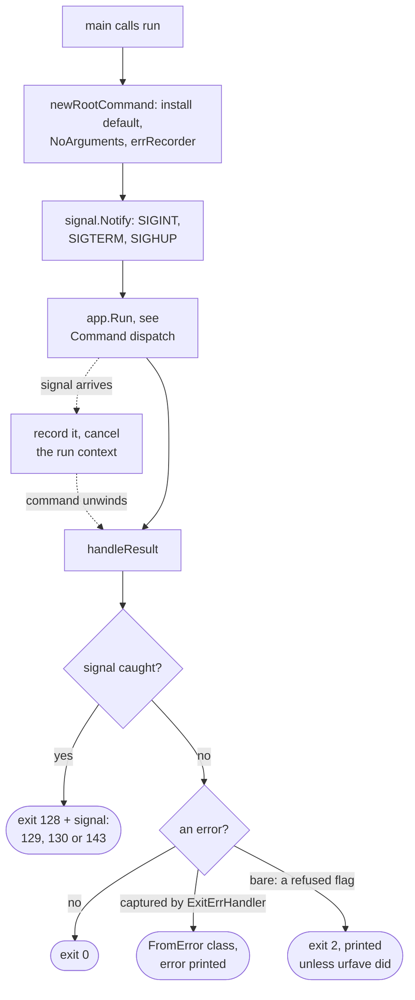
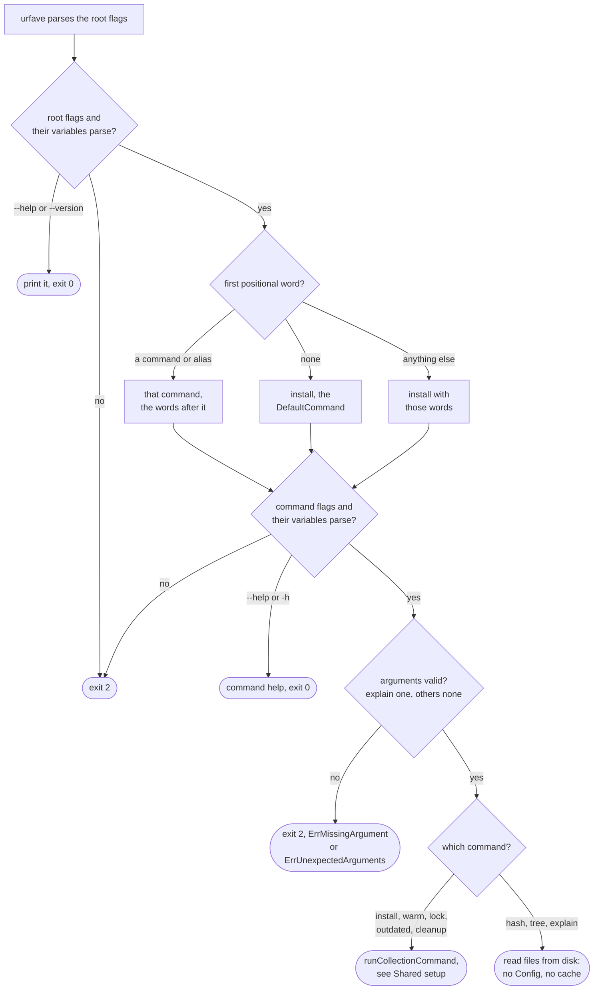
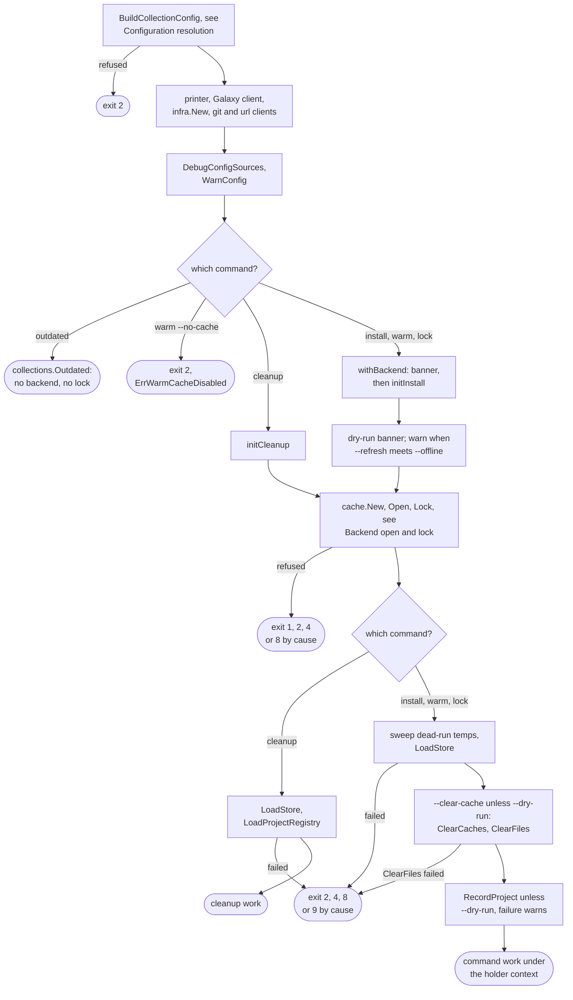
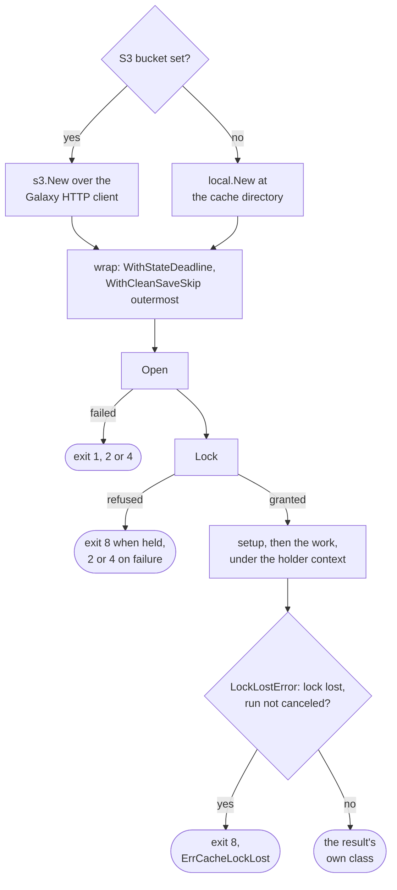

# Command flows

These pages draw each command's control flow and the exit code at every place
it can stop. Option meanings are on the [CLI reference](../reference/cli.md), code
meanings on [Exit codes](../reference/exit-codes.md).

## How to read the diagrams

A rectangle is a step, a diamond a decision with its answers on the arrows,
and a rounded node an end: an exit code, or a hand-over to another diagram. An
exit marked "by cause" takes the class of the error that ended the run, in the
order of [Exit code classes](http-output-exit-codes.md#exit-code-classes); the
page's Exits table resolves it.

Two outcomes hold for every command and are not drawn again. A caught SIGHUP,
SIGINT or SIGTERM exits 129, 130 or 143 and outranks any other exit. Once the
cache lock is held, losing it mid-run turns any result into exit 8.

## Commands

| Command | Page | Does |
| --- | --- | --- |
| `install` | [install flow](flow-install.md) | Resolves, or reads the lockfile under `--frozen`, then installs collections and roles |
| `lock` | [lock flow](flow-lock.md) | Resolves and writes `galaxy.lock`, or gates on drift under `--check` |
| `warm` | [warm flow](flow-warm.md) | Fills the artifact cache and extracted store, installs nothing |
| `cleanup` | [cleanup flow](flow-cleanup.md) | Removes what no recorded project reaches |
| `outdated` | [outdated flow](flow-outdated.md) | Compares locked or installed versions with their sources, no cache |
| `hash`, `tree`, `explain` | [hash, tree and explain flows](flow-hash-tree-explain.md) | Read the lockfile and requirements file from disk |

## Process entry and exit

SIGQUIT stays uncaught, so Go's goroutine dump still works. How
`handleResult` and `errRecorder` decide is under
[Exit code classes](http-output-exit-codes.md#exit-code-classes).

## Command dispatch

`commands.NoArguments` is the root's `ArgValidator` because install is the
`DefaultCommand`: without it, a mistyped command word would run install and
the word would be dropped silently.

Help, version and argument edge cases

| Case | Decided by | Result |
| --- | --- | --- |
| `--help` parsed before a bad root flag | urfave | root help, exit 0 |
| `-h <word>` | urfave's help lookup | that command's help, exit 0; `No help topic`, exit 2 |
| `--version` after a command word | urfave: an undefined flag | exit 2 |
| `-v` after a command word | `UseShortOptionHandling` finds the root flag | ignored, the command runs |
| `explain` with no name or two | `explainArguments` | exit 2 |

## Requirements file discovery

`config.RequirementsPath` implements
[Which file is read](../guides/requirements.md#which-file-is-read) and never fails.

| Caller | Commands | Its warning |
| --- | --- | --- |
| `newConfigFromCLI`, first step of `BuildCollectionConfig` | install, warm, lock, outdated, cleanup | queued first on `Config.Warnings`, printed by `WarnConfig` |
| the command's own action | hash, tree, explain | `progress.Warnf`, before any output |

- The picked path stays relative and is only a name: a missing file fails
  where the command reads it, exit 2.
- `requirements.Load` picks the parser by `projectfile.IsTOMLPath`, the
  extension alone.
- A `.toml` path also feeds `projectfile.LoadSettings`: in
  `BuildCollectionConfig`, and in `lockfilePath` unless `--lock-file` is set.
  One that does not load exits 2.
- cleanup mounts the flag only so a `galaxy.toml` can name its cache; roots
  come from each recorded project.

## Shared setup

`runCollectionCommand` builds everything before the command's own work.
`--offline` swaps the Galaxy client for `fetch.NewOffline` and makes the url
client refuse every request; the extracted store is nil under `--no-cache`.

### Configuration resolution

`BuildCollectionConfig` refuses in this order, each refusal exit 2, so a
configuration broken in several places always reports the same one first.
Construction and precedence are on [Configuration loading](config-loading.md)
and [Where a setting comes from](../reference/configuration.md#where-a-setting-comes-from).

| Order | Step | Refuses |
| ---: | --- | --- |
| 1 | `loadProjectSettings` | a `galaxy.toml` that does not decode, breaks the schema or names an unset `${VAR}` |
| 2 | `applyTimeout` | `--timeout` not a positive integer or Go duration |
| 3 | `loadAnsibleConfigFromCLI` | a missing `--ansible-config`; any ansible.cfg that cannot be read to the end |
| 4 | `resolveServers` | a malformed server, `ErrAmbiguousGalaxyToken`, `ErrInsecureTokenTransport`, a refused token pairing |
| 5 | `loadGitCredentials`, `loadURLCredentials` | a malformed `GO_GALAXY_GIT_*` or `GO_GALAXY_URL_*` binding |
| 6 | `loadS3CacheConfig` | a bucket without both keys, `ErrS3EmptyCreds` |
| 7 | `applySignatureConfig` | a refused keyring, count, status code or `ANSIBLE_GALAXY_DISABLE_GPG_VERIFY` |
| 8 | `applyAnsibleTimeout` | a bad `[galaxy] server_timeout`, read when no `--timeout` source is set |
| 9 | `checkS3CacheOffline` | an S3 bucket beside `--offline`, `ErrS3CacheOffline` |

### Backend open and lock

Every failure after `Open` unwinds through `unwindBackend`: release, then
Close. On the work path the deferred cleanup removes unclaimed `--no-cache`
builds, closes, then releases, a release failure only printed. Only the S3
lock can be lost mid-run ([Cache and storage](cache.md)).

### Exits

| Exit | Decided in | Cause |
| --- | --- | --- |
| 1 | S3 `newClient`, in `Open` | an endpoint `url.Parse` rejects |
| 2 | `BuildCollectionConfig`, `runWarm` | a refused setting; `warm --no-cache` |
| 2 | `Open`, `Lock`, `LoadStore`, `ClearFiles` | `ErrCacheBackendUnusable`; a newer snapshot schema |
| 4 | the same, and every state operation | `ErrCacheBackendUnavailable`, `ErrStateObjectDeadline` |
| 8 | `Lock`, the Bolt open | another holder, the S3 wait ceiling |
| 9 | `LoadStore`, `LoadProjectRegistry` | a corrupt or oversized snapshot, registry or state object |

The local backend's `classifyCacheFailure` maps a permission error to unusable
and anything else to unavailable, so both backends exit alike.

## Which command mounts which flags

| Flags | install, warm | lock | outdated | cleanup | hash, tree, explain |
| --- | :---: | :---: | :---: | :---: | :---: |
| Root: `--verbose`, `-q`, `--dry-run`, `--cache-dir` | yes | yes | yes | yes | accepted, unread |
| `-r` (`--requirements-file`, `--role-file`) | yes | yes | yes | yes | yes |
| `--lock-file` | yes | yes | yes | - | yes |
| Paths, servers, pools, cache behavior, `--offline`, `--metrics-file` | yes | yes | yes | - | - |
| `--frozen` | yes | - | yes | - | - |
| `--check` | - | yes | - | - | - |
| Signature flags | yes | - | - | - | - |
| `--s3-*` | yes | yes | yes | yes | - |

A flag a command does not mount is undefined after its command word (exit 2).
`BuildCollectionConfig` reads it as its zero value and ignores its variable,
so a command must mount every flag whose `Config` field it reads.
