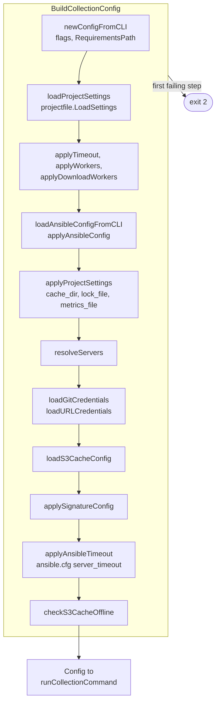
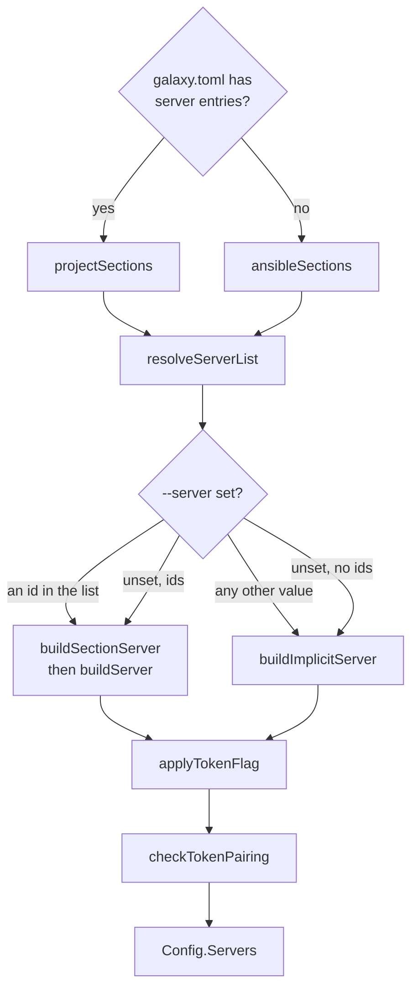

# Configuration loading

`config.BuildCollectionConfig` turns flags, the environment, a galaxy.toml
`[tool.go-galaxy]` table and ansible.cfg into one `*Config` per run. Which
source wins for a key is behavior, on
[Configuration](../configuration.md#where-a-setting-comes-from); this page is
how the code gets there.

## Order of construction

`newConfigWithProject` loads galaxy.toml before `--timeout` because every later
layer may draw on it, so a broken file is the first error a run reports. The order fixes which error
a configuration broken in several places reports: a new check goes after the
existing ones, so theirs keep precedence.

Nothing here opens the network, a cache backend or a printer, so a warning is
queued for whoever prints later:

| Queue | Printed by | When |
| --- | --- | --- |
| `Config.Warnings` | `Infra.WarnConfig` | every `runCollectionCommand` command, before its work |
| `Config.RoleWarnings` (`roles_path`) | `Infra.WarnRoleConfig` | only once a `roles:` block is read |
| `AnsibleSignatureKeysWarning` | `newVerifyContext` | `install` and `warm` only |
| the `RequirementsPath` return value | `progress.Warnf` | `hash`, `tree` and `explain`, which build no `Config` |

## Where each source is read

| Source | Read by | Rule in the code |
| --- | --- | --- |
| Flags and their variables | urfave, from `cliflags` declarations | `c.IsSet` counts an exported-empty variable as set |
| Requirements path | `RequirementsPath` | a set flag verbatim with no `Stat`, else [discovery](../requirements.md#which-file-is-read) |
| `[tool.go-galaxy]` | `loadProjectSettings`, `projectfile.LoadSettings` | an `IsTOMLPath` path only; expanded once, passed by value, kept nowhere |
| ansible.cfg | `loadAnsibleConfigFromCLI`, `applyAnsibleConfig` | a file `--ansible-config` names must exist; a [discovered](../configuration.md#where-it-is-found) one is optional |
| Galaxy servers | `resolveServers` | see [Servers](#servers) |
| `GO_GALAXY_GIT_*`, `GO_GALAXY_URL_*` | `loadGitCredentials`, `loadURLCredentials` | environment only; no file binds a git or url credential |
| S3 settings | `loadS3CacheConfig` | a bucket without both keys is `ErrS3EmptyCreds` |
| Signature settings | `applySignatureConfig` | flags and variables only, since a file's author could relax verification; validated here, not in a worker |

`BuildCollectionConfig` reads the union of every flag the
`runCollectionCommand` commands register, and urfave returns a zero value for
one a command does not. A command must register every flag whose `Config`
field it reads; each zero value is defused where it is consumed.

| Check | Looks at | Gates |
| --- | --- | --- |
| `flagMounted` | the command's own flags | a galaxy.toml `workers`, `download_workers`, `lock_file`, `metrics_file` or S3 key; requirements discovery |
| `registersFlag` | the command and its ancestors | reading `ANSIBLE_GALAXY_DISABLE_GPG_VERIFY` |

## galaxy.toml settings

| Function | Does | Why it matters |
| --- | --- | --- |
| `projectfile.Decode` | checks the closed schema, expands nothing | `requirements.ParseTOML` calls it, so reading `[project]` never needs the environment |
| `projectfile.LoadSettings` | decodes, [expands](../configuration.md#var-expansion) `${VAR}`, re-checks server ids, joins relative paths under the file's directory | an absent file is zero `Settings`; every unset name lands in one `ErrProjectFileEnvUnset` |
| `commands.lockfilePath` | calls `LoadSettings` for `lock_file` | `hash` exits 2 on a galaxy.toml that does not load |

## Servers

`projectSections` shapes each `[[tool.go-galaxy.servers]]` entry into the map
an ansible.cfg `[galaxy_server.<id>]` section yields, so one `buildServer` and
its `ANSIBLE_GALAXY_SERVER_<ID>_*` overrides (`envOrIni`) serve both files. The
files are never merged; the id order is on
[Which servers a run uses](../servers-and-auth.md#which-servers-a-run-uses).
The list path also runs `validateServerIDs` and `checkOriginConflicts`.

`buildServer` records provenance on unexported `Server` fields (`urlFromFile`,
`tokenFromFile`, `insecureFromFile`); `buildSectionServer` adds `sourceFile`
and treats a `${VAR}` token (`TokenExpanded`) as the operator's.
`checkTokenPairing` must run after `applyTokenFlag`, which installs `--token`,
and `tokenPairingOffense` is the only code that decides on provenance. The rule
is on [`--token`](../servers-and-auth.md#--token), the threat on
[Security boundaries](boundaries.md#credentials-and-the-token-pairing-rule).

## Secrets

| Mechanism | Where |
| --- | --- |
| `Secret` keeps its value unexported | `String`, `GoString`, `MarshalJSON`, `MarshalYAML` render `[REDACTED]` or `[unset]` |
| plaintext leaves only through `Reveal` | `serverAuths`, `gitCredentials`, `urlBindings` in `commands`; the S3 client's signing key and session-token header |
| galaxy.toml secrets wrapped on read | `projectSettings`, an alias of `projectfile.Settings`, never reaches `Config` |
| the S3 access key stays a string | it travels in cleartext in every signed request |
| `--verbose` | `DebugConfigSources` shows a Galaxy token as a boolean, other secrets not at all |

A new `Reveal` call site is a review point.

## Verbose source lines

`Config.ProjectSettingsUsed` lists the `[tool.go-galaxy]` keys whose value the
run took, in apply order, for the one `Galaxy.toml <file> supplied: <keys>` line
of `Infra.DebugConfigSources`. It skips a key a flag outranked or the command
does not mount, an out-of-range `workers` or `download_workers`, S3 keys
without a bucket and unused `servers`.

`applyProjectSettings` withdraws the `AnsibleCacheDirUsed` credit when
galaxy.toml's `cache_dir` wins, so the ansible.cfg line never credits a file
that lost.
