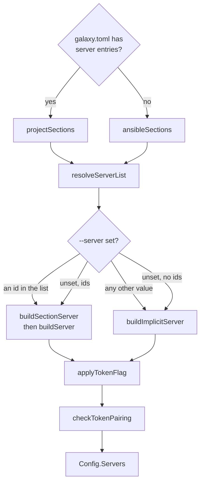

# Configuration loading

`config.BuildCollectionConfig` turns flags, the environment, a galaxy.toml
`[tool.go-galaxy]` table and ansible.cfg into one `*Config` per run. Which
source wins for a key is described under
[Where a setting comes from](../reference/configuration.md#where-a-setting-comes-from).
This page shows how the code gets there.

## Order of construction

`BuildCollectionConfig` runs these steps in order. The first step that refuses
ends the run with exit 2, and the finished `Config` goes to
`runCollectionCommand`.

| Order | Step | Refuses |
| ---: | --- | --- |
| 1 | `newConfigFromCLI`: flags, `RequirementsPath` | a set requirements path not ending in `.yml`, `.yaml` or `.toml`, `ErrRequirementsFileName` |
| 2 | `loadProjectSettings`, through `projectfile.LoadSettings` | a `galaxy.toml` that does not decode, breaks the schema or names an unset `${VAR}` |
| 3 | `applyTimeout` | `--timeout` not a positive integer or Go duration |
| 4 | `applyWorkers`, `applyDownloadWorkers` | - |
| 5 | `loadAnsibleConfigFromCLI`, `applyAnsibleConfig` | a missing `--ansible-config`; any ansible.cfg that cannot be read to the end |
| 6 | `applyProjectSettings`: `cache_dir`, `lock_file`, `metrics_file` | - |
| 7 | `resolveServers` | a malformed server, `ErrAmbiguousGalaxyToken`, `ErrInsecureTokenTransport`, a refused token pairing |
| 8 | `loadGitCredentials`, `loadURLCredentials` | a malformed `GO_GALAXY_GIT_*` or `GO_GALAXY_URL_*` binding |
| 9 | `loadS3CacheConfig` | a bucket without both keys, `ErrS3EmptyCreds` |
| 10 | `applySignatureConfig` | a refused keyring, count, status code or `ANSIBLE_GALAXY_DISABLE_GPG_VERIFY` |
| 11 | `applyAnsibleTimeout` | a bad `[galaxy] server_timeout`, read when no `--timeout` source is set |
| 12 | `checkS3CacheOffline` | an S3 bucket beside `--offline`, `ErrS3CacheOffline` |

`newConfigWithProject` runs steps 1 to 4. It loads galaxy.toml before
`--timeout` because every later layer may draw on it, so a broken file is the
first error a run reports. The order fixes which error a configuration broken
in several places reports. A new check goes after the existing ones, so theirs
keep precedence. The requirements name is the exception: every later step
reads the file it names.

Nothing here opens the network, a cache backend or a printer, so a warning is
queued for whoever prints later:

| Held in | Printed by | When |
| --- | --- | --- |
| `Config.Warnings` | `Infra.WarnConfig` | every `runCollectionCommand` command, before its work |
| `Config.RoleWarnings` (`roles_path`) | `Infra.WarnRoleConfig` | only once a `roles:` block is read |
| `Config.AnsibleSignatureKeys`, rendered by `AnsibleSignatureKeysWarning` | `newVerifyContext` | `install` and `warm` only |
| the `RequirementsPath` return value | `progress.Warnf` | `hash`, `tree` and `explain`, which build no `Config` |
| `requirements.Migration.Notices` | `progress.Warnf`, one line each, prefixed with the `-r` path | `migrate`, which builds no `Config` |

## Where each source is read

| Source | Read by | Rule in the code |
| --- | --- | --- |
| Flags and their variables | urfave, from `cliflags` declarations | `c.IsSet` counts an exported-empty variable as set. The `ANSIBLE_*` spelling of `--download-path`, `--roles-path` and `--cache-dir` is an `ansiblePathEnvSource`, last in its chain, which expands and cleans its value through `helpers.ExpandAnsiblePath`, each `:` entry apart for the two list variables; urfave reports no source to config, so the expansion sits in the source that only this spelling reaches |
| Requirements path | `RequirementsPath` | a set flag held to its extension with no `Stat`, else discovery ([Which file is read](../guides/requirements.md#which-file-is-read)) |
| `[tool.go-galaxy]` | `loadProjectSettings`, `projectfile.LoadSettings` | an `IsTOMLPath` path only; expanded once |
| ansible.cfg | `loadAnsibleConfigFromCLI`, `applyAnsibleConfig` | a file `--ansible-config` names must exist and is cleaned as text, so the file read and `ansibleConfigDir` agree; a discovered one ([Where it is found](../reference/configuration.md#where-it-is-found)) is optional. Discovery expands `$ANSIBLE_CONFIG`, skips an empty result, and resolves the rest through `resolveAnsibleConfigEnv`. A path key goes through `resolveAnsibleConfigPath` under `ansibleConfigDir`, only when `pickConfigValue` took the file's value ([ansible.cfg paths](../reference/configuration.md#ansiblecfg-paths)). Both make a relative path absolute with `helpers.PhysicalAbs`, against the working directory with its symlinks resolved, since `os.Getwd` may return a symlinked `$PWD` where Python's `os.getcwd()` does not. The roles and collections overlap warning compares `canonicalPath` forms, so a spelling through a symlink matches before the directory exists |
| Galaxy servers | `resolveServers` | see [Servers](#servers) |
| `GO_GALAXY_GIT_*`, `GO_GALAXY_URL_*` | `loadGitCredentials`, `loadURLCredentials` | environment only; no file binds a git or url credential |
| S3 settings | `loadS3CacheConfig` | a bucket without both keys is `ErrS3EmptyCreds` |
| Signature settings | `applySignatureConfig` | flags and variables only, since a file's author could relax verification; validated here, not in a worker |

### Flags a command does not mount

`BuildCollectionConfig` reads every flag that any `runCollectionCommand`
command mounts. For a flag the command does not mount, urfave returns a zero
value and never reads its variable, so a command must mount every flag whose
`Config` field it reads. Each zero value is defused where it is consumed.
`IsSet` cannot tell an unmounted flag from an unset one, so two checks do:

| Check | Looks at | Gates |
| --- | --- | --- |
| `flagMounted` | the command's own flags | a galaxy.toml value that stands in for a flag (`workers`, `download_workers`, `lock_file`, `metrics_file`, an S3 key), and requirements discovery |
| `registersFlag` | the command and its ancestors, as urfave's lookup walks them | a variable read outside urfave: `ANSIBLE_GALAXY_DISABLE_GPG_VERIFY` |

## galaxy.toml settings

| Function | Does | Why it matters |
| --- | --- | --- |
| `projectfile.Decode` | checks the closed schema, expands nothing | `requirements.ParseTOML` calls it, so reading `[project]` never needs the environment |
| `projectfile.LoadSettings` | decodes, expands `${VAR}` ([`${VAR}` expansion](../reference/configuration.md#var-expansion)), re-checks server ids, joins relative paths under the file's directory | an absent file is zero `Settings`; every unset name lands in one `ErrProjectFileEnvUnset` |
| `commands.lockfilePath` | calls `LoadSettings` for `lock_file` unless `--lock-file` is set | `hash`, `tree` and `explain` then exit 2 on a galaxy.toml that does not load ([Requirements file discovery](commands.md#requirements-file-discovery)) |

## Servers

`projectSections` shapes each `[[tool.go-galaxy.servers]]` entry into the map
an ansible.cfg `[galaxy_server.<id>]` section yields, so one `buildServer` and
its `ANSIBLE_GALAXY_SERVER_<ID>_*` overrides (`envOrIni`) serve both files. The
files are never merged. The id order is on
[Which servers a run uses](../guides/servers-and-auth.md#which-servers-a-run-uses).
The list path also runs `validateServerIDs` and `checkOriginConflicts`.

`buildServer` records provenance on unexported `Server` fields (`urlFromFile`,
`tokenFromFile`, `insecureFromFile`), and `buildSectionServer` adds
`sourceFile`. `buildImplicitServer` builds the anonymous server and records
`urlFromFile` alone. That field is true only when ansible.cfg's
`[galaxy] server` supplied the URL, and `resolveServerCandidates` then sets
`sourceFile`. A `${VAR}` token arrives already expanded, so it counts as the
file's own. `checkTokenPairing` must run after `applyTokenFlag`, which installs
`--token` or `GO_GALAXY_TOKEN` and clears `tokenFromFile`.
`tokenPairingOffense` is the only code that decides on provenance. The rule is
on [Where a token may go](../guides/servers-and-auth.md#where-a-token-may-go).
The threat it answers is on
[Security boundaries](boundaries.md#credentials-and-the-token-pairing-rule).

## Secrets

| Mechanism | Where |
| --- | --- |
| `Secret` keeps its value unexported | `String`, `GoString`, `MarshalJSON`, `MarshalYAML` render `[REDACTED]` or `[unset]` |
| plaintext leaves only through `Reveal` | `serverAuths`, `gitCredentials`, `urlBindings` in `commands`; the S3 client's signing key and session-token header |
| galaxy.toml secrets are plain strings in `projectSettings`, an alias of `projectfile.Settings` | `loadS3CacheConfig` and `buildServer` wrap them; `projectSettings` is passed by value and never reaches `Config` |
| the S3 access key stays a string | it travels in cleartext in every signed request |
| `--verbose` | `DebugConfigSources` shows a Galaxy token as a boolean, other secrets not at all |

A new `Reveal` call site is a review point.

## Verbose source lines

`Config.ProjectSettingsUsed` lists the `[tool.go-galaxy]` keys whose value the
run took, in apply order, for the one `Galaxy.toml <file> supplied: <keys>` line
of `Infra.DebugConfigSources`. It skips a key a flag outranked or the command
does not mount, an out-of-range `workers` or `download_workers`, S3 keys
without a bucket and unused `servers`.

`applyProjectSettings` withdraws the `AnsibleCacheDirUsed` credit when
galaxy.toml's `cache_dir` wins, so the ansible.cfg line never credits a file
that lost.

`resolveServers` moves the server credit the same way. `applyAnsibleConfig`
credits `[galaxy] server` or `ANSIBLE_GALAXY_SERVER` through
`AnsibleServerUsed` and `AnsibleServerEnvUsed` before any list is read. When a
list decides and `--server` is unset, `creditServerList` clears both, whose
`galaxy.server=` line would name the list's head. It sets
`AnsibleServerListUsed`, with `AnsibleServerListEnvUsed` when
`resolveServerList` read `ANSIBLE_GALAXY_SERVER_LIST`, for one
`galaxy.server_list=<ids>` line. A `galaxy.toml` list keeps its `servers`
credit in `ProjectSettingsUsed` alone, and `--server` gets no source line.
