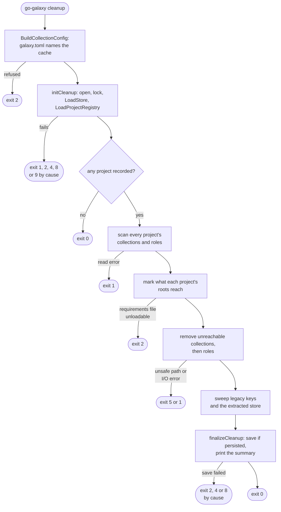
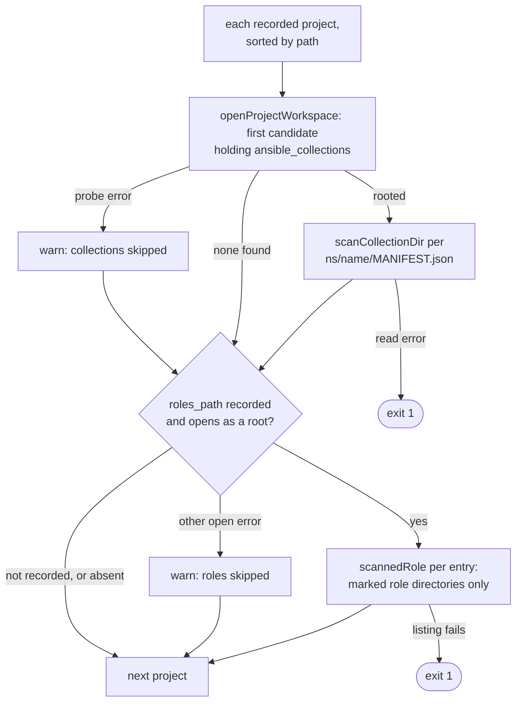
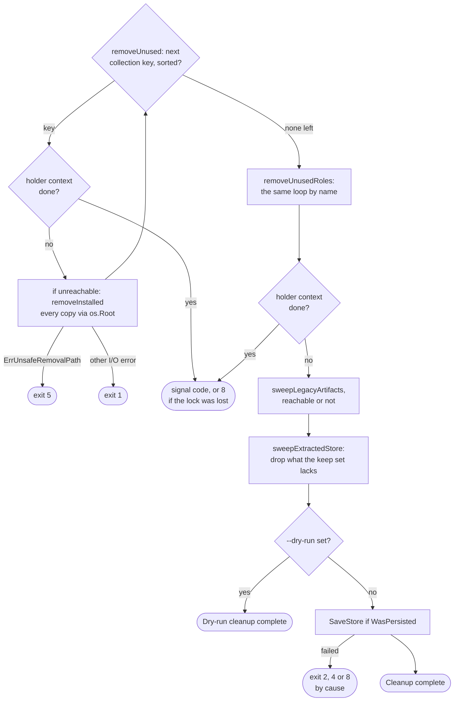

# cleanup flow

`cleanup` computes, across every project in the cache registry, what some
project's requirements still reach, then removes the rest from disk and from
the cache. Options: [`cleanup` options](../reference/cli.md#cleanup-options); code
meanings: [Exit codes](../reference/exit-codes.md).

## Overview

No `--offline` is mounted, so `checkS3CacheOffline` never fires.
`initCleanup` is the backend half of [Shared setup](commands.md#shared-setup)
without the dry-run banner, temp sweep, `--clear-cache` or `RecordProject`,
plus `LoadProjectRegistry`.

## Scan: every recorded project's installs

Every project is scanned before any root resolves, so a root keeps a copy
any project installed. A missing path never fails the run; only an I/O error
while walking or listing stops it (exit 1).

| Item | Indexed when | Otherwise |
| --- | --- | --- |
| Collections path | first of recorded `collections_path`, project `.collections`, `collections` holding `ansible_collections` | probe error, such as an escaping symlink: warn, skip |
| Collection | `ns/name/MANIFEST.json` is a regular file, parses, passes `IsPathElement` | absent or versionless: silent; non-regular, corrupt, unsafe: warn, skip |
| Role | `IsRoleInstallName` directory holding a regular `.extract-done.<sha256>` file | never touched |
| Role deps | the snapshot's installed-role record for that install path | `meta/main.yml` and `meta/requirements.yml`; artifact kept |

Namespace and name come from the walked directories, never the manifest, so
no `MANIFEST.json` can retarget a removal.

## Reachability

| Root | Keeps |
| --- | --- |
| Galaxy collection | versions meeting its constraint; all when empty or unparseable (`selectInstalled`) |
| git collection | what its git pin records; no pin: installs from that repository at its subdir or a child (`gitRootKeys`) |
| url collection | its url pin's key; no pin: every install from that URL (`urlRootKeys`) |
| role | its install name |

`markReachable` and `markReachableRoles` then follow dependencies
transitively. Every unsure case keeps more, the safe direction for a sweep.

`projectRequirementRoots` reloads each recorded file by extension, refusing a
non-regular one first, since a fifo would block under the lock. A missing file
warns and adds no roots; a refused `roles:` list keeps that roles path's roles.
Any other failure exits 2 before anything is removed.

## Removal, sweeps and save

- An artifact is deleted only when the snapshot record names its source, since
  the key is server-scoped.
- The legacy sweep skips any key shaped like a scoped one
  (`IsScopedArtifactKey`).
- The keep set is every kept install's sha plus entries warmed within 30
  days; no cache dir or recorded content skips the sweep.
- A failed extracted sweep only prints.
- A never-persisted snapshot is never saved, so no empty one is fabricated.

Removal bounds are in
[the collections tree and the cache directory](boundaries.md#the-collections-tree-and-the-cache-directory).

## Exits

| Exit | Decided in | Cause |
| --- | --- | --- |
| 2 | `BuildCollectionConfig` | `galaxy.toml`, S3 keys (`ErrS3EmptyCreds`) or `ansible.cfg` refused |
| 1, 2, 4, 8, 9 | `initCleanup` | open, lock, snapshot or registry load ([Shared setup](commands.md#shared-setup)) |
| 2 | `projectRequirementRoots` | `ErrProjectRequirementsUnreadable` |
| 1 | scan | I/O error walking a workspace or listing a roles path |
| 5 | `removeInstalled`, `removeRole` | `ErrUnsafeRemovalPath` |
| 1 | `removeInstalled`, `removeRole` | any other removal error |
| 2, 4, 8 | `finalizeCleanup` | `SaveStore` failed |

## Flags that change the flow

| Flag | Diagram | Effect |
| --- | --- | --- |
| `-r` | Overview | the `galaxy.toml` whose settings name the cache; never roots |
| `--dry-run` | Removal, sweeps and save | prints `Would remove` and `Would sweep` lines; nothing removed or saved |
| `--cache-dir` | Overview; Removal, sweeps and save | local backend and the swept extracted store; empty: exit 2 locally, no sweep on S3 |
| `--s3-bucket` | Overview | S3 backend, so a lock lost mid-run is possible |

Accepted without changing the flow: `--verbose`, `--quiet` and the other
`--s3-*` flags.
