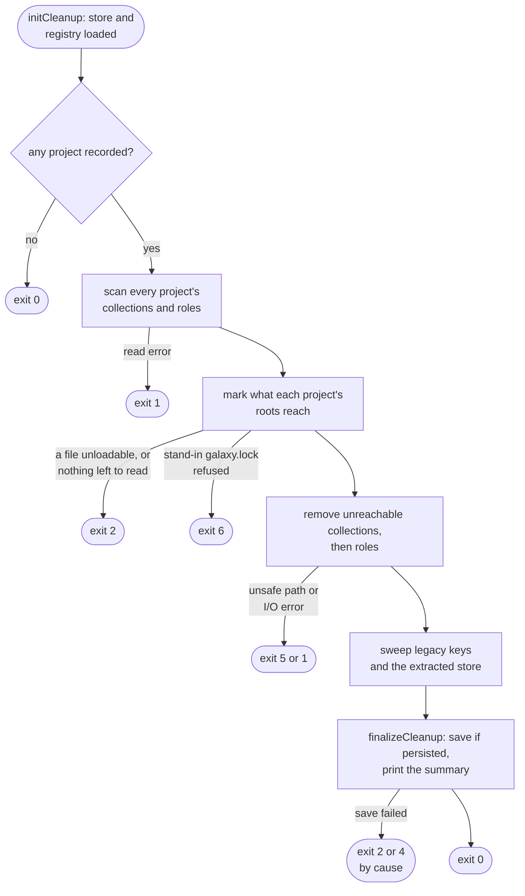
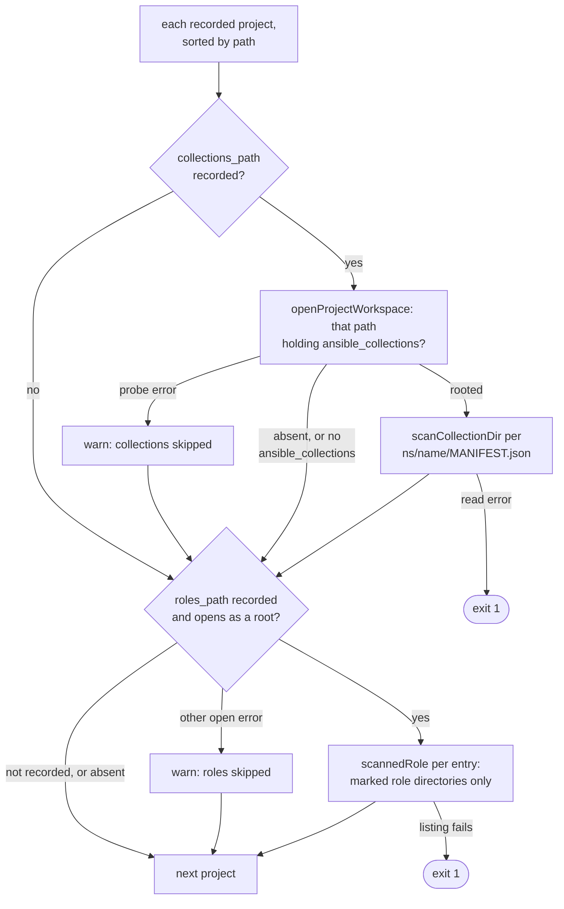
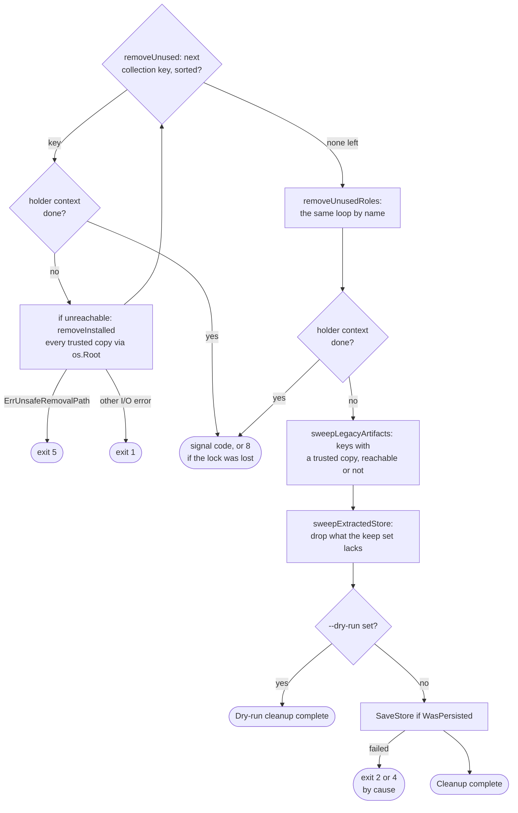

# cleanup flow

`cleanup` computes, across every project in the cache registry, what some
project's requirements still reach, then removes the rest from disk and from
the cache. Options: [`cleanup`](../reference/cli.md#cleanup); code
meanings: [Exit codes](../reference/exit-codes.md).

## Overview

No `--offline` is mounted, so `checkS3CacheOffline` never fires.
`initCleanup` is the backend half of [Shared setup](commands.md#shared-setup)
without the dry-run banner, temp sweep or `--clear-cache`, plus
`LoadProjectRegistry`. Neither records a project; cleanup never does.

## Scan: every recorded project's installs

Every project is scanned before any root resolves, so a root keeps a copy
any project installed. A missing path never fails the run; only an I/O error
while walking or listing stops it (exit 1). What each warning, skip and stop
means to an operator: [What cleanup keeps](../guides/caching.md#what-cleanup-keeps).

| Item | Indexed when | Otherwise |
| --- | --- | --- |
| Collections path | the recorded `collections_path` holds `ansible_collections`; no other tree, the project's own `.collections` or `collections` included | none recorded or absent: silent; probe error, such as an escaping symlink: warn, skip |
| Collection | `ns/name/MANIFEST.json` is a regular file, parses, passes `IsPathElement` | absent or versionless: silent; non-regular, corrupt, unsafe: warn, skip |
| Collection removable | trusted (`trustedCopy`): a regular `.extract-done.<sha256>` file, any sha, in its `<ns>.<name>-<version>.info` or in the collection directory, where older releases wrote it, whose `go-galaxy-extract-1` tally equals the tree as install counts it now (`extractmarker.Check`; what a tally misses: [The extract-done marker](install-pipeline.md#the-extract-done-marker)) | indexed for reachability only: never removed, and no artifact, snapshot record or legacy key purged on its account. So another tool's install stays, as do a copy since changed by a file added, removed or resized and a marker with no tally, as the first releases wrote. What its manifest depends on is marked reachable (`markKeptCopyDependencies`), so no removal breaks a kept copy |
| Role | `IsRoleInstallName` directory holding a regular `.extract-done.<sha256>` file | never touched |
| Role deps | the snapshot's installed-role record for that install path | `meta/main.yml` and `meta/requirements.yml`; artifact kept |

Each recorded path the scan leaves unwalked, absent, without
`ansible_collections` or skipped, is noted for the extracted sweep
(`recordedUnseen`).

Namespace and name come from the walked directories, never the manifest
([Reading an installed tree: cleanup and outdated](boundaries.md#reading-an-installed-tree-cleanup-and-outdated)).

## Reachability

| Root | Keeps |
| --- | --- |
| Galaxy collection | versions meeting its constraint; all when empty or unparseable (`selectInstalled`) |
| git collection | what its git pin records; no pin: installs from that repository at its subdir or a child (`gitRootKeys`) |
| url collection | its url pin's key; no pin: every install from that URL (`urlRootKeys`) |
| role | its install name |

`markReachable` and `markReachableRoles` then follow dependencies
transitively, `markReachable` through the manifest of every copy of a key,
since two copies of one version can list different dependencies.
`markKeptCopyDependencies` then marks what each untrusted copy's own manifest
depends on, never the copy's own key. Every unsure case keeps more, the safe
direction for a sweep.

`buildReachable` first drops a project that has left (`projectLeft`: none of
the directories its recorded files sit in exists), with one warning; it keeps
nothing, never fails the run, and its record is never pruned. For every other
project, `projectRequirementRoots` reloads every file `ProjectRecord.Files`
names, by extension, each under one policy (`loadRootsFile`), refusing a
non-regular one first, since a fifo would block under the lock. Once a
remembered file is gone, `standInRoots` reads the directory's unrecorded
`galaxy.toml` and `requirements.yml` under the same policy, and `lockedRoots`
its `galaxy.lock` through `lockfile.Load`, whose regular-file gate runs before
any open; the lock's collection keys go to `markReachable`, its role names to
`markReachableRoles`. A project with nothing loaded is gathered, and after the
loop `unanchoredProjectsError` returns `ErrProjectRequirementsMissing` naming
them all, before any removal: roots are global, so no removal can be scoped
around an unknown one. What each case does:
[What cleanup keeps](../guides/caching.md#what-cleanup-keeps).

## Removal, sweeps and save

- An artifact is deleted only when the snapshot record names its source, since
  the key is server-scoped.
- The legacy sweep skips any key shaped like a scoped one
  ([Legacy flat-key artifacts](cache.md#legacy-flat-key-artifacts)).
- The keep set is every kept install's sha plus entries warmed within 30
  days; no cache dir or recorded content skips the sweep. A record no scan
  found stays in it only while a project that has not left has a recorded
  collections or roles path the scan left unwalked that may hold it
  (`mayHold`), so a project deleted with its trees frees theirs.
- A failed extracted sweep only prints.
- A never-persisted snapshot is never saved, so no empty one is fabricated.

What bounds a removal from a project:
[Reading an installed tree: cleanup and outdated](boundaries.md#reading-an-installed-tree-cleanup-and-outdated).
What bounds the cache sweeps:
[The collections tree and the cache directory](boundaries.md#the-collections-tree-and-the-cache-directory).

## Exits

| Exit | Decided in | Cause |
| --- | --- | --- |
| 1, 2, 4, 8, 9 | [Shared setup](commands.md#shared-setup) | configuration, backend open, lock, snapshot or registry load |
| 1 | scan | I/O error walking a workspace or listing a roles path |
| 2 | `loadRootsFile` | `ErrProjectRequirementsUnreadable` for a remembered or stand-in file, with a hint naming the file, the project and the registry's `Location` |
| 2 | `unanchoredProjectsError` | `ErrProjectRequirementsMissing`, naming every project left with nothing to read and the registry's `Location` |
| 6 | `lockedRoots` | a stand-in `galaxy.lock` that `lockfile.Load` refuses, not a regular file included (`ErrLockfileInvalid`) |
| 5 | `removeInstalled`, `removeRole` | `ErrUnsafeRemovalPath` |
| 1 | `removeInstalled`, `removeRole` | any other removal error |
| 2, 4 | `finalizeCleanup` | `SaveStore` failed |

## Flags that change the flow

| Flag | Diagram | Effect |
| --- | --- | --- |
| `-r` | [Shared setup](commands.md#shared-setup) | the `galaxy.toml` whose settings name the cache; never roots |
| `--dry-run` | Removal, sweeps and save | prints `Would remove` and `Would sweep` lines; nothing removed or saved |
| `--cache-dir` | [Shared setup](commands.md#shared-setup); Removal, sweeps and save | local backend and the swept extracted store; empty: exit 2 locally, no sweep on S3 |
| `--s3-bucket` | [Shared setup](commands.md#shared-setup) | S3 backend, so a lock lost mid-run is possible |

Accepted without changing the flow: `--verbose`, `--quiet` and the other
`--s3-*` flags.
