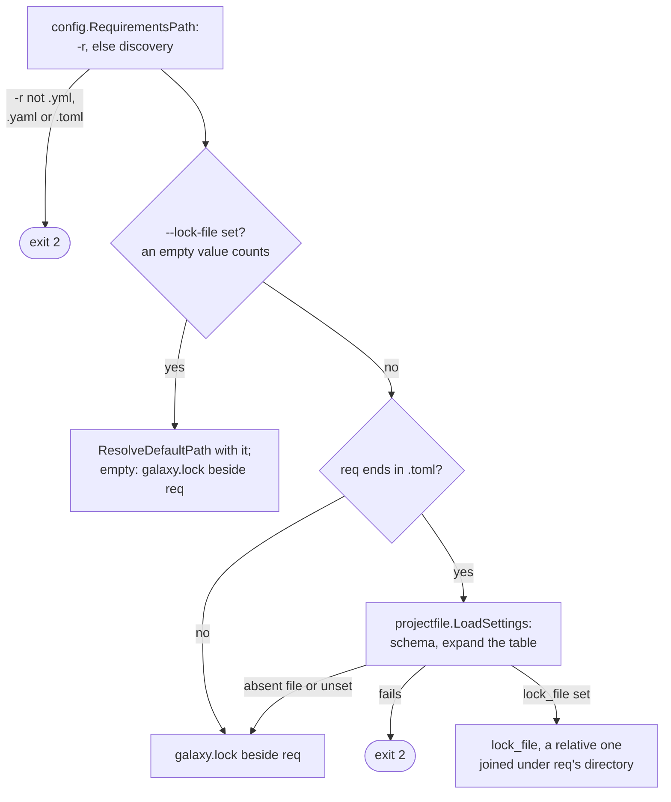
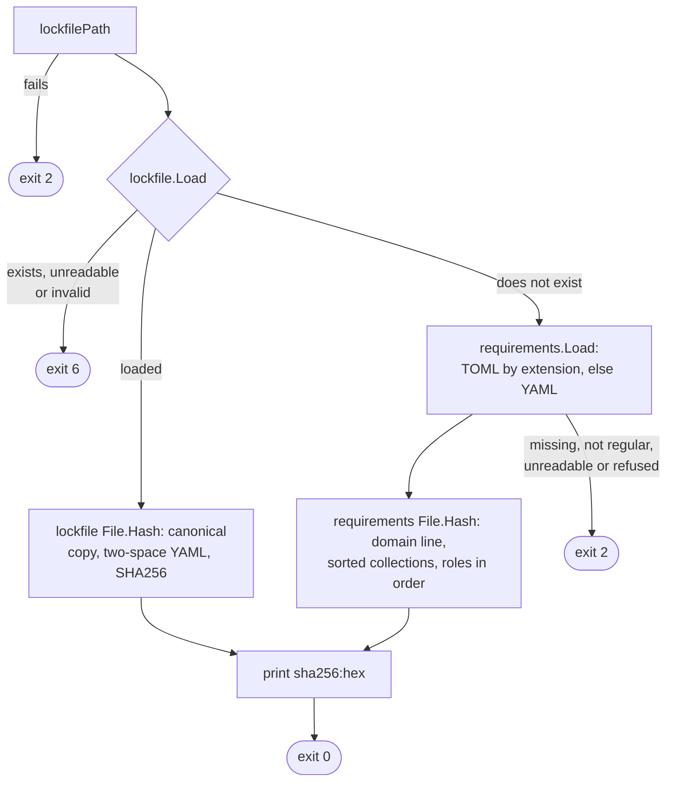
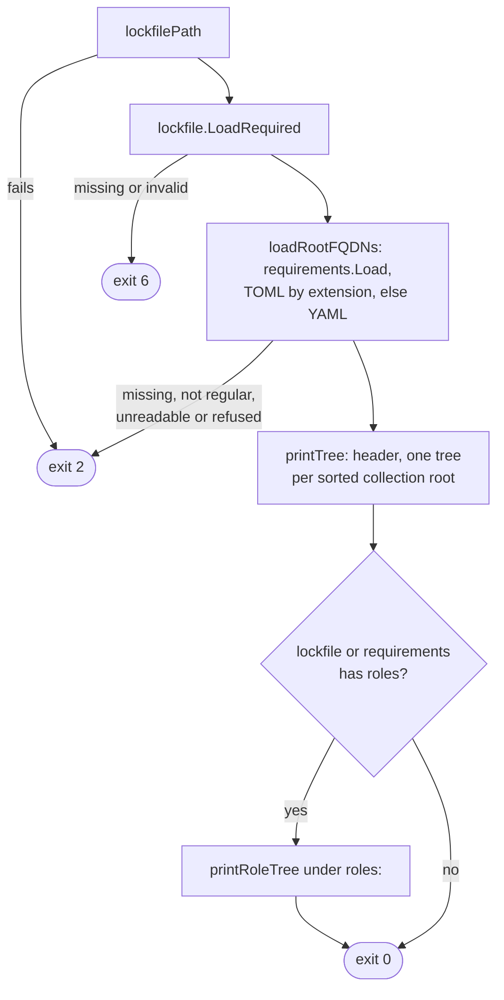
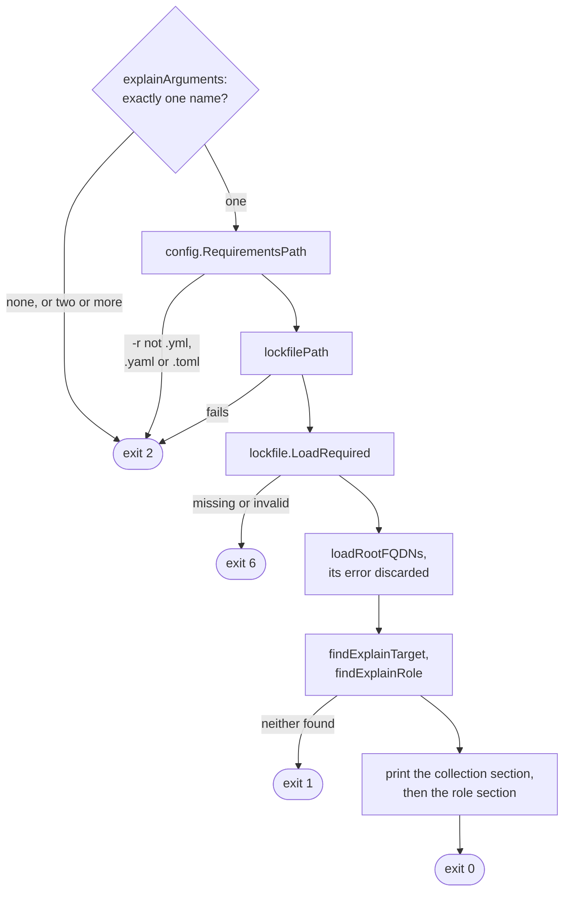

# hash, tree and explain flows

These three commands read files only: no `BuildCollectionConfig`, no
`ansible.cfg`, no cache backend, no network, no write. Options:
[`hash`, `tree` and `explain`](../reference/cli.md#hash-tree-and-explain); what they
print: [Inspect what is locked](../guides/lockfile.md#inspect-what-is-locked) and
[A cache key for CI](../guides/lockfile.md#a-cache-key-for-ci).

Flag, help and argument checks run before the action, as drawn under
[Command dispatch](commands.md#command-dispatch): a bad flag or a stray word
exits 2, `--help` exits 0. The global options change nothing; only an unparseable
`GO_GALAXY_VERBOSE`, `GO_GALAXY_QUIET` or `GO_GALAXY_DRY_RUN` exits 2.

## The lockfile path

All three call `lockfilePath` with the path `config.RequirementsPath` picked
and print its both-files warning. A `-r` or variable it refuses by name,
`ErrRequirementsFileName`, ends the run before any file is read. The whole `[tool.go-galaxy]` table is held
to its schema and expanded, so an unset `${VAR}` anywhere in it fails even
`hash`, although only `lock_file` is read.

## hash

The lockfile's `File.Hash` canonicalizes before encoding, so the key ignores
entry order and the written `schema_version` ([Lockfile format](lockfile-format.md)).
Without a lockfile, the key is `requirements.File.Hash` over the file parsed
with no default server, as `tree` parses it: a domain line no lockfile YAML
starts with, one length-prefixed record per collection, sorted, with a Galaxy
constraint through `helpers.CanonicalConstraint`, then one per role in file
order, since role order decides first-wins. No setting enters it, and a file
that does not load exits 2, under `--lock-file` too.

The action ignores its context, so a caught signal can still print the key
while the exit reports the interrupt.

Where `hash` exits:

| Exit | Decided in | Cause |
| --- | --- | --- |
| 2 | `config.RequirementsPath` | `ErrRequirementsFileName` |
| 2 | `lockfilePath` | `galaxy.toml` settings refused |
| 6 | `lockfile.Load` | lockfile exists but is unreadable or invalid |
| 2 | `requirements.Load` | fallback file missing, `ErrRequirementsNotRegular`, `ErrRequirementsUnreadable`, or a format or entry refused |
| 1 | lockfile `File.Hash` | encoder error, unreachable in practice |

## tree

The lockfile loads first, so with both files missing the exit is 6. Under
`--lock-file` a `galaxy.toml` is still decoded for roots, schema-checked but
never expanded. `loadRootFQDNs` picks the roots, shared with `explain`:

| Requirement | Root |
| --- | --- |
| Galaxy | `namespace.name` |
| git (`gitRootFQDNs`) | locked git entries from its URL at its subdir or a child, filtered by name; else name or locator |
| url (`urlRootFQDNs`) | the first locked url entry from its URL; else its `url+` locator |
| role | its install name |

`walkTree` keeps a seen set per root: a shared dependency prints in full under
each root, `(*)` marks a repeat within one, and a root or dependency the
lockfile lacks prints `(missing in lockfile)`. `gitOrigin` and `roleOrigin`
append provenance; output goes through `safeout.NewWriter`, since a lockfile
may be hand-edited.

Where `tree` exits:

| Exit | Decided in | Cause |
| --- | --- | --- |
| 2 | `config.RequirementsPath` | `ErrRequirementsFileName` |
| 2 | `lockfilePath` | `galaxy.toml` settings refused |
| 6 | `lockfile.LoadRequired` | `ErrLockfileMissing`, or invalid |
| 2 | `loadRootFQDNs` | a requirements file missing, not regular, unreadable or refused |

## explain

- `explainArguments` replaces the root's `NoArguments`, runs before any file
  is read, and names every extra word rather than answer only the first.
- A broken requirements file leaves both root sets empty, so a real root
  prints as an orphan instead of failing, unlike `tree`.
- A role matches by install or Galaxy name, the last match winning; parents
  match its install name, which is what role deps hold.
- The collection header prints `type`, `source`, `download_url`, `ref`,
  `commit`, `subdir` and `sha256` when set; the role header always prints
  `type` and `source`.
- The `(root)` line names `filepath.Base` of the requirements path.

Where `explain` exits:

| Exit | Decided in | Cause |
| --- | --- | --- |
| 2 | `explainArguments` | `ErrMissingArgument`, or `ErrUnexpectedArguments` |
| 2 | `config.RequirementsPath` | `ErrRequirementsFileName` |
| 2 | `lockfilePath` | `galaxy.toml` settings refused |
| 6 | `lockfile.LoadRequired` | lockfile missing or invalid |
| 1 | `printExplain` | `errExplainNotFound`, which wraps no sentinel |

## Flags that change the flow

| Flag | Diagram | Effect |
| --- | --- | --- |
| `-r` | The lockfile path, hash, tree, explain | the default lockfile's directory; `hash`: the file whose entries are digested without a lockfile; `tree`: the roots; `explain`: the roots and the `(root)` label |
| `--lock-file` | The lockfile path, hash, tree, explain | the lockfile read; `hash`: a path that does not exist falls back to the digest of `-r` |
