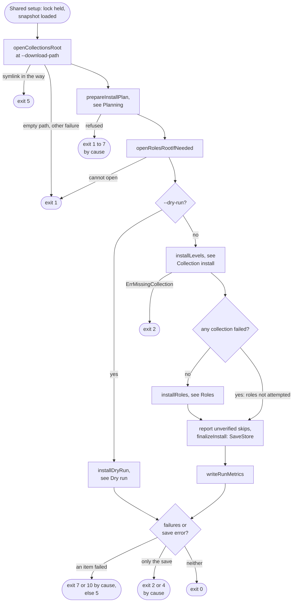
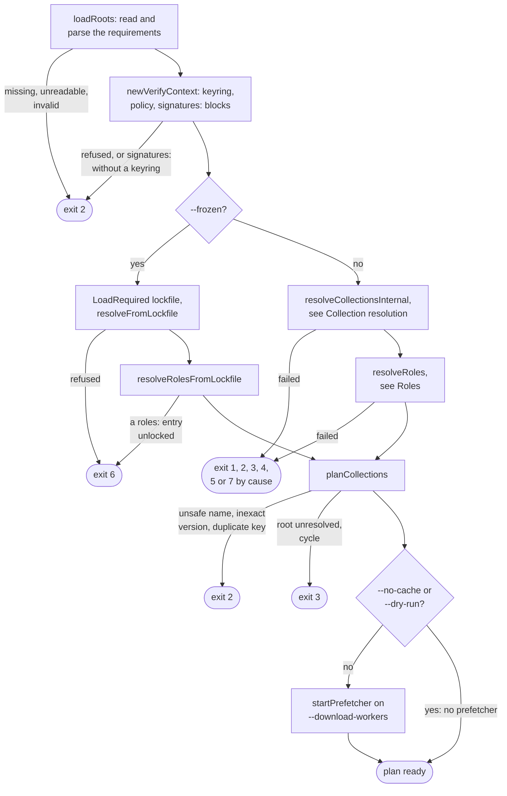
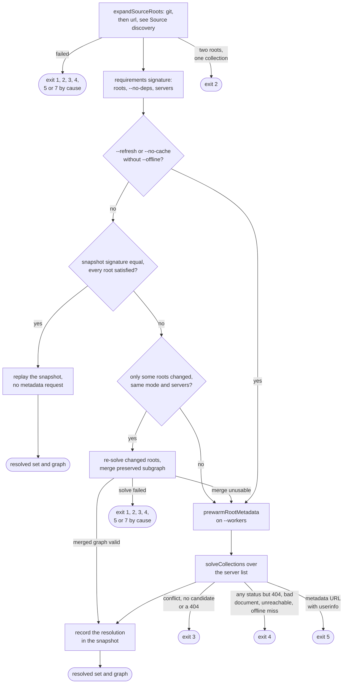
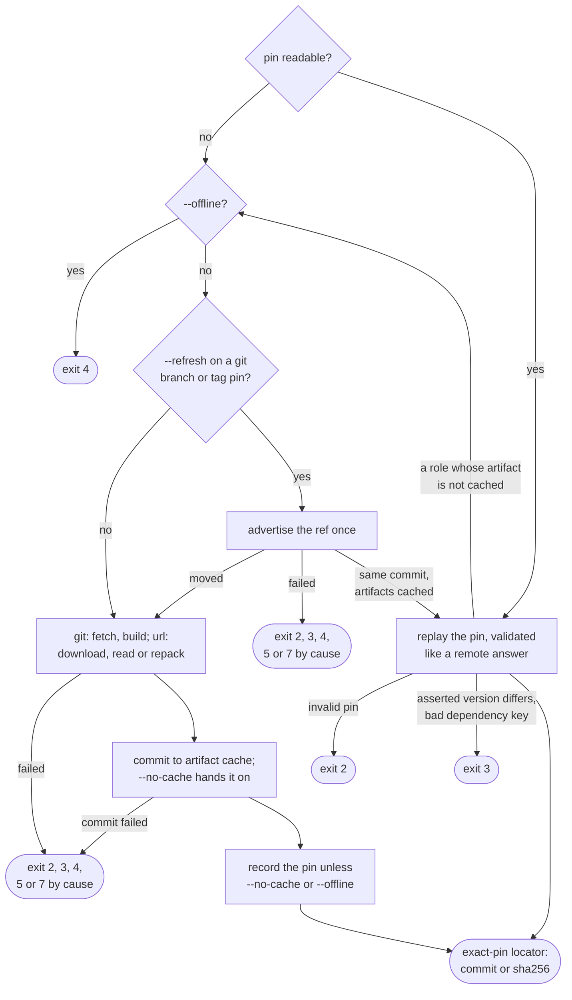
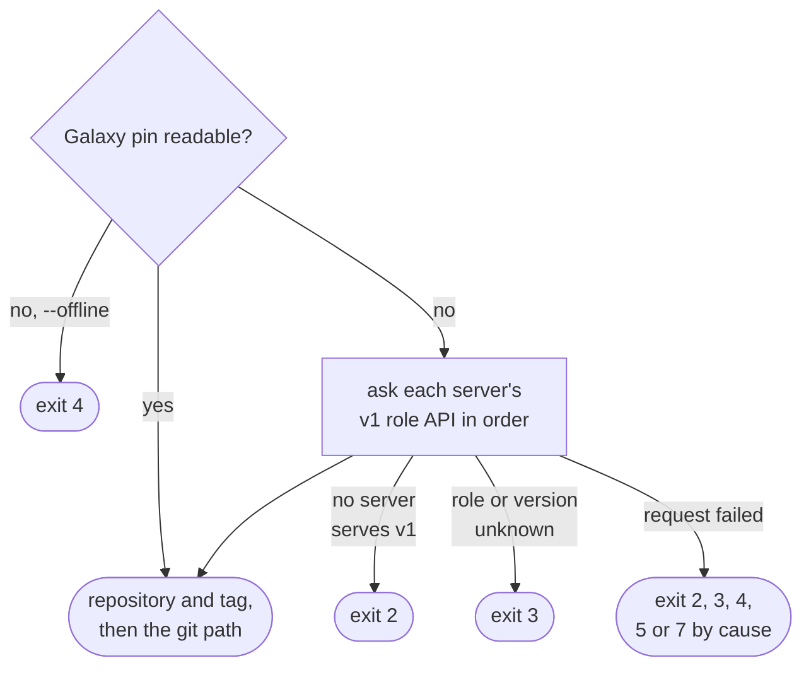
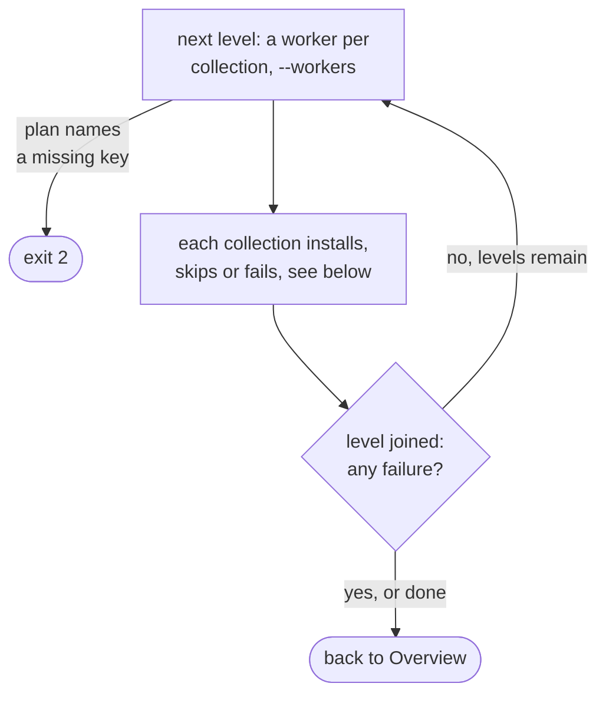
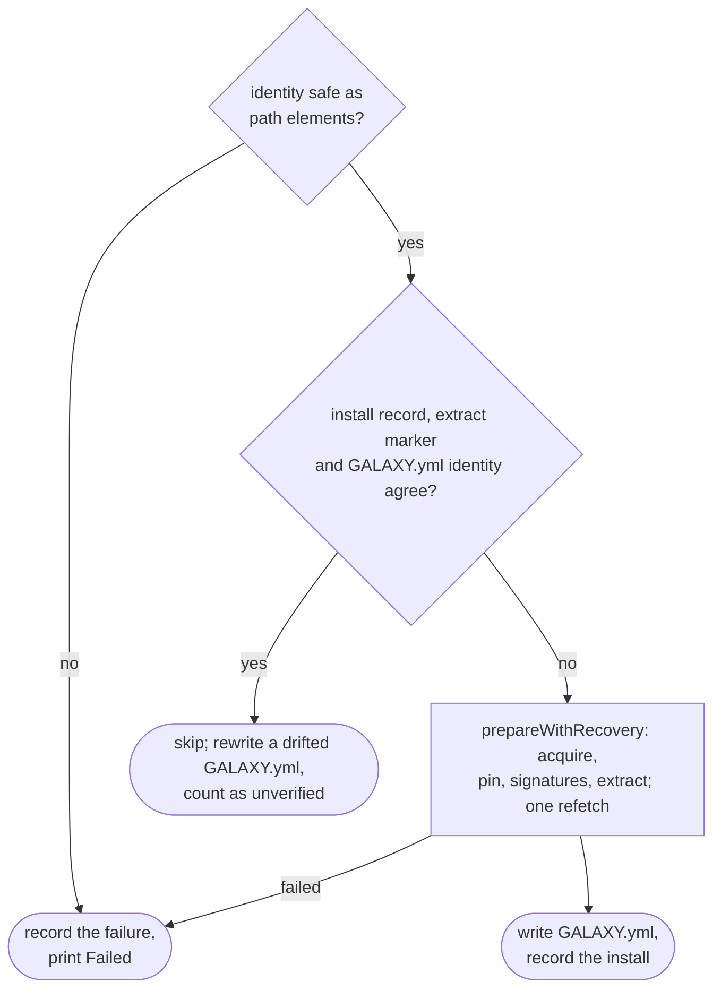

# install flow

`install` resolves the requirements file, or reads the lockfile under
`--frozen`, then installs collections level by level and roles after them.
Options: [Options](../reference/cli.md#options); codes: [Exit codes](../reference/exit-codes.md);
mechanism: [Install pipeline](install-pipeline.md).

## Overview

`installWithState` runs under [Shared setup](commands.md#shared-setup). Roles
wait for every collection level, so a failed run neither reports unattempted
roles nor installs them against a half-done tree. `plan.prefetch.Close` is
deferred there, so every prefetch worker joins before the lock is released.

## Planning

Why this order: [Plan construction](install-pipeline.md#plan-construction).

## Collection resolution

`resolveCollectionsInternal` is shared by install, warm and lock. A cycle is
refused later, in `planCollections`, which `lock` never runs. Why roots
expand before the signature: [Resolution replay](cache.md#resolution-replay).
Why the prewarm sits below the replay: [The Provider seam](solver.md#the-provider-seam).

## Source discovery

Each git or url source, root or role, and each Galaxy role once mapped, takes
one path to an exact pin:

This runs once per unpinned git or url root and once per role, on
`--download-workers`; mechanism on [Git discovery](install-pipeline.md#git-discovery).
A pin is readable when `cache.PolicyForConstraint` allows: always under
`--offline`, never under `--no-cache`, and under `--refresh` only for a git
commit. `--dry-run` discards the build instead of committing it.

A Galaxy role first maps to a repository and tag, from its pin or from the
servers' v1 role API, then takes the path above:

## Collection install

Each collection of the level, on its own worker:

Mechanism: [Acquiring an artifact](install-pipeline.md#acquiring-an-artifact),
[Bounded recovery](install-pipeline.md#bounded-recovery) for the one refetch,
and [The extract-done marker](install-pipeline.md#the-extract-done-marker) for
the marker and its tally. On cancellation `runInstallLevel` stops
dispatching and returns nil, so the snapshot still saves and `main` sets the
signal code.

## Roles

| Step | Code | Refusal, exit |
| --- | --- | --- |
| Walk the `roles:` entries level by level, first request wins a name | `resolveRoles`, `dedupeRoleLevel` | a differing later request only warns |
| Resolve each role of a level | `resolveRoleLevel` | see Source discovery |
| Cap the graph | `helpers.RoleGraphMaxRoles` | `ErrInvalidRoleEntry`, exit 2 |
| Queue meta dependencies | `roleDependencies` | unparseable entry, exit 2; a local role is skipped, a collection's role warns |
| Install, `--workers` at a time | `installRoles` | foreign directory, fetch or extract failure: joined as a Failed item |

Mechanism: [Role resolution](install-pipeline.md#role-resolution) and
[Installing roles](install-pipeline.md#installing-roles).

## Dry run

`installDryRun` replaces both install phases with read-only probes that report
`Up to date`, `Would install` or `Would fail`; a would-fail exits as the real
failure would. The snapshot saves only if one already existed. Details:
[Dry run](install-pipeline.md#dry-run).

## Exits

| Exit | Decided in | Cause |
| --- | --- | --- |
| 1, 2, 4, 8, 9 | [Shared setup](commands.md#shared-setup) | configuration, backend open, lock or snapshot load |
| 5 | `openCollectionsRoot` | a symlinked `ansible_collections` |
| 1 | `openCollectionsRoot` | an empty path or another OS error |
| 2 | `loadRoots` | requirements file missing, unreadable or invalid |
| 2 | `newVerifyContext` | keyring or signature config |
| 6 | `--frozen` planning | lockfile missing, invalid, not covering a root, `download_url` off its server |
| 2 | discovery | two roots for one collection; an invalid pin; a git repository that lacks the `name:` asked for, holds no collection or one declared twice, or has a `galaxy.yml` that is invalid or names an inexact version; no v1 API, or a v1 record refused |
| 3 | discovery | unknown ref, role or version; a found role's versions `404`; url version mismatch |
| 4 | discovery | git or url transport, any v1 API status but `404`, an `--offline` miss |
| 5 | discovery | a git tree or url tarball that is no artifact |
| 7 | discovery | a git remote that did not ship the advertised commit intact |
| 1 | solver | an unparseable `requirements.yml` constraint |
| 3 | solver | conflict, no candidate (any `404` the solver meets included), bad dependency key |
| 4 | solver | any Galaxy status but `404` (auth or unavailable), an unreachable server, a document not JSON or of the wrong shape (a bad timestamp included), an `--offline` miss |
| 5 | solver | a metadata URL with userinfo |
| 2 | `planCollections` | unsafe resolved name, inexact version, duplicate key |
| 3 | `planCollections` | root unresolved, cycle |
| 1 | `openRolesRoot` | an empty path or another OS error |
| 2 | `installLevels` | the plan names a missing key (`ErrMissingCollection`) |
| 5, 7, 10 | `installError` | failed items behind `ErrInstallationFailed`; 7 or 10 when a cause is one |
| 2, 4 | `finalizeInstall` | the snapshot save failed alone; otherwise appended to the item failure |

## Flags that change the flow

| Flag | Diagram | Effect |
| --- | --- | --- |
| `--frozen` | Planning | lockfile replaces discovery and solver; sha256 pins checked before extraction |
| `--dry-run` | Overview, Planning | no roots created, no prefetcher, builds discarded; preview, metrics skipped |
| `--offline` | Source discovery, Collection install | pins and cache only; a miss exits 4 or fails the item |
| `--refresh` | Collection resolution, Source discovery | vetoes replay, re-advertises refs, re-asks v1, re-downloads url sources |
| `--no-cache` | Collection resolution, Source discovery, Planning | no artifact cache, extracted store or prefetcher; builds go straight to install |
| `--no-deps` | Collection resolution, Roles | part of the signature; solver and role walk stop at the roots |
| `--keyring` | Planning, Collection install | verifies before extraction; a cache hit still loads metadata; skips count unverified |
| `--clear-cache` | [Shared setup](commands.md#shared-setup) | forgets metadata and pins, deletes artifacts, keeps the recorded resolve; skipped under `--dry-run` |
| `--s3-bucket` | [Shared setup](commands.md#shared-setup) | S3 backend, so a lock lost mid-run is possible |
| `--metrics-file` | Overview | JSON report after a real run |

`--disable-gpg-verify` turns `--keyring` off. The other options supply values
without changing the flow: the pool sizes `--workers` and
`--download-workers`, `--cache-dir`, the other paths and files,
`--lock-file`, the server and output options, and the other signature and
`--s3-*` flags.
