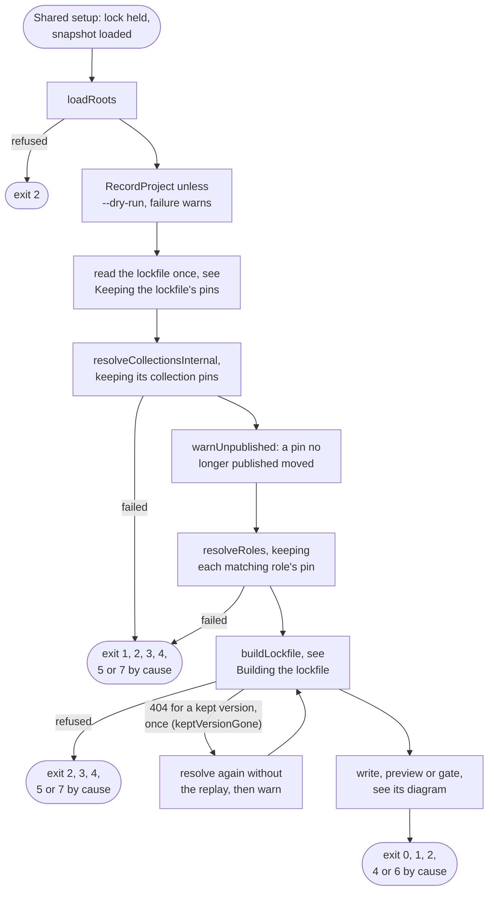
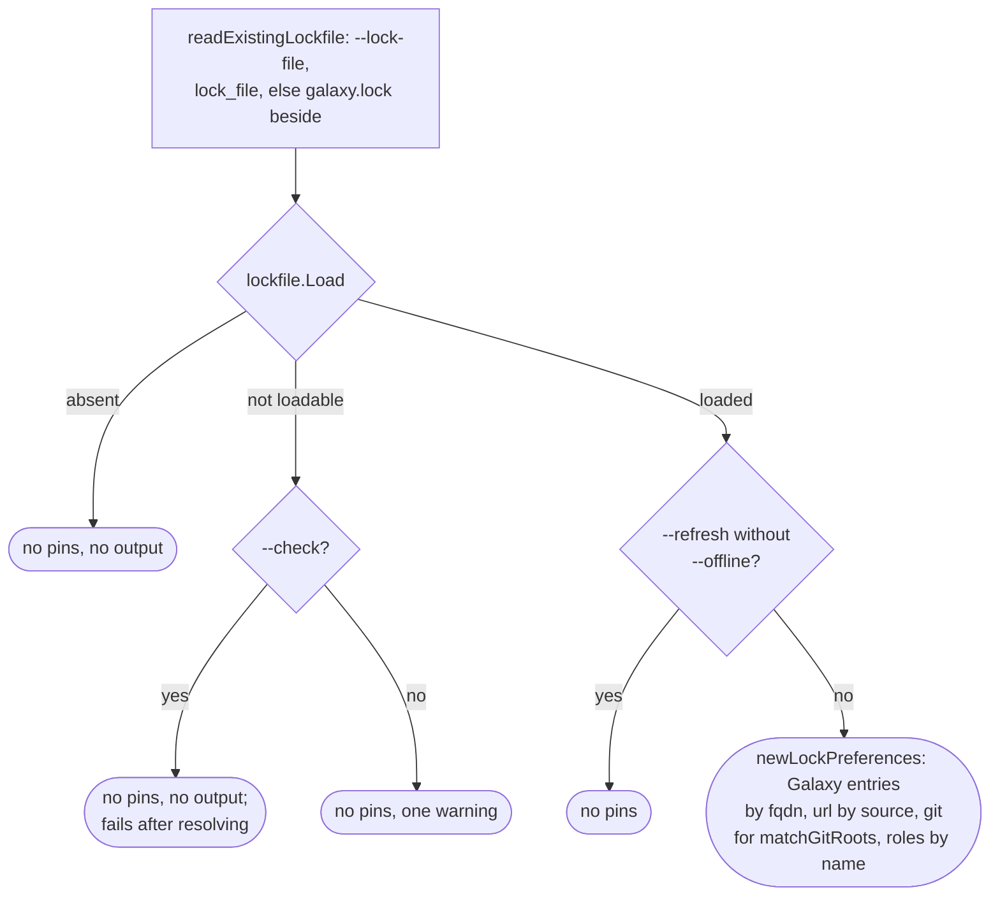
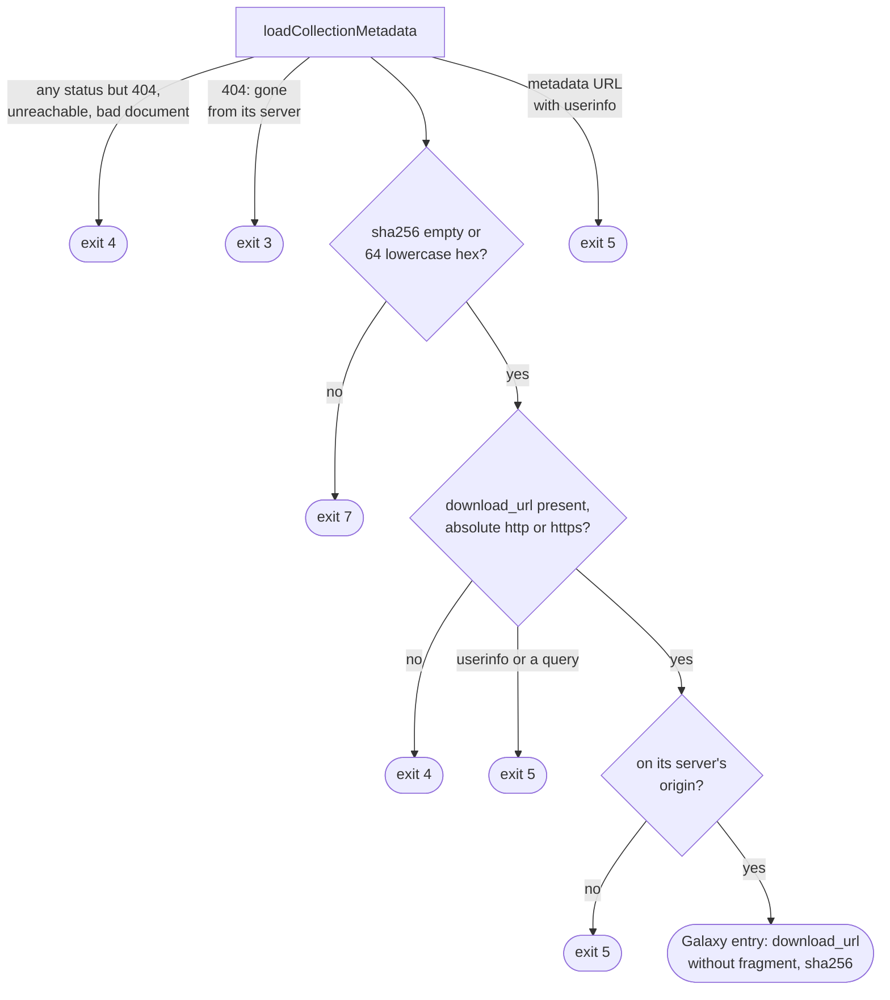
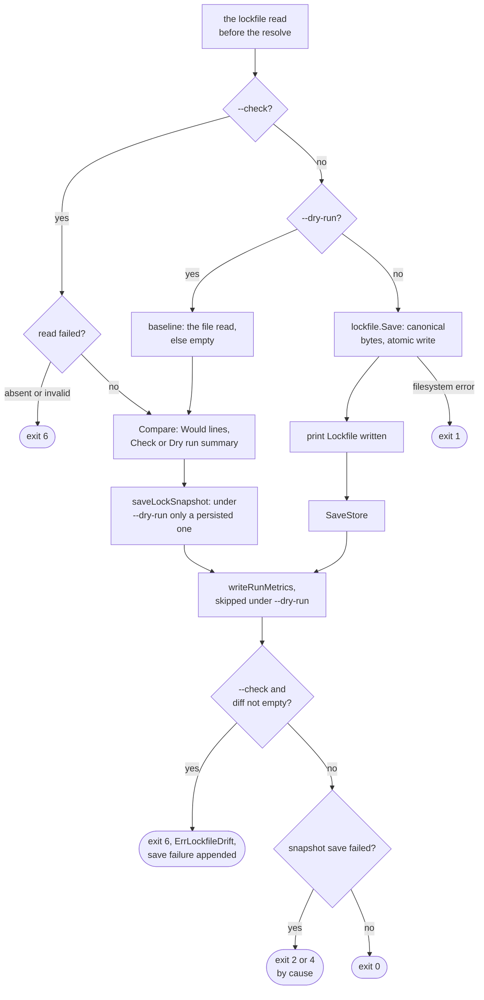

# lock flow

`lock` resolves the requirements file as install does without `--frozen`,
keeping the pins the existing lockfile holds, builds the lockfile in memory
and writes it, previews it under `--dry-run` or compares it under `--check`.
Options:
[`lock`](../reference/cli.md#lock); code meanings: [Exit codes](../reference/exit-codes.md); the
file itself: [Lockfile format](lockfile-format.md).

## Overview

`lockWithState` runs under [Shared setup](commands.md#shared-setup) with the
banner `Resolving for lockfile`. Resolution and source discovery are install's,
drawn on [install flow](flow-install.md): the same
`resolveCollectionsInternal` and `resolveRoles`, without `newVerifyContext` or
`planCollections`, plus the lockfile's pins. It installs nothing but saves the
snapshot, so later runs replay the resolve. It records its project once the
file loads, as install does, `--check` included, but leaves the install paths
to install ([Project registry](cache.md#project-registry)).

## Keeping the lockfile's pins

The file is read after `loadRootsAndRecordProject`, so a refused requirements
file reads nothing, and that one read serves the pins, the `--dry-run`
baseline and the `--check` verdict. `withLockPreferences` puts the index on
`collectionDeps`; only `lockWithState` sets it, so install, warm and outdated
resolve without it. `--no-cache`, `--clear-cache`, `--offline`, `--no-deps` and
`--dry-run` keep the pins, since the lockfile is no cache.

| Reader | Rule |
| --- | --- |
| `MetadataProvider.Preferred` | Answers the version the Galaxy entry pins, from the file alone. A git or url pin, or no Galaxy entry, has no preference |
| `MetadataProvider.Confirm` | Asked once that version passes the accumulation, so one the requirements exclude costs nothing: the root document as `Highest` reads it, so past its 10-minute window it is revalidated and a server that dropped the collection gives way to the next, then the version document under the exact-version policy. Two requests on an empty cache, none within the window, one conditional request past it, and `Dependencies` and `buildLockfile` then read the cache |
| A `404` there | Recorded unpublished without output, since the solver may leave the package out; any other error, `ErrOfflineMode` included, ends the solve |
| `resolveFromSnapshots`, `tryIncrementalResolveWithSnapshot` | A full or incremental replay holding a Galaxy collection at another version than its entry is dropped before it is recorded (`agreesWith`), and the solve runs: the recorded resolution may come from a run that never read the file, such as `install --refresh`. An entry whose root's own constraint excludes the locked version does not count, since that version moved on purpose. The resolution `lock` records holds each kept commit's and sha256's locator, which every command's replay hands only to a run whose own root expanded into it (`sourcesMatchRoots`, [Resolution replay](cache.md#resolution-replay)) |
| `warnUnpublished` | After the resolve, one warning per collection recorded unpublished that resolved to another version; a version the constraints exclude is never confirmed, so it draws none |
| `keptVersionGone`, in `lockWithState` | A replay agreeing with the file keeps a version without asking its server. When `buildLockfile` then meets a `404` for it, as once `--clear-cache` or 30 days dropped its metadata, the collections resolve once more without the replay, so `Confirm` finds the pin gone and the warning above follows |
| `lockPreferences.gitRoots`, once per `expandGitRoots` | Matches the git roots to the git entries by `matchGitRoots`, the rule `--frozen` judges them by, over every root at once, since which entries a root owns depends on the roots beside it. A root keeps the commit every entry it owns shares. One asked at a commit keeps none, nor does one owning no entry, as after a ref change, or entries at two commits; each resolves as install does, with no warning |
| `expandLockedGitRoot` | A recorded pin at the locked commit replays, one at another commit never; else `--offline` fails; else `acquireGitRoot` fetches that commit, its pin recorded as `lockedPinPolicy` allows. `ErrGitCommitNotFound` there warns once, naming the root's one collection or else its source and ref, and the root resolves as if unlocked |
| `lockedPinPolicy`, before a locked commit is fetched | One advertisement, no pack, bounded by `GitDeadline` as a fetch is: the pin is recorded only while the ref names that commit and, for a role, while `roleVersionFor` makes the locked label of the ref name advertised, since a pin the file alone decided would reach every project on a shared cache. A ref the remote no longer has records none; any other advertisement failure ends the run as the fetch's would, an expired deadline as `ErrArtifactDownloadDeadline`. A debug line names why no pin is recorded: the ref not advertised, at another commit, or at that commit under another version. A policy that writes nothing, as under `--no-cache`, advertises nothing. So a moved ref's locked commit is fetched by every run, its artifact still committed under its locator |
| `releaseRuledOutGitRoots`, in `resolveCollectionsInternal` | A resolve failing on a collection two roots expand into (`duplicateRootError`), or on a solver conflict whose proof names a collection a kept git root holds (`ConflictError.Packages`), releases each such root: one warning, then the resolve runs again from forgotten discoveries, the root as if unlocked but never replaying a recorded pin at the released commit. A failure naming no kept root ends the run as without the file |
| `lockPreferences.urlEntry`, `expandLockedURLRoot` | The entry locked from the root's URL, unless the root asserts another `version:`, the rule `--frozen` accepts a url root by. A recorded pin of the locked sha256 replays, one of other bytes never; else `--offline` fails; else the URL is downloaded, and other bytes than the locked ones warn once and are kept |
| `lockPreferences.role` | Every role request, a root or a dependency, finds its entry by install name under the rule `--frozen` accepts a root by (`verifyRoleRootAgainstLockfile`); a git role asked at a commit is not looked up, as that ref is its pin. A request no entry matches resolves as install does, with no warning |
| `resolveLockedGitRole`, for a git role and a usable Galaxy role | A recorded pin at the locked commit and label whose artifact is cached replays; else `--offline` fails; else `acquireRole` fetches that commit under the locked label, its pin recorded as `lockedPinPolicy` allows. `ErrGitCommitNotFound` there warns once and resolves the role as if unlocked |
| `resolveLockedGalaxyRole` | Asks no v1 API when the entry's server is one `lookupGalaxyRole` asks (`lockedRoleServerAsked`) and its repository and ref pass `galaxyPinResolution`; otherwise one warning, and the role resolves as if unlocked, from a recorded Galaxy pin, else the v1 API. It records no Galaxy pin from the entry, since no v1 answer named that repository this run, and leaves a recorded one as it is |
| A Galaxy role's repository that cannot be fetched | `unreachableRepository`: the role asks the v1 API past a recorded pin or a cached answer naming that repository. Another repository warns once and is taken; the same one fails the run with the fetch's error |
| `resolveLockedURLRole` | A recorded pin of the locked sha256 whose artifact is cached under the request's label replays; else `--offline` fails; else the URL is downloaded, and other bytes warn once and are kept. The label is the request's, as for install, so a `version:` dropped from the requirement relabels the locked bytes and both commands record one pin |

The solver picks a passing preference before any unpreferred package
([The loop](solver.md#the-loop)), so the pins a valid resolution allows are
kept, except one reached only through an entry that resolves anew: that entry
takes its highest allowed version, and what it alone reaches can move to what
that version needs. A collection's server binding is unchanged: a root's
`source:`, else the first server in list order that has the collection; the
entry's own `source` is not read. A kept git or url collection or role takes
its dependencies from its replayed pin or its fetch at the locked commit or
bytes, never from the entry's `deps`.

## Building the lockfile

A Galaxy entry, in `galaxyLockfileEntry`:

The version check runs before any metadata request, so a lenient snapshot
entry such as `*` buys no request and never reaches `--frozen`. A Galaxy entry
costs a metadata fetch, never a tarball. Why each `download_url` refusal
exists: [Loading the lockfile](boundaries.md#loading-the-lockfile).

## Write, preview or gate

`--check` is read before `--dry-run`, so with both the verdict applies and
`--dry-run` changes only the save and the metrics. `lockCheck` returns a failed
read as `lockfile.RequiredError` maps it, the error `LoadRequired` gives, so a
missing file fails as missing, never as the drift `Compare(nil, lf)` would
show. `Lockfile written` prints before the snapshot save: the file stays valid
if the save fails.

## Exits

| Exit | Decided in | Cause |
| --- | --- | --- |
| 1, 2, 4, 8, 9 | [Shared setup](commands.md#shared-setup) | configuration, backend open, lock or snapshot load |
| 2 | `loadRoots` | requirements file missing, unreadable or invalid, or a Galaxy `source:` naming no server of the run |
| 1, 2, 3, 4, 5, 7 | resolution | by cause, as on [install flow](flow-install.md#exits) |
| 4 | `MetadataProvider.Confirm` | under `--offline`, a locked Galaxy version the requirements allow whose root or version document is not cached: `ErrOfflineMode` |
| 4 | `expandLockedGitRoot`, `expandLockedURLRoot` | under `--offline`, a locked git commit or url sha256 with no recorded pin: `ErrOfflineMode` |
| 4 | `resolveLockedGitRole`, `resolveLockedURLRole` | under `--offline`, a locked role commit or sha256 with no recorded pin and cached artifact: `ErrOfflineMode` |
| 2 | `buildLockfile` | inexact version; unpinned git, url or role locator |
| 3 | `galaxyLockfileEntry` | a `404` for a collection or version the resolve named, often a replayed one the lockfile does not pin (a pinned one resolves again first): `ErrNoSemverCandidates` |
| 4 | `galaxyLockfileEntry` | any status but `404` (`ErrGalaxyAuthFailed`, `ErrGalaxyServerUnavailable`), an unreachable server, a document not JSON or of the wrong shape, a bad timestamp included |
| 5 | `normalizeVersionsURL` | a metadata URL with userinfo |
| 7 | `galaxyLockfileEntry` | a malformed sha256, `ErrMalformedArtifactSHA256` |
| 4 | `lockableDownloadURL` | `download_url` missing or not absolute http(s) |
| 5 | `lockableDownloadURL` | `download_url` with userinfo or a query |
| 5 | `checkDownloadURLOrigin` | `download_url` off its server's origin |
| 1 | `lockfile.Save` | a filesystem error; no snapshot or metrics written |
| 6 | `lockCheck` | file missing or invalid; drift |
| 2, 4 | `SaveStore` | the save failed alone; appended to drift otherwise |

## Flags that change the flow

| Flag | Diagram | Effect |
| --- | --- | --- |
| `--check` | Write, preview or gate | compare with the file instead of writing; any difference exits 6 |
| `--dry-run` | Write, preview or gate | diff against the file, write nothing; discovery discards its builds |
| `--refresh` | Keeping the lockfile's pins | sets them aside unless `--offline`; otherwise as for install, on [install flow](flow-install.md#flags-that-change-the-flow) |
| `--no-deps` | Overview | as for install; a root still keeps its pin |
| `--offline` | Overview | recorded pins and resolve only, a miss exits 4, a locked version whose documents are not cached or a locked commit, sha256 or role pin not recorded included; no pin or metadata recorded |
| `--no-cache` | Overview | no recorded pin or resolve read, the lockfile's pins still kept; builds kept for the run only |
| `--clear-cache` | [Shared setup](commands.md#shared-setup) | forgets metadata and pins, deletes artifacts, keeps the recorded resolve; skipped under `--dry-run` |
| `--s3-bucket` | [Shared setup](commands.md#shared-setup) | S3 backend, so a lock lost mid-run is possible |
| `--metrics-file` | Write, preview or gate | JSON report once the save step is reached |

`--check` still runs the full resolve and honors `--refresh`: `initInstall`
never reads `--check`. The other options supply values without changing the
flow: the pool sizes `--workers` and `--download-workers`, `--cache-dir`,
`--download-path` and `--roles-path` (unused, since only install records
them), the other paths and files, `--lock-file`, the server and output
options, and the other `--s3-*` flags.
