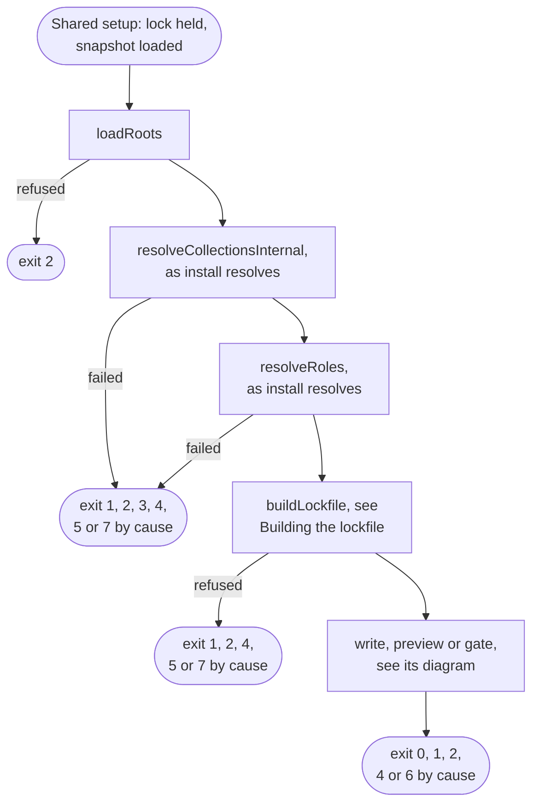
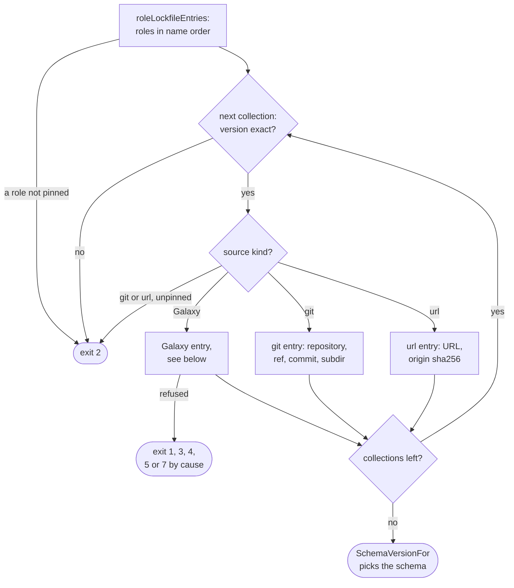
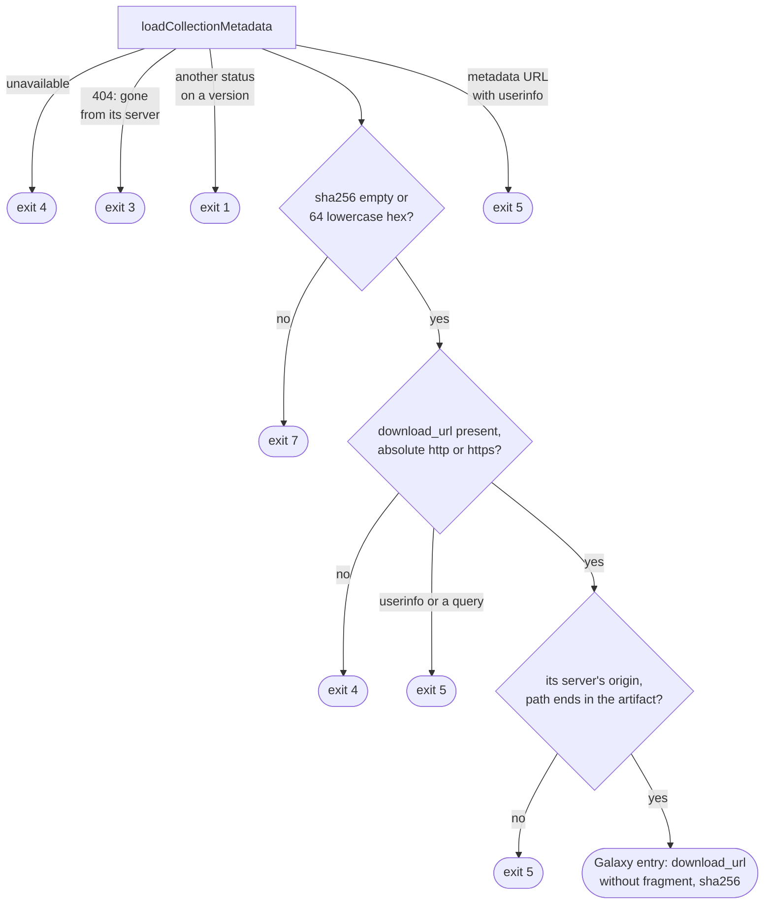
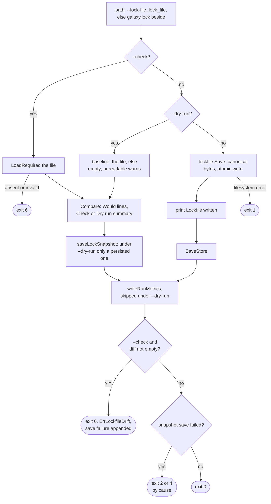

# lock flow

`lock` resolves the requirements file as install does without `--frozen`,
builds the lockfile in memory and writes it, previews it under `--dry-run` or
compares it under `--check`. Options:
[`lock`](../cli.md#lock); code meanings: [Exit codes](../exit-codes.md); the
file itself: [Lockfile format](lockfile-format.md).

## Overview

`lockWithState` runs under [Shared setup](commands.md#shared-setup) with the
banner `Resolving for lockfile`. Resolution and source discovery are install's,
drawn on [install flow](flow-install.md): the same
`resolveCollectionsInternal` and `resolveRoles`, without `newVerifyContext` or
`planCollections`. It installs nothing but saves the snapshot, so later runs
replay the resolve.

## Building the lockfile

A Galaxy entry, in `galaxyLockfileEntry`:

The version check runs before any metadata request, so a lenient snapshot
entry such as `*` buys no request and never reaches `--frozen`. A Galaxy entry
costs a metadata fetch, never a tarball. Why each `download_url` refusal
exists: [download_url and frozen installs](lockfile-format.md).

## Write, preview or gate

`--check` is read before `--dry-run`, so with both the verdict applies and
`--dry-run` changes only the save and the metrics. `lockCheck` loads with
`LoadRequired`, so a missing file fails as missing, never as the drift
`Compare(nil, lf)` would show. `Lockfile written` prints before the snapshot
save: the file stays valid if the save fails.

## Exits

| Exit | Decided in | Cause |
| --- | --- | --- |
| 1 | `lockfile.Save`; solver | a filesystem error, no snapshot or metrics written; an unparseable `requirements.yml` constraint |
| 1 | `galaxyLockfileEntry` | a version document answering a status other than `404`, which no class claims |
| 2 | `loadRoots`, `buildLockfile` | requirements refused; inexact version; unpinned git, url or role locator |
| 2, 3, 4, 5, 7 | resolution | by cause, as on [install flow](flow-install.md) |
| 3 | `galaxyLockfileEntry` | a `404` for a collection or version the resolve named, often a replayed one: `ErrNoSemverCandidates` |
| 4 | `galaxyLockfileEntry` | metadata unavailable; `download_url` missing or not absolute http(s) |
| 5 | `lockableDownloadURL`, `checkServerArtifactURL`, `normalizeVersionsURL` | userinfo, a query, or not its server's artifact; a metadata URL with userinfo |
| 6 | `lockCheck` | file missing or invalid; drift |
| 7 | `galaxyLockfileEntry` | a malformed sha256, `ErrMalformedArtifactSHA256` |
| 2, 4 | `SaveStore` | the save failed alone; appended to drift otherwise |

## Flags that change the flow

| Flag | Diagram | Effect |
| --- | --- | --- |
| `--check` | Write, preview or gate | compare with the file instead of writing; any difference exits 6 |
| `--dry-run` | Write, preview or gate | diff against the file, write nothing; discovery discards its builds |
| `--refresh` | resolution | vetoes replay, re-advertises git refs, skips url and Galaxy role pins |
| `--offline` | resolution | pins and recorded resolve only, a miss exits 4; no pin or metadata recorded |
| `--no-cache` | resolution | no pin or recorded resolve read; builds kept for the run only |
| `--no-deps` | resolution | solver and role walk stop at the roots; part of the signature |
| `--clear-cache` | Shared setup | forgets metadata and pins, deletes artifacts, keeps the recorded resolve |
| `--metrics-file` | Write, preview or gate | JSON report once the save step is reached |

`--check` still runs the full resolve, `--refresh` included: `initInstall`
never reads it. `lock` mounts no `--frozen`, so the flag is undefined (exit 2) and
`GO_GALAXY_FROZEN` never reaches it; it mounts no signature flag either.
`--s3-bucket` acts in Shared setup. The rest supply values without branching:
paths, pools, servers, `--lock-file` and the other S3 settings.
