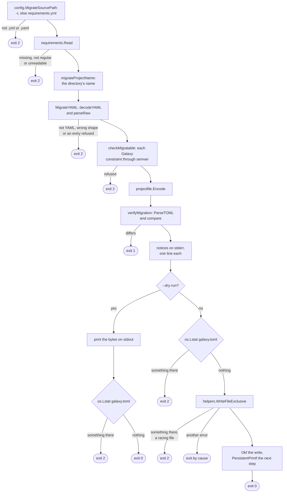

# migrate flow

`migrate` reads one `requirements.yml` and writes `galaxy.toml` beside it.
Options: [`migrate`](../reference/cli.md#migrate); what it carries and the
steps around it: [Moving to
galaxy.toml](../guides/requirements.md#moving-to-galaxytoml). It has no
`BuildCollectionConfig`, no `ansible.cfg`, no cache backend, no network and no
project registry record; of the global options only `--dry-run` works.

Flag, help and argument checks run before the action, as drawn under
[Command dispatch](commands.md#command-dispatch): a bad flag or a stray word
exits 2, `--help` exits 0.

## Overview

The notices come from the same `decodeYAML` tree plus one `yaml.NewDecoder`
pass over the bytes for comments and later documents, and they never change
the bytes.

The action ignores its context, as `hash` does.

## Exits

| Exit | Decided in | Cause |
| --- | --- | --- |
| 2 | `config.MigrateSourcePath` | `ErrMigrateSourceName` |
| 2 | `requirements.Read` | `fs.ErrNotExist`, `ErrRequirementsNotRegular`, `ErrRequirementsUnreadable` |
| 2 | `decodeYAML`, `parseRaw` | `ErrInvalidRequirementsYAML`, `ErrUnsupportedRequirementsFormat`, an entry sentinel or a `RolesError` |
| 2 | `checkMigratable` | `ErrInvalidCollectionConstraint` |
| 2 | `checkMigrateTarget`, then `WriteFileExclusive` | `ErrProjectFileExists` |
| 1 | `verifyMigration` | `ErrMigrateRoundTrip`, which no exit class claims |
| 1 | `WriteFileExclusive` | a write error such as `EACCES` |
| 129, 130, 143 | `main` | a caught signal |

## Flags that change the flow

| Flag | Diagram | Effect |
| --- | --- | --- |
| `-r` | Overview | the input, the directory `galaxy.toml` lands in, and the project name |
| `--dry-run` | Overview | print the bytes instead of writing them; an existing target still exits 2 |
