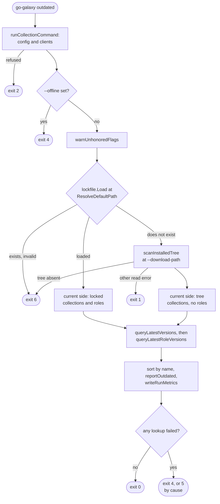
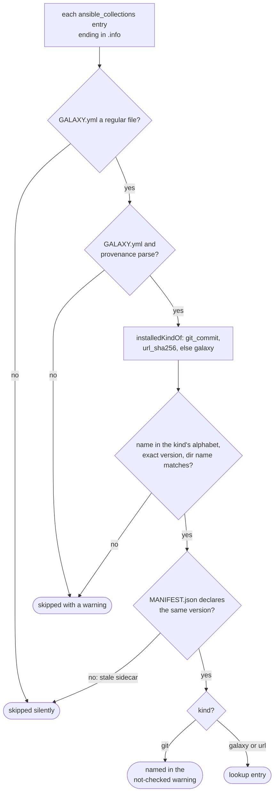
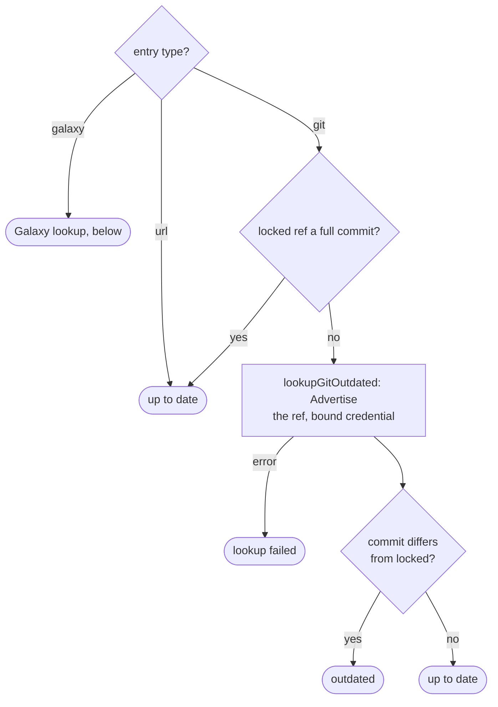
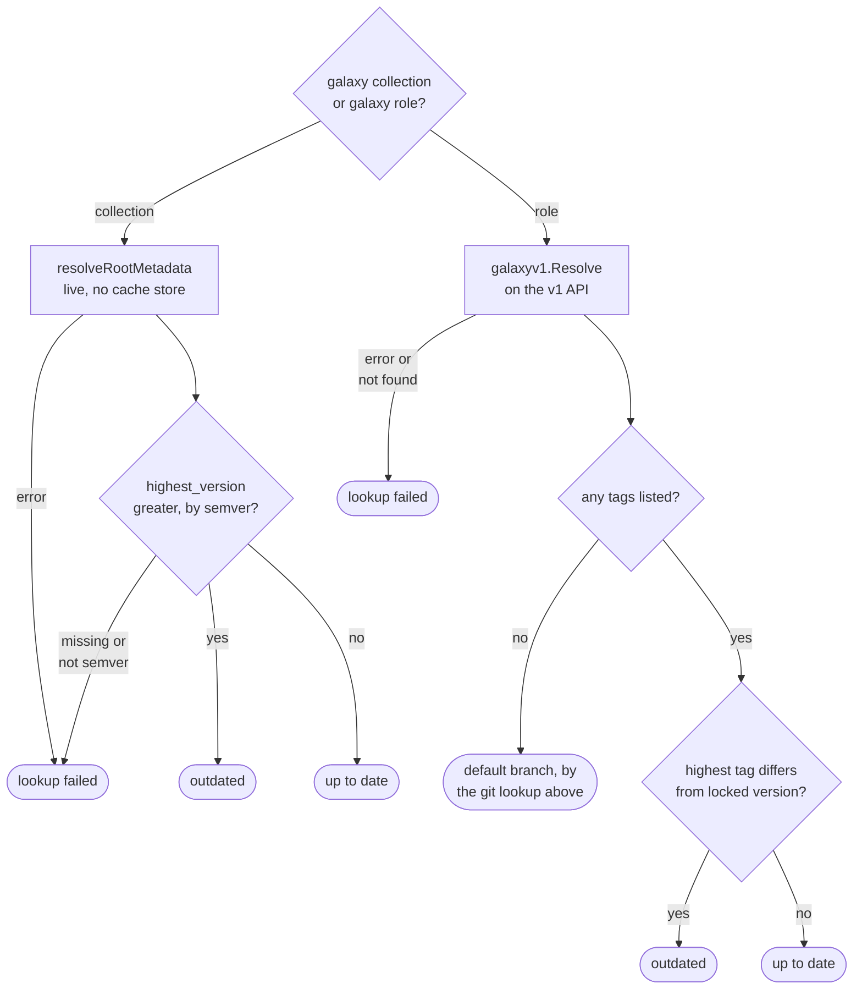

# outdated flow

`outdated` compares what the project runs, its lockfile or else its installed
collections tree, with what each source offers now. Options:
[`outdated`](../reference/cli.md#outdated); the report:
[Find newer versions](../guides/lockfile.md#find-newer-versions); code meanings:
[Exit codes](../reference/exit-codes.md).

## Overview

`Outdated` opens no cache backend and takes no lock, so every answer is live
and no lost-lock exit exists. Configuration still runs in full: a bucket from
any source needs both S3 keys (`ErrS3EmptyCreds`), and `--offline` beside a
bucket fails there (`ErrS3CacheOffline`) before its own refusal, both exit 2.
`--offline` alone is refused with `ErrOfflineMode` before
`warnUnhonoredFlags`.

## Installed-tree fallback

- Provenance comes from `go-galaxy.yml`, else `GALAXY.yml` for older
  installs; a Galaxy sidecar with no server asks `cfg.Server`.
- A git install records no ref, so it is only named in a warning.
- `reportInstalledGaps` also warns about roles under `--roles-path` carrying
  `meta/.galaxy_install_info`; a read failure counts zero.
- With neither lockfile nor tree, `errNoInstalledCollections` wraps
  `ErrLockfileMissing`, so the exit stays 6.

## One entry

A Galaxy entry takes one of two lookups, by its kind:

A url entry and a full-commit ref make no request, and role tags compare by
name, not semver. A Galaxy entry asks its recorded source, else `cfg.Server`;
a source matching no configured server warns once per source. Collections
run on one `--workers` pool, then roles on a second.

## Report, metrics and exit

`reportOutdated` prints every result sorted by name, collections and roles
together: `Lookup failed:` on stderr, `Outdated:` always, `Up to date:` only
under `--verbose`, then a summary that survives `--quiet`. `writeRunMetrics`
runs on this path only, failed lookups or not; the early exits write no
report. Failures join behind `ErrLatestVersionLookupFailed` in
`outdatedError`.

## Exits

| Exit | Decided in | Cause |
| --- | --- | --- |
| 2 | `BuildCollectionConfig` | configuration refused, including the S3 checks above |
| 4 | `Outdated` | `--offline` (`ErrOfflineMode`) |
| 6 | `outdatedInput` | lockfile exists but invalid, or neither lockfile nor tree |
| 1 | `scanInstalledTree` | any other error opening or listing the tree |
| 4 | `outdatedError` | any lookup failed |
| 5 | `outdatedError` | a cause is a server-supplied URL with userinfo (`ErrMetadataURLUserinfo`) |

## Flags that change the flow

| Flag | Diagram | Effect |
| --- | --- | --- |
| `--offline` | Overview | exit 4 before anything is read |
| `--lock-file`, `-r` | Overview | the lockfile path; absence switches to the tree |
| `--download-path` | Overview | the tree scanned, and the report label |
| `--roles-path` | Installed-tree fallback | where installed roles are counted for the warning |
| `--server` | One entry | server for entries recording no source |
| `--workers` | Overview | size of each lookup pool |
| `--verbose`, `--quiet` | Overview | add `Up to date:` lines; hide the fallback notice |
| `--metrics-file` | Overview | JSON report; `--dry-run` skips it with a warning |
| `--clear-cache`, `--no-cache`, `--refresh`, `--no-deps`, `--frozen`, `--s3-bucket` | Overview | named in one warning, no effect |
| `GO_GALAXY_GIT_*` | One entry | credential for the advertisement |

Accepted without changing the flow: `--cache-dir` (a resolved value cannot be
told from its default, so the warning omits it), `--download-workers`,
`--timeout`, `--token`, `--ansible-config` and the other `--s3-*` flags. No
signature flag is mounted.
