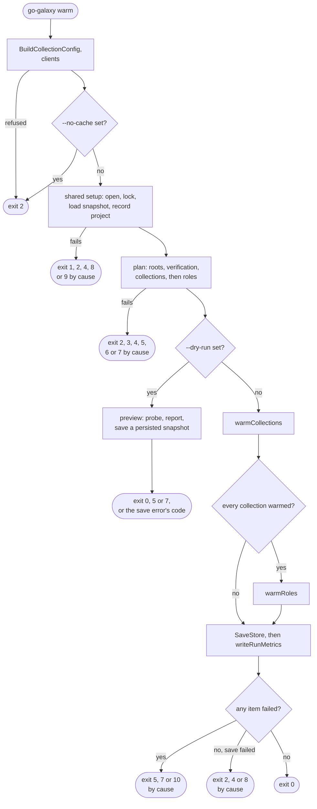
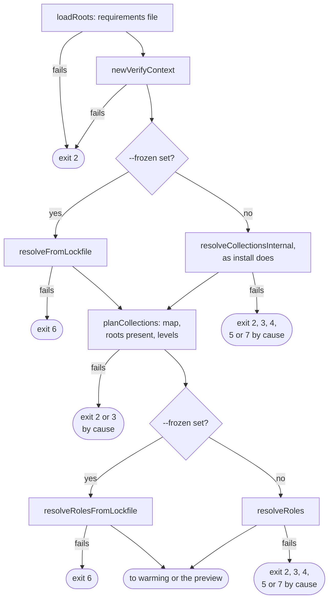
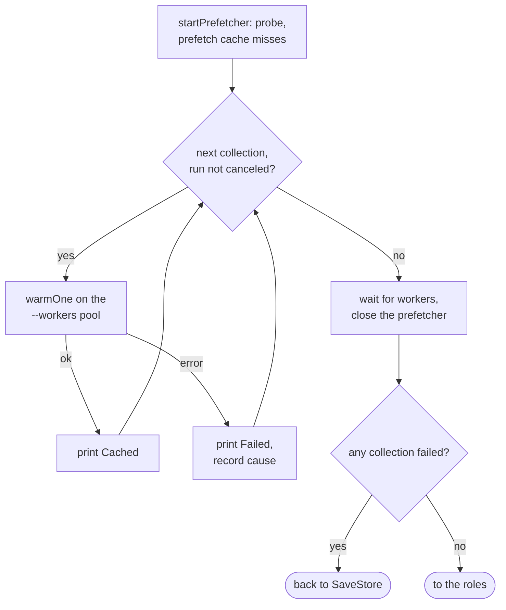
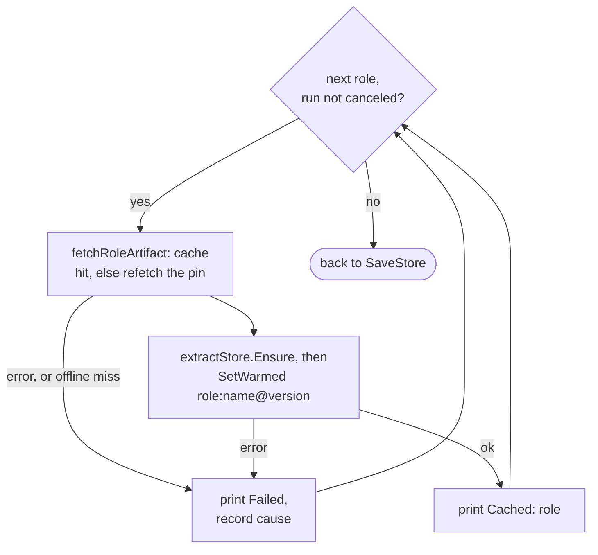
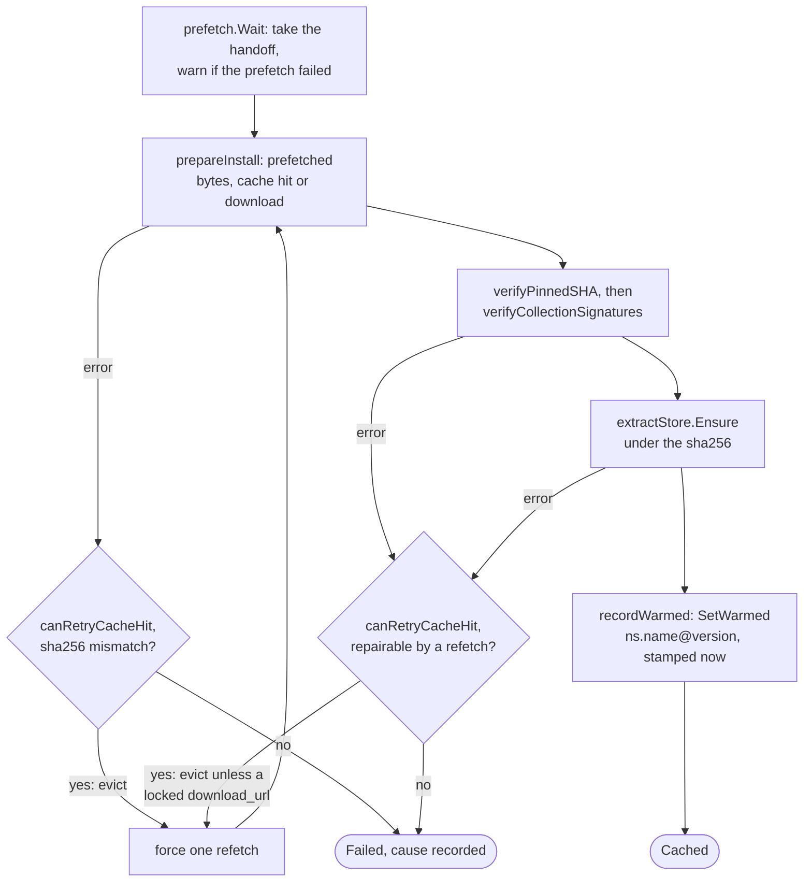
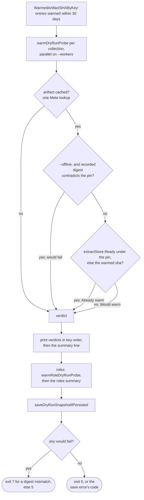

# warm flow

`warm` resolves like `install`, then fills the artifact cache and the extracted
store for every collection and role without writing a collections or roles
tree. Options: [`warm`](../reference/cli.md#warm); code meanings:
[Exit codes](../reference/exit-codes.md).

## Overview

`runWarm` refuses `--no-cache` (`ErrWarmCacheDisabled`) before
`cacheBackend.New`, so no backend opens and no lock is taken. Everything else
runs inside `withBackend`, whose startup is
[Shared setup](commands.md#shared-setup): the dead-run temp sweep,
`--clear-cache` and `RecordProject` happen there.

## Plan

Resolution, discovery and replay are install's, drawn on
[install flow](flow-install.md). One order differs: `warm` runs
`planCollections` before any role resolves, so a cycle or a dropped root
fails before a role repository is fetched. The install levels are computed
and discarded.

## Warming collections and roles

The prefetcher probes the cache and downloads the misses in background; it
is install's with a nil root and nil levels
([Prefetch and handoff](install-pipeline.md#prefetch-and-handoff)). Roles
follow only when every collection warmed:

A per-item failure never stops the others; the causes join behind the
`ErrInstallationFailed` headline built by `warmError`.

## One collection

`canRetryCacheHit` holds for a cache hit on the first try, not under
`--offline`, and both decisions need it. `warmOne` is `prepareWithRecovery`
with `warmVerifyAndEnsure` as its action, so acquisition and the refetch-once
rule are install's:
[Acquiring an artifact](install-pipeline.md#acquiring-an-artifact) and
[Bounded recovery](install-pipeline.md#bounded-recovery). `recordWarmed` stamps
cache hits too, which is what keeps a tree through `cleanup` for 30 days
(`WarmedEntryMaxAge`); install must never call it.

## The dry-run preview

The preview downloads, extracts and stamps nothing; an uncached item under
`--offline` is a would-fail. A git, url or role source with no usable pin was
still fetched during resolution and its build discarded
([Dry run](install-pipeline.md#dry-run)).

## Exits

| Exit | Decided in | Cause |
| --- | --- | --- |
| 2 | `runWarm` | `--no-cache`, before any backend |
| 1, 2, 4, 8, 9 | `BuildCollectionConfig`, `initInstall` | [Shared setup](commands.md#shared-setup) |
| 2 | `loadRoots`, `newVerifyContext`, `buildCollectionsMap` | requirements unreadable or invalid, keyring or signature config, unsafe resolved name, inexact version or duplicate key |
| 3 | solver, `planCollections` | conflict, no candidate, dropped root, cycle |
| 6 | `resolveFromLockfile`, `resolveRolesFromLockfile` | `--frozen`: lockfile missing, invalid, not covering the roots |
| 1, 2, 3, 4, 5, 7 | resolution | by cause, as on [install flow](flow-install.md) |
| 7 | `warmError` | a cause is a sha256, commit or identity mismatch |
| 10 | `warmError` | a cause is a signature verdict |
| 5 | `warmError` | any other item failure, a network cause included |
| 2, 4, 8 | `SaveStore` | save failed and no item did |

## Flags that change the flow

| Flag | Diagram | Effect |
| --- | --- | --- |
| `--no-cache` | Overview | exit 2 before open |
| `--frozen` | Plan | lockfile instead of solver and role discovery |
| `--dry-run` | Overview | preview replaces warming; no `--clear-cache`, registry record or metrics |
| `--offline` | Plan, Warming collections and roles, One collection, The dry-run preview | resolves as install does; a cache miss fails the item; no eviction |
| `--refresh`, `--no-deps` | Plan | as for install |
| `--clear-cache` | [Shared setup](commands.md#shared-setup) | drops caches and artifact files before planning |
| `--keyring`, `--disable-gpg-verify` | Plan, One collection | verification on: signatures checked before `Ensure` |
| `--s3-bucket` | [Shared setup](commands.md#shared-setup) | S3 backend, so a lock lost mid-run is possible |
| `--metrics-file` | Overview | report after the save |

Accepted without changing the flow: `--workers` and `--download-workers` (pool
sizes), `--download-path` and `--roles-path` (only recorded in the registry),
`--lock-file`, the other signature and `--s3-*` flags, and the output and
server options.
