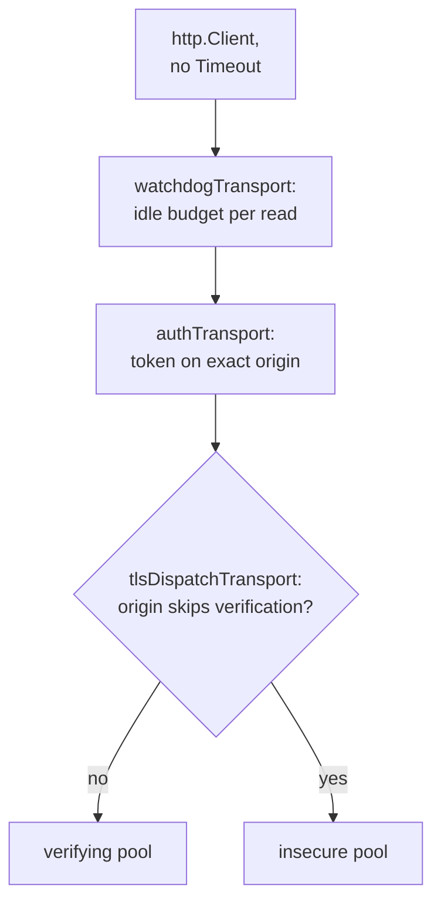
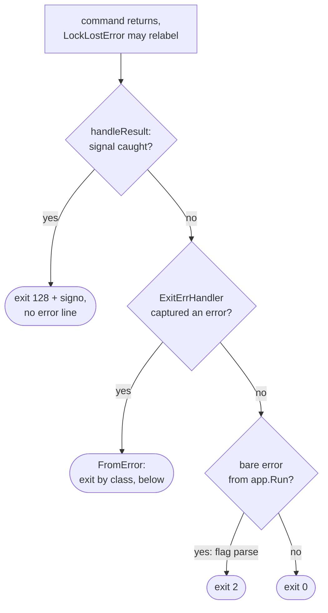
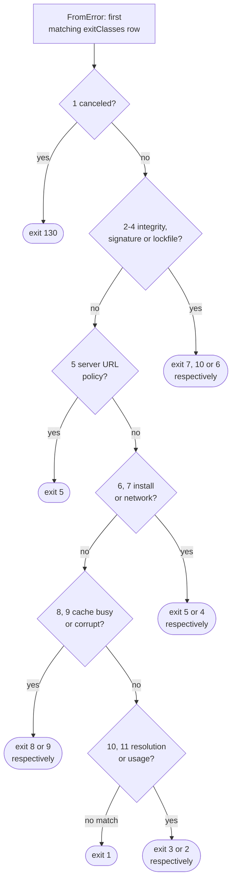

# HTTP, output and exit codes

Which HTTP client carries a request, how a line reaches the terminal, and how
a run gets its exit code. What each code means is on
[Exit codes](../exit-codes.md).

## HTTP clients

`internal/galaxy/fetch` builds every `*http.Client` and owns its per-origin
policy; every pool comes from `newTransport`, so their settings cannot drift.
Every client runs `checkRedirect`: 10 hops at most, `Referer` deleted.

| Client | Constructor | Carries | Refuses a redirect | Used for |
| --- | --- | --- | --- | --- |
| Galaxy | `fetch.New` | a server's token and relaxed TLS, on its exact origin only | past 10 hops | Galaxy API, downloads, S3 cache |
| Offline | `fetch.NewOffline` | nothing: fails every request with `ErrOfflineMode` | - | Galaxy under `--offline`; signature and url clients take the same transport |
| Signature | `fetch.NewUnauthenticated` | nothing | past 10 hops | `signatures:` sources |
| Git | `fetch.NewGit` | only the `GO_GALAXY_GIT_*` credential go-git adds; a non-2xx body capped at 64 KiB | off-origin: `ErrGitTransportFailed` | `gitfetch` |
| url | `fetch.NewURLDownload` | a `GO_GALAXY_URL_*` Bearer token, judged per hop | https to http: `ErrDownloadFailed` | `Infra.URLHTTP` |

- No `http.Client.Timeout`, which caps a whole transfer: `ResponseHeaderTimeout`
  bounds the first byte and the watchdog each read.
- Two pools, not one `DialTLSContext`: the idle pool key ignores `tls.Config`,
  and `DialTLSContext` switches off ALPN HTTP/2.
- The auth and TLS layers stay separate types, so a token and
  `InsecureSkipVerify` never share a struct.
- `serverAuths`, `urlBindings` and `gitCredentials` are the only `Reveal`
  sites for Galaxy, url and git secrets, called while clients are wired.
- The S3 backend rides the shared client, so config refuses `--offline` beside
  it (`ErrS3CacheOffline`) before any client is built.

The watchdog cancels its derived context when a read stalls, and reports
`ErrReadStalled` only while the caller's context is live. Its body is
unsynchronized: abort by canceling the context, never by a concurrent `Close`.
Per-hop credentials: [Redirects](boundaries.md#redirects).

## Operator output

| Tier | `output.Printer` methods | Default | `--quiet` | `--verbose` | Stream |
| --- | --- | --- | --- | --- | --- |
| Progress | `Printf` | spinner suffix on a terminal, else a line | dropped | a line | stdout |
| Debug | `Debugf`, `DebugSincef` | dropped | dropped | a `Debug:` line | stdout |
| Result | `PersistentPrintf`, `Okf`, `OkVersionf`, `Updatef` | printed | printed | printed | stdout |
| Diagnostic | `Errorf`, `ErrorVersionf`, `Warnf` | printed | printed | printed | stderr |

What a user sees: [Output and color](../cli.md#output-and-color).

- `internal/progress` is the one `Printer`, and under `--verbose` the `log`
  sink too, so a dependency's line is sanitized.
- Each method cleans its payload into `safeout.Text`; `writeLine` then adds
  markers and the version tag, so `OkVersionf` takes the version apart:
  formatted in, its color would become U+FFFD.
- The spinner writes `os.Stdout` directly when it is a character device (so
  `/dev/null` counts), with autowrap off for one frame's bytes only.
- `Close` drops the spinner, because the next line would restart a kept one.

`safeout.Clean` sanitizes text of external origin
([what it replaces](boundaries.md)). `IsUnsafeRune` defines that set for
`Clean`, `NewWriter` and `helpers.IsPathElement` alike, and `safeout.Text`
forces an explicit conversion from any typed string. `NewWriter` cleans each
`Write` alone, so `tree` and `explain` write whole lines.

## Exit code classes

| Row | Predicate | Placed here because |
| ---: | --- | --- |
| 1 | `isCanceled` | checked first: only a caller's own cancellation may reach it |
| 2-4 | `isIntegrityError`, `isSignatureError`, `isLockError` | above the install headline, which would claim them joined |
| 5 | `isServerSuppliedURLPolicyError` | exits 5 bare or behind either headline |
| 6, 7 | `isInstallError`, `isNetworkError` | hold the headlines `ErrInstallationFailed`, `ErrLatestVersionLookupFailed` |
| 8, 9 | `isCacheBusyError`, `isCacheCorruptError` | above usage, whose `fs.ErrNotExist` arm matches any not-exist cause |

`TestExitClassOrderIsPinned` pins the order. `errors.Is` walks a joined
failure, so a class above its headline keeps its code and one below collapses
to it.

- `cache.LockLostError` renders the run's error behind `ErrCacheLockLost` with
  `%v`, so lock loss outranks every class. A canceled parent, or a holder not
  lost, passes the error through, which keeps the local backend inert.
- `errRecorder` on the root's `ErrWriter` records whether urfave printed a
  flag failure (an argv one, never `GO_GALAXY_WORKERS=abc`); `handleResult`
  prints the rest.
- On cancellation `runInstallLevel`, `warmCollections` and `warmRoles` return
  nil or a failure summary, never `ctx.Err()`, so the save and metrics tail
  still runs and a success line can precede the signal's code.

## Adding a sentinel

An error carries exactly one class's sentinel, or the check order decides its
code; a producer rewraps a cause that carries another class's at the source. A
sentinel for a stall, a deadline or a lost lock renders its context cause with
`%v`, because a reachable `context.Canceled` exits 130 like a Ctrl-C.

`ErrSignatureSourceUnavailable` alone passes a Ctrl-C through (`%w`):
`transportCause` strips only the `*url.Error`.

| Relabel helper | Sentinel | Only when |
| --- | --- | --- |
| `cache.deadlineError` | `ErrMetadataFetchDeadline`, `ErrStateObjectDeadline` | parent live, own budget expired, error carries a context error |
| `collections.artifactDeadlineError` | `ErrArtifactDownloadDeadline` | parent live, own budget expired; never a sha256 mismatch or unusable backend |
| `collections.signatureDeadlineError` | `ErrSignatureFetchDeadline` | parent live, own budget expired |

| Reclassification | Where | Why |
| --- | --- | --- |
| `ErrEmptyGzipMember` in no predicate | each reader wraps it into its own class | claimed by install, a corrupt S3 snapshot would exit 5 |
| `ErrResponseTooLarge` -> `ErrStateObjectTooLarge`, via `%v` | `internal/cache/s3` | would match exit 4 and 9 at once |
| `ErrGitArtifactSelfCheck` cause as text | `collectionbuild`, `rolebuild` | a builder defect is not the remote's |
| `net.Error` -> `ErrGalaxyServerUnavailable` | `cache.unreachableError`, skipped if the context ended or `isClassifiedFetchError` | a refused dial or DNS failure would exit 1 |
| `*cache.HTTPStatusError` (any status but 200 and a revalidation's 304) -> `ErrGalaxyAuthFailed` (401, 403), else `ErrGalaxyServerUnavailable`; a 404 to nothing | `HTTPStatusError.Unwrap`, by `cache.StatusClass` | a status on any metadata document would exit 1; `Error` leads with the class, so no caller wraps it |
| A `404` -> `ErrNoSemverCandidates`, or `ErrRoleVersionNotFound` for a found role's versions | `collections.notPublishedError`, `galaxyv1.versionsGoneError` | a bare 404 exits 1, and the role's would read as a server without v1 |
| JSON syntax error -> `ErrMetadataNotJSON` | `cache.decodeMetadata` (`*notJSONError`) | would exit 1; exits 4 via `isMetadataDocumentError` |
| Any other decode error (`*json.UnmarshalTypeError`, a timestamp's `*time.ParseError`) -> `ErrMetadataMalformed`; a non-pointer target stays bare | `cache.decodeMetadata` | would exit 1; exits 4 via `isMetadataDocumentError` |

The exit-code tests are closed tables and nothing enumerates `helpers`, so a
new sentinel needs a predicate and a table row or it silently exits 1;
`genericSentinels` lists deliberate 1s. The tables build `%v` shapes
themselves, so only producer tests such as `TestLockLostError` catch a switch
to `%w`. `internal/galaxy/extracted`'s sentinels stay unclassified: only
workers raise them, behind `ErrInstallationFailed`.

`--help`'s exit index is literals in `newRootCommand`, each leading its row in
[Exit codes](../exit-codes.md).
`TestRootCommandDisclosesDefaultCommandAndExitCodes` pins them to the
`exitcode` constants but never reads the doc: change literal, test row and
doc row together.
