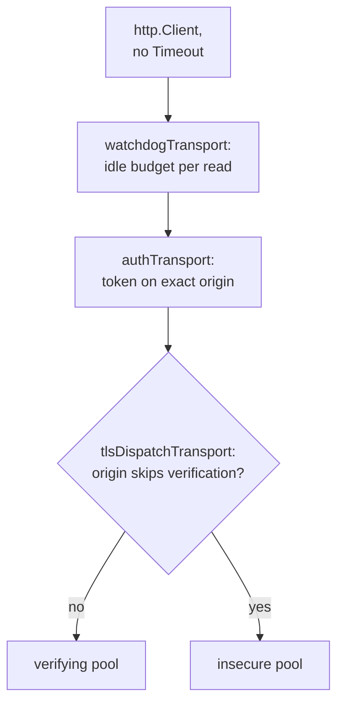

# HTTP, output and exit codes

Which HTTP client carries a request, how a line reaches the terminal, and how
a run gets its exit code. What each code means is on
[Exit codes](../reference/exit-codes.md).

## HTTP clients

`internal/galaxy/fetch` builds every `*http.Client` and owns its per-origin
policy. The S3 client is a copy of one. Every pool comes from `newTransport`,
so their settings cannot drift.

| Client | Constructor | Carries | Used for |
| --- | --- | --- | --- |
| Galaxy | `fetch.New` | a server's token and relaxed TLS, on its exact origin only | Galaxy API, downloads |
| S3 | `newClient`, run by `Backend.Open`: a shallow copy of the Galaxy client `s3.New` was handed, same transport, `CheckRedirect` set to `refuseRedirect` | the SigV4 headers it signs per request | the S3 cache |
| Offline | `fetch.NewOffline` | nothing: fails every request with `ErrOfflineMode` | Galaxy under `--offline`. The signature and url clients take the same transport then, and git gets `gitsource.Offline` (below) |
| Signature | `fetch.NewUnauthenticated` | nothing | `signatures:` sources |
| Git | `fetch.NewGit` | only the `GO_GALAXY_GIT_*` credential go-git adds; a non-2xx body capped at 64 KiB | `gitfetch` |
| url | `fetch.NewURLDownload` | a `GO_GALAXY_URL_*` Bearer token, judged per hop | `Infra.URLHTTP` |

The diagram shows the Galaxy client's layers, outermost first. `NewGit` wraps
them in `errorBodyCapTransport`, `NewURLDownload` puts `urlAuthTransport`
outside them, and an offline client is `offlineTransport` alone.

- No `http.Client.Timeout` on a network client, since it caps a whole
  transfer: `ResponseHeaderTimeout` bounds the first byte and the watchdog
  each read.
- The watchdog cancels its derived context when a read stalls, and reports
  `ErrReadStalled` only while the caller's context is live. Its body is
  unsynchronized: abort by canceling the context, never by a concurrent `Close`.
- Two pools, not one `DialTLSContext`: the idle pool key ignores `tls.Config`,
  and `DialTLSContext` switches off ALPN HTTP/2.
- The auth and TLS layers stay separate types, so a token and
  `InsecureSkipVerify` never share a struct.
- The S3 backend rides the shared client, so config refuses `--offline` beside
  it (`ErrS3CacheOffline`) before any client is built.
- `fetch.NewGit` takes no offline flag, and an ssh remote uses no HTTP client
  at all, so no transport could refuse git traffic under `--offline`. The run
  gets `gitsource.Offline` in place of `gitfetch` instead: every `Advertise`,
  `Acquire` and `AcquireRole` refuses with `ErrOfflineMode` naming the
  repository. Each git path still checks `cfg.Offline` before the call, since
  that check names what the cache lacks.

Redirect limits, per-hop credentials and the S3 copy's refusal of every hop:
[Redirects](boundaries.md#redirects). Where each secret is revealed:
[Credentials and the token pairing rule](boundaries.md#credentials-and-the-token-pairing-rule).

## Operator output

| Tier | `output.Printer` methods | Default | `--quiet` | `--verbose` | Stream |
| --- | --- | --- | --- | --- | --- |
| Progress | `Printf` | spinner suffix on a terminal, else a line | dropped | a line | stdout |
| Debug | `Debugf`, `DebugSincef` | dropped | dropped | a `Debug:` line | stdout |
| Result | `PersistentPrintf`, `Okf`, `OkVersionf`, `Updatef` | printed | printed | printed | stdout |
| Diagnostic | `Errorf`, `ErrorVersionf`, `Warnf` | printed | printed | printed | stderr |

What a user sees: [Output and color](../reference/cli.md#output-and-color).

- `internal/progress` is the one `Printer`, and under `--verbose` the `log`
  sink too, so a dependency's line is sanitized.
- Each method cleans its payload into `safeout.Text` before `writeLine` adds
  the markers and the version tag. That is why `OkVersionf` and
  `ErrorVersionf` take the version as a separate argument: a color escape
  spelled into the format would be cleaned to U+FFFD.
- The spinner writes `os.Stdout` directly when it is a character device (so
  `/dev/null` counts), with autowrap off for one frame's bytes only.
- `Close` drops the spinner, because the next line would restart a kept one.
- The package-level `Okf`, `Warnf`, `Errorf` and `PersistentPrintf` serve
  `hash`, `tree`, `explain` and `migrate`, which own no `Progress`: they
  resolve color per call and ignore `--quiet`.

`safeout.Clean` sanitizes text of external origin. What it replaces is under
[Printed output](boundaries.md#printed-output). `IsUnsafeRune` defines that
set for `Clean`, `NewWriter` and `helpers.IsPathElement` alike, and for the
strings `projectfile.Encode` writes, and `safeout.Text` forces an explicit
conversion from any typed string. `NewWriter` cleans each `Write` alone, and a
multi-byte rune split across writes becomes one U+FFFD per byte, so `tree`,
`explain` and `migrate --dry-run` write whole lines.

## Exit code classes

`handleResult` branches as drawn in
[Process entry and exit](commands.md#process-entry-and-exit). An error that
`ExitErrHandler` captured goes to `FromError`, which returns the code of the
first `exitClasses` row whose predicate matches. `errors.Is` walks a joined
failure, so a class above its
[summary error](../reference/exit-codes.md#when-several-things-fail) keeps its
code and one below collapses to it. `TestExitClassOrderIsPinned` pins the
order.

| Row | Predicate | Exit | Placed here because |
| ---: | --- | ---: | --- |
| 1 | `isCanceled` | 130 | checked first: only a caller's own cancellation may reach it |
| 2 | `isIntegrityError` | 7 | above row 6, whose `ErrInstallationFailed` would claim it joined |
| 3 | `isSignatureError` | 10 | as row 2, and below it: wrong bytes outrank who vouched for them |
| 4 | `isLockError` | 6 | as row 2, and above row 5: `checkLockedDownloadURLs` wraps row 5's `ErrDownloadURLOffServerOrigin` |
| 5 | `isServerSuppliedURLPolicyError` | 5 | exits 5 bare or behind either summary error |
| 6 | `isInstallError` | 5 | holds `ErrInstallationFailed`, the summary error of `install` and `warm` |
| 7 | `isNetworkError` | 4 | holds `ErrLatestVersionLookupFailed`, the summary error of `outdated` |
| 8 | `isCacheBusyError` | 8 | below rows 6 and 7, so contention behind `ErrInstallationFailed` exits 5 and a joined wire failure stays the cause |
| 9 | `isCacheCorruptError` | 9 | below row 6 for the same reason, and above rows 10 and 11 |
| 10 | `isResolutionError` | 3 | above row 11 |
| 11 | `isUsageError` | 2 | last: its `fs.ErrNotExist` arm matches any not-exist cause |
| - | no match | 1 | the fallback |

- `cache.LockLostError` renders the run's error behind `ErrCacheLockLost` with
  `%v`, so lock loss outranks every class. A canceled parent, or a holder that
  still has the lock, passes the error through. The local backend's holder
  never loses its lock, so there it changes nothing.
- `errRecorder` on the root's `ErrWriter` records whether urfave printed a
  flag failure (an argv one, never `GO_GALAXY_WORKERS=abc`); `handleResult`
  prints the rest.
- On cancellation `runInstallLevel`, `warmCollections` and `warmRoles` return
  nil or a failure summary, never `ctx.Err()`, so the save and metrics tail
  still runs and a success line can precede the signal's code.

## Adding a sentinel

1. Add the sentinel to its class's predicate in
   `cmd/go-galaxy/exitcode/exitcode.go`.
2. Add a row for it to `fromErrorCases` in `exitcode_test.go`, or to
   `genericSentinels` for a deliberate 1. Nothing enumerates `helpers`:
   without that row, a sentinel left out of step 1 silently exits 1.
3. If the producer wraps a context cause, render it with `%v` and pin that in
   the producer's own test, as `TestLockLostError` does. The tables build `%v`
   shapes themselves, so they never catch a switch to `%w`.

Prefer one class per error. When a cause carries another class's sentinel,
render it with `%v` at the source. Keep both with `%w` only when the class you
want ranks higher: `lockfile.File.validate` keeps `ErrGalaxyServerURLUserinfo`
under `ErrLockfileInvalid` so a lockfile exits 6, pinned by
`TestLockfileUserinfoClassifiesAsLock`.

A sentinel for a stall, a deadline or a lost lock renders its context cause
with `%v`, because a reachable `context.Canceled` exits 130 like a Ctrl-C.
`ErrSignatureSourceUnavailable` alone wraps its cause with `%w`, so a Ctrl-C
during a signature fetch still exits 130. `transportCause` strips only the
`*url.Error` layer, whose text carries the whole request URL, query included.
`internal/galaxy/extracted`'s sentinels stay unclassified: only workers raise
them, behind `ErrInstallationFailed`.

### Where errors are relabeled

| Relabel helper | Sentinel | Only when |
| --- | --- | --- |
| `cache.deadlineError` | `ErrMetadataFetchDeadline`, `ErrStateObjectDeadline` | parent live, own budget expired, error carries a context error |
| `collections.artifactDeadlineError` | `ErrArtifactDownloadDeadline` | parent live, own budget expired; never a sha256 mismatch or unusable backend |
| `collections.signatureDeadlineError` | `ErrSignatureFetchDeadline` | parent live, own budget expired |

| Reclassification | Where | Why |
| --- | --- | --- |
| `ErrEmptyGzipMember` in no predicate | each reader wraps it into its own class | claimed by install, a corrupt S3 snapshot would exit 5 |
| `ErrResponseTooLarge` -> `ErrStateObjectTooLarge`, via `%v` | `internal/cache/s3` | would match exit 4 and 9 at once |
| `ErrGitArtifactSelfCheck` cause as text | `collectionbuild`, `rolebuild` | a builder defect is not the remote's |
| `net.Error` -> `ErrGalaxyServerUnavailable` | `cache.unreachableError`, skipped if the context ended or `isClassifiedFetchError` | a refused dial or DNS failure would exit 1 |
| `*cache.HTTPStatusError` (any status but 200 and a revalidation's 304) -> `ErrGalaxyAuthFailed` (401, 403), else `ErrGalaxyServerUnavailable`; a 404 to nothing | `HTTPStatusError.Unwrap`, by `cache.StatusClass` | a status on any metadata document would exit 1; `Error` leads with the class, so no caller wraps it |
| A `404` -> `ErrNoSemverCandidates`, or `ErrRoleVersionNotFound` for a found role's versions | `collections.notPublishedError`, `galaxyv1.versionsGoneError` | a bare 404 exits 1, and the role's would read as a server without v1 |
| JSON syntax error -> `ErrMetadataNotJSON` | `cache.decodeMetadata` (`*notJSONError`) | would exit 1; exits 4 via `isMetadataDocumentError` |
| Any other decode error (`*json.UnmarshalTypeError`, a timestamp's `*time.ParseError`) -> `ErrMetadataMalformed`; a non-pointer target stays bare | `cache.decodeMetadata` | would exit 1; exits 4 via `isMetadataDocumentError` |

## The `--help` exit index

`--help`'s exit index is literals in `newRootCommand`, each leading its row in
[Exit codes](../reference/exit-codes.md).
`TestRootCommandDisclosesDefaultCommandAndExitCodes` pins them to the
`exitcode` constants and, for the 129 and 143 rows, to `exitcode.FromSignal`.
It never reads the doc: change literal, test row and doc row together.
