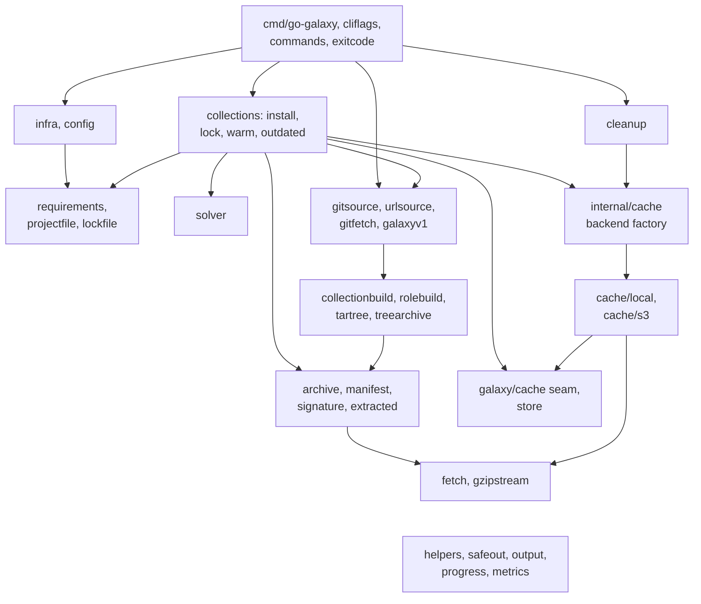
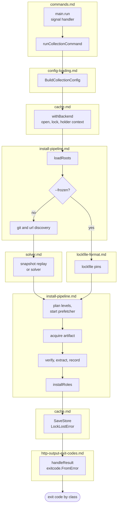

# How it works

These pages describe how go-galaxy is built: which package owns what, the seams
between packages and the rules a change must keep. What a command does for an
operator is on the user pages, starting with the [CLI reference](../cli.md).

## Package map

Each node groups packages the table below lists one by one. Arrows point from
importer to imported and show the main edges only; edges into the `helpers`
node are left out, since nearly every package imports it.
`cmd/go-galaxy` wires, `internal/galaxy/*` works, `internal/cache/*` persists
behind a seam.

| Package | Owns | Holds |
| --- | --- | --- |
| `cmd/go-galaxy` | `newRootCommand`, the signal handler in `run`, the exit decision in `handleResult` | SIGQUIT left to Go's goroutine dump |
| `cmd/go-galaxy/cliflags` | flag names, aliases, defaults, environment sources | reads no value back |
| `cmd/go-galaxy/commands` | the command tree, `runCollectionCommand`, `lockfilePath`, the `hash`, `tree` and `explain` printers | no pipeline work |
| `cmd/go-galaxy/exitcode` | sentinel or signal to exit code (`FromError`, `FromSignal`) | a sentinel no `exitClasses` predicate matches exits 1 |
| `cmd/go-galaxy/buildinfo` | the `--version` string | fills gaps from `debug.ReadBuildInfo`, never the network |
| `internal/galaxy/collections` | install, lock, warm, outdated for collections and roles | cache access only through `withBackend` |
| `internal/galaxy/cleanup` | reachability over every recorded project, then removal | deletes through an `os.Root` per project |
| `internal/galaxy/config` | one `*Config` from every source | precedence; every secret a `Secret`; no network |
| `internal/galaxy/infra` | `Infra`, the per-run container | test-only deadlines behind accessors |
| `internal/galaxy/requirements` | requirements.yml and galaxy.toml entries | every name, URL and signature source judged here |
| `internal/galaxy/projectfile` | galaxy.toml schema, `[tool.go-galaxy]`, `${VAR}` expansion | only BurntSushi/toml importer |
| `internal/galaxy/lockfile` | galaxy.lock `Load`, `Save`, `Hash`, `Compare` | `Load` judges it as repository content |
| `internal/galaxy/solver` | the version solver | imports only `helpers`; metadata through `Provider` |
| `internal/galaxy/gitsource` | git grammar, locator, credential matching, `Client` seam | imports no go-git |
| `internal/galaxy/urlsource` | url grammar, locator, `GO_GALAXY_URL_*` prefix | no transport |
| `internal/galaxy/gitfetch` | `gitsource.Client`: advertise, fetch by hash, read the tree | only go-git importer; unregisters `file` and `git` transports |
| `internal/galaxy/galaxyv1` | Galaxy v1 role name to GitHub repository and tag | never reads `download_url` |
| `internal/galaxy/treearchive` | a `Source` tree to a deterministic tar.gz | only production tar writer; never reads the filesystem |
| `internal/galaxy/collectionbuild` | ignore rules, `MANIFEST.json`, `FILES.json`, identity, `ParseManifestInfo` | self-checks every artifact |
| `internal/galaxy/rolebuild` | a role tree to an artifact, dependency specs carried unjudged | no lead documents |
| `internal/galaxy/tartree` | a url role tarball as a `treearchive.Source` | bytes read only through `archive` |
| `internal/galaxy/archive` | tar.gz extraction and shape probe | refusal sentinels; the caller contains the destination |
| `internal/galaxy/extracted` | the content-addressed store, `Materialize` | writes through an `os.Root` at the cache directory |
| `internal/galaxy/manifest` | `MANIFEST.json` and `FILES.json` cross-checks | read-only |
| `internal/galaxy/signature` | detached OpenPGP over `MANIFEST.json` | read-only; persists no verdict |
| `internal/galaxy/cache` | `Backend`, `ArtifactStore`, decorators, `LockLostError`, `FetchJSONWithCachePolicy` | budgets set above the seam, never in a backend |
| `internal/galaxy/store` | the snapshot `Store`, Bolt file, registry, instance lock | setters clone, getters copy; dirty-flag audit |
| `internal/cache` | `New`, the backend factory | only code naming a concrete backend |
| `internal/cache/local` | Bolt snapshot, JSON registry, flock | - |
| `internal/cache/s3` | S3 backend, hand-rolled SigV4, conditional-write lock | no AWS SDK |
| `internal/galaxy/fetch` | every `*http.Client` and its per-origin policy | never imports `config` |
| `internal/galaxy/metrics` | run counters and the JSON report | - |
| `internal/galaxy/output` | the `Printer` interface | imports only `time` |
| `internal/progress` | the `Printer` implementation | spinner only on a TTY |
| `internal/safeout` | control-character stripping | imports nothing in the module |
| `internal/gzipstream` | gzip reads over untrusted bytes | only pgzip reader |
| `internal/galaxy/helpers` | sentinels, caps, tuning constants, predicates | one rule per value shape |

Test-only and tooling packages

| Package | Owns |
| --- | --- |
| `cmd/go-galaxy-benchmark` | the benchmark binary, never released ([development](development.md#the-benchmark-harness)) |
| `internal/proseaudit` | dashes, test line citations, three-line comment blocks |
| `internal/lockaudit` | work under the lock's holder context |
| `internal/ciaudit` | the golangci-lint version pin |
| `internal/testing/fakegalaxy` | in-memory Galaxy v3 and v1 role API double |
| `internal/testing/fakegit` | in-process smart-HTTP and ssh git remote |
| `internal/testing/faketree` | in-memory `treearchive.Source` |

The audits run under `go test ./...`; [Development](development.md) states
each rule.

## Rules the graph enforces

| Rule | Why |
| --- | --- |
| `solver` imports only `helpers` from the module | it cannot reach I/O even by accident |
| `helpers` imports only `safeout` from the module | sentinels, caps and predicates serve every layer without a cycle |
| only `gzipstream` reads with pgzip | one place checks context and refuses empty members |
| only `projectfile` imports BurntSushi/toml | a parse error echoes input, so one place renders it |
| only `gitfetch` imports go-git in production | requirements, lockfile, store and cleanup never link a transport |
| `treearchive` is the only production tar writer | collections and roles share one byte shape and budget |
| only `internal/cache.New` names a backend | the rest codes to `Backend` and `ArtifactStore` |
| `Infra` carries per-run dependencies | extend it rather than add a global or widen a signature |
| `cmd/go-galaxy` does no pipeline work | five commands hand off through `runCollectionCommand`; `hash`, `tree` and `explain` print what `lockfile` and `requirements` load |

The monopolies on pgzip and toml are tests
(`TestPgzipBeyondItsWriterAPIIsThisPackagesAlone`,
`TestTOMLIsThisPackagesAlone`); the go-git, backend and tar-writer ones are
lint rules, listed under [Lint](development.md#lint).

A collection name has two alphabets, picked by source kind:
`IsCollectionNamePart` (`^[a-z][a-z0-9_]*$`, what Galaxy servers accept) and
`IsURLCollectionNamePart` (`[A-Za-z0-9_]+`, for a url artifact's own
`MANIFEST.json`). Neither is path safety: `SplitFQDN` checks shape only, so a
caller joining halves into a path applies `IsPathElement`.

`IsExactVersion` is a path check: whatever it accepts is an `IsPathElement`
under either `semver.CoerceNewVersion` grammar.
`TestIsExactVersionImpliesIsPathElementExhaustive` and a fuzz target pin that,
because a semver upgrade widening the grammar would reopen path traversal. Role
names (`IsRoleName`, `IsRoleInstallName`) have their own alphabet, since real
ones carry hyphens, capitals and leading digits.

### Traps

| Change | What goes wrong |
| --- | --- |
| rename or move `Version`, `Commit`, `Date`, `BuiltBy` out of `main` | `-X` ignores a missing name; a release reports only what `buildinfo` recovers |
| add a command | the root's `commands.NoArguments` refuses its arguments until it declares a validator |
| return from `gzipstream` without storing the error | the next read blocks in pgzip, which has no context |
| hand `gzipstream`'s `Reset` another reader than its `*bufio.Reader` | pgzip rebuffers and drops bytes past the member boundary |
| move `gzipstream`'s context check to the decompressed side | a member of empty stored blocks consumes input unchecked |

## One run

Each group names the page that explains it. `outdated` opens no backend, and
`hash`, `tree` and `explain` build no `Config`; [Command flows](commands.md)
draws every command branch by branch.

## Where to read next

| Question | Page |
| --- | --- |
| How do flags, galaxy.toml, ansible.cfg and the environment become one `Config`? | [Configuration loading](config-loading.md) |
| How is a version picked, and how is a conflict explained? | [Version solver](solver.md) |
| How does an artifact go from a server or repository to disk? | [Install pipeline](install-pipeline.md) |
| What does the cache hold, and how is it locked? | [Cache and storage](cache.md) |
| What does galaxy.lock pin, and which schema? | [Lockfile format](lockfile-format.md) |
| Which HTTP client carries what, how is output printed, how is the exit code chosen? | [HTTP, output and exit codes](http-output-exit-codes.md) |
| What is refused where, with which sentinel? | [Security boundaries](boundaries.md) |
| How is a command's control flow read? | [Command flows](commands.md) |
| What does `install` do, flag by flag? | [install flow](flow-install.md) |
| What does `lock` do? | [lock flow](flow-lock.md) |
| What does `warm` do? | [warm flow](flow-warm.md) |
| What does `cleanup` remove, and why? | [cleanup flow](flow-cleanup.md) |
| What does `outdated` compare? | [outdated flow](flow-outdated.md) |
| What do `hash`, `tree` and `explain` read? | [hash, tree and explain](flow-hash-tree-explain.md) |
| How are tests, gates, lint and the docs site run? | [Development](development.md) |
| How is a release verified, and what must an operator trust? | [Security](../security.md) |
