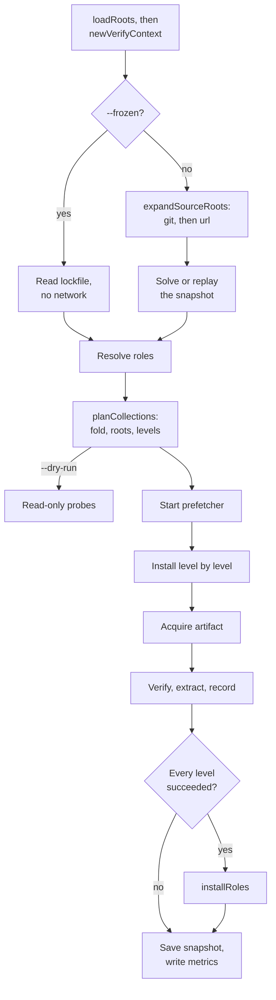
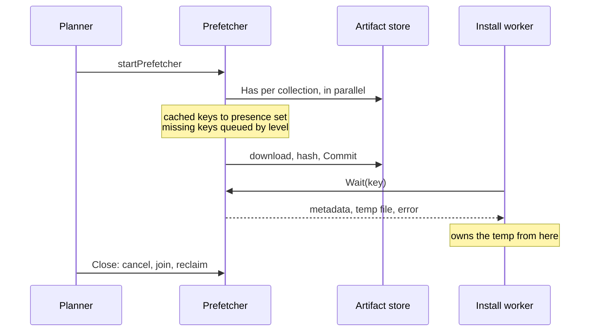
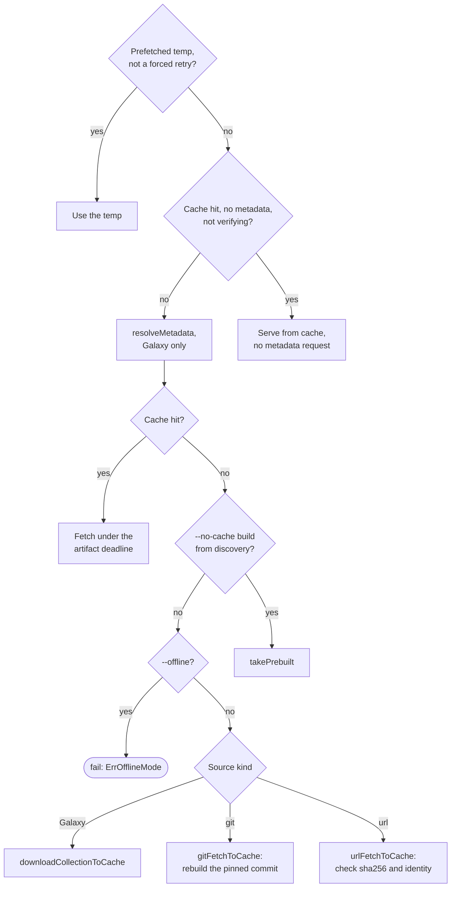

# Install pipeline

How `install` and `warm` take a requirements file to installed or cached
trees, and why each step sits where it does. All of it is in
`internal/galaxy/collections` and runs inside `withBackend`, under the cache
lock's holder context ([The cache seam](cache.md#the-cache-seam)). Control
flow and exit codes: [install flow](flow-install.md) and
[warm flow](flow-warm.md).

The diagram is `install`'s order. `warm` runs `planCollections` before it
resolves roles, then warms instead of installing
([warm flow](flow-warm.md#plan)).

## Plan construction

| Function | Why here |
| --- | --- |
| `checkRootSources`, in `loadRoots` | The first point holding both the parsed file and the run's servers, so an unknown `source:` fails before any request, under `--frozen` too |
| `newVerifyContext` | A bad keyring fails before any background download |
| `resolveOrLoadLockfile` | `--frozen` asks no API; the locked `download_url` stands in for metadata unless verifying |
| `resolveOrLoadRoles` | A missing role fails before any background download |
| `buildCollectionsMap` | The only gate on a version replayed from the `resolved` bucket |
| `verifyRootsResolved` | Catches a solve that dropped a root |
| `buildInstallLevels` | A cycle fails before any prefetch worker; levels order the queue |

Under `--frozen`, `resolveFromLockfile` holds each root to its entry
(`verifyRootsAgainstLockfile`, `ErrLockfileMismatch`) and builds the graph
from the file. On a cache miss, `versionMetadata` then hands over the locked
`download_url` and `sha256` without a request. A verifying run passes
`lockedURLs` false and fetches the version metadata, since a server's
signatures ride on it.

`planCollections` bundles the last three rows. A replay of the `resolved`
bucket refuses only an empty version (`collectionFromResolvedEntry`), so
skipping the fold lets a poisoned `*` reach a worker.

## Two pools, two resources

| Flag | Bounds | Sized by |
| --- | --- | --- |
| `--workers` | Install, warm and role workers, dry-run probes, metadata prewarm, `outdated` | Memory: a 4 x 1 MiB pgzip reader each |
| `--download-workers` | Prefetch, presence scan, discovery, version pages | Network; the probe holds one 64 KiB block |

Defaults and accepted values: [Concurrency](../reference/cli.md#concurrency).

- Both defaults derive from `runtime.GOMAXPROCS(0)`, never
  `runtime.NumCPU()`, which ignores a CFS quota. No test pins it: narrowing
  it races parallel tests.
- `MaxAcceptedInstallWorkers` bounds `--workers` only. The default must lie
  inside it: urfave marks an exported empty `GO_GALAXY_WORKERS=` as set
  without parsing it, so the range check sees the default.

## Git discovery

`resolveCollectionsInternal` first runs `expandSourceRoots`: git roots, then
url roots, each on the download pool and merged in input order. The
requirements signature is taken after this expansion, so it covers the
commit, not just the ref ([Resolution replay](cache.md#resolution-replay)).

| Case | `expandGitRoot` does |
| --- | --- |
| Policy allows a read, pin exists | `replayGitPin`: re-validates commit and identities, no network |
| `--offline`, no pin | Fails with `ErrOfflineMode` |
| `--refresh` without `--no-cache`, branch or tag pinned | One `Advertise`; an unchanged commit with its artifacts cached keeps the pin |
| Otherwise | `acquireGitRoot`: fetch, build, commit, record the pin |

A fetch goes through `gitsource.Client`, which `gitfetch` implements; under
`--offline` the client is `gitsource.Offline`, which refuses every call.
`collectionbuild` builds each collection through `treearchive` and
self-checks it with `manifest.VerifyChain` ([Packages](index.md#packages)).

- A built collection becomes an exact-pin root, locator
  `git+<url>#<subdir>@<commit>`, which the [solver](solver.md) answers from
  `gitDiscoveryMemo`, never from a Galaxy server.
- When the entry names a collection, `recordSelected` keeps only that one
  before it enters `gitDiscoveryMemo`, because a memo entry answers its fqdn
  for the whole run, over any Galaxy root or dependency.
- Under `--no-cache` the build rides the pin as `prebuilt`, taken once;
  `withBackend` deletes untaken ones.

Behavior: [What a git repository must hold](../guides/requirements.md#what-a-git-repository-must-hold).

## URL discovery

`expandURLRoots` runs after the git expansion; only then does
`checkExpandedDuplicates` look for one fqdn from two roots, since an
unexpanded root has none.

| | Git root | Url root |
| --- | --- | --- |
| Pin bucket, key | `git_pins`, `url\nref\nsubdir` | `url_pins`, the URL |
| Pin replayed | Whenever the policy reads; never aged out | Same |
| Fetched by | `Infra.Git` | `Infra.URLHTTP`, the artifact retry policy |
| Identity from | `galaxy.yml` | `MANIFEST.json`, via `collectionbuild.ParseManifestInfo` |
| Name check | `helpers.IsCollectionNamePart` | `helpers.IsURLCollectionNamePart`, mixed case allowed |
| Locator | `git+<url>#<subdir>@<commit>` | `url+<url>#sha256:<hex>` |
| Pin re-checked | On a refetch | Every install and warm, via `col.SHA256` |

A `version:` is asserted against the manifest on both paths
(`ErrURLCollectionVersionMismatch`), and a replayed pin passes the same
predicates as a fresh manifest.

## Role resolution

| Source | Resolved by | Pin key in `role_pins` | Locator |
| --- | --- | --- | --- |
| git | `resolveGitRole`: `Git.AcquireRole`, which fetches and builds with `rolebuild` | `url\nref\n` | `git+<url>#@<commit>` |
| Galaxy | `resolveGalaxyRole`: `galaxyv1` names repository and tag, then the git path | `galaxy\nname\nrequested`, plus the git pin | `git+<github-url>#@<commit>` |
| url | `resolveURLRole`: download, `tartree.Load`, `rolebuild.Build` | `url\n<url>` | `url+<url>#sha256:<hex>` |

`resolveRoles` walks `roles:` and meta dependencies breadth-first. Each level
resolves on the download pool and merges in input order, so ansible's
first-wins follows declaration order (`dedupeRoleLevel`). Past
`helpers.RoleGraphMaxRoles` (1000) it fails with `ErrInvalidRoleEntry`.

- A git or url role pin replays only while its artifact is stored
  (`roleArtifactCached`).
- A git role at `HEAD` is labeled with the branch the remote says `HEAD`
  points at, else `HEAD`. A fetch by commit reaches no ref name, so under
  `--refresh` `refreshRolePin` hands `acquireRole` the label its
  advertisement gave, and keeps a pin at an unchanged commit only under it.
- `lookupGalaxyRole` tries servers in order, skipping one without v1 or the
  role. The first that lists the role owns it: `galaxyv1.Resolve` lists its
  versions from the v1 root that listed it and reads a `404` there as
  `ErrRoleVersionNotFound`, never as a server without v1.
- The repository's commit wins over the one Galaxy recorded.
- A url role's version label is not in the pin key, so another `version:`
  re-downloads. The label's default is under
  [Roles](../guides/requirements.md#roles).

## Prefetch and handoff

| Invariant | Because |
| --- | --- |
| Download workers get a nil root, extract store and verify context | They only fill the cache; the install worker's skip check is the gate |
| `presence` is built before any consumer, never mutated | So it is read without a lock |
| A scheduled key never enters `presence` | The prefetcher writes it; after a failed prefetch the worker probes |
| A task commits without re-probing | It is the key's only committer: its consumer blocks in `Wait` |
| Every task ends in `finish`, canceled ones too | No `Wait` deadlocks |
| `Close` is deferred in `installWithState`, a callee of `withBackend` | Workers join before the lock is released |
| The scan is fail-open and uses `installRecordMatches` | A wrong answer costs one download |

A prefetch failure is a warning; the worker then acquires the artifact itself.
Roles are never prefetched. The prefetcher is off under `--dry-run`,
`--no-cache`, `--offline` or with no artifact store, and `warm` queues in key
order. Offline, each miss then fails on the worker's own `ErrOfflineMode`
check below, before any client is asked.

The metrics report is written before the deferred `Close` joins the pool. On a
failed install, a worker still downloading an undispatched level counts after
it, so the [counters](../reference/metrics.md#how-the-counters-count) are a lower bound.

## Acquiring an artifact

A verifying run gives up the metadata-free path (`servableFromCacheAlone`),
since a server's signatures ride on the version metadata. `prepareInstall`
tolerates one metadata failure, `ErrMetadataUnavailable`, raised only for a
cache hit whose metadata failed to load. Nothing else may raise it: an
unbuildable metadata URL raises `ErrMetadataRequestBuildFailed`.

`resolveArtifactSHA` trusts, in order: this process's own hash; under a pin, a
fresh hash of the file; then the server's digest or the cache sidecar, each
shape-checked (`ErrMalformedArtifactSHA256`, exit 7).

| Download arm | When | Does |
| --- | --- | --- |
| `streamDownloadAndExtract` | An extracted store is present | Tees temp file, sha256 and `IngestReader` in one pass |
| Temp file, then `archive.ProbeTarGz` | Prefetch, `--no-cache` | Keeps an error page out of a shared slot when no digest is declared |

Bytes a locked `download_url` served pass `checkLockedArtifactIdentity` in
either arm, after the sha256 and before the commit or `Promote`: their
`MANIFEST.json` must name the entry, since the URL's path is not judged.

| Budget | Covers | On expiry |
| --- | --- | --- |
| `--timeout` | `ResponseHeaderTimeout`, and each gap between body reads (the `fetch` watchdog) | No response or `ErrReadStalled`, both retried |
| `Infra.ArtifactDeadline`, 15 min | Attempts, backoffs, extraction, commit; a cache-hit `Fetch` too | `ErrArtifactDownloadDeadline`, terminal |
| `Infra.GitDeadline` | One git acquisition | The same sentinel |

Of up to four attempts, `downloadRetryable` retries a stall, a retryable
status or a transport failure with no response. An API GET
(`fetchRetryable`) does not retry that last case. Offline, the deadline,
cancellation and bad bytes are terminal. `artifactDeadlineError` relabels only
when the budget itself expired, rendering the cause with `%v` so it cannot
claim exit 130. A git refetch building another identity fails with
`ErrGitArtifactIdentityMismatch`.

The classification order in <code>downloadRetryable</code>

| Order | Error | Verdict |
| --- | --- | --- |
| 1 | `ErrOfflineMode`, `ErrArtifactDownloadDeadline` | Terminal, so a stall racing the deadline spends no backoff |
| 2 | `ErrReadStalled` | Retry |
| 3 | Canceled or expired context | Terminal |
| 4 | `ErrSHA256Mismatch`, `ErrResponseTooLarge`, `ErrArtifactNotTarGz`, `ErrArtifactTarHeaderNotFound` | Terminal: the URL serves the same bytes |
| 5 | Retryable status, or no response | Retry |

Rows 1 and 3 are load-bearing: an offline refusal or a context error from the
transport arrives as a no-response attempt, which row 5 would retry. Row 4
repeats the default-deny fallthrough, so a content verdict stays terminal even
when wrapped with a retryable status.

## Verify, extract, record

The pin proves the lockfile's bytes, the signature who published them, both
before any write a playbook could find. The manifest chain is checked only
once a signature verified ([boundaries](boundaries.md#reading-a-manifest)).

- `extractTree` serves collections and roles alike. `resetExtractionTarget`
  recreates the tree through `os.Root`, then `unpack` fills it by its plain
  path: nothing can be pre-planted in a directory just made. What the
  extractor refuses: [Archive extraction](boundaries.md#archive-extraction).
- `os.Root` guards the ancestors; a symlink escape is
  `ErrCollectionsPathEscape`, exit 5
  ([boundaries](boundaries.md#the-collections-tree-and-the-cache-directory)).
- `extracted.Ensure` unpacks once per sha256 and `Materialize` hardlinks the
  tree ([extracted store](cache.md#extracted-store-content-addressed-materialized-by-hardlink));
  under `--no-cache`, `archive.ExtractTarGz` unpacks in place.
- `resetCollectionInfo` drops every version's `.info`, so no stale
  [extract marker](#the-extract-done-marker) outlives its tree.
- `writeInfoFile` removes each name before writing it. `GALAXY.yml` keeps
  ansible-core's exact schema or ansible discards it; git and url provenance
  goes to `go-galaxy.yml`.

`recordInstall` stores path, source, sha256 and deps in `installed`. A skip
(`canSkipInstall`) needs that record, the marker and a matching sidecar, and
verifies nothing. Its one repair, `reconcileGalaxyInfo`, writes
`go-galaxy.yml` before `GALAXY.yml`, so a failed write keeps the provenance's
only copy.

Signature gather invariants

| Rule | Because |
| --- | --- |
| `nextBlob` pulls one blob at a time, declared sources first | 64 blobs of up to 1 MiB would otherwise sit resident per worker |
| `helpers.MaxSignaturesPerCollection` counts every candidate, duplicates included | One URI under many spellings cannot spend unbounded requests |
| A repeat is dropped by the sha256 of its bytes | `signature.Verify` counts distinct keys, so this saves only work |
| `serverSignatureBlobs` and `gatherLimit` share that one cap | `gatherOne`'s index stays in range only then |
| One `Keyring` serves every worker, never cloned | Nothing writes it after `LoadKeyring`; mutable state added breaks sharing |
| `Verify` reports a vacuous pass as a field | It knows no collection name; `warnVacuousPass` prints it |
| `signature.parseRequirementSource` is the one source grammar | Load validation, the `--offline` check and the fetch cannot disagree |

### The extract-done marker

The marker proves an installed tree complete. Its content is the tree's
tally: the count of non-directory entries, the count of directories and the
entries' summed sizes.

| Aspect | Rule |
| :-- | :-- |
| Name | `.extract-done.<sha256>`, the digest checked by `extractmarker.Rel` before any join |
| Place | A collection's version `.info` directory, which `ansible-galaxy collection verify` ignores; a role's own directory. Older releases wrote a collection's in its own directory, where only `cleanup` still reads it |
| Content | `go-galaxy-extract-1 entries=<n> dirs=<n> bytes=<n>`, capped at 256 bytes, parsed strictly |
| Catches | An entry added or removed, a size change; not a same-length edit (`TestExtractMarkerMutationCases`) |
| On mismatch | Removed and re-extracted, never a failed run |
| Verified by | Skip checks and extraction (`verifyExtractMarker`); dry-run probes only read (`checkExtractMarker`); `cleanup` reads one of any sha to trust a collection copy ([Scan](flow-cleanup.md#scan-every-recorded-projects-installs)) |
| Code | `internal/galaxy/extractmarker`: the path, the format, the tally and `Check`, which install and `cleanup` share |

## Bounded recovery

`prepareWithRecovery` refetches at most once, structurally: eviction sets
`forceDownload`, which `canRetryCacheHit` refuses. A locked download commits
only bytes that match the pin and name the entry, so keeping its copy stops a
wrong pin from emptying a shared slot.

Only S3 fails a hit on read, comparing the bytes with `x-amz-meta-sha256`
exactly; the local store checks no digest on read. Hence
[metrics](../reference/metrics.md#how-the-counters-count) count a hit and a miss
locally, only the miss on S3.

| Never evicted | Predicate | Because |
| --- | --- | --- |
| Destination-side failure | `isDestinationSideFailure` | The tree is at fault |
| Signature source never obtained | `isSignatureSourceFailure` | No bytes change it |
| Verdict over the signature set | `isBlobSetVerdict` | Same metadata, same verdict |
| No cache hit, forced retry, `--offline` | `canRetryCacheHit` | Offline eviction loses the only copy |
| Other prepare failures, deadline and `ErrMalformedArtifactSHA256` included | `prepareWithRecovery` | They recur; eviction leaves poisoned metadata |

Evicting on a verdict would give a hostile requirements file or server a
delete per collection per run; the cost is a swapped cached artifact failing
closed until `--clear-cache`. The extracted store is never evicted, and a
corrupt cached role is not refetched.

## Installing roles

`installRoles` runs after every collection level succeeded, on `--workers`,
flat, writing through an `os.Root` at the roles path. `installRole` steps:

1. `canSkipRoleInstall`: record, marker, install info and tally agree.
2. `checkRoleDirectoryOwned`, before any fetch: a directory without this tool's
   marker or ansible's install info is `ErrRoleDirectoryForeign`, exit 5
   ([An existing role directory](../guides/requirements.md#an-existing-role-directory)).
3. `fetchRoleArtifact`: prebuilt, cache hit, or a refetch refusing another
   commit or other bytes, exit 7.
4. `extractTree` writes `meta/.galaxy_install_info` before the marker, even
   over a kept tree. The tally then includes the file, and the file names the
   version this run installs.
5. `recordRoleInstall` with an absolute path: cleanup matches a record by the
   path it scans.

The install info and the marker are removed before they are written: either
can be a hard link into the [extracted store](cache.md#extracted-store-content-addressed-materialized-by-hardlink).
Lockfile entries: [Entry kinds](lockfile-format.md#entry-kinds). The cleanup
side: [Scan: every recorded project's installs](flow-cleanup.md#scan-every-recorded-projects-installs).

## Dry run

Discovery still fetches a git, url or role source with no usable pin, since the
plan needs its identity, and discards the artifact. No root is created.

`classifyDryRun` probes on `--workers` into sorted key slots and reports in
the order a real run meets outcomes: settled, uncached under `--offline`,
probe failure, cached, would download.

| | `installDryRunProbe` | `warmDryRunProbe` |
| --- | --- | --- |
| Settled when | Install record and the pure `checkExtractMarker` | Artifact cached and its tree `Ready` under the pin or warmed sha |
| Also checks | Unless settled: pin verdict, then `dryRunNamespaceProbe` | Pin verdict, before `Ready` |
| Never | Calls `canSkipInstall`, which deletes a drifted marker | Fetches to learn a sha: on S3 a full download |

- Cached mirrors `isCacheHit`, from one `ArtifactStore.Meta` per collection
  and no `Has`; every backend's `Meta` must agree with `Has`.
- `dryRunPinVerdict` refuses a recorded digest that contradicts the pin, and
  only under `--offline` (exit 7). A real offline run on the local backend
  re-hashes the bytes and may pass; on S3 it fails the same way.
- The extracted store is local even over S3, so a fresh runner over a warm
  bucket previews `Would warm`.
- A dry run saves only an existing snapshot (`saveDryRunSnapshotIfPersisted`):
  cleanup would read a fresh empty one as nothing installed.

Behavior: [Dry run](../reference/cli.md#dry-run).
