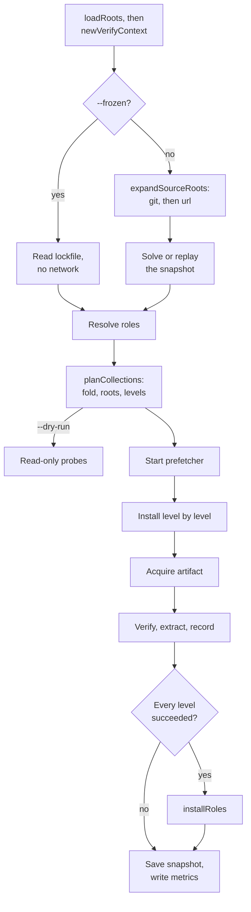
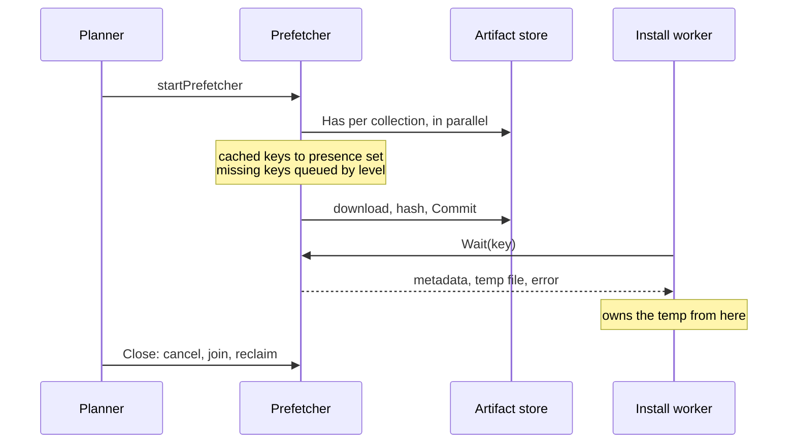
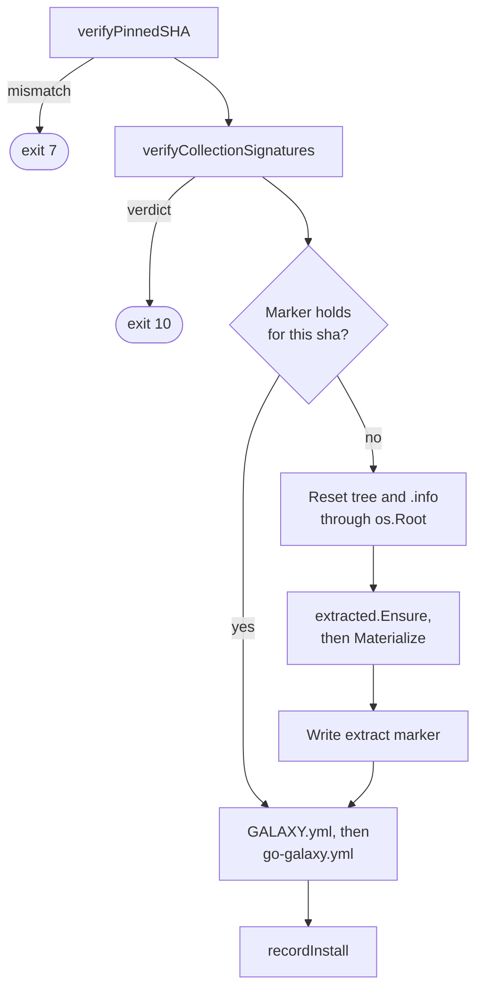
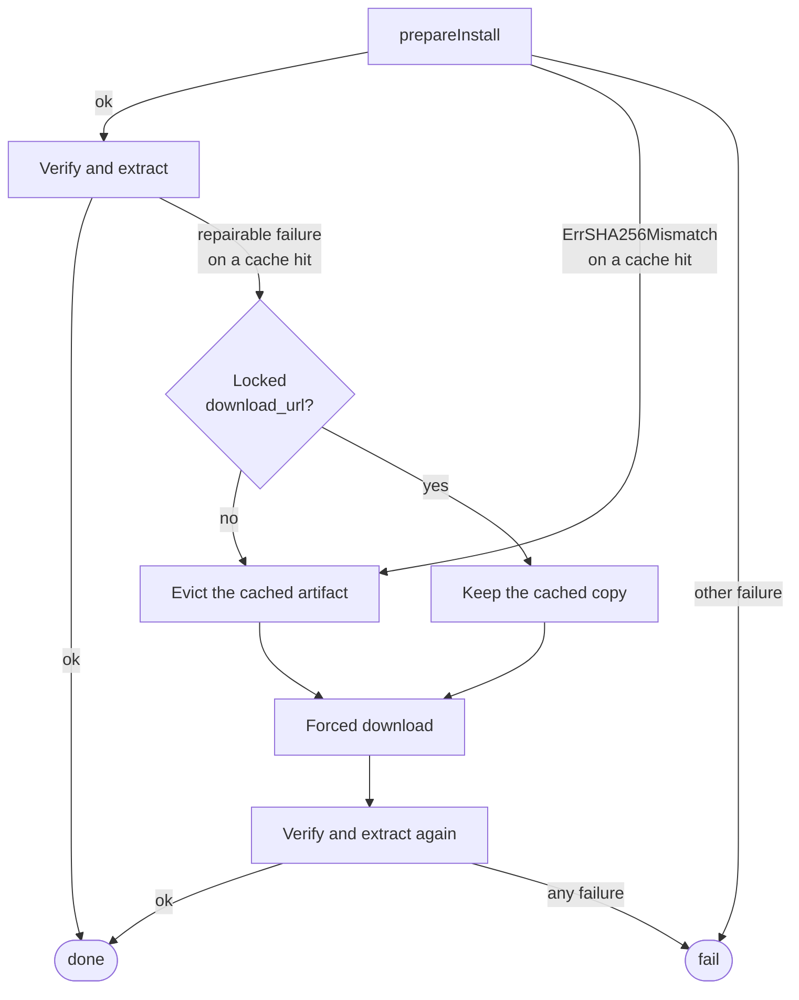

# Install pipeline

How `install` and `warm` take a requirements file to installed or cached
trees, all in `internal/galaxy/collections`. It runs inside `withBackend`,
under the cache lock's holder context ([Cache and storage](cache.md)).

## Git discovery

| Case | `expandGitRoot` does |
| --- | --- |
| Policy allows a read, pin exists | `replayGitPin`: re-validates commit and identities, no network |
| `--offline`, no pin | Fails with `ErrOfflineMode` |
| `--refresh`, branch or tag pinned | One `Advertise`; an unchanged commit with its artifacts cached keeps the pin |
| Otherwise | `acquireGitRoot`: fetch, build, commit, record the pin |

`expandSourceRoots` runs first in `resolveCollectionsInternal` (download pool,
input order); the requirements signature is computed over its output, so it
covers the commit, not just the ref.

| Package | Owns |
| --- | --- |
| `gitsource` | Grammar (URL, ref, subdir, locator, pin key, credentials) and the `Client` interface; no go-git |
| `gitfetch` | The only production go-git importer: advertise once, fetch by hash into a byte-capped store, read the tree without checkout |
| `treearchive` | The only production tar writer: two-pass walk under the archive caps, symlink policy, deterministic tar.gz |
| `collectionbuild` | Ansible's discovery and ignore rules, `MANIFEST.json` and `FILES.json`, identity from `galaxy.yml`, a `manifest.VerifyChain` self-check |

- A built collection becomes an exact-pin root, locator
  `git+<url>#<subdir>@<commit>`, which the [solver](solver.md) answers from
  `gitDiscoveryMemo`, never from a Galaxy server.
- `recordSelected` narrows to the entry's `name:` before the memo, because a
  memo entry owns its fqdn against every Galaxy root and dependency.
- Under `--no-cache` the build rides the pin as `prebuilt`, taken once;
  `withBackend` deletes untaken ones.

## URL discovery

`expandURLRoots` runs after the git expansion; only then does
`checkExpandedDuplicates` look for one fqdn from two roots, since an
unexpanded root has none.

| | Git root | Url root |
| --- | --- | --- |
| Pin bucket, key | `git_pins`, `url\nref\nsubdir` | `url_pins`, the URL |
| Pin replayed | Whenever the policy reads; never aged out | Same |
| Fetched by | `Infra.Git` | `Infra.URLHTTP`, the artifact retry policy |
| Identity from | `galaxy.yml` | `MANIFEST.json`, via `collectionbuild.ParseManifestInfo` |
| Name check | `helpers.IsCollectionNamePart` | `helpers.IsURLCollectionNamePart`, mixed case allowed |
| Locator | `git+<url>#<subdir>@<commit>` | `url+<url>#sha256:<hex>` |
| Pin re-checked | On a refetch | Every install and warm, via `col.SHA256` |

A `version:` is asserted against the manifest on both paths
(`ErrURLCollectionVersionMismatch`), and a replayed pin passes the same
predicates as a fresh manifest.

## Roles

| Source | Resolved by | Pin key in `role_pins` | Locator |
| --- | --- | --- | --- |
| git | `resolveGitRole`: `Git.AcquireRole`, then `rolebuild` | `url\nref\n` | `git+<url>#@<commit>` |
| Galaxy | `resolveGalaxyRole`: `galaxyv1` names repository and tag, then the git path | `galaxy\nname\nrequested`, plus the git pin | `git+<github-url>#@<commit>` |
| url | `resolveURLRole`: download, `tartree.Load`, `rolebuild.Build` | `url\n<url>` | `url+<url>#sha256:<hex>` |

`resolveRoles` walks `roles:` and meta dependencies breadth-first. Each level
resolves on the download pool and merges in input order, so ansible's
first-wins follows declaration order (`dedupeRoleLevel`). Past
`helpers.RoleGraphMaxRoles` (1000) it fails with `ErrInvalidRoleEntry`.

- A git or url role pin replays only while its artifact is stored
  (`roleArtifactCached`).
- `lookupGalaxyRole` tries servers in order, skipping one without v1 or the
  role; the repository's commit wins over the one Galaxy recorded.
- A url role's version label defaults to its sha256's first 12 hex digits
  and is not in the pin key, so another `version:` re-downloads.

`installRoles` runs after every collection level succeeded, on `--workers`,
flat, writing through an `os.Root` at the roles path. `installRole` steps:

1. `canSkipRoleInstall`: record, marker, install info and tally agree.
2. `checkRoleDirectoryOwned`, before any fetch: a directory without this tool's
   marker or ansible's install info is `ErrRoleDirectoryForeign`, exit 5.
3. `fetchRoleArtifact`: prebuilt, cache hit, or a refetch refusing another
   commit or other bytes, exit 7.
4. `extractTree`, writing `meta/.galaxy_install_info` before the marker, over
   a kept tree too, so the tally counts it and a new version reaches it.
5. `recordRoleInstall` with an absolute path: cleanup matches a record by the
   path it scans.

The install info and the marker are removed before they are written: either
can be a hard link into the [extracted store](cache.md#extracted-store-content-addressed-materialized-by-hardlink).
Lockfile entries: [Lockfile format](lockfile-format.md); cleanup:
[its scan](flow-cleanup.md#scan-every-recorded-projects-installs).

## Plan construction

| Function | Why here |
| --- | --- |
| `newVerifyContext` | A bad keyring fails before any background download |
| `resolveOrLoadLockfile` | `--frozen` asks no API; the locked `download_url` stands in for metadata unless verifying |
| `resolveOrLoadRoles` | A missing role fails before any background download |
| `buildCollectionsMap` | The only gate on a version replayed from the `resolved` bucket |
| `verifyRootsResolved` | Catches a solve that dropped a root |
| `buildInstallLevels` | A cycle fails before any prefetch worker; levels order the queue |

`planCollections` bundles the last three; `warm` calls it too, before its
roles. A replay of the `resolved` bucket refuses only an empty version
(`collectionFromResolvedEntry`), so skipping the fold lets a poisoned `*`
reach a worker.

### Two pools, two resources

| Flag | Bounds | Default | Sized by |
| --- | --- | --- | --- |
| `--workers` | Install, warm and role workers, dry-run probes, metadata prewarm, `outdated` | procs clamped to 2..16 | Memory: a 4 x 1 MiB pgzip reader each |
| `--download-workers` | Prefetch, presence scan, discovery, version pages | 4 x procs clamped to 8..32 | Network; the probe holds one 64 KiB block |

- Procs is `runtime.GOMAXPROCS(0)`, never `runtime.NumCPU()`, which ignores a
  CFS quota. No test pins it: narrowing it races parallel tests.
- `MaxAcceptedInstallWorkers` bounds `--workers` only, and the default must
  lie inside it: an empty `GO_GALAXY_WORKERS=` is checked carrying the default.

## Prefetch and handoff

| Invariant | Because |
| --- | --- |
| Download workers get a nil root, extract store and verify context | They only fill the cache; the install worker's skip check is the gate |
| `presence` is built before any consumer, never mutated | So it is read without a lock |
| A scheduled key never enters `presence` | The prefetcher writes it; after a failed prefetch the worker probes |
| A task commits without re-probing | It is the key's only committer: its consumer blocks in `Wait` |
| Every task ends in `finish`, canceled ones too | No `Wait` deadlocks |
| `Close` is deferred in `installWithState`, a callee of `withBackend` | Workers join before the lock is released |
| The scan is fail-open and uses `installRecordMatches` | A wrong answer costs one download |

A prefetch failure is a warning; the worker then acquires the artifact itself.
Roles are never prefetched. The prefetcher is off under `--dry-run`,
`--no-cache` or with no artifact store, and `warm` queues in key order.

The metrics report is written before the deferred `Close` joins the pool. On a
failed install, a worker still downloading an undispatched level counts after
it, so the [counters](../metrics.md#how-the-counters-count) are a lower bound.

## Acquiring an artifact

A verifying run gives up the metadata-free path (`servableFromCacheAlone`),
since a server's signatures ride on the version metadata. A cache hit whose
metadata load fails raises `ErrMetadataUnavailable`, the one metadata failure
`prepareInstall` tolerates, so nothing else may raise it: an unbuildable URL
has `ErrMetadataRequestBuildFailed`.

`resolveArtifactSHA` trusts, in order: this process's own hash; under a pin, a
fresh hash of the file; then the server's digest or the cache sidecar, each
shape-checked (`ErrMalformedArtifactSHA256`, exit 7).

| Download arm | When | Does |
| --- | --- | --- |
| `streamDownloadAndExtract` | An extracted store is present | Tees temp file, sha256 and `IngestReader` in one pass |
| Temp file, then `archive.ProbeTarGz` | Prefetch, `--no-cache` | Keeps an error page out of a shared slot when no digest is declared |

| Budget | Covers | On expiry |
| --- | --- | --- |
| `--timeout` | `ResponseHeaderTimeout`, and each gap between body reads (the `fetch` watchdog) | No response or `ErrReadStalled`, both retried |
| `Infra.ArtifactDeadline`, 15 min | Attempts, backoffs, extraction, commit; a cache-hit `Fetch` too | `ErrArtifactDownloadDeadline`, terminal |
| `Infra.GitDeadline` | One git acquisition | The same sentinel |

Of up to four attempts, `downloadRetryable` retries a stall, a retryable
status or no response at all, unlike an API GET; offline, the deadline,
cancellation and bad bytes are terminal. `artifactDeadlineError` relabels only
when the budget itself expired, rendering the cause with `%v` so it cannot
claim exit 130. A git refetch building another identity fails with
`ErrGitArtifactIdentityMismatch`.

The classification order in <code>downloadRetryable</code>

| Order | Error | Verdict |
| --- | --- | --- |
| 1 | `ErrOfflineMode`, `ErrArtifactDownloadDeadline` | Terminal, so a stall racing the deadline spends no backoff |
| 2 | `ErrReadStalled` | Retry |
| 3 | Canceled or expired context | Terminal |
| 4 | `ErrSHA256Mismatch`, `ErrResponseTooLarge`, `ErrArtifactNotTarGz`, `ErrArtifactTarHeaderNotFound` | Terminal: the URL serves the same bytes |
| 5 | Retryable status, or no response | Retry |

Rows 1 and 3 are load-bearing: an offline refusal or a context error from the
transport arrives as a no-response attempt, which row 5 would retry. Row 4
repeats the default-deny fallthrough, so a content verdict stays terminal even
when wrapped with a retryable status.

## Verify, extract, record

The pin proves the lockfile's bytes, the signature who published them, both
before any write a playbook could find. The manifest chain is checked only
once a signature verified ([boundaries](boundaries.md#reading-a-manifest)).

- `resetExtractionTarget` recreates the tree through `os.Root`, then untars
  into a plain path: nothing can be pre-planted in a directory just made.
- `os.Root` guards the ancestors; a symlink escape is
  `ErrCollectionsPathEscape`, exit 5
  ([boundaries](boundaries.md#the-collections-tree-and-the-cache-directory)).
- `extracted.Ensure` unpacks once per sha256 and `Materialize` hardlinks the
  tree ([extracted store](cache.md#extracted-store-content-addressed-materialized-by-hardlink));
  under `--no-cache`, `archive.ExtractTarGz` unpacks in place.
- `resetCollectionInfo` drops every version's `.info`, so no stale marker
  outlives its tree.
- `writeInfoFile` removes each name before writing it. `GALAXY.yml` keeps
  ansible-core's exact schema or ansible discards it; git and url provenance
  goes to `go-galaxy.yml`.

`recordInstall` stores path, source, sha256 and deps in `installed`. A skip
(`canSkipInstall`) needs that record, the marker and a matching sidecar, and
verifies nothing. Its one repair, `reconcileGalaxyInfo`, writes
`go-galaxy.yml` before `GALAXY.yml`, so a failed write keeps the provenance's
only copy.

Signature gather invariants

| Rule | Because |
| --- | --- |
| `nextBlob` pulls one blob at a time, declared sources first | 64 blobs of up to 1 MiB would otherwise sit resident per worker |
| `helpers.MaxSignaturesPerCollection` counts every candidate, duplicates included | One URI under many spellings cannot spend unbounded requests |
| A repeat is dropped by the sha256 of its bytes | `signature.Verify` counts distinct keys, so this saves only work |
| `serverSignatureBlobs` and `gatherLimit` share that one cap | `gatherOne`'s index stays in range only then |
| One `Keyring` serves every worker, never cloned | Nothing writes it after `LoadKeyring`; mutable state added breaks sharing |
| `Verify` reports a vacuous pass as a field | It knows no collection name; `warnVacuousPass` prints it |
| `signature.parseRequirementSource` is the one source grammar | Load validation, the `--offline` check and the fetch cannot disagree |

## Bounded recovery

`prepareWithRecovery` refetches at most once, structurally: eviction sets
`forceDownload`, which `canRetryCacheHit` refuses. A locked download commits
only pin-matching bytes, so keeping its copy stops a wrong pin from emptying a
shared slot.

Only S3 fails a hit on read, comparing the bytes with `x-amz-meta-sha256`
exactly; the local store checks no digest on read. Hence
[metrics](../metrics.md#how-the-counters-count) count a hit and a miss
locally, only the miss on S3.

| Never evicted | Predicate | Because |
| --- | --- | --- |
| Destination-side failure | `isDestinationSideFailure` | The tree is at fault |
| Signature source never obtained | `isSignatureSourceFailure` | No bytes change it |
| Verdict over the signature set | `isBlobSetVerdict` | Same metadata, same verdict |
| No cache hit, forced retry, `--offline` | `canRetryCacheHit` | Offline eviction loses the only copy |
| Other prepare failures, deadline and `ErrMalformedArtifactSHA256` included | `prepareWithRecovery` | They recur; eviction leaves poisoned metadata |

Evicting on a verdict would give a hostile requirements file or server a
delete per collection per run; the cost is a swapped cached artifact failing
closed until `--clear-cache`. The extracted store is never evicted, and a
corrupt cached role is not refetched.

## Dry run

Discovery still fetches a git, url or role source with no usable pin, since the
plan needs its identity, and discards the artifact. No root is created.

`classifyDryRun` probes on `--workers` into sorted key slots and reports in
the order a real run meets outcomes: settled, uncached under `--offline`,
probe failure, cached, would download.

| | `installDryRunProbe` | `warmDryRunProbe` |
| --- | --- | --- |
| Settled when | Install record and the pure `checkExtractMarker` | Artifact cached and its tree `Ready` under the pin or warmed sha |
| Then checks | Pin verdict, then `dryRunNamespaceProbe` | Pin verdict, before `Ready` |
| Never | Calls `canSkipInstall`, which deletes a drifted marker | Fetches to learn a sha: on S3 a full download |

- Cached mirrors `isCacheHit`, from one `ArtifactStore.Meta` per collection
  and no `Has`; every backend's `Meta` must agree with `Has`.
- `dryRunPinVerdict` refuses a recorded digest contradicting the pin, only
  under `--offline` (exit 7). A real local run re-hashes and may pass; S3
  fails alike.
- The extracted store is local even over S3, so a fresh runner over a warm
  bucket previews `Would warm`.
- A dry run saves only an existing snapshot (`saveDryRunSnapshotIfPersisted`):
  cleanup would read a fresh empty one as nothing installed.

Behavior: [Dry run](../cli.md#dry-run).
