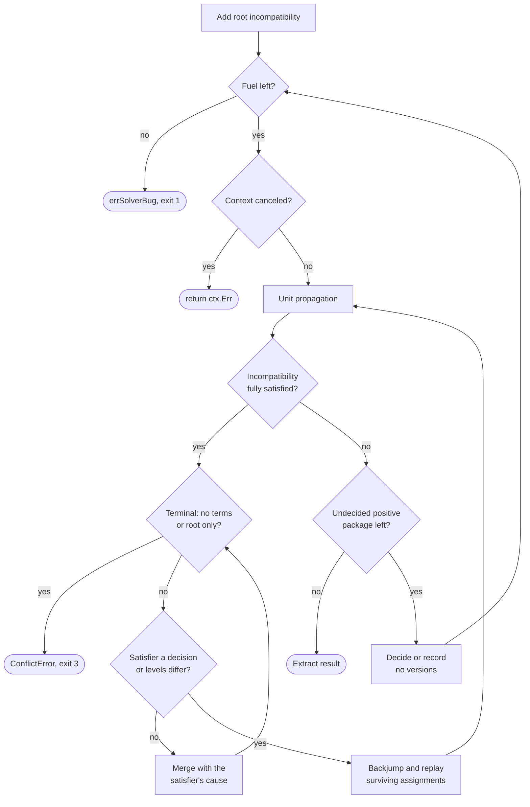

# Version solver

`internal/galaxy/solver` picks one version per collection that satisfies every
constraint, or proves that none exists. It is PubGrub-style and pure: no
goroutines, clock or I/O, with all metadata behind the `Provider` seam.

## Units

| Unit | What it is | Note |
| --- | --- | --- |
| `term` | `package in set` (positive) or `not (package in set)` | `Negate` flips the sign, never complements the set |
| `incompatibility` | Terms that cannot all hold, plus a `cause` | `normalizeTerms`: one term per package, sorted by package |
| `assignment` | A decision (`CauseIndex` -1) or a derivation naming its cause | Recorded at a decision level |
| `partialSolution` | The assignments plus each package's `accum` | `accum` is the exact signed conjunction of its terms |
| `verSet` | An exact set of versions | Canonical, so structural equality is set equality |

`termIntersect` has four rules: `P(a)&P(b) = P(a&b)`, `P(a)&N(b) = P(a-b)`,
`N(a)&P(b) = P(b-a)`, `N(a)&N(b) = N(a|b)`. `termSubset` mirrors them, except
that a negative term never entails a positive one.

- Beside another term, `normalizeTerms` drops `N({})` and root's positive
  term, which always holds; another package's positive term asserts a
  requirement and stays.
- No stored incompatibility holds the tautology `N({})`, so every satisfied one
  has a satisfier. An empty-set dependency is stored as `{parent@version}`.

## Version sets

| Subline | Ordered by | Half-open runs bounded by |
| --- | --- | --- |
| Release | `(major, minor, patch)` | Triples |
| Prerelease | Full semver precedence | Versions without build metadata |

Each subline keeps its runs sorted, nonempty, disjoint and non-abutting, and
build metadata is invisible to both. Two sublines exist because Masterminds
gates prereleases per AND group: "every release from 1.2.0" has no interval
on one order, but is one release run and no prerelease run.

`writeCanonical` is injective, which lets `hashIncompat` prefilter the store's
dedup. Equality ignores two carriers: `single`, a singleton's registry
spelling that exact pins and decisions read, and `display`, a proof label no
logic may branch on.

## Where prereleases are admitted

| Rule | When |
| --- | --- |
| Parse authority | `semver.NewConstraint` alone decides what parses; `versetbuild.go` mirrors it to build the set |
| All versions | `""` or `*` is `fullVerSet`, prereleases included |
| No prerelease | An AND group with no prerelease operand, whatever its runs admit (`buildGroup`) |
| Prereleases too | Any prerelease operand opens its whole group: `>=1.0.0-0` admits `2.0.0-rc1` |
| Refused | `!=` with a patch x-range and a prerelease operand (`errNonIntervalConstraint`) |

The mirror replicates vendored Masterminds v3.5.0
(`TestVerSetDifferentialAgainstCheck`); refusing accepted input is a solver
bug. The refused shape is an infinite comb that would break closure under
complement. User rule: [Prereleases](../ansible-galaxy-compat.md#prereleases).

## The loop

Propagation scans each changed package's incompatibilities newest first,
since conflict resolution learns the general ones late. It relates terms only
to `accum`, so propagation and conflict resolution make no provider call. A
replay costs microseconds, so no per-level snapshot is kept.

| Decision step | Rule |
| --- | --- |
| Pick | Exact pins, then highest conflict count, then fewest allowed among fetched packages, then name |
| Exact-pin fast path | Decides without `Universe` when the pin passes `accum` |
| Probe fast path | An unfetched positive package is decided at `Highest` when that passes |
| Otherwise | `Universe`, then the highest allowed version, else a no-versions or unknown-package leaf |
| Commit | Declined when a new dependency incompatibility is already satisfied (`decideVersion`) |

Every path still asks `Dependencies`, once per package and version
(`depsAdded`). An empty pool finishes the solve, since a decided parent's
requirement is always positive; `extractResult` fails closed on an undecided
package reachable from root.

## The Provider seam

| Method | Answers | Contract |
| --- | --- | --- |
| `Highest(ctx, pkg)` | The registry's highest version, unchecked | `ok` false sends the core to `Universe`; an error aborts |
| `Universe(ctx, pkg)` | Every published version | Any order; an unknown package is an empty slice and nil error |
| `Dependencies(ctx, pkg, v)` | fqdn to canonical constraint | Refuses a malformed key or constraint itself |

`Solve` calls every method from its caller's goroutine and checks `ctx` once
per iteration. An implementation carries `ctx` into every I/O and keeps
`errors.Is(err, ctx.Err())` true, or an interrupt during resolution is
misclassified.

`MetadataProvider` in `internal/galaxy/collections` is the production side:

| Concern | Rule |
| --- | --- |
| Source binding | `bindings` records which server answered each fqdn; it becomes the resolved `source` |
| git and url pins | Answered from the discovery pin, never a Galaxy server |
| `deps_cache` | Keyed per bound server (`helpers.ScopedDepsCacheKey`): two servers may publish different deps for one version |
| Version list | 100 per page, `ErrVersionsPagingExceeded` past 100 requests, one `MetadataDeadline` for all pages |
| A `404` the core cannot model | An exact pin's root, a versions page or a version document gone: `notPublishedError` returns `ErrNoSemverCandidates`, exit 3 |
| `--no-deps` | `NewNoDepsProvider` answers no dependencies without asking |
| Prewarm | `prewarmRootMetadata` makes the solve's own calls ahead, on `--workers` |

> [!WARNING]
> `bindings` has no lock, so prewarm builds a fresh provider per root. Build
> each with `newMetadataProviderWithDeps` over the run's `collectionDeps`:
> `NewMetadataProvider` starts new memos and loses the prewarm.

When prewarm runs

| Rule | Why |
| --- | --- |
| Calls `Highest` or `Dependencies`, never `Universe` | The same call on both sides makes a warmed document a cache hit |
| Needs a store, two roots, a read-write policy | Else it saves nothing or pays twice; `--offline` and `--no-cache` disable it |
| `--refresh` warms exact pins only | Only their policy still reads back |
| Skips git and url roots, exact pins under `--no-deps` | The solve asks no server for them |
| An error stops dispatch, logged under `--verbose` | The solve reports it once, on the caller's own context |
| Runs below the snapshot-replay return | A replay makes no metadata request |

## Determinism

- Propagation pops the smallest changed package (`popSmallest`); candidate
  packages, dependency names and incompatibility terms are sorted.
- `buildUniverse` re-sorts every version list by precedence, then original
  string, both descending: `1.0.0` and `1.0.0+build` tie on precedence.

`TestDeterminism` runs every fixture 100 times on a shuffling provider.
`FuzzSolve` and `TestOracleMembership` hold results to a brute-force oracle
in both directions.

## How Solve fails

| Outcome | Returned as | Exit |
| --- | --- | --- |
| No version fits | `*ConflictError`, whose `Is` matches `helpers.ErrNoVersionSatisfiesConstraints` | [`3`](../exit-codes.md) |
| Canceled | Bare `ctx.Err()` from the per-iteration check | [By cause](../exit-codes.md#signals) |
| Provider failure | Wrapped, never modeled as an incompatibility | By its sentinel |
| Broken invariant | Wraps the unexported `errSolverBug`, no panic | `1` |

The only panic is `mustNewVersion` on the init-time root version; a new
invariant check joins the `errSolverBug` family. Conflict resolution stops
after 10,000 steps, and a root cause that is not almost satisfied ends as a
`*ConflictError`, not a bug.

What wraps errSolverBug

- The main loop past `fuelLimit`, 1,000,000 (a var, so `TestFuelGuard` can
  lower it).
- No satisfier for a satisfied incompatibility.
- A decision term without a singleton version (`decisionVersionOf`).
- `extractResult` reaching an undecided package.
- The mirror parser refusing input `semver.NewConstraint` accepted.
- The proof walk reaching a non-derived incompatibility, reported instead of
  the incomplete proof.

### The failure proof

`buildConflictError` walks the derivation graph into PubGrub's numbered
explanation. A node referenced twice gets a line number, and a derived
terminal line is rewritten to begin `So,` and end `version solving failed.`
How to read one: [When no version fits](../requirements.md#when-no-version-fits).

| Incompatibility | Reads |
| --- | --- |
| Dependency | `X 1.0.0 depends on Y >=2`, or `root depends on ...` |
| No allowed version | `no version of X matches S` |
| Unknown package | `X has no published versions` |
| A lone term | Positive: `X S is forbidden`; negative: `X S is required` |
| Two terms | Mixed: `P requires N`; positive: `P is incompatible with Q`; negative: `either A or B is required` |
| Three or more | `A, B and C are incompatible`; `one of A, B or C is required`; `P and Q require N` |

A term reads opposite to its polarity, because the terms cannot all hold;
`TestDescribePhrasesEveryShape` pins each shape. `collectHints` adds one
prerelease hint per package from the no-versions leaves.
