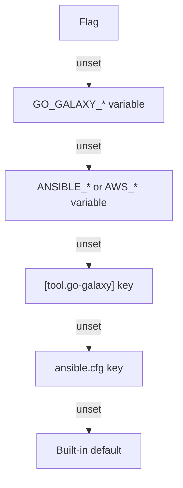

# Configuration

A setting comes from a flag, a variable, the `[tool.go-galaxy]` table of
`galaxy.toml`, `ansible.cfg` or a built-in default.

> [!TIP]
> Looking for `requirements.yml` or the `[project]` table of `galaxy.toml`?
> Both are on [Requirements files](../guides/requirements.md).

## Where a setting comes from



- A flag's variable exported empty counts as set: it hides the layers below,
  and a numeric flag keeps its built-in default.
- Most settings have only some of these layers. [Options](cli.md#options)
  lists each flag's variables in order, and its default.
- `--verbose` prints each `[defaults]` and `[galaxy]` value the run took from
  `ansible.cfg`, and one taken from `ANSIBLE_GALAXY_SERVER` or
  `ANSIBLE_GALAXY_SERVER_LIST`, naming its source; a value a higher layer
  outranked is left out. Of the `[tool.go-galaxy]` keys the run took, it
  prints the names, never the values.

> [!NOTE]
> `ANSIBLE_GALAXY_SERVER` stands in for `[galaxy] server`, below any server
> list, not for `--server`
> ([Which servers a run uses](../guides/servers-and-auth.md#which-servers-a-run-uses)).

## The `[tool.go-galaxy]` table

- The table is read only when the run uses a `galaxy.toml`
  ([Which file is read](../guides/requirements.md#which-file-is-read)). A run
  on `requirements.yml` has none.
- A relative path resolves from the file's directory.
- The table is closed: an unknown key exits [`2`](exit-codes.md).

```toml
[project]
collections = ["community.general >= 9.0"]

[tool.go-galaxy]
lock_file = "galaxy.lock"
cache_dir = "${HOME}/.cache/go-galaxy" # (1)!
metrics_file = "build/go-galaxy-metrics.json"
workers = 4 # (2)!
download_workers = 16

[tool.go-galaxy.s3] # (3)!
bucket = "ci-galaxy-cache"
region = "eu-central-1"
access_key = "${S3_CACHE_ACCESS_KEY}"
secret_key = "${S3_CACHE_SECRET_KEY}"
path_style_disabled = false # (4)!

[[tool.go-galaxy.servers]] # (5)!
id = "hub"
url = "https://hub.example.com/api/galaxy"
token = "${HUB_TOKEN}"

[[tool.go-galaxy.servers]]
id = "galaxy"
url = "https://galaxy.ansible.com"
```

1.  `~` is not expanded: write `${HOME}`.
2.  A TOML integer, never `"4"`. Outside `1` to the CPU count this process may
    use (at least `2`), the default applies with a warning.
3.  A non-empty `bucket` switches to the [S3 cache](../guides/caching.md#s3-cache-optional)
    and needs `access_key` and `secret_key`, here or in their variables. It is
    refused beside `--offline`.
4.  A TOML boolean: `true` selects virtual-hosted-style addressing.
5.  The server list, in order. Its keys are under
    [Server settings](../guides/servers-and-auth.md#server-settings).

With `HUB_TOKEN`, `S3_CACHE_ACCESS_KEY` and `S3_CACHE_SECRET_KEY` exported,
`go-galaxy install` needs no flag. The `${VAR}` token counts as the file's
own, like a literal, so it is sent to the entry's `url`
([Where a token may go](../guides/servers-and-auth.md#where-a-token-may-go)).

The flag beside each key outranks the key, and so do the flag's variables.
Follow the flag for them and for its default.

| Key | Type | Flag |
|:----|:-----|:-----|
| `lock_file` | string | [`--lock-file`](cli.md#lockfile) |
| `cache_dir` | string | [`--cache-dir`](cli.md#global-options) |
| `metrics_file` | string | [`--metrics-file`](cli.md#paths-and-files) |
| `workers` | integer | [`--workers`](cli.md#concurrency) |
| `download_workers` | integer | [`--download-workers`](cli.md#concurrency) |
| `s3.bucket` | string | [`--s3-bucket`](cli.md#s3) |
| `s3.region` | string | [`--s3-region`](cli.md#s3) |
| `s3.prefix` | string | [`--s3-prefix`](cli.md#s3) |
| `s3.endpoint` | string | [`--s3-endpoint`](cli.md#s3) |
| `s3.access_key` | string | [`--s3-access-key`](cli.md#s3) |
| `s3.secret_key` | string | [`--s3-secret-key`](cli.md#s3) |
| `s3.session_token` | string | [`--s3-session-token`](cli.md#s3) |
| `s3.path_style_disabled` | boolean | [`--s3-path-style-disabled`](cli.md#s3) |
| `servers` | array of tables | [`--server`](cli.md#servers-and-network) |

The install paths (`--download-path`, `--roles-path`) and `--timeout` have
no key: keep them in `ansible.cfg`, a flag or a variable. Signature policy,
git and url credentials, `--ansible-config` and switches such as `--offline`
have no key either.

`install`, `warm`, `lock` and `outdated` read every key. `cleanup` reads
`cache_dir`, `s3` and `servers`, so the rule in [Where a token may
go](../guides/servers-and-auth.md#where-a-token-may-go) applies to it too. `hash`, `tree`
and `explain` read only `lock_file`, and not even that under `--lock-file`.
`migrate` reads no key. A command that reads any key needs every `${VAR}` in
the table, even under a key it does not read.

### `${VAR}` expansion

- Only `${NAME}` is expanded, in string values under this table. `$NAME`,
  key names and `[project]` stay literal.
- There is no escape, so a value cannot hold a literal `${NAME}`. An expanded
  value is not expanded again.
- Every unset name is reported in one sorted error once the file parses,
  before `ansible.cfg` is read, and the run exits [`2`](exit-codes.md).
- A variable exported empty expands to the empty string, which leaves a path
  or `s3` key unset.
- A `${VAR}` reads any variable the run exports, into a server `url` or
  `token` or an S3 setting too. A `galaxy.toml` is trusted with every
  variable it names ([Trust model](../guides/security.md#trust-model)).

<details markdown>
<summary>Exact messages</summary>

Each is a separate run. An unset variable exits `2`:

```text
✗ galaxy.toml: project file references unset environment variables: HUB_TOKEN, S3_CACHE_ACCESS_KEY, S3_CACHE_SECRET_KEY
```

A `workers` value outside the accepted range warns, here on a machine with 12
CPUs:

```text
! [tool.go-galaxy] workers in galaxy.toml = 64 is outside 1..12, the range this machine accepts (the ceiling is the CPU this process is permitted to use, at least 2); using 12 instead
```

A value of the wrong type exits `2`:

```text
✗ galaxy.toml: unsupported requirements file format: [tool.go-galaxy] workers is not an integer
```

A misspelled key exits `2`:

```text
✗ galaxy.toml: unsupported requirements file format: unknown key "worker" in [tool.go-galaxy]
```

</details>

## ansible.cfg

```ini
[defaults]
collections_path = .collections
roles_path = .roles

[galaxy]
server = https://galaxy.ansible.com
cache_dir = /home/ci/.cache/go-galaxy
server_timeout = 60
```

[What go-galaxy reads](#what-go-galaxy-reads) lists every key.

> [!WARNING]
> In a world-writable working directory, sticky bit included (`/tmp`, a `0777`
> CI workspace), go-galaxy skips `./ansible.cfg` and warns, whether or not one
> exists, since any user could plant one. Name the file with `ANSIBLE_CONFIG`
> or `--ansible-config`, or remove the world-writable bit.

### Where it is found

| Order | File | Notes |
|:------|:-----|:------|
| 1 | `--ansible-config`, `GO_GALAXY_ANSIBLE_CONFIG` | Taken as written, a `..` resolved as text ([ansible.cfg paths](#ansiblecfg-paths)). Must exist, or the run exits `2`. `cleanup` takes neither: point it with `ANSIBLE_CONFIG`. |
| 2 | `$ANSIBLE_CONFIG` | Read as ansible reads it: `~` and `$VAR` expand, a relative path resolves from the working directory ([ansible.cfg paths](#ansiblecfg-paths)), and a directory stands for the `ansible.cfg` in it. Skipped when empty, before or after expansion, or not found. |
| 3 | `./ansible.cfg` | Skipped in a world-writable working directory. |
| 4 | `~/.ansible.cfg` | |
| 5 | `/etc/ansible/ansible.cfg` | |
| - | none found | Fine: each setting falls to its next layer. |

The first file that exists is read, and no other. One that cannot be read
exits `2`. `install`, `warm`, `lock`, `outdated` and `cleanup` read it.
`hash`, `tree`, `explain` and `migrate` never do.

### What go-galaxy reads

| Key | Variable | Outranked by |
|:----|:---------|:-------------|
| `[defaults] collections_path` | `ANSIBLE_COLLECTIONS_PATH` | [`--download-path`](cli.md#paths-and-files) |
| `[defaults] roles_path` | `ANSIBLE_ROLES_PATH` | [`--roles-path`](cli.md#paths-and-files) |
| `[galaxy] server` | `ANSIBLE_GALAXY_SERVER` | any server list, [`--server`](cli.md#servers-and-network) |
| `[galaxy] server_list` | `ANSIBLE_GALAXY_SERVER_LIST` | [`--server`](cli.md#servers-and-network): an id picks one entry, a URL replaces the list |
| `[galaxy] cache_dir` | `ANSIBLE_GALAXY_CACHE_DIR` | [`--cache-dir`](cli.md#global-options) |
| `[galaxy] server_timeout` | `ANSIBLE_GALAXY_SERVER_TIMEOUT` | [`--timeout`](cli.md#servers-and-network) |
| `[galaxy_server.<id>] url`, `token`, `validate_certs` | `ANSIBLE_GALAXY_SERVER_<ID>_URL`, `_TOKEN`, `_VALIDATE_CERTS` | [`--server`](cli.md#servers-and-network) set to a URL; for a lone server's token, [`--token`](cli.md#servers-and-network) |

A key's variable outranks the key, and each setting in the third column
outranks both. A flag there counts with its `GO_GALAXY_*` variables.
`galaxy.toml` sits between variable and key for two settings:
`[tool.go-galaxy] cache_dir` outranks `[galaxy] cache_dir`, and
`[[tool.go-galaxy.servers]]` replaces `server_list` and every
`[galaxy_server.<id>]` section.

A token of yours, from `--token`, `GO_GALAXY_TOKEN` or
`ANSIBLE_GALAXY_SERVER_<ID>_TOKEN`, is refused with exit `2` when that
server's address or `validate_certs = false` is set in `ansible.cfg` or
`galaxy.toml` ([Where a token may go](../guides/servers-and-auth.md#where-a-token-may-go)).

The `[galaxy]` keys `gpg_keyring`, `required_valid_signature_count`,
`ignore_signature_status_codes` and `disable_gpg_verify` are never read:
`install` and `warm` warn and read the matching `ANSIBLE_GALAXY_*` variables
instead. Any other key is ignored, the plural `collections_paths` included,
except in a `[galaxy_server.<id>]` section
([Server settings](../guides/servers-and-auth.md#server-settings)).

`collections_path` and `roles_path` are `:` lists, of which go-galaxy uses
only the first entry ([Paths and files](cli.md#paths-and-files)). A relative
path resolves from the file's directory, as in ansible
([ansible.cfg paths](#ansiblecfg-paths)).

The file is parsed like Python's `configparser` with `;` as the only inline
comment marker, so watch for these lines:

| You write | go-galaxy reads |
|:----------|:----------------|
| `collections_path = "./c"` | `"./c"`, quotes included: drop them |
| `server = https://galaxy.ansible.com # note` | a URL with `# note` in it, refused as `invalid galaxy server url` |
| `server = https://galaxy.ansible.com ; note` | `https://galaxy.ansible.com` |
| `token = abc;def` | `abc;def` |
| `[galaxy] # prod` | the `[galaxy]` section |
| `[ galaxy ]` | another section, its name keeping the spaces |
| the same key twice | the last value |
| a line longer than 64 KiB | nothing: the run exits `2` |

<details markdown>
<summary>Full parsing rules</summary>

- A line starting with `#` or `;` is a comment. A `;` after whitespace starts
  one mid-line, on a header too.
- Whitespace is whatever Python's `str.isspace` accepts, which adds U+001C to
  U+001F to the usual set.
- `=` or `:`, whichever comes first, separates a key from its value.
- Keys are lowercased; section names are matched as written.
- A section name runs to the last `]` on its line, so `[galaxy] = x` opens
  `[galaxy]`.
- Nothing is refused for its content: a junk line is skipped, and one opening
  with `[` also closes the current section.
- A leading UTF-8 byte order mark is stripped, where ansible refuses the file.
- Unlike any other value, a server URL loses one pair of surrounding double
  quotes, whatever its source
  ([API roots and URL normalization](../guides/servers-and-auth.md#api-roots-and-url-normalization)).
- A discovered file that vanishes before it is opened counts as none found.

</details>

### ansible.cfg paths

go-galaxy resolves `collections_path`, `roles_path` and `[galaxy] cache_dir`
as ansible does, so both tools use the same directories:

| The path comes from | `~` and `$VAR` | A relative path resolves from |
|:--------------------|:---------------|:------------------------------|
| `ansible.cfg` | Expanded | The file's directory |
| `ANSIBLE_COLLECTIONS_PATH`, `ANSIBLE_ROLES_PATH`, `ANSIBLE_GALAXY_CACHE_DIR` | Expanded | The working directory |
| A flag or its `GO_GALAXY_*` variables | Taken as written | The working directory |

- `$VAR` and `${VAR}` take the variable's value, an unset name stays in the
  path as written, and `~user` is that user's home as the system user
  database lists it, on Linux `/etc/passwd` alone
  ([Paths and timeouts](../get-started/ansible-galaxy-compat.md#paths-and-timeouts)).
- The working directory is the physical one, as ansible reads it: from a
  directory entered through a symlink, `..` climbs from the link's target.
- In a path from `ansible.cfg`, an `ANSIBLE_*` variable or `--ansible-config`,
  a `..` is resolved as text, so `/opt/link/../c` is `/opt/c` even where
  `link` is a symlink.
- The file's directory is the one its path names: a symlinked `ansible.cfg`
  resolves from the link's directory, not its target's.
- `ANSIBLE_COLLECTIONS_PATH` and `ANSIBLE_ROLES_PATH` are split at `:` after
  their `$VAR`s expand, so a variable holding `:` adds entries
  ([Paths and timeouts](../get-started/ansible-galaxy-compat.md#paths-and-timeouts)).
- A variable in an `ansible.cfg` path puts its value into a directory name
  and into the lines that print that path
  ([Trust model](../guides/security.md#trust-model)).
- `{{CWD}}`, which ansible replaces with the working directory in either
  place, is kept as written
  ([Paths and timeouts](../get-started/ansible-galaxy-compat.md#paths-and-timeouts)).

## Environment-only variables

| Variable | What it sets | Explained in |
|:---------|:-------------|:----------------------|
| `ANSIBLE_CONFIG` | the `ansible.cfg` tried first when `--ansible-config` is unset | [Where it is found](#where-it-is-found) |
| `GO_GALAXY_GIT_CREDENTIALS`, `GO_GALAXY_GIT_<ID>_*` | a credential bound to a git host | [Git sources and credentials](../guides/servers-and-auth.md#git-sources-and-credentials) |
| `GO_GALAXY_URL_CREDENTIALS`, `GO_GALAXY_URL_<ID>_*` | a Bearer token bound to a url-source origin | [URL sources and credentials](../guides/servers-and-auth.md#url-sources-and-credentials) |
| `SSH_AUTH_SOCK`, `SSH_KNOWN_HOSTS`, `ALL_PROXY`, `NO_PROXY` | the ssh agent, the known_hosts file and a `socks5://` proxy for ssh git fetches | [Git sources and credentials](../guides/servers-and-auth.md#git-sources-and-credentials) |
| `HTTP_PROXY`, `HTTPS_PROXY`, `NO_PROXY` | the proxy for every HTTP request. Every client, the git and url ones included, sends the proxy the user and password in its URL | - |
| `SSL_CERT_FILE`, `SSL_CERT_DIR` | a private CA, replacing the default trust store | [TLS and a private CA](../guides/servers-and-auth.md#tls-and-a-private-ca) |
| `TMPDIR` | the directory, `/tmp` when unset, where a run stages fetched git objects, unpacked url roles and, on the S3 cache, every artifact | [What the directory holds](../guides/caching.md#what-the-directory-holds) |
| `NO_COLOR`, `CLICOLOR_FORCE`, `FORCE_COLOR`, `TERM` | whether output is colored (`TERM=dumb`: the spinner only) | [Output and color](cli.md#output-and-color) |

`ANSIBLE_GALAXY_REQUIREMENTS_FILE` looks like an ansible variable but is
go-galaxy's own: a source of [`--requirements-file`](cli.md#paths-and-files)
that `ansible-galaxy` ignores. Exported empty, it and
`GO_GALAXY_REQUIREMENTS_FILE` name no file and exit `2`
([Which file is read](../guides/requirements.md#which-file-is-read)).
