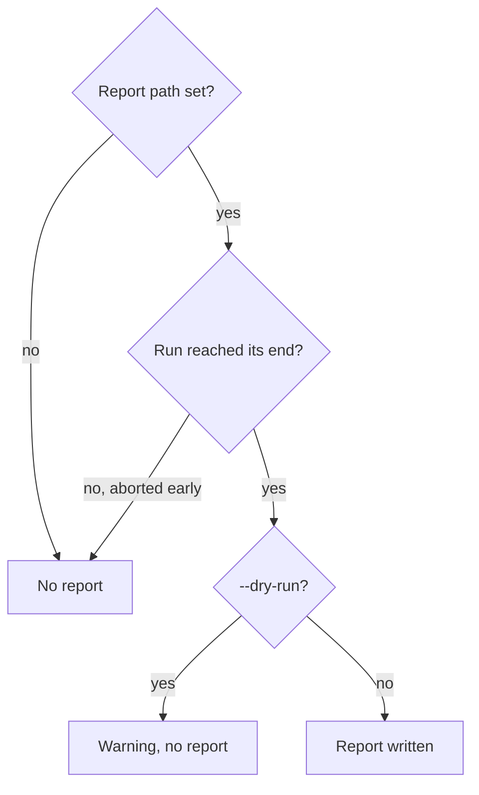

# Metrics

go-galaxy can write a JSON report of each `install`, `warm`, `lock` and
`outdated` run for CI dashboards.

## Turn it on

=== "galaxy.toml"

    ```toml
    [project]
    collections = ["community.general"]

    [tool.go-galaxy]
    metrics_file = "build/go-galaxy-metrics.json" # (1)!
    ```

    1.  Relative to the directory of `galaxy.toml`.

=== "Flags"

    ```bash
    go-galaxy install --metrics-file build/go-galaxy-metrics.json
    ```

=== "Environment"

    ```bash
    export GO_GALAXY_METRICS_FILE=build/go-galaxy-metrics.json
    go-galaxy install
    ```

Missing directories are created, and the file is replaced atomically, so a
reader never sees half a report. A flag or variable
[outranks](configuration.md#where-a-setting-comes-from) `metrics_file`, and an
exported empty `GO_GALAXY_METRICS_FILE` turns the report off.

## Fields

A cold `install --frozen` of three collections and one Galaxy role:

```json
{
  "started_at": "2026-09-25T21:09:06.614403Z",
  "finished_at": "2026-09-25T21:09:16.765747Z",
  "command": "install",
  "server": "https://galaxy.ansible.com",
  "lockfile": "galaxy.lock",
  "lockfile_hash": "cd042c8bf64fc5315301eb10613e03a61b699c35bac3942d1d50ce5627d823f0",
  "duration_ns": 10151245375,
  "cache_hits": 0,
  "cache_misses": 4,
  "bytes_downloaded": 3208936,
  "collections": 3,
  "roles": 1,
  "failures": 0,
  "frozen": true
}
```

| Field | Meaning |
| :-- | :-- |
| `started_at`, `finished_at` | Run start and report time, RFC 3339 in UTC |
| `command` | `install`, `warm`, `lock` or `outdated` |
| `server` | URL of the first configured server only |
| `lockfile` | Resolved lockfile path, even when none exists |
| `lockfile_hash` | [`go-galaxy hash`](../guides/lockfile.md#a-cache-key-for-ci) of the lockfile on disk when the report is written, minus `sha256:`; absent when none loads |
| `duration_ns` | Run time in nanoseconds |
| `cache_hits` | [Artifact hits](#how-the-counters-count) |
| `cache_misses` | [Artifact misses](#how-the-counters-count) |
| `bytes_downloaded` | [Bytes fetched from origins](#how-the-counters-count) |
| `frozen` | `true` when `install` or `warm` ran with `--frozen`, else absent |
| `offline` | `true` under `--offline`, else absent |

A plain `install` or `warm` does not read the lockfile, and `lock --check`
leaves a drifted one as it was. For those runs `lockfile_hash` need not match
what the run installed or resolved.

`collections`, `roles` and `failures` depend on the command:

| Command | `collections`, `roles` | `failures` |
| :-- | :-- | :-- |
| `install`, `warm` | Planned entries, dependencies and already-installed ones included | Failed collections plus failed roles |
| `lock` | Entries in the lockfile the run built | Always `0` |
| `outdated` | [Entries compared](../guides/lockfile.md#find-newer-versions) | Failed lookups |

## When a report is written



A run still reaches its end with failed collections or roles, a failed
snapshot save or `lock --check` drift. Early aborts include an unreadable
requirements file, a failed resolve and a lockfile the command needs but
cannot load.

> [!WARNING]
> Gate on the [exit code](exit-codes.md#using-exit-codes-in-ci), never on the
> report. A `lock` report cannot tell a `--check` run from a write, and shows
> `failures: 0` even when `--check` exits `6`. A failed report write prints a
> warning and leaves the exit code unchanged.

## How the counters count

A hit is an artifact served from the cache, local or S3, and adds no bytes. A
miss is an artifact fetched from its origin. A Galaxy collection counts once.
A git or url collection, and every role, counts a miss when the resolve stores
it and a hit when `install` or `warm` reads it back. Under `--frozen` nothing
resolves, so one fetched from its origin counts only the miss. Under
`--no-cache` such an artifact counts neither.

One git and one Galaxy collection:

| Run | `cache_misses` | `cache_hits` | `bytes_downloaded` |
| :-- | :-- | :-- | :-- |
| Cold cache | `2` | `1` | Git pack + Galaxy tarball |
| `--frozen`, cold cache | `2` | `0` | Git pack + Galaxy tarball |
| Warm cache, empty workspace | `0` | `2` | `0` |
| Both already installed | `0` | `0` | `0` |
| `--no-cache` | `1` | `0` | Git pack + Galaxy tarball |

The [Fields](#fields) report is a `--frozen` run, so its three Galaxy tarballs
and one role make `4` misses. `lock` counts only git, url and role fetches.
`outdated` counts nothing.

<details markdown>
<summary>Counting rules in detail</summary>

- A miss counts once per acquisition, after retries.
- `bytes_downloaded` adds every Galaxy or url download attempt, a failed
  partial body included; a git fetch adds its pack only once it succeeds.
- A corrupt cached collection is [refetched](../internals/install-pipeline.md#bounded-recovery):
  a hit and a miss locally, only the miss when S3 catches it on read.
- A corrupt cached role is not refetched: its install fails.
- On a failed `install` the counters are a lower bound:
  [prefetch workers still in flight](../internals/install-pipeline.md#prefetch-and-handoff)
  count after the report is built.

</details>
