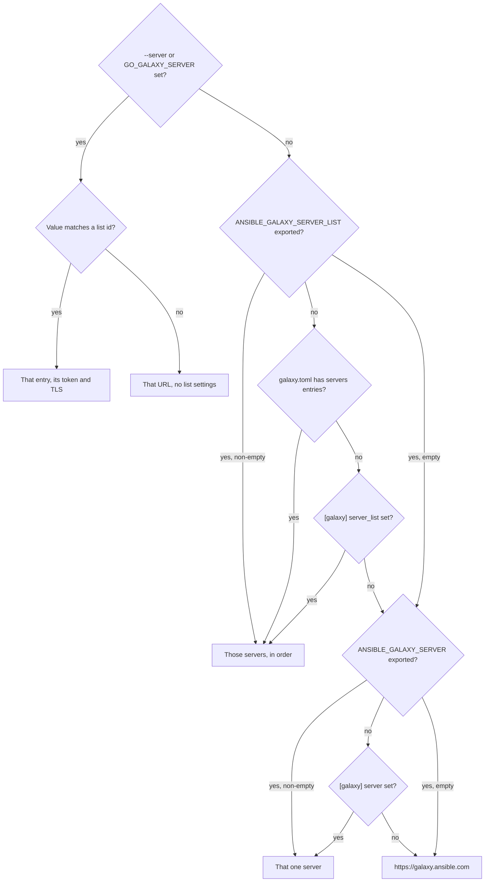
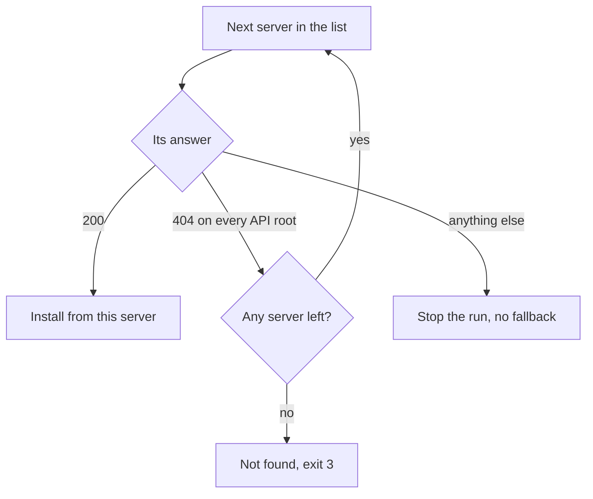
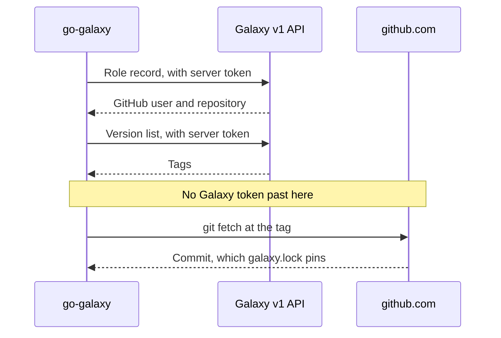

# Galaxy servers and authentication

Install from private Galaxy servers, git repositories and tarball URLs, and
see where each credential may go.

| I need to...                                       | Go to                                                                  |
|:---------------------------------------------------|:-----------------------------------------------------------------------|
| Use a private hub with a token, then public Galaxy | [A private hub, then public Galaxy](#a-private-hub-then-public-galaxy) |
| Fix a refused token                                | [`--token`](#--token)                                                  |
| Trust a hub signed by a private CA                 | [TLS: validate_certs](#tls-validate_certs)                             |
| Install Galaxy roles                               | [Roles and the v1 role API](#roles-and-the-v1-role-api)                |
| Fetch a private git repository                     | [Git sources and credentials](#git-sources-and-credentials)            |
| Download a private release tarball                 | [URL sources and credentials](#url-sources-and-credentials)            |

## A private hub, then public Galaxy

=== "ansible.cfg"

    ```ini
    [galaxy]
    server_list = hub, galaxy

    [galaxy_server.hub]
    url = https://hub.example.internal/api/galaxy

    [galaxy_server.galaxy]
    url = https://galaxy.ansible.com
    ```

    ```bash
    export ANSIBLE_GALAXY_SERVER_HUB_URL=https://hub.example.internal/api/galaxy # (1)!
    export ANSIBLE_GALAXY_SERVER_HUB_TOKEN="${HUB_TOKEN}"
    go-galaxy install
    ```

    1.  The file's address again: a token you supply goes only to an
        address you supplied ([`--token`](#--token)).

=== "galaxy.toml"

    ```toml
    [project]
    collections = ["community.general"]

    [[tool.go-galaxy.servers]]
    id = "hub"
    url = "https://hub.example.internal/api/galaxy"
    token = "${HUB_TOKEN}" # (1)!

    [[tool.go-galaxy.servers]]
    id = "galaxy"
    url = "https://galaxy.ansible.com"
    ```

    1.  Expanded when the file loads; an unset `HUB_TOKEN` exits
        [`2`](exit-codes.md)
        ([`${VAR}` expansion](configuration.md#var-expansion)). The token is
        the file's own, as a literal one is, so the address needs no export
        ([`--token`](#--token)).

=== "Environment"

    ```bash
    export ANSIBLE_GALAXY_SERVER_LIST=hub,galaxy
    export ANSIBLE_GALAXY_SERVER_HUB_URL=https://hub.example.internal/api/galaxy
    export ANSIBLE_GALAXY_SERVER_HUB_TOKEN="${HUB_TOKEN}"
    export ANSIBLE_GALAXY_SERVER_GALAXY_URL=https://galaxy.ansible.com
    go-galaxy install
    ```

Each collection comes from the first server that has it: private ones from
`hub`, the rest from public Galaxy.

## Which servers a run uses



Other settings follow
[Where a setting comes from](configuration.md#where-a-setting-comes-from).

## How a collection picks its server



Any other answer exits [`4`](exit-codes.md): a 401 or 403, any other status
(a 429, 500, 502, 503 or 504 only after the retries), a document of the wrong
shape, or a refused connection, DNS or TLS failure. A web page at an API root,
as galaxy.ansible.com serves under `/v3`, is passed over, but a server with web
pages at every API root, like a single sign-on front, stops the run too. A
configuration mistake exits `2` before any request: fix it.

While resolving or locking, every later request to the server that owns a
collection (a versions page, a version document) fails the same way, except
that a `404` there exits `3`: the server lacks the version or list asked for.
At install, such a failure is [one item's](exit-codes.md#when-several-things-fail)
and exits `5`.

A [`source:`](requirements.md#collections) pins one collection to one server:
an id, or a URL on a server's origin (scheme, host and port), with that
server's token and TLS. One matching no server is still requested, with a
warning and no token. The lockfile records the server's URL for an id, the
`source:` URL for an origin match.

> [!NOTE]
> `source:` pins only that collection, not its dependencies: they walk the
> whole list. Pin a dependency as a root of its own, or put the hub first.
>
> ```yaml
> collections:
>   - name: acme.app
>     source: hub
>   - name: acme.common
>     source: hub
> ```

## `--token`

| Token supplied by                                                                   | URL, or `validate_certs = false`, from a file | Neither from a file |
|:------------------------------------------------------------------------------------|:----------------------------------------------|:--------------------|
| You: `--token`, `GO_GALAXY_TOKEN` or `ANSIBLE_GALAXY_SERVER_<ID>_TOKEN`             | Refused, exit `2`                             | Sent                |
| The file: a `token` in the same section or entry, a `galaxy.toml` `${VAR}` included | Sent                                          | Sent                |

An address is yours when it comes from `--server=<url>`, `GO_GALAXY_SERVER`,
`ANSIBLE_GALAXY_SERVER`, `ANSIBLE_GALAXY_SERVER_<ID>_URL` or the default;
`--server=<id>` and `url = "${VAR}"` leave it the file's. The rule stops a
checked-out repository from choosing where your secret goes
([why](internals/boundaries.md#credentials-and-the-token-pairing-rule)). A
`galaxy.toml` that names a variable is trusted with its value, as with every
[`${VAR}`](configuration.md#var-expansion).

```text
✗ galaxy server token destination came from a configuration file: server "hub" (https://hub.example.internal:443) in ansible.cfg
```

| Message                                                                                                     | Fix                                                                                 |
|:------------------------------------------------------------------------------------------------------------|:------------------------------------------------------------------------------------|
| `galaxy server token destination came from a configuration file: server "<id>"`                             | Export `ANSIBLE_GALAXY_SERVER_<ID>_URL` with the identical address                  |
| The same, naming `server ""`: the `[galaxy] server` line                                                    | Export `ANSIBLE_GALAXY_SERVER` with the identical address, or pass `--server=<url>` |
| `galaxy server certificate verification was disabled by a configuration file for a token it did not supply` | Export `ANSIBLE_GALAXY_SERVER_<ID>_VALIDATE_CERTS` with the identical value         |
| `--token is ambiguous with a multi-entry server_list`                                                       | Give each server its own token, such as `ANSIBLE_GALAXY_SERVER_<ID>_TOKEN`          |

When the file supplies both the `url` and `validate_certs = false`, export
both; the run reports the address first. With several servers in effect,
setting `--token` or `GO_GALAXY_TOKEN`, even empty, exits `2`. With one
server, either replaces its token, and an empty value forces an anonymous run.

> [!TIP]
> Prefer `GO_GALAXY_TOKEN` to `--token`: other local users can read a flag's
> value with `ps` while the run lasts.

<details markdown>
<summary>My server id contains a hyphen</summary>

A shell cannot `export` a name such as `ANSIBLE_GALAXY_SERVER_MY-HUB_URL`.
Set it through `env` or a container's `-e`, or rename the id with `_`.
`--server=<url>` works too, but drops the whole list and the entry's own token
and `validate_certs`: give the token as `GO_GALAXY_TOKEN`.

```bash
env 'ANSIBLE_GALAXY_SERVER_MY-HUB_URL=https://hub.example.internal/api/galaxy' go-galaxy install
```

</details>

## TLS: validate_certs

```bash
cat /etc/ssl/certs/ca-certificates.crt hub-ca.pem > hub-bundle.pem # (1)!
export SSL_CERT_FILE="${PWD}/hub-bundle.pem"
go-galaxy install
```

1.  The public roots on Debian and Ubuntu; on macOS, `/etc/ssl/cert.pem`.

Trust the hub's CA and leave `validate_certs` unset. This also covers git, url
and signature fetches, which never honor `validate_certs`, and it never trips
the token rule. `SSL_CERT_DIR` names a directory of certificates, as well or
instead.

> [!WARNING]
> On macOS and Windows, setting `SSL_CERT_FILE` or `SSL_CERT_DIR` replaces the
> whole system store, so the bundle must also hold public roots such as
> github.com's.
> On Linux each replaces only its own default: the bundle file or the
> certificate directories.

`validate_certs = false` turns verification off for that server's origin only
and warns on every run, even under `--quiet`. A second warning follows when a
token crosses it, and a token of yours is refused there unless you exported
that `validate_certs` yourself ([`--token`](#--token)).

```text
! TLS certificate verification is DISABLED for Galaxy server "hub" (https://hub.example.internal:443); this run cannot detect a man-in-the-middle on that host
```

## Server settings

| Key                                             | `[galaxy_server.<id>]`                              | `[[tool.go-galaxy.servers]]`    | Variable                                    |
|:------------------------------------------------|:----------------------------------------------------|:--------------------------------|:--------------------------------------------|
| `id`                                            | The section name, listed in `server_list`           | Required                        | `<ID>`: the id upper-cased, `-` kept        |
| `url`                                           | Required                                            | Required                        | `ANSIBLE_GALAXY_SERVER_<ID>_URL`            |
| `token`                                         | Optional                                            | Optional, a literal or `${VAR}` | `ANSIBLE_GALAXY_SERVER_<ID>_TOKEN`          |
| `validate_certs`                                | `true`, `false`, `yes`, `no`, `on`, `off`, `1`, `0` | A TOML `true` or `false`        | `ANSIBLE_GALAXY_SERVER_<ID>_VALIDATE_CERTS` |
| `api_version`                                   | Only `v3`                                           | Refused                         | -                                           |
| `username`, `password`, `auth_url`, `client_id` | Refused: configure an API token instead             | Refused                         | -                                           |
| Any other key                                   | Warned about and ignored                            | Refused                         | -                                           |

Refused means exit `2` when the configuration loads. Also refused: an id
outside `^[A-Za-z0-9_-]+$`, two ids equal ignoring case, a `url` with a user or
password, a token for plain `http` off loopback (`localhost` or a loopback IP
literal, no DNS lookup), and two servers on one origin with different tokens
or `validate_certs`.

An exported variable always wins: an empty `_TOKEN` clears the token, an empty
`_VALIDATE_CERTS` restores verification, and an empty `_URL` exits `2`. An id
with no section is built from its variables alone, and `galaxy.toml` entries
replace the sections outright, never merged.

<details markdown>
<summary>API root discovery and URL normalization</summary>

| `url` ends in                        | Appended to `url`, in order                |
|:-------------------------------------|:-------------------------------------------|
| `/api/v3`, `/api/v2`, `/v3` or `/v2` | Nothing: the `url` as written              |
| `/api`                               | `/v3`, `/v2`, then nothing                 |
| Anything else                        | `/api/v3`, `/v3`, `/api/v2`, `/v2`, `/api` |

Each root is tried with and without a trailing slash, the next only after a
404, and a root that answered is reused for that server. A server whose walk
ended in `404` for a collection is not asked for it again in the same resolve
or `lock`, even where an earlier run cached an answer from it. A server URL is
trimmed, loses one pair of double quotes and its trailing slashes, and must
then be absolute.

</details>

<details markdown>
<summary>Exact error messages for server entries</summary>

```text
✗ unsupported galaxy_server key: configure a Galaxy API token instead: server "hub" key "username"
! unsupported key "timeout" in [galaxy_server.hub] ignored
✗ galaxy.toml: [[tool.go-galaxy.servers]] entry 1: unsupported requirements file format: unknown key "api_version" in [[tool.go-galaxy.servers]]
✗ galaxy.toml: [[tool.go-galaxy.servers]] entry 1: unsupported requirements file format: [[tool.go-galaxy.servers]] validate_certs is not a boolean
✗ galaxy.toml: [[tool.go-galaxy.servers]] entry 1: unsupported requirements file format: [[tool.go-galaxy.servers]] needs both id and url
✗ galaxy.toml: unsupported requirements file format: [[tool.go-galaxy.servers]] entry 2 repeats id "hub"
✗ galaxy.toml: unsupported requirements file format: [[tool.go-galaxy.servers]] is not an array of tables
✗ galaxy.toml: unsupported requirements file format: [[tool.go-galaxy.servers]] entry 1 is not a table
✗ galaxy.toml: project file references unset environment variables: HUB_TOKEN
```

Most other refusals open with one of these:

```text
unsupported galaxy_server api_version
invalid galaxy server id
duplicate galaxy server id
galaxy server is missing its url
invalid galaxy server url
galaxy server url must not contain userinfo
invalid validate_certs value
galaxy server token configured for an insecure plaintext transport
conflicting token for the same galaxy server origin
conflicting validate_certs for the same galaxy server origin
```

</details>

## Roles and the v1 role API

| Server               | Serves v1 roles?     |
|:---------------------|:---------------------|
| galaxy.ansible.com   | Yes, under `/api/v1` |
| Standalone Galaxy NG | Yes, under `/v1`     |
| Automation Hub       | No                   |



A Galaxy role walks the server list like a collection, skipping a server that
has no v1 or does not list the role. No v1 on any server exits `2` (add
galaxy.ansible.com); a role no v1 server knows exits `3`. The first server that
lists the role owns it: a `404` for its versions exits `3`, an unusable record
or page link `2`, any other failed answer `4`.

A role takes no `source:` ([spelling](requirements.md#roles)), and a git role
never asks a Galaxy server. A `GO_GALAXY_GIT_<ID>_URL` binding for
`https://github.com` applies to the fetch.

## Git sources and credentials

=== "HTTPS token"

    ```bash
    export GO_GALAXY_GIT_CREDENTIALS=forge
    export GO_GALAXY_GIT_FORGE_URL=https://gitlab.example.internal/platform # (1)!
    export GO_GALAXY_GIT_FORGE_USERNAME=gitlab-ci-token
    export GO_GALAXY_GIT_FORGE_PASSWORD="${CI_JOB_TOKEN}" # (2)!
    ```

    1.  Covers every repository under `/platform` on that host, and nothing
        beside it.
    2.  A personal access token or a CI job token goes in the password.

=== "SSH deploy key"

    ```bash
    export GO_GALAXY_GIT_CREDENTIALS=forge
    export GO_GALAXY_GIT_FORGE_URL=ssh://forge.example.internal # (1)!
    export GO_GALAXY_GIT_FORGE_SSH_KEY_FILE=/run/secrets/deploy_key
    export GO_GALAXY_GIT_FORGE_SSH_KEY_PASSPHRASE="${DEPLOY_KEY_PASSPHRASE}"
    export SSH_KNOWN_HOSTS=/run/secrets/known_hosts # (2)!
    ```

    1.  The binding names no user: the login, such as `git`, comes from the
        repository URL.
    2.  Holds the forge's host key, recorded in advance.

=== "SSH agent"

    ```bash
    eval "$(ssh-agent -s)"
    ssh-add /run/secrets/deploy_key
    export SSH_KNOWN_HOSTS=/run/secrets/known_hosts
    go-galaxy install # (1)!
    ```

    1.  No binding: with no bound key, the agent `SSH_AUTH_SOCK` names is
        used. With neither, the run exits `2`.

| Variable                                      | What it holds                                                                                  | Required?                      |
|:----------------------------------------------|:-----------------------------------------------------------------------------------------------|:-------------------------------|
| `GO_GALAXY_GIT_CREDENTIALS`                   | The ids to read, comma-separated                                                               | Yes: an unlisted id is ignored |
| `GO_GALAXY_GIT_<ID>_URL`                      | `https`, `ssh`, or `http` on loopback only; a host, optional port and path prefix              | Yes                            |
| `GO_GALAXY_GIT_<ID>_USERNAME`, `_PASSWORD`    | Basic auth for an http(s) host                                                                 | Both, for an http(s) binding   |
| `GO_GALAXY_GIT_<ID>_SSH_KEY`, `_SSH_KEY_FILE` | For an ssh host: the PEM text, or a path read at startup                                       | One, for an ssh binding        |
| `GO_GALAXY_GIT_<ID>_SSH_KEY_PASSPHRASE`       | The passphrase of an encrypted ssh key                                                         | No                             |
| `SSH_AUTH_SOCK`                               | The agent, for an ssh host with no bound key                                                   | When no key is bound           |
| `SSH_KNOWN_HOSTS`                             | Host keys, else `~/.ssh/known_hosts` and `/etc/ssh/ssh_known_hosts`                            | No                             |
| `ALL_PROXY`, `NO_PROXY`                       | A `socks5://` or `socks5h://` proxy for ssh, and its exceptions; other values connect directly | No                             |

A binding applies when scheme, host and port match exactly and the path starts
with its prefix; the longest prefix wins. No `git` binary runs, so no
credential helper, `~/.netrc`, `~/.ssh/config` or git config is read, and a
repository URL carrying a credential is refused.

Entries are spelled under [Collections](requirements.md#collections) and
[Roles](requirements.md#roles). Certificates are always verified
([TLS](#tls-validate_certs)) and cross-origin redirects refused. No secret is
printed or stored, and no flag takes one
([the full boundary](internals/boundaries.md#git-and-url-sources)).

> [!NOTE]
> An unknown or changed ssh host key exits `4`: there is no trust on first
> use. Record the key with `ssh-keyscan` and check its fingerprint first.

<details markdown>
<summary>How bindings are read, for git and url alike</summary>

- An id matches `^[A-Za-z0-9_-]+$`, no two ids differ only in case, and
  `<ID>` is the id upper-cased.
- A variable exported empty counts as unset. An unknown variable under a
  listed id is warned about and ignored.
- `_URL`, `_USERNAME` and `_SSH_KEY_FILE` are trimmed; passwords, keys,
  passphrases and tokens are taken verbatim.
- Two ids whose `_URL` agree once scheme and host are lower-cased, a default
  port dropped and trailing slashes cut are refused.
- The first problem stops the load: the id list, then each id in order with
  `_URL` first, then collisions; git before url.
- A refusal names the variable, never the secret.

</details>

## URL sources and credentials

```bash
export GO_GALAXY_URL_CREDENTIALS=gh,artifacts # (1)!
export GO_GALAXY_URL_GH_URL=https://github.com/acme
export GO_GALAXY_URL_GH_TOKEN="${GITHUB_TOKEN}"
export GO_GALAXY_URL_ARTIFACTS_URL=https://artifacts.example.internal/ansible
export GO_GALAXY_URL_ARTIFACTS_TOKEN="${ARTIFACTS_TOKEN}"
```

1.  Every id to read: the variables of an unlisted id are ignored.

`_URL` names an `https` origin (`http` only for loopback) and an optional path
prefix; the longest matching prefix wins. `_TOKEN` is sent as
`Authorization: Bearer <token>`. Behind a caching proxy
(`https://front/<upstream-url>`), bind the front host.

| Redirect hop                                                      | `Authorization` sent?       |
|:------------------------------------------------------------------|:----------------------------|
| Into a bound origin and prefix                                    | Yes, that binding's token   |
| Into an unbound origin, such as object storage after a GitHub 302 | No                          |
| From `https` to `http`                                            | Refused: the download fails |

A url source never gets the Galaxy token or a relaxed TLS setting, even on a
configured server's origin: bind the same token under `GO_GALAXY_URL_*` when
that host accepts it. Spell the entry as
[Collections](requirements.md#collections) or [Roles](requirements.md#roles)
shows; a query in its URL is allowed and cut from every printed line.
