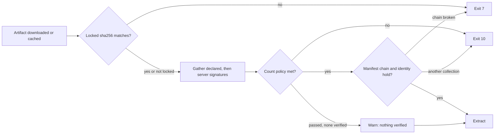
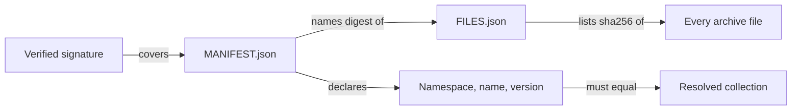

# Signature verification

`install` and `warm` can check each collection's detached OpenPGP signatures
against your keyring before extracting it. Verification is off until you set
`--keyring`.

> [!TIP]
> Signatures come from the Galaxy server and any `signatures:` you declare;
> `+1` fails a collection with none, git and url ones included.
>
> ```sh
> gpg --export --armor KEYID > keyring.asc
> go-galaxy install --keyring keyring.asc --required-valid-signature-count +1
> ```



## Turning it on

| Flag                               | Variable                                   | Ansible variable                                | Default          |
|:-----------------------------------|:-------------------------------------------|:------------------------------------------------|:-----------------|
| `--keyring`                        | `GO_GALAXY_KEYRING`                        | `ANSIBLE_GALAXY_GPG_KEYRING`                    | unset: no checks |
| `--required-valid-signature-count` | `GO_GALAXY_REQUIRED_VALID_SIGNATURE_COUNT` | `ANSIBLE_GALAXY_REQUIRED_VALID_SIGNATURE_COUNT` | `1`              |
| `--ignore-signature-status-code`   | `GO_GALAXY_IGNORE_SIGNATURE_STATUS_CODE`   | `ANSIBLE_GALAXY_IGNORE_SIGNATURE_STATUS_CODES`  | none             |
| `--disable-gpg-verify`             | `GO_GALAXY_DISABLE_GPG_VERIFY`             | `ANSIBLE_GALAXY_DISABLE_GPG_VERIFY`             | `false`          |

Only `install` and `warm` read these; `~` and `~/` expand in the keyring
path. An empty keyring or count, such as a withheld CI secret, exits
[`2`](exit-codes.md) rather than falling back.

`signatures:` with no keyring exits `2`, or warns under `--disable-gpg-verify`,
which also warns beside a keyring. `ANSIBLE_GALAXY_DISABLE_GPG_VERIFY` also
accepts `yes`/`no` and `on`/`off`.

> [!WARNING]
> `ansible.cfg`'s `[galaxy]` signature keys are ignored with a warning, and
> `galaxy.toml` refuses them (exit `2`). A repository can ship either file, so
> use flags or variables.

## Required count and the vacuous pass

| Spelling           | No signature gathered  | Otherwise passes when                        | Stops checking at |
|:-------------------|:-----------------------|:---------------------------------------------|:------------------|
| `1` (default), `N` | passes, warns          | N distinct keys verify                       | Nth key           |
| `+1`, `+N`         | fails                  | N distinct keys verify                       | Nth key           |
| `all`              | passes, warns          | no failure outside the ignore list           | never             |
| `+all`             | fails                  | one verifies, no failure outside ignore list | never             |
| `0`                | passes, warns          | nothing verifies, as in ansible              | never             |
| `+0`               | fails                  | never passes                                 | -                 |
| `-1`               | exits `2`: write `all` | -                                            | -                 |

To require a signature, write `+1`.

Keys are counted, not files: one key signing twice counts once. `ALL`, `++1`
and a count with spaces exit `2`. Git and url collections carry no signature,
and roles are never verified.

## Signatures in the requirements file

=== "galaxy.toml"

    ```toml
    [[project.collections]]
    name = "community.general"
    version = "11.1.0"
    signatures = [
      "https://sigs.example.com/community.general-11.1.0.asc",
      "file:///etc/pki/collections/community.general.asc",
    ]
    ```

=== "requirements.yml"

    ```yaml
    collections:
      - name: community.general
        version: "11.1.0"
        signatures:
          - https://sigs.example.com/community.general-11.1.0.asc
          - file:///etc/pki/collections/community.general.asc
    ```

| Source                                            | Accepted |
|:--------------------------------------------------|:---------|
| `https://...` or `http://...` with a host         | yes      |
| `file:///abs/path` or `file://localhost/abs/path` | yes      |
| relative path, other scheme, `file://otherhost/`  | no       |
| URL carrying userinfo, such as `user@`            | no       |
| over 64 sources per collection                    | no       |

`signatures:` takes one source or a list. A refused source exits `2` when the
file loads, before any request. Git, url and role entries refuse the key
([What is refused](requirements.md#what-is-refused)).

A source is fetched with no Galaxy token and no relaxed TLS, so a private CA
must be [trusted system-wide](servers-and-auth.md#tls-validate_certs). Its
query string is sent but never printed or stored.

## What a verifying run does differently

| Situation                                     | What happens                                                                                                                 |
|:----------------------------------------------|:-----------------------------------------------------------------------------------------------------------------------------|
| `warm`                                        | Verifies every collection, cache hits included                                                                               |
| Every Galaxy collection, cached or `--frozen` | Reads its version metadata (API cache first) for server signatures                                                           |
| Server adds or withdraws a signature          | Seen under `--no-cache`, after `--clear-cache` or [30 days](caching.md#freshness-and-retention), not with `--refresh`        |
| Unfetchable declared source                   | Fails the collection when reached (exit `5`); no retry                                                                       |
| `--offline`                                   | `file://` sources work; a network one warns, fails if reached. Server signatures need cached metadata: warm with `--keyring` |
| `--dry-run`                                   | Checks the setup; fetches no signature                                                                                       |
| Chain or identity fails on a cache hit        | Downloads once more, unless `--offline`; a failed count refetches only after `--clear-cache`                                 |

> [!WARNING]
> `install` skips an installed collection unverified and prints how many.
> Install into an empty collections path to verify what playbooks load; `warm`
> checks only the cache.

<details markdown>
<summary>Limits</summary>

| Limit                              | Value                      |
|:-----------------------------------|:---------------------------|
| Signatures gathered per collection | 64, declared sources first |
| One signature                      | 1 MiB                      |
| Connecting to a source             | 10 s                       |
| Keyring                            | 64 MiB, 4096 packets       |

Time budgets: [Timeouts and fixed limits](cli.md#timeouts-and-fixed-limits).

</details>

## Keyring and signature file formats

```sh
cat teamA.asc teamB.asc > keyring.asc   # trusts both teams' keys
```

| Keyring file                                                   | Result    | Fix                                                                       |
|:---------------------------------------------------------------|:----------|:--------------------------------------------------------------------------|
| `gpg --export --armor` output, or several concatenated         | accepted  | -                                                                         |
| Binary export or raw `pubring.gpg`, v3 certifications included | accepted  | -                                                                         |
| Exports glued with no newline                                  | exits `2` | End each with a newline                                                   |
| GnuPG keybox (`.kbx`)                                          | exits `2` | `gpg --no-default-keyring --keyring <kbx> --export --armor > keyring.asc` |
| Secret key material                                            | exits `2` | `gpg --export --armor > keyring.asc`                                      |
| No keys, or a non-key armor block                              | exits `2` | `gpg --export --armor KEYID > keyring.asc`                                |

No `gpg` process runs; the format is judged from the bytes. Any trusted key
vouches for any collection, and revocation is only as fresh as the keyring file
([trust model](security.md#trust-model)).

<details markdown>
<summary>Packet rules</summary>

| File      | May hold                                                                                  | Refused                                        |
|:----------|:------------------------------------------------------------------------------------------|:-----------------------------------------------|
| Keyring   | Public keys and subkeys, user IDs and attributes, signatures, ring-trust packets, padding | Secret keys, marker packets, over 4096 packets |
| Signature | Signature packets, at most 64                                                             | Anything else                                  |

Each armor block costs one packet, so 1024 minimal three-packet exports load
and 1025 do not. See
[Signatures and OpenPGP framing](internals/boundaries.md#signatures-and-openpgp-framing).

</details>

## Ignored status codes

```sh
go-galaxy install --keyring keyring.asc --required-valid-signature-count +all \
  --ignore-signature-status-code NO_PUBKEY
```

| Code                                                                                  | Reported when                            |
|:--------------------------------------------------------------------------------------|:-----------------------------------------|
| `BADSIG`                                                                              | signature does not match `MANIFEST.json` |
| `NO_PUBKEY`                                                                           | signing key is not in the keyring        |
| `EXPKEYSIG`, alias `KEYEXPIRED`                                                       | signing key expired                      |
| `REVKEYSIG`, alias `KEYREVOKED`                                                       | signing key revoked                      |
| `EXPSIG`                                                                              | signature expired                        |
| `NODATA`                                                                              | blob or armor block is empty             |
| `BADARMOR`                                                                            | armor cannot be decoded                  |
| `ERRSIG`                                                                              | malformed packets, or any other error    |
| `MISSING_PASSPHRASE`, `BAD_PASSPHRASE`, `NO_SECKEY`, `UNEXPECTED`, `ERROR`, `FAILURE` | never; accepted, with no effect          |

An ignored failure never fails an `all` policy and never counts toward N.

The flag repeats and its variables take a comma-separated list; values are
trimmed and case-insensitive. Any other code, or an empty element, exits `2`.

## Manifest chain check



The check runs once a signature verifies and covers every file, symlink and
hardlink in the archive. Mixed failures follow
[When several things fail](exit-codes.md#when-several-things-fail).

| Refusal                                                              | Exit |
|:---------------------------------------------------------------------|:-----|
| Unlisted entry, wrong digest, or `MANIFEST.json` not the signed copy | `7`  |
| Manifest names another collection, or its identity is ambiguous      | `10` |
| No `MANIFEST.json`, or an empty one, in the first 64 MiB             | `5`  |

<details markdown>
<summary>What the chain check refuses</summary>

| Archive or listing                                                                     | Exit |
|:---------------------------------------------------------------------------------------|:-----|
| Two entries with one cleaned path                                                      | `5`  |
| A symlink that is absolute or resolves to the archive root or above                    | `5`  |
| A listed `ftype` other than `file` over a regular file                                 | `7`  |
| A link followed through more than 8 hops                                               | `7`  |
| `FILES.json` with a second `files` key, a name listed twice or a non-`sha256` checksum | `7`  |
| A listing over 100,000 rows                                                            | `7`  |

`MANIFEST.json` and `FILES.json` may go unlisted. Each identity key must appear
once, spelled exactly, and match byte for byte. See
[Reading a manifest](internals/boundaries.md#reading-a-manifest).

</details>
